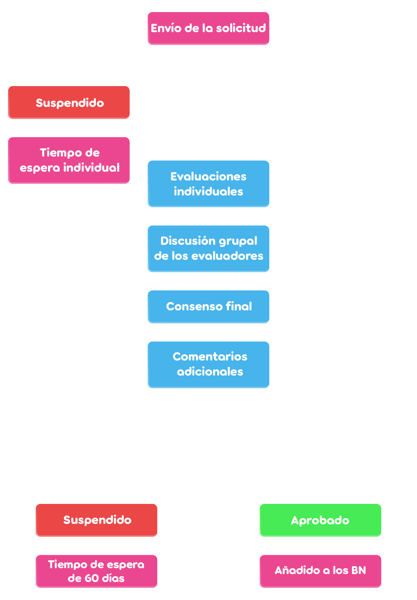

# Convertirse en Beatmap Nominator

Los usuarios interesados en unirse a los [Beatmap Nominators](/wiki/People/Beatmap_Nominators) deben pasar por un proceso de solicitud supervisado por el [Nomination Assessment Team](/wiki/People/Nomination_Assessment_Team) (NAT).

Las solicitudes se realizan a través del [sitio web de los BN](https://bn.mappersguild.com/bnapps).

Los solicitantes deben cumplir con una cierta cantidad de [kudosu](/wiki/Modding/Kudosu) y enviar tres [beatmaps](/wiki/Beatmap) que hayan [modeado](/wiki/Modding) recientemente, además de responder a ciertas preguntas sobre ellos. Se enviará un mensaje del NAT una vez que se haya decidido un veredicto. Se puede encontrar más información sobre la solicitud [en el sitio web](https://bn.mappersguild.com/bnapps).

## Criterios básicos

Los modders que deseen postularse para los Beatmap Nominators deben:

- Tener al menos 150 [kudosu](/wiki/Modding/Kudosu).
- No haber infringido las [normas de la comunidad de osu!](/wiki/Rules) en los últimos 12 meses.
- Tener la capacidad de reconocer beatmaps que deberían (y no deberían) ser nominados.

## Cualidades a demostrar en el modding

*Véase también: [Errores de modding comunes](/wiki/Guides/Common_modding_mistakes) y [Guía de modding de osu!mania](/wiki/Guides/osu!mania_modding_guide)*

Los mods enviados deben mostrar que un usuario es capaz de reconocer los beatmaps que deben y no deben ser nominados, además de analizar y mejorar los beatmaps hasta un nivel adecuado para los Beatmap Nominators.

Estas son las cualidades que se esperan de los Beatmap Nominators en el modding:

- **Cobertura de todos los niveles de dificultad comunes.**
  - La mayoría de los beatmaps tendrán una distribución de [dificultades](/wiki/Beatmap/Difficulty) que van desde Easy hasta Expert, por lo que los Beatmap Nominators deben ser competentes en modding de dichas dificultades. No se requieren habilidades de modding en dificultades de niveles extremadamente altos.
- **Identificación de problemas no clasificables, incluidos aquellos que las herramientas no pueden detectar, como temporización o metadatos incorrectos.**
- **Comparación entre partes de un beatmap para respaldar problemas o sugerencias.**
  - Hacer referencia a otras partes del beatmap es útil para mantener las sugerencias en línea con los estilos e ideas originales que el mapper tiene en su mapa.
- **Comentarios sobre una amplia variedad de elementos de un beatmap, como el [ritmo](/wiki/Music_theory/Rhythm), espaciado, movimiento, intensidad, contraste y consistencia.**
  - Si bien se anima a los Beatmap Nominators a pedir ayuda cuando sea necesario, deberían poder juzgar casi todos los aspectos del mapping de forma independiente a un nivel decente.
- **Identificación de problemas aislados y problemas generales en todo el mapa**
- **Consideración de las intenciones de los mappers al identificar problemas y dar sugerencias.**
  - Evita sugerir tus propios estilos o preferencias de mapeo si contradicen el estilo previsto por el mapper. Si hay un problema relacionado con el estilo del mapper, intenta enmarcar tus sugerencias en torno a lo que pretendían originalmente.
- **Capacidad para hacer sugerencias útiles y detectar errores para mappers con distintos niveles de experiencia.**
  - Los Beatmap Nominators a menudo tratarán con mappers muy experimentados o mapas de alta calidad que pueden no requerir mucha retroalimentación. Por lo tanto, es importante poder detectar errores y sugerir mejoras incluso para los mappers más experimentados.
  - Para la solicitud, no se recomienda enviar mods en mapas de mappers principiantes que carezcan de los fundamentos. En cambio, los mods enviados deben estar en mapas que estén listos para que un BN los vea.
- **Comunicación clara con el mapper.**
  - Las publicaciones de mods deben explicar el problema y la solución de la manera más clara y concisa posible para evitar confundir al mapper, o incluso que tu sugerencia se aplique incorrectamente. En general, también se debe evitar la terminología especializada.

## Proceso de solicitud

Los usuarios deben enviar tres beatmaps que hayan modeado en los últimos 6 meses, cada uno con un [anfitrión](/wiki/Beatmap/Beatmap_host) diferente.

- **Un mod en un mapa que está listo para ser nominado (o listo para ser nominado después de que se aplique el mod).**
  - Esto tiene como objetivo mostrar la capacidad del solicitante para llevar a cabo los pasos finales del proceso de modding y evaluar de forma independiente la preparación de un mapa para la clasificación.
  - Este mapa debe tener 0 nominaciones cuando se envíe la solicitud.
  - El solicitante debe describir brevemente por qué el mapa está listo (o casi listo) para ser nominado.
- **Un mod en un mapa que NO está listo para ser nominado sin mejoras significativas.**
  - Esto tiene como objetivo mostrar la capacidad del solicitante para identificar problemas, su capacidad de comunicación y su comprensión de los estándares de los mapas clasificados.
  - Este mapa debe incluir una distribución que tenga al menos las dificultades Normal, Hard e Insane.
  - El solicitante debe explicar brevemente por qué el mapa NO está listo para ser nominado, mientras usa sus mods para respaldar sus motivos.
- **Un mod en un mapa que demuestre que el solicitante es capaz de juzgar la calidad del mapa y la preparación para su clasificación.**
  - Los solicitantes son libres de elegir un mapa que nominarían o no nominarían.
  - Este mapa debe tener 0 nominaciones cuando se envíe la solicitud.
  - Esto le da al solicitante la oportunidad de rellenar cualquier hueco que falte en su solicitud, teniendo en cuenta las intenciones expresadas en las descripciones de los envíos anteriores.
  - El solicitante debe describir brevemente por qué el mapa está (o no) listo para ser nominado.

Es una buena práctica conservar y enviar una copia del mapa antes de aplicar los mods, ya que ello ayudará notablemente a la evaluación de su modding al ofrecer un mejor contexto a los evaluadores.

Además, las solicitudes se pueden marcar como disponibles para el público, lo que hará que aparezcan en el [archivo de evaluaciones públicas](https://bn.mappersguild.com/publicarchive). Los usuarios pueden optar libremente por activar o desactivar esta opción cambiando el estado de visibilidad de cualquier evaluación que tengan en [su página de evaluaciones](https://bn.mappersguild.com/yourevals).

Cuando un usuario solicita convertirse en un BN, el NAT será notificado a través del bot de Discord «bnsite» en su respectivo canal de Discord. La notificación incluirá el nombre del solicitante y el enlace de la evaluación, así como qué evaluadores han sido asignados a la solicitud.

Una barra de progreso en la [página de la solicitud](https://bn.mappersguild.com/bnapps) detalla en qué paso se encuentra actualmente la evaluación.

Luego, los evaluadores pueden revisar la solicitud completa en el sitio web de los BN, que incluye cualquier información enviada por el solicitante, así como un registro histórico de evaluaciones pasadas si el usuario ha solicitado o ha sido un BN anteriormente.

La evaluación se divide en dos etapas: *individual* y *grupal*.

### Etapa individual

Durante la *etapa individual*, que dura como máximo 7 días, se asignan aleatoriamente 3 evaluadores a la solicitud. A veces, se invita a los BN a actuar como evaluadores, pero siempre habrá al menos un NAT asignado.

Los evaluadores revisarán la solicitud y evaluarán el desempeño y la conducta en modding del solicitante. Por lo general, anotarán las publicaciones positivas y negativas en los mods. Luego, cada evaluador votará «aprobado», «neutral» o «suspendido» por la solicitud.

Los solicitantes serán evaluados según los siguientes criterios:

- **Modding:**
  - Conocimiento de los [criterios de clasificación](/wiki/Ranking_criteria) generales y específicos de cada [modo de juego](/wiki/Game_mode).
  - Presencia de las [cualidades](#cualidades-a-demostrar-en-el-modding) recomendadas en sus mods.
  - Respuestas a las preguntas sobre cada mod enviado.
  - Habilidades adicionales relacionadas con los metadatos, temporización y otras áreas diversas.
- **Actitud general:**
  - Tono de entrega de los mods y otras expectativas de la conducta según el [código de conducta](/wiki/Rules/Code_of_conduct_for_modding_and_mapping).
  - Comportamiento general en chat/foros.

Todos los comentarios y votos de los evaluadores en esta etapa están ocultos para los demás evaluadores.

### Etapa grupal

La *etapa grupal* dura como máximo hasta 14 días después de que el solicitante envió su solicitud, la cual avanza a esta etapa cuando:

- Todos los evaluadores asignados han presentado su evaluación individual.
- La mayoría de los evaluadores han presentado su evaluación individual, donde han suspendido por unanimidad al solicitante.

En esta etapa, los comentarios y votos de cada evaluador se revelan a los demás evaluadores, y en caso de un veredicto ambiguo, discutirán hasta llegar a un consenso.

A continuación, se escriben comentarios adicionales para añadir cualquier información que falte en el informe de los evaluadores y el resultado de la solicitud es enviado de vuelta al solicitante por el [Nomination Assessment Team bot](https://osu.ppy.sh/users/6616586) como un [mensaje de anuncio](/wiki/Announcement_messages), tras lo cual la evaluación será archivada para referencia futura. Los solicitantes seleccionados se añaden como BN de prueba inmediatamente después de que se envía el resultado.

## Comunicación posterior a la solicitud

Una vez completada la solicitud, el solicitante dispone de una interfaz que le permite chatear directamente con los evaluadores a través del sitio web de los BN para hacer preguntas sobre el consenso de su solicitud y los comentarios de los evaluadores.

El chat se bloquea automáticamente después de 7 días de inactividad.

## Tiempos de espera

Hay un tiempo de espera de 60 días para volver a aplicar en las siguientes ocasiones:

- Solicitudes fallidas
- Ser retirado de los Beatmap Nominators
- [Renunciar en buenos términos](/wiki/People/Nomination_Assessment_Team/Evaluations#términos-estándar)
