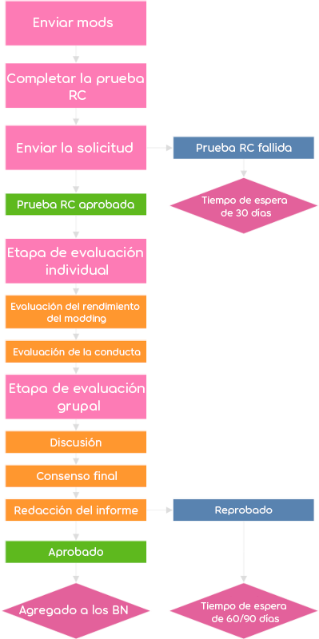

# Convertirse en Beatmap Nominator

Los usuarios interesados en unirse a los [Beatmap Nominators](/wiki/People/Beatmap_Nominators) deben pasar por un proceso de solicitud supervisado por el [Nomination Assessment Team](/wiki/People/Nomination_Assessment_Team) (NAT).

Las solicitudes se realizan a través del [sitio web de los BN](https://bn.mappersguild.com/bnapps).

Los solicitantes deben cumplir con un umbral mínimo de [kudosu](/wiki/Modding/Kudosu), enviar al menos dos [beatmaps](/wiki/Beatmap) que hayan [modeado](/wiki/Modding) recientemente y completar una [prueba para Beatmap Nominator](/wiki/People/Beatmap_Nominators/Beatmap_Nominator_Test) en los [criterios de clasificación](/wiki/Ranking_criteria) para enviar su solicitud. Se enviará un mensaje del NAT una vez que se haya decidido un veredicto. Se puede encontrar más información sobre la solicitud [en el sitio web](https://bn.mappersguild.com/bnapps).

## Criterios básicos

Los modders que deseen postularse para los Beatmap Nominators deben cumplir con los siguientes criterios:

- Han acumulado al menos 150 [kudosu](/wiki/Modding/Kudosu).
- Proporcionan 3 de sus mods que creen que los calificarían para ser parte de los Beatmap Nominators.
  - Los miembros anteriores del BN/NAT pueden enviar un mínimo de 2 mods para su solicitud.

### Expectativas de modding

*Véase también: [Errores de modding comunes](/wiki/Guides/Common_modding_mistakes) y [Guía de modding de osu!mania](/wiki/Guides/osu!mania_modding_guide)*

Los mods enviados deben mostrar que un usuario es capaz de analizar y mejorar beatmaps hasta un nivel adecuado para los Beatmap Nominators.

Los siguientes son los rasgos de modding que se esperan de los Beatmap Nominators. La falta de mostrar cualquiera de estos rasgos puede resultar en una solicitud rechazada.

- **Cobertura de todos los niveles de dificultad comunes.**
  - La mayoría de los beatmaps tendrán una distribución de [dificultades](/wiki/Beatmap/Difficulty) que van desde easy hasta expert, por lo que los Beatmap Nominators deben ser competentes en modding de dichas dificultades. No se requieren habilidades de modding en dificultades de niveles extremadamente altos.
- **Identificación de problemas no clasificables, incluidos aquellos que las herramientas no pueden detectar, como temporización o metadatos incorrectos.**
- **Comparación entre partes de un beatmap para respaldar problemas o sugerencias.**
  - Hacer referencia a otras partes del beatmap es útil para mantener las sugerencias en línea con los estilos e ideas originales que el mapper tiene en su mapa.
- **Comentarios sobre una amplia variedad de elementos de un beatmap, como el [ritmo](/wiki/Music_theory/Rhythm), espaciado, movimiento, intensidad, contraste y consistencia.**
  - Si bien se anima a los Beatmap Nominators a pedir ayuda cuando sea necesario, deberían poder juzgar casi todos los aspectos del mapping de forma independiente a un nivel decente.
- **Identificación de problemas aislados y problemas generales en todo el mapa**
- **Consideración de las intenciones de los mappers al identificar problemas y dar sugerencias.**
  - Evita sugerir tus propios estilos o preferencias de mapeo si contradicen el estilo previsto por el mapper. Si hay un problema relacionado con el estilo del mapper, intenta enmarcar tus sugerencias en torno a lo que pretendían originalmente.
- **Capacidad para hacer sugerencias útiles y detectar errores para mappers con distintos niveles de experiencia.**
  - Los Beatmap Nominators a menudo tratarán con mappers muy experimentados o mapas de alta calidad que pueden no requerir mucha retroalimentación. Por lo tanto, es importante poder detectar errores y sugerir mejoras incluso para los mappers más experimentados.
  - Para la solicitud, no se recomienda enviar mods en mapas de mappers principiantes que carezcan de los fundamentos. En cambio, los mods enviados deben estar en mapas que estén listos para que un BN los vea.
- **Comunicación clara con el mapper.**
  - Las publicaciones de mods deben explicar el problema y la solución de la manera más clara y concisa posible para evitar confundir al mapper, o incluso que tu sugerencia se aplique incorrectamente. En general, también se debe evitar la terminología especializada.

## Proceso de solicitud

Cada solicitud enviada al sitio web de los BN que pase la [prueba para Beatmap Nominator](/wiki/People/Beatmap_Nominators/Beatmap_Nominator_Test) será revisada por evaluadores para determinar si el solicitante puede ingresar o no al grupo Beatmap Nominator.

Cuando un usuario solicita convertirse en BN, el NAT será notificado a través del bot de Discord «bnsite» en su respectivo canal de Discord. La notificación incluirá el nombre del solicitante y su puntuación en la prueba, así como también qué evaluadores han sido asignados a la solicitud.

Los evaluadores pueden revisar la solicitud completa en el sitio web de los BN, que incluye cualquier información enviada por el solicitante, los resultados de sus pruebas, así como un registro histórico de evaluaciones pasadas si el usuario ha solicitado o ha sido un BN anteriormente.

La evaluación se divide en dos etapas: *individual* y *grupal*.

### Etapa individual

Durante la *etapa individual*, que dura como máximo 7 días, se asignan aleatoriamente entre 2 y 3 evaluadores a la solicitud. A veces, se invita a los BN a actuar como evaluadores, pero siempre habrá al menos un NAT asignado.

Los evaluadores revisarán la solicitud y evaluarán el desempeño y la conducta en modding del solicitante. Por lo general, anotarán las publicaciones positivas y negativas en los mods. Luego, cada evaluador votará «aprobado», «neutral» o «suspendido» por la solicitud.

Los solicitantes serán evaluados según los siguientes criterios:

- **Modding:** Conocimiento de los [criterios de clasificación](/wiki/Ranking_criteria) generales y específicos de cada [modo de juego](/wiki/Game_mode). Cumplimiento de las [expectativas de modding](#expectativas-de-modding). También se tendrán en cuenta capacidades adicionales relacionadas con metadatos, temporización y algunas otras.
- **Actitud general:** Tono de entrega de los mods y otras expectativas de conducta según el [código de conducta](/wiki/Rules/Code_of_conduct_for_modding_and_mapping), así como el comportamiento general en chat/foros.

Todos los comentarios y votos de los evaluadores en esta etapa están ocultos para los demás evaluadores.

### Etapa grupal

La *etapa grupal* dura como máximo hasta 14 días después de que el solicitante envió su solicitud, la cual avanza a esta etapa cuando:

- Todos los evaluadores asignados han presentado su evaluación individual.
- La mayoría de los evaluadores han presentado su evaluación individual, donde han suspendido por unanimidad al solicitante.

En esta etapa, los comentarios y votos de cada evaluador se revelan a los demás evaluadores, y en caso de un veredicto ambiguo, discutirán hasta llegar a un consenso.

A continuación, se redacta un informe basado en los comentarios de los evaluadores y el resultado de la solicitud es enviado de vuelta al solicitante por el [Nomination Assessment Team bot](https://osu.ppy.sh/users/6616586) como un [mensaje de anuncio](/wiki/Announcement_messages), tras lo cual la evaluación será archivada para referencia futura. Los solicitantes seleccionados se agregan como BN de prueba inmediatamente después de que se envía el resultado.

En el caso de [solicitudes fallidas](/wiki/People/Beatmap_Nominators/Becoming_a_Beatmap_Nominator#solicitudes-fallidas), el NAT también determinará la duración del [tiempo de espera](#solicitudes-fallidas) del usuario antes de que pueda postularse nuevamente. En caso de que se reduzca la duración del tiempo de espera estándar, las condiciones se indicarán en el informe enviado al solicitante.

## Tiempos de espera

Dependiendo de tu estado, el tiempo de espera antes de que puedas volver a aplicar puede variar.

### Solicitudes fallidas

Si fallaste en una solicitud para Beatmap Nominator, estarás sujeto a uno de los siguientes tiempos de espera antes de que puedas volver a postularte:

| Tipo | Tiempo de espera | Uso |
| :-- | :-- | :-- |
| Reducido | 30 días | Solicitudes con relativamente pocos problemas, o fallar la [prueba para Beatmap Nominator](/wiki/People/Beatmap_Nominators/Beatmap_Nominator_Test) |
| Estándar | 60 días | Falla normal |
| Extendido | 120 días | Solicitantes con problemas graves de conducta |

### Volver a unirse después de haber sido eliminado de los Beatmap Nominators

Los usuarios que abandonaron recientemente los Beatmap Nominators pueden tener diferentes requisitos para volver a unirse en comparación con cuando se unieron por primera vez. Los usuarios que hayan tenido un buen desempeño antes de irse, podrán volver a unirse sin ningún requisito durante un periodo de tiempo. El NAT informará al usuario si tiene la oportunidad de acelerar su camino de regreso a los Beatmap Nominators.

Si antes eras un Beatmap Nominator, se aplican los siguientes requisitos, a menos que hayas suspendido una solicitud desde la última vez que fuiste Beatmap Nominator:

| Tipo | Tiempo de espera | Proceso de solicitud |
| :-- | :-- | :-- |
| Bueno | *Ninguno* | *Ninguno*[^good-terms] |
| Estándar | 60 días | Normal |
| Actividad | *Ninguno* | Normal[^activity-terms] |

## Notas

[^good-terms]: Un Beatmap Nominator que renunció en buenos términos será tratado con términos estándar después de 1 año.
[^activity-terms]: Los solicitantes deberán proporcionar 3 mods en las solicitudes, en lugar de al menos 2.
