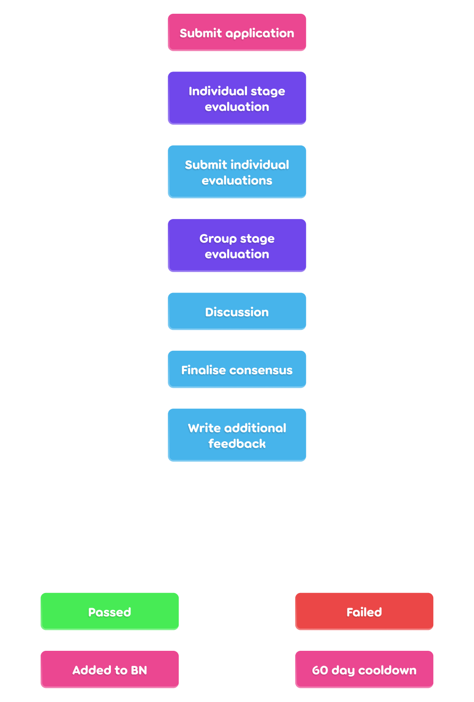
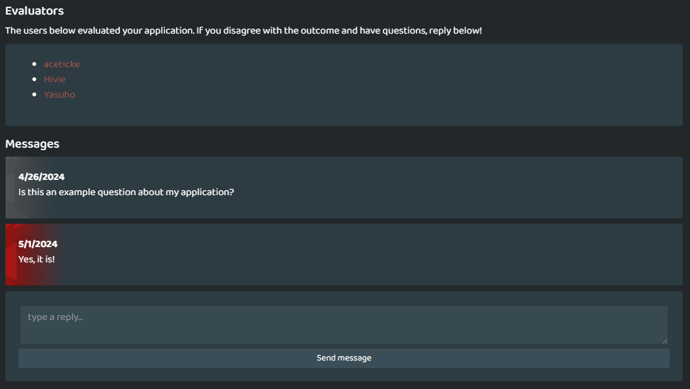

# Devenir un Beatmap Nominator

Les utilisateurs intéressés à rejoindre les [Beatmap Nominators](/wiki/People/Beatmap_Nominators) doivent passer par un processus de candidature supervisé par la [Nomination Assessment Team](/wiki/People/Nomination_Assessment_Team) (NAT).

Les candidatures se font via le [site web des BN](https://bn.mappersguild.com/bnapps).

Les candidats doivent atteindre un seuil minimum de [kudosu](/wiki/Modding/Kudosu), soumettre au moins deux [beatmaps](/wiki/Beatmap) qu'ils ont été récemment [moddés](/wiki/Modding), et remplir un [Beatmap Nominator Test](/wiki/People/Beatmap_Nominators/Beatmap_Nominator_Test) sur les [ranking criteria](/wiki/Ranking_criteria) afin de pouvoir soumettre leur candidature. Un message des NAT sera envoyé une fois que le verdict aura été rendu. De plus amples informations sur les candidatures sont disponibles [sur le site web](https://bn.mappersguild.com/bnapps).

## Critères de base

Les moddeurs souhaitant postuler auprès des Beatmap Nominators doivent remplir les critères suivants :

- Avoir au moins 150 [kudosu](/wiki/Modding/Kudosu).
- Ne pas avoir violé les [règles de la communauté d'osu!](/wiki/Rules) au cours des 12 derniers mois.
- Avoir la capacité de reconnaître les beatmaps qui devraient (ou ne devraient pas) être nominés.

## Aspects à démontrer dans le modding

*Voir également : [Erreurs courantes de modding](/wiki/Guides/Common_modding_mistakes) et [Guide de modding d'osu!mania](/wiki/Guides/osu!mania_modding_guide)*

Les mods soumis doivent montrer qu'un utilisateur est capable de reconnaître les beatmaps qui devraient ou ne devraient pas être nominés, ainsi que d'analyser et d'améliorer les beatmaps jusqu'à ce qu'ils atteignent un niveau acceptable pour les Beatmap Nominators.

Les caractéristiques suivantes sont attendues des Beatmap Nominators en matière de modding :

- **Couverture de tous les niveaux de difficultés courants.**
  - La plupart des beatmaps ont un éventail de [difficultés](/wiki/Beatmap/Difficulty) allant de Easy à Expert, et donc les Beatmap Nominators doivent être compétents dans le modding de ces difficultés. Il n'est pas nécessaire de savoir modder des difficultés de très haut niveau.
- **Identification des problèmes non classables, y compris ceux que les outils ne peuvent pas détecter, tels qu'un timing ou des métadonnées incorrects.**
- **Comparaison entre les parties d'une beatmap pour étayer des questions ou des suggestions.**
  - La référence à d'autres parties de la beatmap est utile pour garder les suggestions en ligne avec les styles et les idées originales que le mappeur a dans sa map.
- **Commentaires sur une grande variété d'éléments de la beatmap, tels que le [rythme](/wiki/Music_theory/Rhythm), l'espacement, le mouvement, l'intensité, le contraste et la cohérence.**
  - Bien que les Beatmap Nominators soient encouragés à demander de l'aide en cas de besoin, ils devraient être en mesure de juger de presque tous les aspects du mapping de manière indépendante à un niveau décent.
- **Identification des problèmes isolés et des problèmes généraux à l'échelle de la map.**
- **Prise en compte des intentions des mappeurs lors de l'identification des problèmes et de la formulation de suggestions.**
  - Évitez de suggérer vos propres styles ou préférences de mapping s'ils sont en contradiction avec le style voulu par le mappeur. S'il y a un problème lié au style du mappeur, essayez de formuler vos suggestions en fonction de ce qu'il voulait à l'origine.
- **Capacité à faire des suggestions utiles et à repérer les erreurs pour des mappeurs de différents niveaux d'expérience.**
  - Les Beatmap Nominator ont souvent affaire à des mappeurs très expérimentés ou à des maps de haute qualité qui n'ont pas besoin de beaucoup de feedback. Il est donc important d'être capable de repérer les erreurs et de suggérer des améliorations, même pour les mappeurs les plus expérimentés.
  - Pour l'application, il n'est pas recommandé de soumettre des mods sur des maps de mappeurs débutants qui manquent de fondamentaux. Au lieu de cela, les mods soumis devraient être sur des maps qui sont prêtes à être regardées par un BN.
- **Une communication claire avec le mappeur.**
  - Les messages des mods doivent expliquer le problème et la solution de la manière la plus claire et la plus concise possible afin d'éviter d'embrouiller le mappeur, ou même de voir leur suggestion mal appliquée. La terminologie spécialisée doit également être évitée.

## Processus de candidature

Les utilisateurs doivent soumettre trois beatmaps qu'ils ont moddés au cours des 6 derniers mois, chacun ayant un [host](/wiki/Beatmap/Beatmap_host) différent.

- **Un mod sur une map qui est prête à être nominée (ou prête à être nominée après l'application du mod).**
  - Il s'agit de démontrer la capacité du candidat à mener à bien les étapes finales du processus de modding et à évaluer de manière indépendante si une map est prête à être classée.
  - Cette map devrait avoir 0 nomination au moment de la soumission de la demande.
  - Le candidat doit décrire brièvement pourquoi la map est prête (ou presque) à être nominée.
- **Un mod sur une map qui n'est PAS prête à être nominée sans améliorations significatives.**
  - Il s'agit de montrer les compétences du candidat en matière d'identification des problèmes, de communication et de compréhension des normes applicables aux maps classés.
  - Cette map doit comporter une répartition avec au moins les difficultés Normal, Hard et Insane.
  - Le candidat doit expliquer brièvement pourquoi la map n'est PAS prête à être nominée, tout en utilisant son modding pour étayer ses raisons.
- **Un mod sur une map qui prouve que le candidat est capable de juger de la qualité de la map et de son état de préparation pour le classement.**
  - Les candidats sont libres de choisir une map qu'ils proposeraient ou non.
  - Cette map devrait avoir 0 nomination au moment de la soumission de la demande.
  - Le candidat a ainsi l'occasion de combler les lacunes de sa candidature, en gardant à l'esprit les intentions énoncées dans les descriptions des candidatures précédentes.
  - Le candidat doit décrire brièvement pourquoi la map est (ou n'est pas) prête à être proposée.

Il est conseillé de conserver et de soumettre une copie de la map avant l'application des mods, car cela facilitera notamment l'évaluation des mods en donnant un meilleur contexte aux évaluateurs.

En outre, les applications peuvent être marquées comme étant disponibles pour le public, ce qui les fera apparaître dans les [archives des évaluations publiques](https://bn.mappersguild.com/publicarchive). Les utilisateurs peuvent librement choisir de participer ou non à ce processus en modifiant le statut de visibilité de toute évaluation qu'ils possèdent dans [leur page d'évaluation](https://bn.mappersguild.com/yourevals).

Lorsqu'un utilisateur postule pour devenir BN, le NAT sera notifié via le bot Discord "bnsite" dans son channel Discord respectif. La notification comprendra le nom du candidat et le lien d'évaluation, ainsi que les évaluateurs assignés à la candidature.

Une barre de progression dans la [page de candidature](https://bn.mappersguild.com/bnapps) indique l'état d'avancement de l'évaluation.

Les évaluateurs peuvent ensuite consulter la demande complète sur le site web des BN, qui comprend toutes les informations soumises par le candidat, ainsi qu'un historique des évaluations antérieures si l'utilisateur a déjà posé sa candidature ou a déjà été un BN.

L'évaluation est divisée en deux étapes : *individuel* et *groupe*.

### Étape individuelle

Au cours de *l'étape individuelle*, qui dure au maximum 7 jours, 3 évaluateurs sont affectés de manière aléatoire à la demande. Parfois, les BN sont invités à jouer le rôle d'évaluateurs, mais il y aura toujours au moins un NAT désigné.

Les évaluateurs examinent la candidature et évaluent les performances et le comportement du candidat en matière de modding. Ils noteront les messages positifs et négatifs postés dans les mods. Chaque évaluateur votera ensuite pour la candidature en indiquant si elle est "acceptée", "neutre" ou "rejetée".

Les candidats seront évalués sur la base des critères suivants :

- **Modding :**
  - Connaissance des [critères de classement](/wiki/Ranking_criteria) généraux et des critères spécifiques à chaque [mode de jeu](/wiki/Game_mode).
  - Présence des [aspects](#aspects-à-démontrer-dans-le-modding) recommandés dans leurs mods.
  - Réponses aux questions concernant chaque mod soumis.
  - Capacités supplémentaires relatives aux métadonnées, au timing et à d'autres domaines divers.
- **Attitude générale :**
  - Ton des mods et autres attentes comportementales du [Code de conduite](/wiki/Rules/Code_of_conduct_for_modding_and_mapping).
  - Comportement général dans le tchat/forum.

Les commentaires et les votes des évaluateurs à ce stade sont cachés aux autres évaluateurs.

### Étape de groupe

*L'étape de groupe* dure au maximum jusqu'à 14 jours après que le demandeur a envoyé sa demande, qui passe à cette étape lorsque :

- Tous les évaluateurs désignés ont soumis leur évaluation individuelle.
- La majorité des évaluateurs ont soumis leur évaluation individuelle, dans laquelle ils ont unanimement rejeté le candidat.

À ce stade, les commentaires et les votes de chaque évaluateur sont révélés aux autres évaluateurs et, en cas de verdict ambigu, ils discutent jusqu'à ce qu'un consensus soit atteint.

Des commentaires supplémentaires sont alors rédigés pour ajouter toute information manquante dans les commentaires des évaluateurs et le résultat de la candidature est renvoyé au candidat par le [Nomination Assessment Team bot](https://osu.ppy.sh/users/6616586) sous la forme d'un [message d'annonce](/wiki/Announcement_messages), après quoi l'évaluation est archivée pour référence future. Les candidats retenus sont ajoutés en tant que BN probatoire immédiatement après l'envoi du résultat.

## Communication post-candidature

Lorsqu'une demande est remplie, le candidat dispose d'une interface qui lui permet de discuter avec les évaluateurs directement sur le site web des BN afin de poser toutes les questions concernant le consensus de sa demande et les commentaires des évaluateurs.

Le tchat est automatiquement verrouillé après 7 jours d'inactivité.

## Cooldowns

Un délai de 60 jours est fixé pour le renouvellement de la demande dans les cas suivants :

- Demandes rejetées
- Renvoi du groupe Beatmap Nominators
- [Démissions ordinaires](/wiki/People/Nomination_Assessment_Team/Evaluations#termes-standards)
