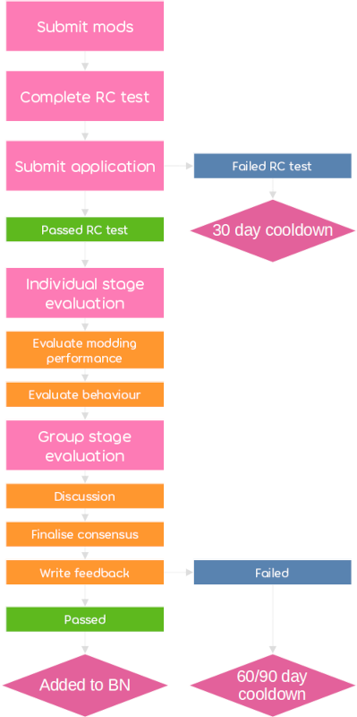

# Как стать номинатором

За зачисление в [номинаторы](/wiki/People/Beatmap_Nominators) отвечает [команда оценки номинаций](/wiki/People/Nomination_Assessment_Team) (NAT).

Заявку на вступление в команду номинаторов нужно заполнять на [веб-сайте для номинаторов](http://bn.mappersguild.com/bnapps).

Для подачи заявки необходимо подходить под требования по количеству [кудосу](/wiki/Modding/Kudosu). В форме нужно указать ссылки минимум на две карты, которые вы недавно моддили, а также пройти [тест на номинатора](/wiki/People/Beatmap_Nominators/Beatmap_Nominator_Test), составленный по [критериям ранкинга](/wiki/Ranking_criteria). NAT свяжется с вами после рассмотрения заявки. Остальные подробности о подаче заявки см. на [веб-сайте](https://bn.mappersguild.com/bnapps).

## Минимальные требования

От моддеров, желающих стать номинаторами, ожидается следующее:

- Для [osu!](/wiki/Game_mode/osu!) — минимум 200 [кудосу](/wiki/Modding/Kudosu), для остальных режимов — 150 [кудосу](/wiki/Modding/Kudosu).
- Ссылки на 3 мода, демонстрирующих пригодность к становлению номинатором.
  - Если моддер уже был номинатором или членом NAT, он может прислать 2 мода вместо трёх.

### Качество моддинга

*См. также: [Частые ошибки в моддинге](/wiki/Guides/Common_modding_mistakes), [Моддинг карт osu!mania](/wiki/Guides/osu!mania_modding_guide)*

Моды, приводимые в качестве примеров, должны отражать способность к анализу и улучшению карт на уровне номинатора.

Ниже перечислены качества, которыми должны обладать номинаторы. Вашу заявку могут отклонить, если в перечисленных в ней модах не будет видно какой-либо из этих черт.

- **Моддинг всех уровней сложности.**
  - Поскольку в большинстве карт содержится подборка [сложностей](/wiki/Beatmap/Difficulty), варьирующихся от Easy до Expert, номинатор должен понимать, как моддить каждую из них. Уметь моддить крайне сложные карты при этом не обязательно.
- **Умение замечать неранкабельные проблемы, включая те, которые нельзя обнаружить автоматически (например, неправильный тайминг или метаданные).**
- **Сравнение разных участков карты для поддержки аргументации своих замечаний.**
  - Это необходимо, чтобы ваши замечания и предложения подходили стилю маппера и его идеям, выраженным в карте.
- **Замечания, направленные на разные стороны карты, например, на [ритмику](/wiki/Music_theory/Rhythm), спейсинг, движение, интенсивность, контраст и последовательность.**
  - Несмотря на то, что номинаторы могут (и даже должны!) при необходимости просить других о помощи, от них ожидается понимание практически всех сторон маппинга на хорошем уровне.
- **Умение находить как конкретные недочёты, так и проблемы, присущие всей карте сразу.**
- **Понимание задумок маппера при поиске проблем или возможных улучшений.**
  - Старайтесь не выдвигать предложения или замечания, которые идут вразрез с идеями маппера. Если проблема преимущественно в стиле маппинга, постарайтесь понять задумку автора и прокомментировать её.
- **Умение помочь советами и замечаниями как опытному мапперу, так и новичку.**
  - Зачастую номинаторы общаются с опытными мапперами либо проверяют качественные карты, содержащие минимум недочётов, — важно уметь что-нибудь подсказать даже в таких ситуациях.
  - Перечисляя в своей заявке моды, призванные показать вас как опытного моддера, старайтесь выбирать достойные цели: проверенные вами карты быть сделаны на таком уровне, чтобы их было не стыдно показать настоящему номинатору.
- **Умение донести свою мысль до автора карты.**
  - Ваши моды должны объяснять найденные недочёты и их решения настолько чётко и кратко, насколько это возможно, чтобы маппер смог не только понять суть проблемы, но и правильно её решить. Не рекомендуется использовать специализированную терминологию без надобности.

## Обработка заявок

Все заявки, опубликованные через веб-сайт и прошедшие [тест на номинатора](/wiki/People/Beatmap_Nominators/Beatmap_Nominator_Test), будут просмотрены пользователями, отвечающими за аттестацию.

Команда NAT получает уведомления обо всех поданных заявках через бота под названием bnsite в соответствующем дискорд-канале. В уведомлении указывается ник заявителя и его результат теста, а также кто именно будет заниматься проверкой заявки.

Полный текст заявки, включая результат теста, доступен проверяющим на веб-сайте для номинаторов. Помимо опубликованных данных, для пользователей, уже подававаших заявки или ранее бывших номинаторами, доступны результаты прошлых аттестаций.

Сам процесс аттестации делится на два этапа: индивидуальный и групповой.

### Индивидуальный этап

На индивидуальном этапе, длящемся максимум 7 дней, заявку проверяют 2-3 случайно выбранных пользователя. Иногда в их число приглашают номинаторов, но среди проверяющих всегда есть хотя бы один член NAT.

На данном этапе оцениваются не только навыки моддинга, но и поведение автора заявки: проверяющие отмечают положительные и отрицательные стороны написанных модов, после чего каждый из них отдаёт за заявку положительный, нейтральный или отрицательный голос.

Критерии оценки следующие:

- **Моддинг:** знание [критериев ранкинга](/wiki/Ranking_criteria) — как общих, так и специфичных для [выбранных режимов игры](/wiki/Game_mode). Высокое [качество моддинга](#качество-моддинга). Приветствуется умение работать с метаданными, таймингом и прочими особенностями карты.
- **Общее поведение:** приличная манера общения при написании модов, а также другие пункты [кодекса поведения](/wiki/Rules/Code_of_conduct_for_modding_and_mapping), включая общение в чате и на форумах.

На индивидуальном этапе проверяющие не видят комментарии или голоса друг друга.

### Групповой этап

Групповой этап длится до 14 дней после приёма заявки от кандидата. К нему переходят в одном из следующих случаев:

- Все пользователи, проверявшие заявку, опубликовали свои вердикты.
- Большинство проверяющих проголосовало против кандидата, так что он не будет принят даже после подсчёта всех голосов.

На групповом этапе проверяющие получают доступ к комментариям друг друга и приступают к обсуждению кандидата, если по нему ещё нет единодушного мнения.

Когда решение принято, кто-нибудь из членов NAT подводит итоги, пользуясь комментариями проверяющих, и сообщает кандидату о решении через [бота NAT](https://osu.ppy.sh/users/6616586) (сообщение приходит через [систему оповещений](/wiki/Announcement_messages)), после чего заявка, как и результаты её рассмотрения, отправляется в архив. Кандидаты, успешно прошедшие отбор, сразу после оповещения получают роль номинаторов на испытательном сроке.

Если заявка [была отклонена](#при-отклонении-заявки), члены NAT решают, когда человеку можно будет подать следующую заявку — о более коротком периоде ожидания кандидат узна́ет всё из того же ответа с обратной связью.

## Кулдаун

Кулдаун (англ. *cooldown*, рус. *время восстановления*) — срок, через который можно будет повторно отправить заявку. Он бывает нескольких типов.

### При отклонении заявки

Эти ограничения действуют, если вы провалили тест на номинатора.

| Тип кулдауна | Длительность |
| :-- | :-- |
| Стандартный | 90 дней |
| Укороченный | 45–60 дней |
| При проваленном [тесте на номинатора](/wiki/People/Beatmap_Nominators/Beatmap_Nominator_Test) | 30 дней |

Если к кандидату на номинаторы очень мало претензий, то срок его ожидания может быть снижен.

### После исключения из номинаторов

При исключении из номинаторов требования к повторной заявке могут отличаться от первоначальных. Номинаторы, хорошо справлявшиеся с работой в прошлый раз, могут вступить в команду на упрощённых условиях (либо вообще сразу), о чём при необходимости им сообщит член NAT.

Если вы уже были номинатором и после своего ухода не проваливали соответствующий тест, ориентируйтесь на требования в табличке внизу.

| Тип кулдауна | Длительность | Требования |
| :-- | :-- | :-- |
| Стандартный | 60 дней | нет |
| При неактивности | 30 дней | 8 модов за последние 60 дней |
| При хорошей активности | 30 дней | нет |

Если вас исключили из-за нехватки активности, необходимые 8 модов можно набрать в любом режиме игры.

Полноправные номинаторы, ушедшие по собственному желанию и на хороших условиях, могут в течение 6 месяцев вступить обратно сразу же и без учёта каких-либо требований (в том числе не проходя [тест на номинатора](/wiki/People/Beatmap_Nominators/Beatmap_Nominator_Test)). Если после ухода прошло менее года, им нужно будет подавать полноценную заявку, при одобрении которой их сразу вернут в полноправные номинаторы.
