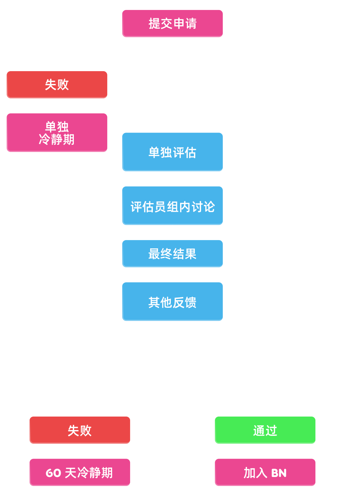

# 成为 BN

想要加入[谱面审核团队 (BN)](/wiki/People/Beatmap_Nominators) 的玩家需要在[审核评估团队 (NAT)](/wiki/People/Nomination_Assessment_Team) 成员的监管下通过 BN 申请程序。

BN 申请程序于 [BN 官网](http://bn.mappersguild.com/bnapps)进行。

想要通过 BN 申请，玩家需要达到 [kudosu](/wiki/Modding/Kudosu) 最低数量要求；提交 3 张自己[摸](/wiki/Modding)过的谱面的链接，并回答有关这些谱面的某些问题。一旦结果确定，NAT 会给你发送一条信息。关于申请的更多信息已在 [BN 官网](https://bn.mappersguild.com/bnapps)内列出。

## 基础标准

BN 申请者必须：

- 至少获取 150 个 [kudosu](/wiki/Modding/Kudosu)。
- 过去 12 个月内，没有违反 osu! [规章制度](/wiki/Rules)。
- 拥有区分应该提名和不该提名的谱面的能力。

### 在摸图中应体现的关键点（上狗摸要求）

*参见：[常见的摸图错误](/wiki/Guides/Common_modding_mistakes) 和 [osu!mania 摸图指南](/wiki/Guides/osu!mania_modding_guide)*

提交的摸应该展示了申请者能够区分应该提名和不该提名的谱面，同时有能力分析并提升谱面质量，达到了担任 BN 的水平要求。

以下这些是对提交摸的特殊要求：

- **覆盖所有难度等级。**
  - 大多数图拥有从简单 (Easy) 到专家 (Expert) 的一系列[难度](/wiki/Beatmap/Difficulty)，所以 BN 也应能够熟练地摸这些难度。对于摸非常困难难度的能力不做要求。
- **识别出摸图工具无法显示出的，不符合上架标准 (unrankable) 的问题。如不准确的歌曲时间轴或是歌曲元数据问题。**
- **比较谱面不同段落，并提出问题或改进建议。**
  - 引用谱面的不同段落，能让提出的建议和谱师在谱面中展示出的原思路、风格保持一致。
- **评述谱面的整体元素。如[节奏](/wiki/Music_theory/Rhythm)、物件间距、物件运动、物件密度、不同段落的差异、谱面一致性。**
  - 虽然我们鼓励 BN 在遇到琢磨不清的时候寻求他人的帮助，但是 BN 应在独立评判作图的几乎所有方面，达到不错的水平。
- **清晰区分单一出现的问题摸和广泛的全谱面问题摸。**
- **提出问题或改进建议时，总是从谱师角度出发考虑。**
  - 如果 BN 的作图风格和喜好与谱师打算展现出的风格等有冲突，请避免按照 BN 自己的作图风格和喜好提出建议。如果存在于谱师的风格有关的问题，请尝试理解谱师最初的意图，并提出对应的建议。
- **能够发现错误，并给不同经验水平的谱师提出有用的建议。**
  - 即使 BN 经常会和经验丰富的谱师打交道；评判高质量，不需要太多反馈的谱面，BN 也需要有发现这些谱面中存在的错误并提出改进建议的能力。尽管这些谱面可能来自于经验最丰富的谱师。这一点很重要。
  - 对于想要申请 BN 的申请者，建议不要提交来自于缺乏基础作图知识的谱师所制作谱面上的摸作为上狗摸。相反，应将质量足够，准备上架的谱面上的摸作为上狗摸。
- **与谱师顺畅沟通。**
  - 为了避免谱师误解，或是提出的摸被错误地理解并修改，BN 提出的摸图贴应尽可能清楚简洁地展示谱面中存在的问题并给出相应的解决方案。通常情况下也应避免使用专业术语。

## BN 申请流程

BN 申请者需要提交他们在过去 6 个月内，在 3 张谱面（分属于不同的[谱面拥有者](/wiki/Beatmap/Beatmap_host)）内的摸。

- **提供一个已经准备好被提名（或是在所有摸都完美解决后准备好被提名）谱面内的摸。**
  - 这能体现出申请者完成摸图最终步骤的能力，以及独立分析谱面在上架之前的准备情况。
  - 在提交 BN 申请时，谱面必须是 0 提名状态。
  - 申请者需要指明出为什么谱面已经准备好（或几乎准备好）被提名。
- **提供一个在不做出重大修改之前，都不应该被提名谱面内的摸。**
  - 这能体现出申请者识别谱面内存在的问题的能力、与其他谱师沟通的技巧以及对适合上架谱面的理解。
  - 这张谱面至少需要包括 Normal、Hard、Insane 难度。
  - 申请者需要指明出为什么谱面并未准备好被提名，并提供将自己的摸作为这一判断的理由。
- **提供一个能够体现申请者评价谱面质量能力，以及对适合上架谱面的理解的摸。**
  - 申请者可以自由挑选谱面，无论其是否适合上架。
  - 在提交 BN 申请时，谱面必须是 0 提名状态。
  - 申请者能有机会弥补其他遗漏的部分，并牢记文章前半段所提到的要求。
  - 申请者需要指明出为什么谱面已经（或者并未）准备好被提名。

在提交申请前，最好保存一份这 3 张谱面被摸之前的版本，这能方便评估员分析谱面的前后变化，并有助于评估顺利进行。

另外，如果申请被标注为公开，则会在[公共评估存档](https://bn.mappersguild.com/publicarchive)中显示出。玩家可以在[他们的评估页面](https://bn.mappersguild.com/yourevals)中自由切换其是否公开可见。

当玩家申请成为 BN 时，NAT 将会通过 "bnsite" Discord 机器人在特定的频道收到通知。通知将会包含申请者的玩家名和评估链接，并分配了负责这次评估的评估者。

[申请页](https://bn.mappersguild.com/bnapps)的进度条显示了当前的评估进行到了哪一步。

评估者可以在 BN 网站上审阅完整的申请，包括申请者提供的所有信息，以及申请者的历史评估记录（如果申请者曾经发过申请，或是曾经任职 BN）。

评估被分为两个阶段：*独立阶段*和*团队阶段*。

### 独立阶段

在最长持续 7 天的*独立阶段*中，3 位评估员将被随机分配给对应的申请。有时候，现任 BN 也会被邀请参与评估，但是至少会有一位 NAT 参与评估。

评估员将审查这些申请，因此评估申请者的摸图表现和言行举止。他们通常会在申请者提供的摸中记录任何正面或者负面的帖子。然后，每个评估员将会给这个申请投“通过”、“中立”、“不通过”票。

以下是对申请者的评估标准：

- **摸图能力：**
  - 熟记通用[上架标准 (RC)](/wiki/Ranking_criteria) 以及每个[游戏模式](/wiki/Game_mode)特有的上架标准。
  - 在申请中所提交的摸中，遵守[关键点](#在摸图中应体现的关键点（上狗摸要求）)。
  - 申请者作出的，关于这些摸所提出问题的回答。
  - 检查歌曲元数据、测定时间轴和其他一些相关的附加能力。
- **语气态度：**
  - 摸图的语气和其他行为是否符合[行为准则：摸图和作图](/wiki/Rules/Code_of_conduct_for_modding_and_mapping)。
  - 在聊天和论坛内的总体行为。

这个阶段，评估员的评论和投票将对其他评估员不可见。

### 团队阶段

如果达成以下条件，评估将进入团队阶段。该阶段最久持续到申请者提交申请之后的第 14 天。

- 所有参与评估的评估员都提交了独立评估。
- 只有大部分参与评估的评估员提交了独立评估，但他们一致认为该申请者不合格。

这个阶段，所有评估员的评论和投票都会对其他评估员可见。如果不明确如何做出对于申请者的最终决定时，他们将讨论，直到达成共识。

之后，评估流程结束并即将存档（提供以后可能的参考）。评估员们会撰写并补充反馈意见，来补充负责这个申请的评估员所遗漏的信息。结果会由 [NAT 机器人](https://osu.ppy.sh/users/6616586) 通过[通知消息](/wiki/Announcement_messages)的方式反馈给申请者。如果申请通过，申请者将在结果送出后马上加入实习 BN。

## 申请后沟通

当申请流程结束后，BN 网站将提供一个交互页，来让申请者和评估者直接沟通或者提问，无需关心评估进度和评估者的留言。

在 7 天不活跃后，反馈聊天将自动锁定。

## 冷却期

在以下情况发生后，申请者将有 60 天的冷却期：

- 申请未通过
- 被踢出 BN 团队
- [标准流程辞职](/wiki/People/Nomination_Assessment_Team/Evaluations#standard-terms)
