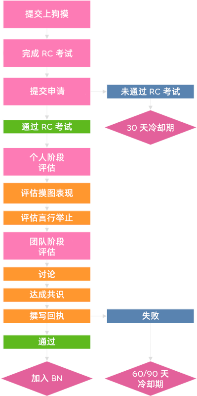

# 成为 BN

想要加入[谱面审核团队 (BN)](/wiki/People/Beatmap_Nominators) 的玩家需要在[审核评估团队 (NAT)](/wiki/People/Nomination_Assessment_Team) 成员的监管下通过 BN 申请程序。

BN 申请程序于 [BN 官网](http://bn.mappersguild.com/bnapps)进行。

想要通过 BN 申请，玩家需要达到 [kudosu](/wiki/Modding/Kudosu) 最低数量要求；提交两张自己[摸](/wiki/Modding)过的谱面的链接；并完成基于[谱面上架标准 (RC)](/wiki/Ranking_criteria) 而设立的 [BN 考试](/wiki/People/Beatmap_Nominators/Beatmap_Nominator_Test)。一旦结果确定，NAT 会给你发送一条信息。关于申请的更多信息已在 [BN 官网](https://bn.mappersguild.com/bnapps)内列出。

## 基础标准

BN 申请者必须达到以下标准：

- 至少获取 150 个 [kudosu](/wiki/Modding/Kudosu)。
- 提交 3 个让评审员觉得申请者有资格成为 BN 的摸（俗称上狗摸）。
  - 前 BN/NAT 成员在申请时，只需要至少提交 2 个摸。

### 摸图期望（上狗摸要求）

*参见：[常见的摸图错误](/wiki/Guides/Common_modding_mistakes) 和 [osu!mania 摸图指南](/wiki/Guides/osu!mania_modding_guide)*

提交的摸应该展示了申请者有能力分析并提升谱面质量，达到了担任 BN 的水平要求。

以下这些是对提交摸的特殊要求。任何一条不满足都可能导致申请者被拒。

- **覆盖所有难度等级。**
  - 大多数图拥有从简单 (Easy) 到专家 (Expert) 的一系列[难度](/wiki/Beatmap/Difficulty)，所以 BN 也应能够熟练地摸这些难度。对于摸非常困难难度的能力不做要求。
- **识别出摸图工具无法显示出的，不符合上架标准 (unrankable) 的问题。如不准确的歌曲时间轴或是歌曲元数据问题。**
- **比较谱面不同段落，并提出问题或改进建议。**
  - 引用谱面的不同段落，能让提出的建议和谱师在谱面中展示出的原思路、风格保持一致。
- **评述谱面的整体元素。如[节奏](/wiki/Music_theory/Rhythm)、物件间距、物件运动、物件密度、不同段落的差异、谱面一致性。**
  - 虽然我们鼓励 BN 在遇到琢磨不清的时候寻求他人的帮助，但是 BN 应在独立评判作图的几乎所有方面，达到不错的水平。
- **清晰区分单一出现的问题摸和广泛的全谱面问题摸。**
- **提出问题或改进建议时，总是从谱师角度出发考虑。**
  - 如果 BN 的作图风格和喜好与谱师打算展现出的风格等有冲突，请避免按照 BN 自己的作图风格和喜好提出建议。如果存在于谱师的风格有关的问题，请尝试理解谱师最初的意图，并提出对应的建议。
- **能够发现错误，并给不同经验水平的谱师提出有用的建议。**
  - 即使 BN 经常会和经验丰富的谱师打交道；评判高质量，不需要太多反馈的谱面，BN 也需要有发现这些谱面中存在的错误并提出改进建议的能力。尽管这些谱面可能来自于经验最丰富的谱师。这一点很重要。
  - 对于想要申请 BN 的申请者，建议不要提交来自于缺乏基础作图知识的谱师所制作谱面上的摸作为上狗摸。相反，应将质量足够，准备上架的谱面上的摸作为上狗摸。
- **与谱师顺畅沟通。**
  - 为了避免谱师误解，或是提出的摸被错误地理解并修改，BN 提出的摸图贴应尽可能清楚简洁地展示谱面中存在的问题并给出相应的解决方案。通常情况下也应避免使用专业术语。

## BN 申请流程

评估员将会审查通过 [BN 考试](/wiki/People/Beatmap_Nominators/Beatmap_Nominator_Test)，并提交到 BN 官网的申请，来确定申请者是否可以进入 BN 候选组。

当申请者提交申请后， “bnsite” 机器人将在 NAT 设立的 Discord 频道中通知 NAT。通知将包括申请者的用户名和考试成绩，以及为其分配的评估员。

之后，评估员可以在 BN 官网上审查完整的申请内容，包括申请者提交的所有信息、考试成绩。如果申请者曾申请或曾任 BN，也会展示申请者历史评估的记录。

评估被分为两个阶段：*独立阶段*和*团队阶段*。

### 独立阶段

在最长持续 7 天的*独立阶段*中，2-3 位评估员将被随机分配给对应的申请。有时候，现任 BN 也会被邀请参与评估，但是至少会有一位 NAT 参与评估。

评估员将审查这些申请，因此评估申请者的摸图表现和言行举止。他们通常会在申请者提供的摸中记录任何正面或者负面的帖子。然后，每个评估员将会给这个申请投“通过”、“中立”、“失败”票。

以下是对申请者的评估标准：

- **摸图能力：**熟记通用[上架标准 (RC)](/wiki/Ranking_criteria) 以及每个[游戏模式](/wiki/Game_mode)特有的上架标准，遵守[摸图期望](#摸图期望（上狗摸要求）)，在评估时也会考虑申请者检查歌曲元数据、测定时间轴和其他一些相关的能力。
- **语气态度：**摸图的语气和其他行为，或在聊天、论坛等地方的言论是否符合[行为准则：摸图和作图](/wiki/Rules/Code_of_conduct_for_modding_and_mapping)。

这个阶段，评估员的评论和投票将对其他评估员不可见。

### 团队阶段

如果达成以下条件，评估将进入团队阶段。该阶段最久持续到申请者提交申请之后的第 14 天。

- 所有参与评估的评估员都提交了独立评估。
- 只有大部分参与评估的评估员提交了独立评估，但他们一致认为该申请者不合格。

这个阶段，所有评估员的评论和投票都会对其他评估员可见。如果不明确如何做出对于申请者的最终决定时，他们将讨论，直到达成共识。

然后，评估员将会根据讨论结果和评论，通过[审核评估团队 (NAT) 机器人](https://osu.ppy.sh/users/6616586)给申请者以[公告消息](/wiki/Announcement_messages)的方式发送反馈意见。随后评估结果将存档供未来使用。如果申请者成功通过，将在反馈结果发送后立即添加为见习 BN。

如果申请者[申请失败](/wiki/People/Beatmap_Nominators/Becoming_a_Beatmap_Nominator#申请失败)，NAT 还将确定申请者可再次发出申请之前的[冷却期](#申请失败)。如果申请者的冷却期被缩短，NAT 将会在反馈意见中指出。

## 冷却期

取决于你所在的状态不同，对于申请失败直到再次申请之前所需的冷却期，要求也会不同。

### 申请失败

如果你申请 BN 失败，在你再次提交申请前，需要经过一段冷静期：

| 种类 | 冷却期 | 用途 |
| :-- | :-- | :-- |
| 缩短 (Reduced) | 30 天 | 申请还有一点小问题，或是未通过 [BN 考试](/wiki/People/Beatmap_Nominators/Beatmap_Nominator_Test) |
| 常规 (Standard) | 60 天 | 常规 |
| 延长 (Extended) | 120 天 | 申请者有严重的行为问题 |

### 在离开 BN 团队后回归

对于离开 BN 团队后回归的玩家，和第一次加入团队的玩家的要求不太一样。如果玩家在离开团队之前表现良好，那么他们在回归团队时，甚至可以无需满足某些要求，直接加入。NAT 会提醒那些符合快速回归 BN 团队条件的玩家。

如果申请者曾任 BN，适用下表的这些要求。但是如果申请者在曾任 BN 后还未通过 BN 考试，则不适用下表的要求：

| 种类 | 冷却期 | 申请流程 |
| :-- | :-- | :-- |
| 良好 (Good) | *无* | *无*[^good-terms] |
| 常规 (Standard) | 60 天 | 常规 |
| 活跃度不足 (Activity) | *无* | 常规[^activity-terms] |

## 备注

[^good-terms]: 即使离开 BN 团队的玩家在此之前表现良好，在一年之后也需要遵守标准的流程重新申请。
[^activity-terms]: 申请者需要在申请中提交 3 个摸，而不是标准要求的 2 个。
