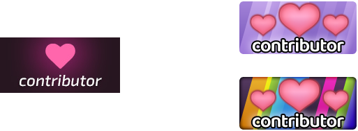

# Mitwirkende der Community

::: Infobox

:::

::: Infobox

:::

Die **Community-Mitwirkenden** sind eine handvoll Leute, die aufgrund ihrer besonderen Arbeit — sei es Features, Tools oder Organisatorisches — eine bedeutende Auswirkung auf die Community haben und diese zu der gemacht haben, was sie heute ist. Diese Personen haben dafür ein Abzeichen auf ihrem Profil bekommen, das zeigt, dass sie etwas Bemerkenswertes für die gesamte Community getan haben.

Nicht zu verwechseln mit [osu! Alumni](/wiki/People/osu!_Alumni), die frühere Mitglieder verschiedener osu!-Teams waren und nun zurückgetreten sind. Community-Contributor-Abzeichen werden an freiwillige Helfer vergeben, die sich über ihre Pflicht hinaus für die Verbesserung von osu! und der Community-Umgebung eingesetzt haben.

Mitwirkende, die ihre Accounts während einer früheren Ära des Spiels registrierten, haben das [originale Abzeichendesign](#geschichte) auf ihrem Profil und neuere Mitwirkende erhalten eine buntere Variante.

## Auflistung

### 2013

#### August

*Für den Forumsbeitrag, siehe: [osu! community contributors](https://osu.ppy.sh/community/forums/topics/147919)*

| Benutzer | Beiträge |
| :-- | :-- |
| ::{ flag=GB }:: ::Darkimmortal::{ user-id=10886 } | Entwicklung und Wartung des [osu!record-Service](https://osu.ppy.sh/community/forums/topics/108092) (Replay `.osr` zu Videodatei). |
| ::{ flag=DE }:: ::nanashiRei::{ user-id=807630 } | Hosting und Wartung einer der am längsten laufenden [Nachbildung einer Beatmap-Auflistung](https://osu.yas-online.net/). |
| ::{ flag=US }:: ::RBRat3::{ user-id=307202 } | Unzählige grafische Beiträge zum Spiel-Client und zu allem anderen. |
| ::{ flag=CN }:: ::Ballance::{ user-id=165946 } | Gestaltung der [Achievements](/wiki/Medals). |
| ::{ flag=US }:: ::akrolsmir::{ user-id=576800 } | Entwickler und Aufrechthaltung des [AIBat](https://osu.ppy.sh/community/forums/topics/55305), dem bekanntesten Drittanbietertool für Beatmap-Modding, das heute von den meisten Benutzern in der Community verwendet wird. |
| ::{ flag=NL }:: ::statementreply::{ user-id=126198 } | Ausgezeichnete Arbeit im Testen von Features und bei der Fehlerbehebung sowie Entwicklung verschiedener Funktionen für Mapper und Modder. |
| ::{ flag=DE }:: ::Loctav::{ user-id=71366 } | Organisierung vieler offizieller Turniere (unter anderem des [OWC](/wiki/Tournaments/OWC)). |
| ::{ flag=US }:: ::Blazevoir::{ user-id=120265 } | Wahnsinnige Moderationserfolge (entspricht etwa 6 Mitarbeitern) und fast alleinige Moderation von `#osu` während der Spitzenzeiten (9k+ Nutzer). |
| ::{ flag=PL }:: ::Piotrekol::{ user-id=304520 } | Entwicklung und Pflege von [osu!stats](https://osustats.ppy.sh/) und einer Reihe nützlicher Werkzeuge für Beatmapping, Modding und allgemeines Spielen. |
| ::{ flag=NO }:: ::MillhioreF::{ user-id=941094 } | Herausragende Leistungen beim Testen von Bugfixes/Features und bei der Bearbeitung von Support-Anfragen der Benutzer. |
| ::{ flag=US }:: ::DeathxShinigami::{ user-id=49516 } | Mehr als drei Jahre lang für die Aufrechthaltung der [Beatmap-Pakete](https://osu.ppy.sh/p/packlist) verantwortlich und mehrere Jahre hindurch der Manager der Beatmap-Charts. |
| ::{ flag=US }:: ::LuigiHann::{ user-id=1079 } | Jahrelanger Dienst und Mithilfe, insbesondere des Skinning und fortgeschrittenem [Storyboarding](/wiki/Storyboard) und Designer des originalen Skins. |
| ::{ flag=CA }:: ::awp::{ user-id=2650 } | Frühes Mitglied und für das damalige Community-Management verantwortlich. Außerdem sehr stark mitwirkend innerhalb der Community. |
| ::{ flag=GR }:: ::Sinistro::{ user-id=5530 } | Der erste Community-Manager und globaler Moderator, der die Messlatte und Qualifikation für das [GMT](/wiki/People/Global_Moderation_Team) sehr hoch gesetzt hat und dadurch für ausgezeichnete Moderatoren verantwortlich ist. |
| ::{ flag=US }:: ::Ivalset::{ user-id=827 } | Der erste Team-Manager sowie [BAT-Manager](/wiki/People/Beatmap_Appreciation_Team/BAT_Managers), der damals alleine ein elitäres Moderationsteam für Beatmaps aus dem Nichts gegründet hat. |

### 2015

#### März

| Benutzer | Beiträge |
| :-- | :-- |
| ::{ flag=MX }:: ::Repflez::{ user-id=201392 } | Herausragende Beiträge zum osu!-Wiki |
| ::{ flag=MY }:: ::RaikireHiuduo::{ user-id=1570014 } | Herausragende Beiträge zum osu!-Wiki |
| ::{ flag=DE }:: ::givenameplz::{ user-id=947499 } | Entwicklung von [osu!Rank](https://osu.ppy.sh/community/forums/topics/133966) & [osu!Post](https://osu.ppy.sh/community/forums/topics/164486) |

### 2016

#### Januar

*Für den Newsbeitrag, siehe: [Community Contributor Badges (January 2016)](https://osu.ppy.sh/home/news/2016-01-09-community-contributor-badges-january-2016)*

| Benutzer | Beiträge |
| :-- | :-- |
| ::{ flag=US }:: ::ztrot::{ user-id=6347 } | Gründung der [osu!academy](/wiki/Community/Video_series/osu!academy) |
| ::{ flag=CA }:: ::karterfreak::{ user-id=1031958 } | osu!weekly + News-Mitwirkender |
| ::{ flag=BG }:: ::Flanster::{ user-id=447818 } | Herausragende Moderationspräsenz (10k+ Kills) |
| ::{ flag=PH }:: ::Nathanael::{ user-id=2295078 } | Herausragende Moderationspräsenz (10k+ Kills) |
| ::{ flag=SE }:: ::Saten::{ user-id=444506 } | Herausragende Moderationspräsenz und Engagement (30k+ Kills) |
| ::{ flag=DE }:: ::MoonShade::{ user-id=273649 } | Entwicklung von revolutionären Hilfsprogrammen für das Storyboarding (SGL) |
| ::{ flag=PL }:: ::iys::{ user-id=322480 } | Entwicklung von [Mikuia.tv](https://mikuia.tv) - ein Toolkit für osu!-Twitchbots |
| ::{ flag=DE }:: ::Tillerino::{ user-id=2070907 } | Entwicklung eines Beatmap-Empfehlungsbots |

#### März

*Für den Newsbeitrag, siehe: [osu!weekly #53](https://osu.ppy.sh/home/news/2016-03-22-osuweekly-53)*

| Benutzer | Beiträge |
| :-- | :-- |
| ::{ flag=US }:: ::Charles445::{ user-id=85000 } | Jahrelanges Engagement für die Aufrechterhaltung und Verbesserung der Qualität des Mappings, das bei zahlreichen Gelegenheiten zur Lösung verschiedener Probleme in der Community beigetragen hat. |

#### November

*Für den Newsbeitrag, siehe: [Recognising the Best of the Best](https://osu.ppy.sh/home/news/2016-11-02-recognising-the-best-of-the-best)*

| Benutzer | Beiträge |
| :-- | :-- |
| ::{ flag=US }:: ::pishifat::{ user-id=3178418 } | Beispielhafte Leistungen in den Bereichen Beatmap-Erstellung und -Weiterbildung |
| ::{ flag=DE }:: ::Okoratu::{ user-id=1623405 } | Außergewöhnliche Führungsqualitäten in Sachen Beatmap-Management |
| ::{ flag=HK }:: ::IamKwaN::{ user-id=1856463 } | Herausragende Moderationspräsenz und Gesamtbeitrag |
| ::{ flag=PL }:: ::Marcin::{ user-id=722665 } | Herausragender Beitrag zu Community-Angelegenheiten, Organisation und Moderation |
| ::{ flag=PL }:: ::LiquidPL::{ user-id=5044384 } | Herausragender Entwicklungsbeitrag (osu!next) |
| ::{ flag=CA }:: ::Nyquill::{ user-id=682935 } | Herausragender Beitrag für die Community (osu!weekly) |
| ::{ flag=US }:: ::Derekku::{ user-id=91341 } | Frühzeitige Verwaltung und Moderation der Community |
| ::{ flag=ES }:: ::Trosk-::{ user-id=3469385 } | Herausragender Beitrag zu Community-Angelegenheiten |
| ::{ flag=FR }:: ::Shiro::{ user-id=113005 } | Herausragender Beitrag zu Moderation, Organisation und Management |

### 2017

#### Dezember

*Für den Newsbeitrag, siehe: [Community Contributors: 2017](https://osu.ppy.sh/home/news/2017-12-24-community-contributors-2017)*

| Benutzer | Beiträge |
| :-- | :-- |
| ::{ flag=DE }:: ::OnosakiHito::{ user-id=290128 } | Herausragende Arbeit bei der Gründung der frühen osu!taiko-Community, mehrjährige Tätigkeit im [BAT](/wiki/People/Beatmap_Appreciation_Team)/[QAT](/wiki/People/Quality_Assurance_Team) |
| ::{ flag=ES }:: ::Deif::{ user-id=318565 } | Herausragende Beiträge zur osu!catch-Community, Überarbeitung der Ranking-Kriterien und Turnieren |
| ::{ flag=NZ }:: ::deadbeat::{ user-id=128370 } | Herausragende Beiträge zu zahlreichen Medienprojekten, Turnieren und eine langjährige Zugehörigkeit zum [GMT](/wiki/People/Global_Moderation_Team) |
| ::{ flag=US }:: ::Garven::{ user-id=244216 } | Jahrelange engagierte Arbeit für das [BAT](/wiki/People/Beatmap_Appreciation_Team)/[QAT](/wiki/People/Quality_Assurance_Team) und immenser Beitrag zur Überarbeitung der Ranking-Kriterien |
| ::{ flag=DE }:: ::Mao::{ user-id=2204515 } | Jahrelanges Engagement für das [BAT](/wiki/People/Beatmap_Appreciation_Team)/[QAT](/wiki/People/Quality_Assurance_Team), maßgebliche Beteiligung an der Überarbeitung der Ranking-Kriterien und am Beatmap Nominator Test Management |
| ::{ flag=CH }:: ::Irreversible::{ user-id=1287964 } | Engagierter Beitrag zum [BAT](/wiki/People/Beatmap_Appreciation_Team)/[QAT](/wiki/People/Quality_Assurance_Team) über unzählige Jahre hinweg |
| ::{ flag=DE }:: ::Nwolf::{ user-id=1910766 } | Hunderte von Stunden an Statistiken und Analysen zu den Turnieren des World Cup |
| ::{ flag=GB }:: ::Yazzehh::{ user-id=7068973 } | Herausragende Präsenz als Schiedsrichter bei Dutzenden Community-Turnieren |
| ::{ flag=CA }:: ::Evrien::{ user-id=791660 } | Hervorragende Leistungen bei Castings, Kommentierungen und ereignisbezogenen Berichten/Rückblicken |
| ::{ flag=DE }:: ::Tom94::{ user-id=1857058 } | Der Kopf hinter zahllosen Verbesserungen von osu!, von pp, zu einer neu geschriebenen Grafik-Engine, über Star-Rating und mehr! |
| ::{ flag=CA }:: ::DrabWeb::{ user-id=6946022 } | Herausragender Beitrag zum osu!(lazer)-Projekt |
| ::{ flag=BY }:: ::EVAST::{ user-id=8195163 } | Herausragender Beitrag zum osu!(lazer)-Projekt mit über 90 Pull Requests und Hunderten von Commits |
| ::{ flag=CN }:: ::huoyaoyuan::{ user-id=2428732 } | Herausragender Beitrag zum osu!(lazer)-Projekt |
| ::{ flag=CN }:: ::kj415j45::{ user-id=9367540 } | Herausragender Beitrag und Organisation des chinesischen Lokalisierungsprojekts für osu!, osu!-Wiki und osu!(lazer) |
| ::{ flag=DE }:: ::jorolf::{ user-id=7004641 } | Herausragender Beitrag zum osu!(lazer)-Projekt und Erstellung zahlreicher Medienwerkzeuge |
| ::{ flag=AU }:: ::Syrin::{ user-id=5701575 } | Ersteller von [PerformancePlus](https://syrin.me/pp+/) und [osu!chan](https://osuchan.syrin.me) |
| ::{ flag=SG }:: ::Raveille::{ user-id=1388767 } | Herausragende Leistungen bei der Erstellung und Veröffentlichung des Scorewatch-Projekts |
| ::{ flag=FR }:: ::ThePooN::{ user-id=718454 } | Herausragende Leistungen bei der Erstellung und Veröffentlichung des Scorewatch-Projekts |
| ::{ flag=US }:: ::MegaApple\1Pi::{ user-id=2148208 } | Hervorragender Einsatz bei der Förderung des osu!-Wiki-Projekts mit unzähligen Überarbeitungen, Nacharbeiten und Überprüfungen |
| ::{ flag=PL }:: ::TPGPL::{ user-id=3944705 } | Stützpfeiler des osu!-Wiki-Projekts und herausragender Beitrag über die Jahre hinweg |

### 2019

#### Februar

*Für den Newsbeitrag, siehe: [Community Contributors: February 2019](https://osu.ppy.sh/home/news/2019-02-22-community-contributors-february-2019)*

| Benutzer | Beiträge |
| :-- | :-- |
| ::{ flag=US }:: ::HappyStick::{ user-id=256802 } | World Cup Organisation & Gastgeber der osu! Coffee Hour |
| ::{ flag=AR }:: ::juankristal::{ user-id=443656 } | Herausragender Beitrag zur Organisation des World Cups und anderer Turniere |
| ::{ flag=CL }:: ::WalterToro::{ user-id=5281416 } | Herausragender Beitrag als Mitglied des [GMT](/wiki/People/Global_Moderation_Team) und osu!-Wiki-Teams |
| ::{ flag=US }:: ::clayton::{ user-id=3666350 } | Hervorragende Beiträge in vielen Projekten und Bereichen |
| ::{ flag=BE }:: ::VeilStar::{ user-id=4255720 } | Hervorragende Arbeit bei Spielersupport und Problemlösung |
| ::{ flag=AT }:: ::Stefan::{ user-id=626907 } | Projektbetreiber der Extraklasse im Bereich [Beatmap-Pakete](https://osu.ppy.sh/beatmaps/packs) |
| ::{ flag=SE }:: ::Naxess::{ user-id=8129817 } | Entwickler zahlreicher Tools, die sich als integraler Bestandteil des modernen Ranking-Zyklus erwiesen haben |
| ::{ flag=HU }:: ::Kurokami::{ user-id=260933 } | Herausragender Beitrag zum [Beatmap-Spotlights-Projekt](/wiki/Beatmap_Spotlights) |
| ::{ flag=DE }:: ::p3n::{ user-id=123703 } | Herausragender Beitrag in zahlreichen Projekten und Bereichen |
| ::{ flag=FR }:: ::shARPII::{ user-id=776257 } | Hervorragender Beitrag zum [GMT](/wiki/People/Global_Moderation_Team) und zur Aufrechterhaltung von Turnieren |
| ::{ flag=US }:: ::Toy::{ user-id=2757689 } | [Project Loved](/wiki/Community/Project_Loved) Teamleiter |
| ::{ flag=CA }:: ::Kaifin::{ user-id=2596942 } | Frühzeitige Unterstützung und Organisation des [Project Loved](/wiki/Community/Project_Loved) |
| ::{ flag=US }:: ::Zak::{ user-id=1375955 } | [Project Loved](/wiki/Community/Project_Loved) Captain (osu!catch) |
| ::{ flag=US }:: ::Backfire::{ user-id=263110 } | [Project Loved](/wiki/Community/Project_Loved) Captain (osu!taiko) |
| ::{ flag=DE }:: ::Tenshichan::{ user-id=1101600 } | [Project Loved](/wiki/Community/Project_Loved) Captain (osu!catch) |
| ::{ flag=PL }:: ::Kamikaze::{ user-id=2124783 } | [Project Loved](/wiki/Community/Project_Loved) Captain (osu!mania) |
| ::{ flag=GB }:: ::Pope Gadget::{ user-id=2288341 } | [Project Loved](/wiki/Community/Project_Loved) Captain (osu!mania) |
| ::{ flag=AR }:: ::Yuii-::{ user-id=2935923 } | Herausragender Beitrag zum [Mentorenprogramm](/wiki/Community/Community_Mentorship_Program) |
| ::{ flag=US }:: ::Halfslashed::{ user-id=4598899 } | Herausragender Beitrag zum [Mentorenprogramm](/wiki/Community/Community_Mentorship_Program) |
| ::{ flag=DE }:: ::Mir::{ user-id=8688812 } | Herausragender Beitrag zum [Mentorenprogramm](/wiki/Community/Community_Mentorship_Program) |
| ::{ flag=US }:: ::Mun::{ user-id=6699165 } | Herausragender Beitrag zum [Mentorenprogramm](/wiki/Community/Community_Mentorship_Program) |
| ::{ flag=FI }:: ::J1NX1337::{ user-id=3971179 } | Herausragender Beitrag zum [Mentorenprogramm](/wiki/Community/Community_Mentorship_Program) |
| ::{ flag=JP }:: ::ekr::{ user-id=4497706 } | Herausragender Beitrag zum osu!(lazer)-Projekt |

### 2020

#### Februar

*Für den Newsbeitrag, siehe: [Community Contributors: 2019](https://osu.ppy.sh/home/news/2020-02-07-community-contributors-2019)*

| Benutzer | Beiträge |
| :-- | :-- |
| ::{ flag=CA }:: ::VINXIS::{ user-id=4323406 } | Herausragende Beiträge zu Community-Angelegenheiten, Veranstaltungen und Turnieren |
| ::{ flag=SG }:: ::hehe::{ user-id=2123087 } | Herausragende Beiträge zur Mapping-Szene, zu Veranstaltungen und Turnieren |
| ::{ flag=US }:: ::Noffy::{ user-id=1541323 } | Herausragende Beiträge zur Mapping-, Modding- und Metadaten-Szene |
| ::{ flag=SG }:: ::Shoegazer::{ user-id=2520707 } | Herausragende Beiträge zum Spielmodus osu!mania |
| ::{ flag=GB }:: ::JBHyperion::{ user-id=4879508 } | Herausragende Beiträge zum Spielmodus osu!catch und zum Management |
| ::{ flag=GB }:: ::-Mo-::{ user-id=2202163 } | Herausragende Beiträge zu Management- und Führungsangelegenheiten |
| ::{ flag=US }:: ::Chaos::{ user-id=2628870 } | Herausragende Beiträge für das globale Moderationsteam |
| ::{ flag=BE }:: ::yaspo::{ user-id=4945926 } | Herausragende Beiträge zum Mentorenprogramm |
| ::{ flag=CL }:: ::Uberzolik::{ user-id=1314547 } | Herausragende Beiträge zum Mentorenprogramm |
| ::{ flag=SE }:: ::PuffBuck::{ user-id=4234525 } | Herausragende Beiträge zur Moderation und Organisation des World Cups |
| ::{ flag=GB }:: ::Doomsday::{ user-id=18983 } | Herausragende, unermüdliche Beiträge für die osu!-Community im Allgemeinen |
| ::{ flag=AT }:: ::Omgforz::{ user-id=578943 } | Herausragende Beiträge zum osu! World Cup |
| ::{ flag=AU }:: ::Kano::{ user-id=3036203 } | Herausragende Beiträge zum osu! World Cup |
| ::{ flag=US }:: ::Halogen-::{ user-id=169992 } | Herausragende Beiträge zur osu!mania-Turnierszene |
| ::{ flag=DE }:: ::Junihuhn::{ user-id=4182339 } | Herausragende Beiträge für die osu! World Cups & Turnierszene |
| ::{ flag=NL }:: ::Sartan::{ user-id=4100941 } | Herausragende Beiträge zur osu!catch-Turnierszene |
| ::{ flag=RU }:: ::Kobold84::{ user-id=3227533 } | Herausragende Beiträge zur Community-Moderation |
| ::{ flag=US }:: ::Death::{ user-id=3242450 } | Herausragende, unermüdliche Unterstützung und Hilfe für Spieler |
| ::{ flag=US }:: ::Dntm8kmeeatu::{ user-id=5428812 } | Herausragende, unermüdliche Unterstützung und Hilfe für Spieler |
| ::{ flag=CL }:: ::Milan-::{ user-id=1052994 } | Herausragende Beiträge für die [Mappers' Guild](/wiki/Community/Mappers_Guild) und [Beatmap Nominatoren](/wiki/People/Beatmap_Nominators) |
| ::{ flag=US }:: ::Joehu::{ user-id=8549835 } | Herausragende Beiträge zu Open-Source-Projekten für osu! |

### 2021

#### März

*Für den Newsbeitrag, siehe: [Community Contributors: 2020](https://osu.ppy.sh/home/news/2021-03-19-community-contributors-2020)*

| Benutzer | Beiträge |
| :-- | :-- |
| ::{ flag=DE }:: ::hallowatcher::{ user-id=1874761 } | Herausragende Beiträge zu Veranstaltungen der Community und zur Entwicklung |
| ::{ flag=GB }:: ::mangomizer::{ user-id=1893718 } | Herausragende Beiträge zu den World Cups und Community-Veranstaltungen |
| ::{ flag=DE }:: ::Lasse::{ user-id=896613 } | Herausragende Beiträge zur Mapping- und Modding-Szene |
| ::{ flag=PL }:: ::spaceman\1atlas::{ user-id=3035836 } | Herausragende Beiträge zur Entwicklung von osu! durch viele Projekte |
| ::{ flag=DE }:: ::RockRoller::{ user-id=8388854 } | Herausragende Beiträge zur Skinning- und Moderationsszene von osu! |
| ::{ flag=US }:: ::I Must Decrease::{ user-id=2773526 } | Herausragende Beiträge zur Wartung und Entwicklung des Scorings |
| ::{ flag=US }:: ::this1neguy::{ user-id=1797189 } | Herausragende Beiträge zu den World Cups und Community-Turnieren |

### 2022

#### Juni

*Für den Newsbeitrag, siehe: [Community Contributors: 2021](https://osu.ppy.sh/home/news/2022-06-30-community-contributors-2021)*

| Benutzer | Beiträge |
| :-- | :-- |
| ::{ flag=FR }:: ::Kasumi-sama::{ user-id=6177263 } | Herausragende Beiträge zu der Community-Turnierszene von osu!taiko |
| ::{ flag=SA }:: ::frenzibyte::{ user-id=14210502 } | Herausragende Beiträge zur Entwicklung von osu!(lazer) |
| ::{ flag=HR }:: ::Susko3::{ user-id=18945305 } | Herausragende Beiträge zur Entwicklung von osu!(lazer) und osu!framework |
| ::{ flag=RU }:: ::StanR::{ user-id=7217455 } | Herausragende Beiträge zur Entwicklung und Wartung der osu!-Performance-Punkte |
| ::{ flag=GB }:: ::Apo11o::{ user-id=9558549 } | Herausragende Beiträge zur Entwicklung der osu!-Performance-Punkte |
| ::{ flag=AU }:: ::MBmasher::{ user-id=4498616 } | Herausragende Beiträge zur Entwicklung der osu!-Performance-Punkte und zur Wiederbelebung der Mod Flashlight |
| ::{ flag=SE }:: ::Walavouchey::{ user-id=5773079 } | Herausragende Beiträge zum osu!-Wiki-Projekt |
| ::{ flag=ID }:: ::Niva::{ user-id=197805 } | Herausragende Beiträge zum osu!-Wiki-Projekt |
| ::{ flag=NZ }:: ::Technocoder::{ user-id=10338558 } | Herausragende Beiträge zum technischen Support für macOS |
| ::{ flag=LT }:: ::huu::{ user-id=6044237 } | Herausragende Beiträge zum Management und zur Organisation von Project Loved |
| ::{ flag=NL }:: ::OliBomby::{ user-id=6573093 } | Herausragende Beiträge zur osu!-Mapping-Szene mit der Entwicklung von Tools |
| ::{ flag=TR }:: ::frukoyurdakul::{ user-id=7612550 } | Herausragende Beiträge zur osu!taiko-Mapping-Szene mit der Entwicklung von Tools |
| ::{ flag=BR }:: ::LeoFLT::{ user-id=3668779 } | Herausragende Beiträge zur osu!-Turnierszene und den World Cups |
| ::{ flag=US }:: ::ChillierPear::{ user-id=9501251 } | Herausragende Beiträge zur osu!-Turnierszene und den World Cups |
| ::{ flag=NL }:: ::cavoeboy::{ user-id=7361815 } | Herausragende Beiträge zu osu! IRL-Events und zur Turnierszene |

### 2023

#### November

*Für den Newsbeitrag, siehe: [Community Contributors: 2022 & 2023](https://osu.ppy.sh/home/news/2023-11-19-community-contributors-2022-2023)*

| Benutzer | Beiträge |
| :-- | :-- |
| ::{ flag=AU }:: ::Ephemeral::{ user-id=102335 } | Außergewöhnliches und unermüdliches Engagement im Community-Management für über ein Jahrzehnt |
| ::{ flag=PL }:: ::Venix::{ user-id=5999631 } | Herausragendes Engagement in der Moderationsszene und den [Beatmap Spotlights](/wiki/Beatmap_Spotlights) |
| ::{ flag=CH }:: ::TicClick::{ user-id=672931 } | Herausragende Beiträge zu Moderationsangelegenheiten und dem osu!-Wiki (wikifriend) |
| ::{ flag=TN }:: ::Hivie::{ user-id=14102976 } | Herausragende und wegweisende Beiträge zum osu!taiko-Spielmodus |
| ::{ flag=US }:: ::radar::{ user-id=7131099 } | Herausragende Führung zu Angelegenheiten im Beatmap-Management |
| ::{ flag=US }:: ::Cychloryn::{ user-id=6921736 } | Herausragende Beiträge zur Mappingszene durch die Entwicklung von Tools ([osumod.com](https://osumod.com)) |
| ::{ flag=US }:: ::BTMC::{ user-id=3171691 } | Herausragende Beiträge zu Offline-Turnieren und dem Wachstum der Community allgemein |
| ::{ flag=CA }:: ::D I O::{ user-id=3958619 } | Herausragende Beiträge zur osu!-Turnierszene und den World Cups |
| ::{ flag=CA }:: ::Azer::{ user-id=2155578 } | Herausragende Beiträge zur osu!-Turnierszene und den World Cups |
| ::{ flag=MY }:: ::Jerry::{ user-id=605973 } | Herausragende Beiträge zur osu!taiko-Community und Turnierszene |
| ::{ flag=NL }:: ::Roan::{ user-id=8214639 } | Herausragende Beiträge zur Skinning-Community |
| ::{ flag=AR }:: ::Darksonic::{ user-id=570042 } | Herausragende Beiträge zur Community-Moderation |
| ::{ flag=GB }:: ::Tanza3D::{ user-id=10379965 } | Herausragende Beiträge zum Grafikdesign in unzähligen Community-Projekten |
| ::{ flag=US }:: ::vrnl::{ user-id=4799788 } | Herausragende Beiträge zur Qualitätssicherung von Beatmaps |
| ::{ flag=DE }:: ::Meyer::{ user-id=5452367 } | Herausragende Beiträge zu osu! IRL-Events |
| ::{ flag=ID }:: ::FAMoss::{ user-id=7707789 } | Herausragende Beiträge zur [Mappers' Guild](/wiki/Community/Mappers_Guild) und zu Vorstellungsvideos von Featured Artists |
| ::{ flag=ID }:: ::Hinsvar::{ user-id=1249323 } | Herausragende Beiträge zur [Mappers' Guild](/wiki/Community/Mappers_Guild) und zu Präsentationsvideos von Featured Artists |
| ::{ flag=PH }:: ::Jemzuu::{ user-id=7890134 } | Herausragende Beiträge zur [Mappers' Guild](/wiki/Community/Mappers_Guild) und zu Präsentationsvideos von Featured Artists |
| ::{ flag=RU }:: ::SMOKELIND::{ user-id=9327302 } | Herausragende Beiträge zur [Mappers' Guild](/wiki/Community/Mappers_Guild) und zu Präsentationsvideos von Featured Artists |
| ::{ flag=LT }:: ::Strategas::{ user-id=2971837 } | Herausragende Beiträge zur [Mappers' Guild](/wiki/Community/Mappers_Guild) und zu Präsentationsvideos von Featured Artists |

### 2024

#### März

*Für den Newsbeitrag, siehe: [Community Contributors: 2024](https://osu.ppy.sh/home/news/2025-03-25-community-contributors-2024)*

| Benutzer | Beiträge |
| :-- | :-- |
| ::{ flag=RS }:: ::0x84f::{ user-id=7944724 } | Herausragende Beiträge zu Moderationsangelegenheiten, zur Teamführung und Berichterstattung |
| ::{ flag=CN }:: ::Sakura006::{ user-id=10365024 } | Ausgezeichnete Koordinierung der Erstellung von Musik und Kunst für osu! |
| ::{ flag=US }:: ::Ascendance::{ user-id=2931883 } | Herausragende Beiträge zur Community und Mappingszene von osu!catch |
| ::{ flag=NL }:: ::Greaper::{ user-id=2369776 } | Herausragende Beiträge zur osu!catch-Community und zur Entwicklung zentraler Tools |
| ::{ flag=ID }:: ::Maxus::{ user-id=4335785 } | Herausragende Beiträge zur Modding- und Mappingszene von osu!mania |
| ::{ flag=US }:: ::-mint-::{ user-id=8976576 } | Herausragende Beiträge zur Turnier- und Mappingszene von osu!mania |
| ::{ flag=NL }:: ::Mr HeliX::{ user-id=2330619 } | Herausragende Beiträge zur Entwicklung der Performance-Punkte durch zentrale Tools ([huismetbenen](https://pp.huismetbenen.nl/)) |
| ::{ flag=GB }:: ::tsunyoku::{ user-id=11315329 } | Herausragende Beiträge zur Entwicklung der Performance-Punkte und zur Wartung von osu!(stable) |
| ::{ flag=CA }:: ::emanfman::{ user-id=4136150 } | Herausragende Beiträge durch das Vereinen der Community auf Reddit während den [r/place](https://www.reddit.com/r/place/)-Events |
| ::{ flag=RU }:: ::cyperdark::{ user-id=9893708 } | Herausragende Beiträge zur Community durch die Entwicklung und Dokumentation von Replay-Tools |
| ::{ flag=CA }:: ::FunOrange::{ user-id=2051389 } | Herausragende Beiträge zur Community durch die Entwicklung von Tools ([osu-trainer](https://github.com/FunOrange/osu-trainer)) |
| ::{ flag=SG }:: ::oneplusone::{ user-id=1843447 } | Herausragende Beiträge zur Community durch die Entwicklung von Tools ([osuplus](https://github.com/limjeck/osuplus)) |
| ::{ flag=US }:: ::Stevy::{ user-id=5053158 } | Herausragende Beiträge zur Community durch die Entwicklung von Tools ([owo! bot](https://owo-bot.xyz/)) |
| ::{ flag=BE }:: ::Badewanne3::{ user-id=2211396 } | Herausragende Beiträge zur Community durch die Entwicklung von Tools ([Bathbot](https://github.com/MaxOhn/Bathbot)) |

## Geschichte

Im Februar 2018 wurde das alte Contributor-Abzeichen von ::{ flag=US }:: ::RBRat3::{ user-id=307202 } von ::{ flag=JP }:: ::flyte::{ user-id=3103765 } neu gestaltet, da es nicht zum Farbschema der neuen Webseite passte.[^redesign-reasons]

Aufgrund einer vollkommenen "Gefühllosigkeit"[^redesign-reasons] wurde das Design am 21. Juli 2023 erneut geändert. Dieses Mal wurde der ursprüngliche Entwurf von ::{ flag=US }:: ::RBRat3::{ user-id=307202 } überarbeitet und in zwei Versionen aufgeteilt, wobei ältere Mitwirkende (mit einer Nutzer-ID unter 4.000.000) das Original beibehielten und neuere Mitwirkende eine buntere Variante erhielten.

## Referenzen

[^redesign-reasons]: [Discord-Nachrichten von Walavouchey und RBRat3 (12.08.2023) in #osu-wiki in osu!](https://discord.com/channels/188630481301012481/218677502141399041/1139836832381673524)
