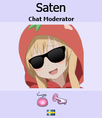

---
tags:
  - chatop
  - chat op
  - chat operator
  - chatops
  - lsd
  - op del chat
  - operador del chat
  - ops del chat
---

# División de Vigilancia Lingüística

*Para conocer el equipo moderno de moderadores, véase: [Global Moderation Team](/wiki/People/Global_Moderation_Team).*

La **División de Vigilancia Lingüística** (coloquialmente conocida como *LSD*) era un grupo de usuarios responsable de la moderación de comunidades de idiomas específicos dentro de osu!. Cada uno de sus miembros tenía un área de enfoque dedicada: un canal de idioma en el que estaban presentes principalmente y las secciones respectivas del foro que podían administrar (lugares como [Help](https://osu.ppy.sh/community/forums/5) u [Off-Topic](https://osu.ppy.sh/community/forums/52)).

## Tareas

Los miembros de la LSD fueron seleccionados personalmente por el osu! team entre la comunidad para actuar como moderadores en comunidades y subforos de menor tráfico. A diferencia de los moderadores globales, no tenían características como apodos de colores o títulos de foros personalizados. En [IRC](/wiki/Community/Internet_Relay_Chat), sin embargo, eran [operadores](/wiki/Community/Internet_Relay_Chat#¿por-qué-algunos-nombres-de-usuario-tienen-prefijos-con-diferentes-signos?) y podían aplicar [silencios](/wiki/Silence).

La LSD también sirvió como un grupo intermediario para miembros prometedores pendientes de admisión en el [Global Moderation Team](/wiki/People/Global_Moderation_Team) en ocasiones, ya que los dos grupos generalmente compartían un objetivo común y conjuntos de habilidades similares.

## Reestructuración

Después de una [reestructuración del personal](https://osu.ppy.sh/community/forums/topics/123510) en 2013, la División de Vigilancia Lingüística pasó a llamarse **Chat Moderators** y recibió su propia lista de miembros.

El [20 de agosto de 2015](/wiki/People/Staff_log/2015#agosto), los equipos de Chat Moderators y Global Moderation [se fusionaron](https://osu.ppy.sh/community/forums/posts/4435972), dando efectivamente a todos los moderadores apodos rojos distintivos en el chat y poder de administración sobre todo el foro.
