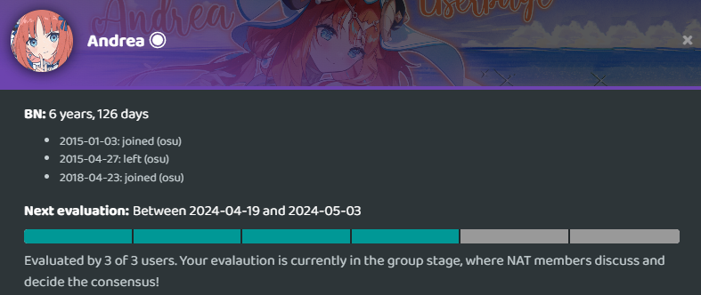

# Evaluaciones de los Beatmap Nominators

*Véase también: [Convertirse en Beatmap Nominator § Proceso de solicitud](/wiki/People/Beatmap_Nominators/Becoming_a_Beatmap_Nominator#proceso-de-solicitud)*

Las evaluaciones de quienes solicitan convertirse en [Beatmap Nominator](/wiki/People/Beatmap_Nominators) (*BN*), así como de los actuales Beatmap Nominators, son llevadas a cabo por los miembros del [Nomination Assessment Team](/wiki/People/Nomination_Assessment_Team) (*NAT*). Estas evaluaciones siguen un formato establecido para garantizar que cada solicitud y cada nominador serán evaluados con regularidad. Todas las evaluaciones se realizan en el [sitio web de los BN](https://bn.mappersguild.com/).

Cada evaluación tiene dos fases: *individual* y *grupal*. Estas fases difieren en los detalles de su funcionamiento para las aplicaciones o las evaluaciones regulares de los BN y se detallarán a continuación.

Se asignan tres miembros a cada evaluación, pero otros pueden sumarse a la conversación durante la fase grupal si hay elementos de la evaluación que requieran una discusión más profunda sobre los que los miembros asignados inicialmente no puedan llegar a un acuerdo.

Si un miembro del NAT asignado no está disponible o no puede realizar la evaluación asignada, su tarea puede reasignarse aleatoriamente a otro miembro del NAT desde el sitio web de los BN.

Las referencias a Discord en este artículo se refieren al servidor de Discord de los BN, que tiene acceso limitado a los miembros de los BN, NAT, GMT y antiguos miembros para la organización, discusión y socialización en grupo.

## Evaluaciones actuales de los Beatmap Nominators

Cada BN es revisado periódicamente por los miembros del NAT.

Para los nominadores en [periodo de prueba](/wiki/People/Beatmap_Nominators#beatmap-nominators-provisionales), o que hayan recibido una advertencia de [actividad](/wiki/People/Beatmap_Nominators/Rules#actividad), su próxima evaluación se programará aproximadamente 1 mes después de haber sido puestos en periodo de prueba o de haber recibido la advertencia.

En el caso de los Beatmap Nominators completos sin advertencias recientes, sus evaluaciones se programarán cada 3 meses.

La duración entre las evaluaciones es programada automáticamente por el [sitio web de los BN](https://bn.mappersguild.com/). Sin embargo, si existe un motivo importante de preocupación sobre el rendimiento de un BN en una fecha anterior, los miembros del NAT también pueden programar manualmente una evaluación para que se produzca antes de lo normal.

Un BN puede ver el progreso actual de su evaluación a través de una barra de progreso en su perfil del sitio web de los BN.

Al igual que las solicitudes, las evaluaciones actuales de los BN se asignan aleatoriamente a 3 evaluadores y se anunciarán en los canales del modo respectivo en el Discord del NAT.

### Fase individual

La fase individual se mostrará en el sitio web de los BN 2 semanas antes de su finalización, lo que permitirá a los miembros del NAT saber cuáles son las próximas evaluaciones para ayudarlos a administrar su carga de trabajo adecuadamente. Durante la fase individual, los miembros del NAT pueden enviar sus evaluaciones sobre el desempeño del Beatmap Nominator. Estas evaluaciones tendrán en cuenta las nominaciones del BN, cualquier restablecimiento de nominación que haya tenido lugar en sus nominaciones, así como el modding general del BN en una selección de sus mapas nominados. Los miembros del NAT también revisarán si el BN sigue adecuadamente las [reglas para los Beatmap Nominators](/wiki/People/Beatmap_Nominators/Rules) y las [expectativas](/wiki/People/Beatmap_Nominators/Expectations).

### Fase grupal

Una vez que tres miembros del NAT hayan presentado sus evaluaciones, la evaluación pasará a la fase grupal. Durante la fase grupal, los miembros del NAT discutirán sus evaluaciones entre sí, llegarán a un acuerdo y redactarán el informe de la evaluación. Los resultados e informe pueden variar en función del BN. Si se observa que un BN no está rindiendo a la altura de las expectativas, se le puede imponer una advertencia o un periodo de prueba, dependiendo de la gravedad del problema.

Una vez redactado y revisado el informe, se enviará y se realizarán los cambios necesarios en los [grupos de usuarios](/wiki/People/User_group). El [bot del Nomination Assessment Team](https://osu.ppy.sh/users/6616586) enviará el informe en forma de [mensaje de anuncio](/wiki/Announcement_messages).

Las advertencias debidas a un rendimiento insuficiente como Beatmap Nominator completo son válidas durante aproximadamente un año. Si un BN tiene problemas recurrentes después de haber sido advertido recientemente, puede ser expulsado de los Beatmap Nominators en futuras evaluaciones.

## Evaluaciones especiales

### Renuncias

Los Beatmap Nominators pueden renunciar al grupo en cualquier momento a través del sitio web de los BN. Cuando esto ocurra, se asignará a tres miembros del NAT para que evalúen al nominador por última vez, con el fin de determinar si la renuncia se produce en «buenos» términos o en términos «estándar». Esta evaluación tiene un plazo de 24 horas y se anuncia a los miembros del NAT en su respectivo canal de Discord.

Una vez que se haya llegado a un acuerdo sobre los términos de la renuncia, el NAT le enviará un mensaje de anuncio al BN a través del [bot del Nomination Assessment Team](https://osu.ppy.sh/users/6616586) informándole de su situación y de cuándo puede volver a solicitar convertirse en un BN si así lo desea.

#### Buenos términos

Los Beatmap Nominators que no han sido advertidos recientemente ni han estado en periodo de prueba, y que no estaban a punto de ser advertidos por problemas, suelen renunciar en buenos términos.

Este estatus le permite a los antiguos nominadores volver a ser un BN completo por la vía rápida si deciden solicitarlo de nuevo en el plazo de un año desde su renuncia. La renuncia pasará a términos estándar si tiene más de 1 año.

#### Términos estándar

Una renuncia en términos estándar se emite para los nominadores que han sido advertidos recientemente, están en periodo de prueba o estaban a punto de ser advertidos por problemas en su próxima evaluación de BN actual.

Los nominadores que renuncien en condiciones estándar tendrán que volver a solicitar convertirse en un BN después de un tiempo de espera de 60 días si desean volver al grupo, y tendrán que empezar desde el periodo de prueba si aprueban su nueva solicitud.

### Actividad

Cada vez que se crea la evaluación de un Beatmap Nominator, su actividad es revisada automáticamente por el sitio web de los BN. Si no cumple los [requisitos mínimos](/wiki/People/Beatmap_Nominators/Rules#actividad), la evaluación pasará automáticamente a la fase grupal y tendrá como consenso una advertencia de actividad o una expulsión, dependiendo de la actividad. Luego, un miembro del NAT comprobará la validez de dicha evaluación y la enviará si no hay ningún problema.

Si un Beatmap Nominator regresa de una renuncia en buenos términos y no ha alcanzado su actividad mínima dentro de los primeros 30 días, se creará una nueva evaluación siguiendo el mismo procedimiento anterior, con un consenso de expulsión.
