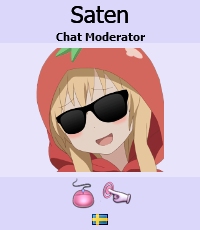

---
tags:
  - chatop
  - chat op
  - chat operator
  - chatops
  - lsd
---

# Language Surveillance Division

*Untuk artikel mengenai tim moderator modern, lihat: [Global Moderation Team](/wiki/People/The_Team/Global_Moderation_Team).*

**Language Surveillance Division** (atau lebih dikenal sebagai *LSD*) merupakan grup pengguna yang bertanggungjawab untuk memoderasi komunitas-komunitas yang berbasis bahasa tertentu pada osu!. Setiap anggota memiliki area kerjanya sendiri, yaitu: sebuah *channel* bahasa yang sering mereka kunjungi dan sub-forum yang mereka atur (seperti sub-forum [Help](https://osu.ppy.sh/community/forums/5) atau [Off-Topic](https://osu.ppy.sh/community/forums/52)).

## Tugas-tugas

Anggota dari LSD dipilih secara internal oleh tim inti osu! dari komunitas untuk bertugas sebagai moderator pada komunitas dan sub-forum yang memiliki jumlah pengunjung yang rendah. Tidak seperti Global Moderator, mereka tidak memiliki fitur-fitur tertentu seperti *nickname* dengan warna khusus atau gelar khusus di forum. Namun di [IRC](/wiki/Community/Internet_Relay_Chat), mereka menjadi [operator](/wiki/Community/Internet_Relay_Chat#why-are-some-usernames-prefixed-with-different-signs?) dan dapat memberikan [silence](/wiki/Silence).

LSD juga berfungsi menjadi grup perantara untuk member yang akan bergabung ke dalam [Global Moderation Team](/wiki/People/The_Team/Global_Moderation_Team) pada waktu itu, hal tersebut dikarenakan kedua grup tersebut memiliki tujuan dan membutuhkan anggota dengan kemampuan yang sama secara umum.

## Restrukturisasi

Setelah [restrukturisasi staf](https://osu.ppy.sh/community/forums/topics/123510) pada tahun 2013, grup Language Surveillance Division diberi nama baru yaitu **Chat Moderator** dan memiliki keanggotaannya sendiri.

<!--TODO: Translate Staff log-->

Pada tanggal [20 Agustus 2015](/wiki/Staff_Log/2015#august) Chat Moderator dan Global Moderation Team [dimerger](https://osu.ppy.sh/community/forums/posts/4435972) dan membuat seluruh moderator memiliki warna merah pada namanya dan tingkat akses manajemen untuk seluruh forum. 
