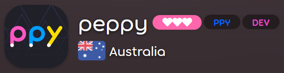

---
tags:
  - usergroup
---

# User group

*Note: The Chat Bots and Announce user group listings are not public.*

Listed below are **user groups**, most of which are made up of osu! community members that help maintain osu!. Most of these user groups can be recognised by their [forum](/wiki/Community/Forum) colours, [in-game chat](/wiki/Client/Interface/Chat_console) colours, [user titles](/wiki/Community/User_title), and/or user group badges.

Clicking the badges will lead to the respective group listings, while the names link to the wiki articles.

| ID | Badge | Name | Description |
| :-: | :-: | :-- | :-- |
| 4 |  | [Global Moderation Team](/wiki/People/The_Team/Global_Moderation_Team) | Keeping watch over the forums and in-game chat |
| 7 |  | [Nomination Assessment Team](/wiki/People/The_Team/Nomination_Assessment_Team) | Managing the Beatmap Nominators |
| 11 |  | [Developers](/wiki/People/The_Team/Developers) | Making the game awesome by adding new features and fixing the bugs |
| 16 |  | [osu! Alumni](/wiki/People/The_Team/Developers) | Those known for their contributions who have since moved on |
| 22 |  | [Support Team](/wiki/People/The_Team/Support_Team) | Help and assistance |
| 28 |  | [Beatmap Nominators](/wiki/People/The_Team/Beatmap_Nominators) | Users going above and beyond the call to ensure beatmaps get qualified |
| 29 |  | [Chat Bots](/wiki/Bot_account) | Special accounts run by automated services instead of real people |
| 31 |  | [Project Loved](/wiki/People/The_Team/Project_Loved_Team) | Recognising the beatmaps that the community loves most |
| 32 |  | [Beatmap Nominators (Probationary)](/wiki/People/The_Team/Beatmap_Nominators#probationary-beatmap-nominators) | Probationary BN that await a positive evaluation to confirm their presence in the team as a full member. |
| 35 |  | [Featured Artist](/wiki/Featured_Artists) | Musical creators who have partnered with osu! |
| 47 |  | Announce | Users with permission to send announcement chat messages  |
| 48 |  | [Beatmap Spotlight Curators](/wiki/People/The_Team/Beatmap_Spotlight_Curators) | Responsible for selecting high-quality maps for the [Beatmap Spotlights](/wiki/Beatmap_Spotlights) |
