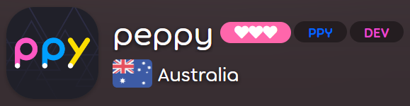

---
tags:
  - usergroup
  - Nutzergruppe
  - usergroups
  - Nutzergruppen
---

# Benutzergruppen

Im Folgenden sind **Benutzergruppen** aufgeführt, von denen die meisten aus Mitgliedern der osu!-Community bestehen, die helfen, osu! zu erhalten. Viele dieser Benutzergruppen sind anhand der jeweiligen Farben im [Forum](/wiki/Community/Forum), Farben im [Spiel-Chat](/wiki/Client/Interface/Chat_console), [Profiltitel](/wiki/Community/User_title) und/oder Gruppenabzeichen erkennbar.

Ein Klick auf die Abzeichen führt zu den jeweiligen Gruppenlisten, während die Namen auf die Wiki-Artikel verweisen.

| ID | Abzeichen | Name | Beschreibung |
| :-: | :-: | :-- | :-- |
| 4 |  | [Globales Moderationsteam](/wiki/People/Global_Moderation_Team) | Behalten die Übersicht über die Foren und den Spiel-Chat |
| 7 |  | [Nomination Assessment Team](/wiki/People/Nomination_Assessment_Team) | Verwaltung der Beatmap Nominators |
| 11 |  | [Entwickler](/wiki/People/Developers) | Machen das Spiel besser, indem sie neue Inhalte zum Spiel hinzufügen und Fehler beheben |
| 16 |  | [osu! Alumni](/wiki/People/osu!_Alumni) | Diejenigen, die für ihre Beiträge bekannt sind und osu! inzwischen den Rücken gekehrt haben |
| 22 |  | [Technisches Support-Team](/wiki/People/Technical_Support_Team) | Hilfe und Unterstützung |
| 26 |  | Turnierpersonal[^private] | Nutzer, die [Befehle für das Turnier-Management](/wiki/osu!_tournament_client/osu!tourney/Tournament_management_commands) ausführen dürfen |
| 28 |  | [Beatmap Nominators](/wiki/People/Beatmap_Nominators) | Sorgen dafür, dass Beatmaps den Status "qualifiziert" erlangen |
| 29 |  | [Chat-Bots](/wiki/Bot_account)[^private] | Spezielle Accounts, die von automatisierten Diensten anstatt von echten Personen verwendet werden |
| 31 |  | [Project Loved](/wiki/People/Project_Loved_Team) | Anerkennen der Beatmaps, die die Community am meisten liebt |
| 32 |  | [Beatmap Nominators (auf Probe)](/wiki/People/Beatmap_Nominators#probationary-beatmap-nominators) | BNs in der Probezeit, die auf eine positive Rückmeldung warten, dass sie als vollwertiges Mitglied im Team aufgenommen werden |
| 33 |  | ppy[^private] | Reserviert für [peppy](/wiki/People/peppy), dem Ersteller von osu! |
| 35 |  | [Featured Artist](/wiki/People/Featured_Artists) | Musiker, die sich mit osu! zusammengetan haben |
| 47 |  | Ankündigungen[^private] | Benutzer mit der Berechtigung, [Ankündigungsnachrichten](/wiki/Announcement_messages) senden zu können |
| 48 |  | [Beatmap Spotlight Curators](/wiki/People/Beatmap_Spotlight_Curators) | Verantwortlich für das Auswählen hochqualitativer Beatmaps für die [Beatmap Spotlights](/wiki/Beatmap_Spotlights) |
| 50 |  | [Turnierkomitee](/wiki/People/Tournament_Committee) | Helfen dabei, dass [Turniere](/wiki/Tournaments) und [Wettbewerbe](/wiki/Contests) für alle fair und spaßig bleiben |

## Anmerkungen

[^private]: Die Auflistung dieser Benutzergruppe ist nicht öffentlich.
