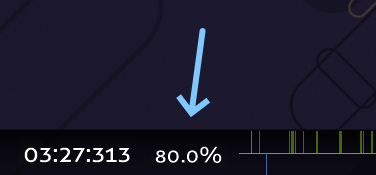
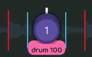
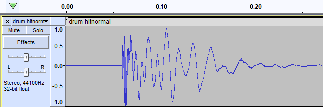
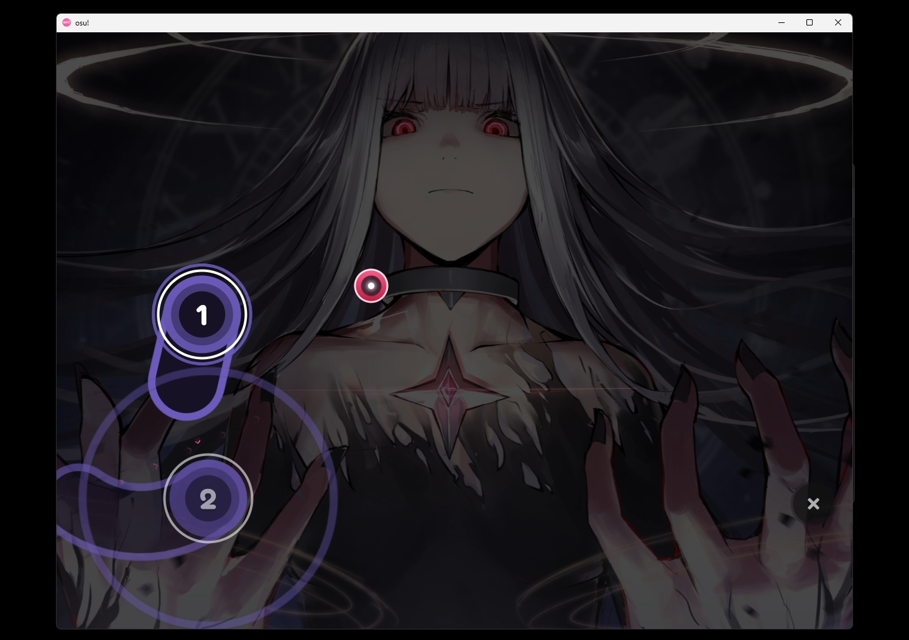
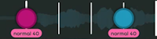
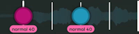
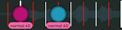
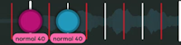

# Simplified ranking criteria

*For the full ranking criteria, see: [Ranking criteria](/wiki/Ranking_criteria)*

The full list of [ranking criteria](/wiki/Ranking_criteria) is complicated. It explains every rule and guideline required to create a [beatmap](/wiki/Beatmap) worthy of being [Ranked](/wiki/Beatmap_ranking_procedure#ranked), including *a lot* of niche situations that the majority of mappers never encounter.

The **simplified ranking criteria** aims to give mappers a clearer perspective on what's required to create a rankable map through the following:

- Simplified rules and guidelines that impact most beatmaps
- Subjective criteria that mappers encounter when ranking their maps

## Beatmap

::: Infobox

:::

- **Make sure everything in the map is cleared in terms of [content usage permissions](/wiki/Rules/Content_usage_permissions#artist-permissions).**
- **Maps must be at least 30 seconds long.**
- **Maps should end around the [80% mark](img/percent.png).** If you want to end the map earlier, try cutting the song.

### Spread

- **Difficulty names must have progression.** 
  - Easy -> Normal -> Hard -> Insane -> Expert is default.
  - Logical naming schemes like Seed -> Sprout -> Tree are okay too.
  - **Exception:** The hardest difficulty can use a custom name, like Normal -> Hard -> *Melancholy*.
- **Don't skip difficulties.** For example, if you have Normal and Insane difficulties, you need a Hard too.
- **A [guest mapper](/wiki/Beatmap/Guest_difficulty) can't create more difficulties than the [host](/wiki/Beatmap/Beatmap_host).**
- **Minimum requirement for lowest difficulty by mode and length:**

| [Drain time](/wiki/Beatmap/Drain_time) | osu! | osu!taiko |
| :-- | :-: | :-: |
| **0:30 to 3:30** | Normal | Futsuu |
| **3:30 to 4:15** | Hard | Muzukashii |
| **4:15 to 5:00** | Insane | Oni |

| [Drain time](/wiki/Beatmap/Drain_time) | osu!catch | osu!mania |
| :-- | :-: | :-: |
| **0:30 to 2:30** | Salad | Normal |
| **2:30 to 3:15** | Platter | Hard |
| **3:15 to 4:00** | Rain | Insane |

### Hitsounds

- **Maps must be [hitsounded](/wiki/Beatmapping/Hitsound),** excluding osu!mania maps.
- **Every clickable object must have audible feedback.**

### Timing

::: Infobox

:::

- **Maps must be correctly timed.** This includes BPM and time signatures.
- **All difficulties must use the same timing.**
- **Do not change timing to adjust slider velocity.**
- **Objects must be snapped to timeline ticks.**
- **Only one object is allowed per tick,** excluding osu!mania maps.

## Metadata

- **Metadata must be accurate.**
  - Use a [primary metadata source](/wiki/Beatmap/Primary_metadata_source).
  - If the song has a Ranked or Loved map, use that map's metadata unless it's blatantly wrong.
- **Use [Modified Hepburn romanisation](https://en.wikipedia.org/wiki/Hepburn_romanization#Features) for Japanese words.**

### Tags

- **Add usernames of anyone who contributes to the map.** This doesn't include modders.
- **Add the song's [genre and language](/wiki/Beatmap/Genre_and_language).**
- **Add `featured artist` if the song is in the [Featured Artist catalogue](https://osu.ppy.sh/beatmaps/artists).**
- **Other tags must be relevant to the song/map.**

### Title

- **Songs shortened for TV must have `(TV Size)`.**
- **Replace game version markers with `(Game Ver.)`.**
- **Replace short version markers with `(Short Ver.)`.**
- **Use `(Cut Ver.)` to indicate an unofficial song cut.**
- **Use `(Extended Edit)` to indicate an unofficial song extension.**
- **Use `(Sped Up Ver.)` to indicate an unofficial song tempo increase.** For some genres, `(Nightcore Mix)` is an okay alternative.

### Source

- **Use the Source field if the song is from another media source, like a game, movie, or event.**

## Files

- **Don't use inappropriate content.** See [song content rules](/wiki/Rules/Song_content_rules) and [visual content considerations](/wiki/Rules/Visual_content_considerations).
- **Don't include unused files in the map folder.**

### Song

- **Use `.mp3` or `.ogg` file formats.**
  - At most 192 kbps for `.mp3` files.
  - At most 208 kbps for `.ogg` files.
  - At least 128 kbps for any filetype.
- **One song file must be used for all difficulties.**
- **Set a consistent preview point for all difficulties.**

### Hitsounds

::: Infobox

:::

- **Hitsound files must be at least 25 ms long and use `.wav` or `.ogg` file formats.**
  - Do not use `.mp3`.
  - **Exception:** Use [this file](https://up.ppy.sh/files/blank.wav) for silent hitsounds.
- **Hitsounds must not be [delayed](img/delay.png).**

### Background

- **Every difficulty must have a background adhering to the following:**
  - **Minimum width:** 160 px
  - **Minimum height:** 120 px
  - **Maximum width:** 2560 px
  - **Maximum height:** 1440 px
  - **Maximum file size:** 2.5 MB
- **Link the source of the map's background in the description.**

### Video

- **Videos must adhere to the following:**
  - **Maximum video resolution:** 1280x720
  - **Video encoding:** H.264
- **The audio track must be removed from video files.**

## Mode-specific

*For full [game mode](/wiki/Game_mode)–specific ranking criteria, see: [osu!](../osu!), [osu!taiko](../osu!taiko), [osu!catch](../osu!catch), and [osu!mania](../osu!mania)*

### osu!

::: Infobox

:::

- **No offscreen objects in 4:3 aspect ratios.**
- **[The Auto mod](/wiki/Gameplay/Game_modifier/Auto) must achieve bonus score on spinners.** They're too short otherwise.
- **Use at least two combo colors.**

### osu!taiko

- **Avoid covering essential parts of the background with the taiko playfield.** You can edit the vertical offset of the background in the [`.osu` file](/wiki/Client/File_formats/osu_(file_format)).
- **Avoid rapid [kiai](/wiki/Gameplay/Kiai_time) toggles.**
- **On rhythms that are 1/4 or faster, use big notes only at the end of patterns.**
- **Avoid slider velocity changes on lower difficulties.**
- **Each difficulty should follow its respective break length guidelines:**

| Difficulty | Break | Chain length |
| --: | :-: | :-: |
| **Kantan** |  | Break needed every 32–36 beats |
| **Futsuu** |  | Break needed every 32–36 beats |
| **Muzukashii** (option 1) |  | Break needed every 16–20 beats |
| **Muzukashii** (option 2) |  | Break needed every 16–20 beats |
| **Oni** |  | Break needed every 16–20 beats |

### osu!catch

- **[The Auto mod](/wiki/Gameplay/Game_modifier/Auto) must be able to SS your map.**
- **Avoid [dashes](/wiki/Gameplay/Dash) and [hyperdashes](/wiki/Gameplay/Hyperdash) that lead to the edges of the screen.** Placements between x = 16 and x = 496 are okay.
- **[Overall difficulty](/wiki/Beatmap/Overall_difficulty) should match [approach rate](/wiki/Beatmap/Approach_rate).**

### osu!mania

- **[Spread](#spread) rules apply to each key mode or [playstyle](/wiki/Ranking_criteria/osu!mania#common-terms) separately.** For example, if you have 4K and 7K difficulties, you need two difficulty spreads.
- **Beatmaps can only use 4–10, 12, 14, 16, or 18 keys.** Key modes over 10 keys must use [certain playstyles](/wiki/Beatmapping/osu!mania_10K_plus_playstyles).
- **No column can be left empty.**
- **No more than 6 notes can be pressed at the same time in Insane or lower difficulties.**
- **Difficulties using an [N+1 playstyle](/wiki/Ranking_criteria/osu!mania#common-terms) must enable the `Use special style (N+1 style) for mania` toggle.**

## Song interpretation

*Note: This section is based on subjective mapping views, not the ranking criteria.*

**Every element of a map should represent the song.**

This principle sounds simple, but it might be the most controversial part of ranking a map! There's no *correct way* to interpret a song, so each individual's interpretation varies, and [Beatmap Nominators](/wiki/People/Beatmap_Nominators) determine if your interpretation is valid for Ranked status.

While it's impossible to explain exactly how to interpret a song, these pointers may lead you in the right direction:

- **Correlate map and song intensity.**
  - **Rhythm:** Intense parts have more rhythm density than calm parts.
  - **Spacing:** Intense parts have higher jump distance than calm parts.
  - **Slider velocity:** Intense parts have faster sliders than calm parts.
  - **Design:** Intense parts have more complex object composition than calm parts.
  - When the song gradually increases or decreases intensity, show a gradual progression of any elements above.
- **Show song variation through contrast.**
  - Establish some core ideas for your mapping choices.
  - When the song enters a new section, shift those mapping ideas according to how different the song feels.
  - If a specific sound only occurs once or twice in a song, make it stand out by clearly deviating from your usual mapping choices.
- **Be consistent (within reason).**
  - When a song repeats itself, it makes sense to repeat your map too.
  - Copying and pasting part of your map can be pretty boring though, so when a song repeats, vary your map in ways that don't drastically change how you previously interpreted the song.
- **Ask how your objects fit into the *"every element of a map should represent the song"* principle.**
  - **Example 1:** "How does this object represent the sound it aligns with?"
  - **Example 2:** "How does this section of objects follow the general mood of this section of the song?"
- **Consider how other people will interpret your map.** If your way of interpreting the song isn't clear, it'll feel like your map doesn't follow the song!
