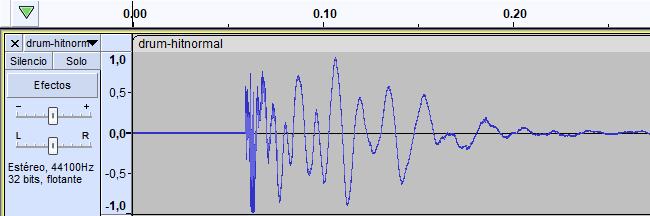

# Criterios de clasificación simplificados

*Para conocer los criterios de clasificación completos, véase: [Criterios de clasificación](/wiki/Ranking_criteria)*

La lista completa de [criterios de clasificación](/wiki/Ranking_criteria) es complicada. Explica todas las reglas y pautas necesarias para crear un [beatmap](/wiki/Beatmap) digno de ser [clasificado](/wiki/Beatmap_ranking_procedure#clasificados), incluidas *muchas* situaciones específicas que la mayoría de los mappers nunca encuentran.

Los **criterios de clasificación simplificados** tienen como objetivo brindar a los mappers una perspectiva más clara sobre lo que se requiere para crear un mapa clasificable a través de lo siguiente:

- Reglas y pautas simplificadas que afectan a la mayoría de los beatmaps
- Criterios subjetivos que encuentran los mappers al clasificar sus mapas

## Beatmap

::: Infobox

:::

- **Asegúrate de que todo en el mapa esté autorizado en términos de [permisos de uso de contenido](/wiki/Rules/Content_usage_permissions#permisos-de-los-artistas).**
- **Los mapas deben tener al menos 30 segundos de duración.**
- **Los mapas deben terminar alrededor de la [marca de 80 %](img/percent.png).** Si quieres terminar el mapa antes, prueba a cortar la canción.

### Distribución

- **Los nombres de las dificultades deben tener progresión.** 
  - Easy -> Normal -> Hard -> Insane -> Expert es el predeterminado.
  - Los esquemas lógicos de nombramiento como Semilla -> Brote -> Árbol también están bien.
  - **Excepción:** La dificultad más difícil puede usar un nombre personalizado, como Normal -> Hard -> *Melancholy*.
- **No te saltes las dificultades.** Por ejemplo, si tienes una dificultad Normal e Insane, también necesitas una Hard.
- **Un [mapper invitado](/wiki/Beatmap/Guest_difficulty) no puede crear más dificultades que el [anfitrión](/wiki/Beatmap/Beatmap_host).**
- **Requisito mínimo para la dificultad más baja por modalidad y longitud:**

| [Tiempo de drenaje](/wiki/Beatmap/Drain_time) | osu! | osu!taiko |
| :-- | :-: | :-: |
| **De 0:30 a 3:30** | Normal | Futsuu |
| **De 3:30 a 4:15** | Hard | Muzukashii |
| **De 4:15 a 5:00** | Insane | Oni |

| [Tiempo de drenaje](/wiki/Beatmap/Drain_time) | osu!catch | osu!mania |
| :-- | :-: | :-: |
| **De 0:30 a 2:30** | Salad | Normal |
| **De 2:30 a 3:15** | Platter | Hard |
| **De 3:15 a 4:00** | Rain | Insane |

### Hitsounds

- **Los mapas deben tener [hitsounds](/wiki/Beatmapping/Hitsound),** excluyendo los mapas de osu!mania.
- **Cada objeto en el que se pueda hacer clic debe tener una respuesta audible.**

### Temporización

::: Infobox

:::

- **Los mapas deben estar correctamente temporizados.** Esto incluye BPM y compases.
- **Todas las dificultades deben usar la misma temporización.**
- **No cambies la temporización para ajustar la velocidad del slider.**
- **Los objetos deben anclarse a las marcas de la línea de tiempo.**
- **Solo se permite un objeto por marca,** excluyendo los mapas de osu!mania.

## Metadatos

- **Los metadatos deben ser precisos.**
  - Usa una [fuente primaria de metadatos](/wiki/Beatmap/Primary_metadata_source).
  - Si la canción tiene un mapa clasificado o amado, usa los metadatos de ese mapa, a menos que sean totalmente erróneos.
- **Usa la [romanización Hepburn modificada](https://es.wikipedia.org/wiki/Romanización_Hepburn#Características_de_la_romanización_Hepburn) para las palabras japonesas.**

### Etiquetas

- **Añade los nombres de usuario de cualquiera que contribuya al mapa.** Esto no incluye modders.
- **Añade el [género e idioma](/wiki/Beatmap/Genre_and_language) de la canción.**
- **Añade `featured artist` si la canción está en el [catálogo de artistas destacados](https://osu.ppy.sh/beatmaps/artists).**
- **Otras etiquetas deben ser relevantes para la canción/mapa.**

### Título

- **Las canciones acortadas para TV deben tener `(TV Size)`.**
- **Sustituye los marcadores de versión del juego por `(Game Ver.)`.**
- **Sustituye los marcadores de versión corta por `(Short Ver.)`.**
- **Usa `(Cut Ver.)` para indicar un corte de la canción no oficial.**
- **Usa `(Extended Edit)` para indicar una extensión de la canción no oficial.**
- **Usa `(Sped Up Ver.)` para indicar un aumento no oficial del tempo de la canción.** Para algunos géneros, `(Nightcore Mix)` es una buena alternativa.

### Fuente

- **Usa el campo de fuente si la canción procede de otra fuente multimedia, como un juego, una película o un evento.**

## Archivos

- **No uses contenido inapropiado.** Consulta las [reglas de contenido de las canciones](/wiki/Rules/Song_content_rules) y las [consideraciones de contenido visual](/wiki/Rules/Visual_content_considerations).
- **No incluyas archivos no usados en la carpeta del mapa.**

### Canción

- **Usa formatos de archivo `.mp3` o `.ogg`.**
  - Un máximo de 192 kbps para archivos `.mp3`.
  - Un máximo de 208 kbps para archivos `.ogg`.
  - Al menos 128 kbps para cualquier tipo de archivo.
- **Se debe usar un solo archivo de canción para todas las dificultades.**
- **Establece un punto de vista previo que coincida en todas las dificultades.**

### Hitsounds

::: Infobox

:::

- **Los archivos de hitsounds deben tener una duración mínima de 25 ms y usar los formatos de archivo `.wav` o `.ogg`.**
  - No uses `.mp3`.
  - **Excepción:** Usa [este archivo](https://up.ppy.sh/files/blank.wav) para los hitsounds silenciosos.
- **Los hitsounds no deben tener [retraso](img/delay.png).**

### Fondo

- **Cada dificultad debe tener un fondo que se adhiera a lo siguiente:**
  - **Ancho mínimo:** 160 píxeles
  - **Altura mínima:** 120 píxeles
  - **Ancho máximo:** 2560 píxeles
  - **Altura máxima:** 1440 píxeles
  - **Tamaño máximo del archivo:** 2,5 MB
- **Incluye un enlace a la fuente del fondo del mapa en la descripción.**

### Vídeo

- **Los vídeos deben cumplir con lo siguiente:**
  - **Resolución máxima del vídeo:** 1280x720
  - **Codificación del vídeo:** H.264
- **La pista de audio debe eliminarse de los archivos de vídeo.**

## Específico para cada modo

*Para conocer todos los criterios de clasificación específicos de cada [modo de juego](/wiki/Game_mode), véase: [osu!](../osu!), [osu!taiko](../osu!taiko), [osu!catch](../osu!catch), y [osu!mania](../osu!mania)*

### osu!

::: Infobox

:::

- **No deben aparecer objetos fuera de la pantalla en las relaciones de aspecto 4:3.**
- **[El mod Auto](/wiki/Gameplay/Game_modifier/Auto) debe conseguir una puntuación bonus en los spinners.** De lo contrario, son demasiado cortos.
- **Usa al menos dos colores para los combos.**

### osu!taiko

- **Evita cubrir partes esenciales del fondo con el campo de juego de taiko.** Puedes editar el desplazamiento vertical del fondo en el [archivo `.osu`](/wiki/Client/File_formats/osu_(file_format)).
- **Evita los cambios rápidos del [kiai](/wiki/Gameplay/Kiai_time).**
- **En ritmos de 1/4 o más rápidos, usa notas grandes solo al final de los patrones.**
- **Evita los cambios de velocidad de los sliders en las dificultades más bajas.**
- **Cada dificultad debe seguir sus respectivas pautas para la duración de las pausas:**

| Dificultad | Pausa | Longitud de la cadena |
| --: | :-: | :-: |
| **Kantan** |  | Se necesita una pausa cada 32-36 pulsos |
| **Futsuu** |  | Se necesita una pausa cada 32-36 pulsos |
| **Muzukashii** (opción 1) |  | Se necesita una pausa cada 16-20 pulsos |
| **Muzukashii** (opción 2) |  | Se necesita una pausa cada 16-20 pulsos |
| **Oni** |  | Se necesita una pausa cada 16-20 pulsos |

### osu!catch

- **[El mod Auto](/wiki/Gameplay/Game_modifier/Auto) debe poder obtener una SS en tu mapa.**
- **Evita usar [dashes](/wiki/Gameplay/Dash) e [hiperdashes](/wiki/Gameplay/Hyperdash) que vayan hacia los bordes de la pantalla.** Las posiciones entre x = 16 y x = 496 están bien.
- **La [dificultad general](/wiki/Beatmap/Overall_difficulty) debe coincidir con la [velocidad de aproximación](/wiki/Beatmap/Approach_rate).**

### osu!mania

- **Las reglas de [distribución](#distribución) se aplican a cada modo de teclas o [estilo de juego](/wiki/Ranking_criteria/osu!mania#términos-comunes) por separado.** Por ejemplo, si tienes dificultades de 4K y 7K, necesitarás dos distribuciones de dificultad.
- **Los beatmaps solo pueden usar de 4 a 10, 12, 14, 16 o 18 teclas.** Los modos de teclas de más de 10 teclas deben usar [ciertos estilos de juego](/wiki/Beatmapping/osu!mania_10K_plus_playstyles).
- **Ninguna columna puede quedar vacía.**
- **No se pueden presionar más de 6 notas al mismo tiempo en una dificultad Insane o inferior.**
- **Las dificultades que usen un [estilo de juego N+1](/wiki/Ranking_criteria/osu!mania#términos-comunes) deben activar la opción `Use special style (N+1 style) for mania`.**

## Interpretación de las canciones

*Nota: Esta sección se basa en opiniones subjetivas sobre el mapping, no en los criterios de clasificación.*

**Cada elemento de un mapa debe representar la canción.**

Este principio parece sencillo, ¡pero puede ser la parte más controversial a la hora de clasificar un mapa! No hay una forma *correcta* de interpretar una canción, por lo que la interpretación de cada individuo varía, y los [Beatmap Nominators](/wiki/People/Beatmap_Nominators) determinan si tu interpretación es válida para el estado de clasificación.

Si bien es imposible explicar exactamente cómo interpretar una canción, estos consejos pueden guiarte en la dirección correcta:

- **Correlaciona el mapa y la intensidad de la canción.**
  - **Ritmo:** Las partes intensas tienen más densidad rítmica que las partes tranquilas.
  - **Espaciado:** Las partes intensas tienen mayor distancia de notas que las tranquilas.
  - **Velocidad del slider:** Las partes intensas tienen sliders más rápidos que las partes tranquilas.
  - **Diseño:** Las partes intensas tienen una composición de objetos más compleja que las partes tranquilas.
  - Cuando la canción aumente o disminuya gradualmente la intensidad, muestra una progresión gradual de cualquiera de los elementos anteriores.
- **Muestra la variación de la canción a través del contraste.**
  - Establece algunas ideas básicas para tus decisiones al momento de mapear.
  - Cuando la canción entre en una nueva sección, cambia esas ideas de mapeo según lo diferente que se sienta la canción.
  - Si un sonido específico solo aparece una o dos veces en una canción, haz que se destaque desviándote claramente de tus opciones habituales de mapeo.
- **Sé consistente (dentro de lo razonable).**
  - Cuando una canción se repite, también tiene sentido repetir tu mapa.
  - Sin embargo, copiar y pegar parte de tu mapa puede ser bastante aburrido, así que cuando una canción se repita, varía tu mapa de manera que no cambie drásticamente la forma en que interpretaste la canción anteriormente.
- **Pregúntate cómo encajan tus objetos con el principio *«cada elemento de un mapa debe representar la canción»*.**
  - **Ejemplo 1:** «¿Cómo representa este objeto el sonido con el que se alinea?»
  - **Ejemplo 2:** «¿Cómo sigue esta sección de objetos el ritmo general de esta sección de la canción?»
- **Piensa en cómo interpretarán tu mapa los demás.** Si tu forma de interpretar la canción no es clara, ¡parecerá que tu mapa no sigue la canción!
