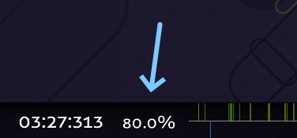
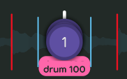
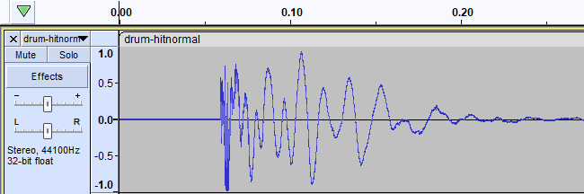
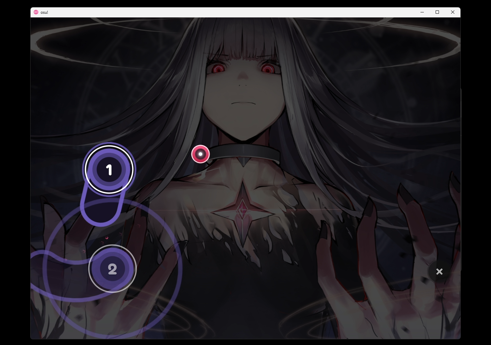
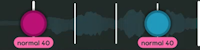
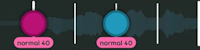
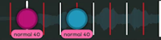
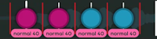
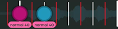

# Упрощённые критерии ранкинга

::: alert-note
Для полной версии критериев ранкинга см. [Критерии ранкинга](/wiki/Ranking_criteria).
:::

Полный список [критериев ранкинга](/wiki/Ranking_criteria) довольно сложен. В нём разобраны все правила и рекомендации, необходимые, чтобы сделать [карту](/wiki/Beatmap), достойную [ранка](/wiki/Beatmap_ranking_procedure#ранк), но там перечислено *множество* редких ситуаций, с которыми большинство мапперов никогда не столкнётся.

**Упрощённые критерии ранкинга** призваны облегчить жизнь мапперов и описывают ключевые требования, необходимые для создания ранкабельной карты:

- Упрощённые правила и рекомендации, затрагивающие большинство карт;
- Субъективные критерии, с которыми мапперы сталкиваются при ранке своих карт.

## Карта

::: Infobox

:::

- **Убедитесь, что всё содержимое карты соответствует [правилам использования медиа](/wiki/Rules/Content_usage_permissions#разрешения-артистов).**
- **Карта должна длиться не менее 30 секунд.**
- **Карта должна заканчиваться примерно на [отметке в 80%](img/percent.png).** Если хотите закончить карту раньше, понадобится укоротить песню.

### Подборка сложностей

- **Названия сложностей должны идти по возрастанию.**
  - Стандартная схема наименования: Easy -> Normal -> Hard -> Insane -> Expert.
  - Допустимы и просто логичные схемы: Seed -> Sprout -> Tree.
  - **Исключение:** у самой высокой сложности может быть собственное название, например, Normal -> Hard -> *Melancholy*.
- **Не пропускайте сложности.** Например, если в карте есть Normal и Insane, нужен и Hard.
- **[Гостевой маппер](/wiki/Beatmap/Guest_difficulty) не может сделать больше сложностей, чем [хост](/wiki/Beatmap/Beatmap_host) (владелец карты).**
- **Минимальные требования к самой низкой сложности по режиму и длительности:**

| [Игровое время](/wiki/Beatmap/Drain_time) |  osu! |
| :-- | :-: |
| **0:30–3:30** | Normal |
| **3:30–4:15** | Hard |
| **4:15–5:00** | Insane |

| [Игровое время](/wiki/Beatmap/Drain_time) |  osu!taiko |  osu!catch |
| :-- | :-: | :-: |
| **0:30–2:30** | Futsuu | Salad |
| **2:30–3:15** | Muzukashii | Platter |
| **3:15–4:00** | Oni | Rain |

| [Игровое время](/wiki/Beatmap/Drain_time) |  osu!mania |
| :-- | :-: |
| **0:30–2:00** | Normal |
| **2:00–2:45** | Hard |
| **2:45–3:30** | Insane |

### Хитсаунды

- **В карте должны быть расставлены [хитсаунды](/wiki/Beatmapping/Hitsound)** во всех режимах, кроме osu!mania.
- **У каждого объекта, по которому можно кликнуть, должна быть обратная связь (слышимый звук).**

### Тайминг

::: Infobox

:::

- **Карта должна быть правильно затаймлена.** Это касается BPM и размеров такта.
- **Все сложности должны использовать один и тот же тайминг.**
- **Тайминг нельзя менять для регулирования скорости слайдеров.**
- **Объекты должны быть привязаны к тикам временной шкалы.**
- **На одном тике может быть только один объект** во всех режимах, кроме osu!mania.

## Метаданные

- **Метаданные должны быть точными.**
  - Используйте [первоисточник метаданных](/wiki/Beatmap/Primary_metadata_source).
  - Если на песню уже есть карта в статусе Ranked или Loved, скопируйте метаданные из неё, если только они не явно ошибочны.
- **Романизируйте (записывайте) японские слова латиницей с помощью [модифицированной системы Хепбёрна](https://ru.wikipedia.org/wiki/Система_Хепбёрна#Правила_системы_Хепбёрна).**

### Теги

- **Добавьте ники всех, кто участвовал в создании карты.** Моддеры сюда не входят.
- **Добавьте [жанр и язык](/wiki/Beatmap/Genre_and_language) песни.**
- **Добавьте `featured artist`, если песня есть в [каталоге Featured Artist](https://osu.ppy.sh/beatmaps/artists).**
- **Все остальные теги должны относиться к песне или карте.**

### Название

- **Песни, укороченные для телевидения и вещания, должны иметь маркер `(TV Size)`.**
- **Заменяйте маркеры, обозначающие игровые версии песен, на `(Game Ver.)`.**
- **Заменяйте маркеры, обозначающие сокращённые версии песен, на `(Short Ver.)`.**
- **Используйте `(Cut Ver.)` для неофициально укороченной версии.**
- **Используйте `(Extended Edit)` для неофициально удлинённой версии.**
- **Используйте `(Sped Up Ver.)` для неофициально ускоренной версии.** Для некоторых жанров подойдёт и `(Nightcore Mix)`.

### Источник

- **Заполняйте поле Source, если песня взята из другого произведения — игры, фильма или ивента.**

## Файлы

- **Не используйте медиа, нарушающее правила.** См. [правила содержания песен](/wiki/Rules/Song_content_rules) и [критерии визуального содержания](/wiki/Rules/Visual_content_considerations).
- **Не оставляйте в папке карты неиспользуемые файлы.**

### Песня

- **Используйте форматы `.mp3` или `.ogg`.**
  - Максимум 192 кбит/с для `.mp3`.
  - Максимум 208 кбит/с для `.ogg`.
  - Минимум 128 кбит/с для любого формата.
- **Все сложности должны использовать один и тот же аудиофайл.**
- **Аудиопревью у всех сложностей должно совпадать.**

### Хитсаунды

::: Infobox

:::

- **Аудиофайлы хитсаундов должны быть не короче 25 мс и использовать формат `.wav` или `.ogg`.**
  - Не используйте `.mp3`.
  - **Исключение:** для беззвучных хитсаундов используйте [этот файл](https://up.ppy.sh/files/blank.wav).
- **Хитсаунды не должны иметь [задержку](img/delay.png).**

### Фон

- **На каждой сложности должен быть фон, отвечающий следующим требованиям:**
  - **Минимальная ширина:** 160px
  - **Минимальная высота:** 120px
  - **Максимальная ширина:** 2560px
  - **Максимальная высота:** 1440px
  - **Максимальный размер файла:** 2.5MB
- **Источник, откуда взят фон карты, должен быть указан в описании.**

### Видео

- **Видео должно отвечать следующим требованиям:**
  - **Максимальное разрешение видео:** 1280x720
  - **Кодек видео:** H.264
- **Из видеофайлов должна быть удалена аудиодорожка.**

## Критерии для конкретных режимов

::: alert-note
**Примечание**: полные критерии ранкинга для каждого [режима игры](/wiki/Game_mode) см. на страницах [osu!](../osu!), [osu!taiko](../osu!taiko), [osu!catch](../osu!catch) и [osu!mania](../osu!mania).
:::

### osu!

::: Infobox

:::

- **Объекты не должны выходить за пределы экрана при соотношении сторон 4:3.**
- **[Мод Auto](/wiki/Gameplay/Game_modifier/Auto) должен набирать на спиннерах бонусные очки.** Если этого не происходит, значит, спиннеры слишком короткие.
- **Используйте хотя бы два комбо-цвета.**

### osu!taiko

- **Старайтесь не перекрывать важную область фона игровым полем тайко.** Вертикальное смещение фона можно задать в [файле `.osu`](/wiki/Client/File_formats/osu_(file_format)).
- **Избегайте частого переключения [киаи](/wiki/Gameplay/Kiai_time).**
- **На ритмах 1/4 и быстрее используйте большие ноты только в конце паттернов.**
- **Избегайте изменений скорости слайдеров на низких сложностях.**
- **Каждая сложность должна следовать отдельным рекомендациям по перерывам:**

| Сложность | Перерыв | Пример | Длина цепочки |
| :-: | :-: | :-: | :-- |
|  **Kantan** | 3/1 или дольше |  | Перерыв обязателен через каждые 32–36 долей |
|  **Futsuu** | 2/1 или дольше |  | Перерыв обязателен через каждые 32–36 долей |
|  **Muzukashii** (вариант 1) | 3/2 или дольше |  | Перерыв обязателен через каждые 32–36 долей |
|  **Muzukashii** (вариант 2) | 3 подряд идущих 1/1 или дольше |  | Перерыв обязателен через каждые 32–36 долей |
|  **Oni** | 1/1 или дольше |  | Перерыв обязателен через каждые 16–20 долей |

### osu!catch

- **[Мод Auto](/wiki/Gameplay/Game_modifier/Auto) должен проходить вашу карту на SS.**
- **Избегайте [дэшей](/wiki/Gameplay/Dash) и [гипердэшей](/wiki/Gameplay/Hyperdash), ведущих к краям экрана.** Фрукты, вызывающие дэш, можно расставлять между x = 16 и x = 496.
- **Значения [Overall Difficulty](/wiki/Beatmap/Overall_difficulty) и [Approach Rate](/wiki/Beatmap/Approach_rate) должны совпадать.**

### osu!mania

- **Правила [подборки сложностей](#подборка-сложностей) применяются к каждому [числу клавиш](/wiki/Ranking_criteria/osu!mania#общая-терминология) или [стилю игры](/wiki/Ranking_criteria/osu!mania#общая-терминология) отдельно.** Например, если в карте есть сложности на 4K и 7K, нужны две подборки.
- **В картах можно использовать только 4–10, 12, 14, 16 или 18 клавиш.** Режимы с числом клавиш больше 10 должны использовать [определённые стили игры](/wiki/Beatmapping/osu!mania_10K_plus_playstyles).
- **Ни одна колонка не должна оставаться пустой.**
- **На сложностях Insane и ниже нельзя ставить более 6 одновременных нот.**
- **На сложностях со [стилем игры N+1](/wiki/Ranking_criteria/osu!mania#общая-терминология) должен быть включён параметр `Use special style (N+1 style) for mania`.**

## Интерпретация песни

::: alert-notice
**Примечание**
Этот раздел основан на субъективных взглядах на маппинг, а не на критериях ранкинга.
:::

**Каждый элемент карты должен отражать песню.**

Звучит просто, но это, возможно, самая спорная часть ранкинга карты! *Единственно верного* способа интерпретировать песню не существует, поэтому у каждого маппера получается своя интерпретация. [Номинаторы карт](/wiki/People/Beatmap_Nominators), в свою очередь, решают, годится ли она для статуса Ranked.

Идеально объяснить, как надо интерпретировать песни, невозможно, но можно дать подсказки:

- **Соотносите интенсивность карты и песни.**
  - **Ритм:** в напряжённых частях плотность ритма выше, чем в спокойных.
  - **Спейсинг:** в напряжённых частях спейсинг выше, чем в спокойных.
  - **Скорость слайдеров:** в напряжённых частях слайдеры быстрее, чем в спокойных.
  - **Дизайн:** в напряжённых частях объекты складываются в более сложные структуры, чем в спокойных.
  - Когда интенсивность песни плавно нарастает или спадает, это можно передать через плавное изменение любого из перечисленных элементов.
- **Показывайте изменения в песне через контраст.**
  - Определите для себя несколько ключевых идей маппинга.
  - Когда в песне начинается новая часть, видоизменяйте эти идеи в зависимости от того, насколько по-другому песня начинает звучать.
  - Уникальные звуки, которые встречаются всего раз или два, можно выделять, резко отступая от уже зафиксированных вами приёмов маппинга.
- **Будьте последовательны — в пределах разумного.**
  - Когда песня повторяется, логично повторить и карту.
  - Копирование и вставка не приветствуются, поэтому меняйте повторяющийся участок так, чтобы маппинг выглядел по-новому, но в целом следовал вашей прежней интерпретации такого же куска.
- **Периодически возвращайтесь к мысли, что *каждый элемент карты должен отражать песню*, и задавайте себе наводящие вопросы.**
  - **Пример 1:** «Как этот объект отражает звук, под который он замапан?»
  - **Пример 2:** «Как общее настроение песни на этом участке можно передать с помощью группы объектов?»
- **Подумайте, как вашу карту воспримут другие игроки и мапперы.** Если не очень понятно, что вы хотели передать с помощью маппинга, другим будет казаться, что карта не связана с песней!
