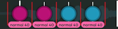

# 简版上架标准

*对于完整版谱面上架标准 (RC)，请参阅：[谱面上架标准](/wiki/Ranking_criteria)*

完整的[谱面上架标准 (RC)](/wiki/Ranking_criteria) 相当复杂。它解释了制作一张能够被[上架](/wiki/Beatmap_ranking_procedure#上架)的[谱面](/wiki/Beatmap)所需要遵守的所有规定和准则，其中包含*大量*大多数谱师从未遇到过的特殊情况。

**简版上架标准**旨在通过以下方式，为谱师提供一个更清晰的视角，了解创建一张可上架谱面需要什么：

- 影响大多数谱面的简化版规定和准则
- 谱师上架谱面时需要考虑的主观标准

## 谱面

::: Infobox

:::

- **确保谱面中的所有内容都符合[内容使用许可](/wiki/Rules/Content_usage_permissions#艺术家准许)。**
- **谱面长度必须至少为 30 秒。**
- **谱面最早只能结束在 [80% 标记](img/percent.png)处。** 如果你想更早结束谱面，请截短歌曲。

### 难度梯度

- **难度名必须体现递进关系。**
  - 默认方案是 Easy -> Normal -> Hard -> Insane -> Expert。
  - 像 Seed -> Sprout -> Tree 这样符合事物发展逻辑的命名方案也可以。
  - **例外：** 谱面的主难（最高难度）可以自定义命名。例如 Normal -> Hard -> *Melancholy*。
- **不要跳过难度级别。** 例如，你制作了 Normal 和 Insane 难度，那么也需要制作 Hard 难度。
- **[谱面创建者](/wiki/Beatmap/Beatmap_host)制作的难度数量必须大于等于[客串谱师](/wiki/Beatmap/Guest_difficulty)制作的数量。**
- **取决于游戏模式和歌曲长度，谱面所需的最低难度不能低于：**

| [掉血时间](/wiki/Beatmap/Drain_time) |  osu! |
| --: | :-: |
| **0:30 到 3:30** | Normal |
| **3:30 到 4:15** | Hard |
| **4:15 到 5:00** | Insane |

| [掉血时间](/wiki/Beatmap/Drain_time) |  osu!taiko |  osu!catch |
| --: | :-: | :-: |
| **0:30 到 2:30** | Futsuu | Salad |
| **2:30 到 3:15** | Muzukashii | Platter |
| **3:15 到 4:00** | Oni | Rain |

| [掉血时间](/wiki/Beatmap/Drain_time) |  osu!mania |
| --: | :-: |
| **0:30 到 2:00** | Normal |
| **2:00 到 2:45** | Hard |
| **2:45 到 3:30** | Insane |

### 打击音效

- **谱面必须[下音效](/wiki/Beatmapping/Hitsound)。** osu!mania 谱面除外。
- **所有可点击的物件必须能让玩家听到（有足够的反馈）。**

### 时间轴

::: Infobox

:::

- **谱面时间轴（红线）必须精确。** 这包括 BPM 和拍号。
- **所有难度必须使用同一套时间轴（红线）。**
- **不要为了更改滑条速度而调整时间轴（红线）。**
- **物件必须放置在节拍细分线上。**
- **同一时间点只能有一个物件。** osu!mania 谱面除外。

## 元数据

- **元数据（歌曲信息）必须准确无误。**
  - 使用一个[主要的元数据来源](/wiki/Beatmap/Primary_metadata_source)。
  - 如果歌曲已有已上架 (Ranked) 或社区喜爱谱面 (Loved) 的谱面，请使用该谱面的元数据，除非它存在明显的错误。
- **使用[修正平文式罗马音方案](https://zh.wikipedia.org/wiki/%E5%B9%B3%E6%96%87%E5%BC%8F%E7%BD%97%E9%A9%AC%E5%AD%97)作为日文罗马音方案。**

### 标签

- **添加为谱面做出贡献的玩家名。** 这不包括摸图的玩家。
- **添加歌曲的[曲风和语言](/wiki/Beatmap/Genre_and_language)。**
- **如果歌曲存在于[精选艺术家目录](https://osu.ppy.sh/beatmaps/artists)内，添加 `featured artist`。**
- **其他标签必须与谱面或歌曲相关。**

### 曲名

- **为电视播放而缩短的歌曲标题必须添加 `(TV Size)`。**
- **将所有“游戏版”标签替换成 `(Game Ver.)`。**
- **将所有“短版”标签替换成 `(Short Ver.)`。**
- **如果歌曲是非官方剪辑版，添加 `(Cut Ver.)`。**
- **如果歌曲是非官方延长版，添加 `(Extended Edit)`。**
- **如果歌曲是非官方提速版，添加`(Sped Up Ver.)` 。** 对于某些曲风，也可以添加 `(Nightcore Mix)`。

### 来源

- **如果歌曲来自于其他媒体（比如游戏或电影），将媒体的名称填写至来源字段。**

## 文件

- **不要使用不恰当的内容。** 参见[歌曲内容规定](/wiki/Rules/Song_content_rules)和[视觉内容注意事项](/wiki/Rules/Visual_content_considerations).
- **不要在谱面文件夹内遗留未使用的文件。**

### 歌曲

- **使用 `.mp3` 或 `.ogg` 文件格式。**
  - `.mp3` 文件的码率至多 192 kbps。
  - `.ogg` 文件的码率至多 208 kbps。
  - 所有文件码率至少 128 kbps。
- **所有难度必须使用同一个歌曲文件。**
- **所有难度必须使用同一处歌曲预览点。**

### 打击音效

::: Infobox

:::

- **打击音效文件长度必须至少为 25 毫秒，并使用 `.wav` 或 `.ogg` 文件格式。**
  - 不要使用 `.mp3`。
  - **例外：** 静音音效请使用[这个文件](https://up.ppy.sh/files/blank.wav)。
- **打击音效开头不能留有[空白](img/delay.png)（不得延迟）。**

### 背景

- **所有难度的背景必须符合以下要求：**
  - **最小宽度：** 160 px
  - **最小高度：** 120 px
  - **最大宽度：** 2560 px
  - **最大高度：** 1440 px
  - **最大文件大小：** 2.5 MB
- **在谱面介绍里标出背景的来源。**

### 视频

- **视频必须符合以下要求：**
  - **最大分辨率：** 1280x720
  - **视频编码格式：** H.264
- **视频不能含有音轨。**

## 游戏模式特有

*若想查阅[游戏模式](/wiki/Game_mode)特有的谱面上架标准，请参阅：[osu!](../osu!)、[osu!taiko](../osu!taiko)、[osu!catch](../osu!catch)、[osu!mania](../osu!mania)。*

### osu!

::: Infobox

:::

- **在游戏处于 4:3 纵横比下，谱面物件不能超出游戏窗口区域。**
- **[Auto 模组](/wiki/Gameplay/Game_modifier/Auto)必须在所有转盘上获得奖励分。** 否则转盘时间太短。
- **至少使用两种连击色。**

### osu!taiko

- **避免背景图片的重要部分被太鼓游玩区域遮挡住。** 你能在 [`.osu` 文件](/wiki/Client/File_formats/osu_(file_format))内调整背景图的垂直偏移。
- **避免频繁地开关 [kiai](/wiki/Gameplay/Kiai_time)**。
- **在 1/4 或更密集的节奏内，只在末尾使用大音符。**
- **在较低的难度内，尽量避免调整滑条速度（变速）。**
- **每个难度必须遵守其各自对应的休息段准则：**

| 难度 | 休息段 | 示例 | 物件连续排列的段落长度 |
| :-: | :-: | :-: | :-- |
|  **Kantan** | 3/1 或更长 |  | 每 32-36 拍需要一个休息段 |
|  **Futsuu** | 2/1 或更长 |  | 每 32-36 拍需要一个休息段 |
|  **Muzukashii** (选项 1) | 3/2 或更长 |  | 每 32-36 拍需要一个休息段 |
|  **Muzukashii** (选项 2) | 3 个连续的 1/1 或更长 |  | 每 32-36 拍需要一个休息段 |
|  **Oni** | 1/1 或更长 |  | 每 16-20 拍需要一个休息段 |

### osu!catch

- **[Auto 模组](/wiki/Gameplay/Game_modifier/Auto)必须能 SS。**
- **[跳](/wiki/Gameplay/Dash)和[红果跳](/wiki/Gameplay/Hyperdash)的后一个物件不应过于靠近游戏区域的左右边缘。** 可以放置在 x = 16 和 x = 496 之间。
- **[分数因子 (OD)](/wiki/Beatmap/Overall_difficulty) 应完全匹配[下落速度 (AR)](/wiki/Beatmap/Approach_rate)**。

### osu!mania

- **[难度梯度 (Spread)](#难度梯度) 规则应在每一个键位模式或[游玩方式](/wiki/Ranking_criteria/osu!mania#常用术语)上得以体现。** 比如，你的谱面内含有 4K 和 7K 的难度，那么你需要两套难度梯度。
- **只能上架 4-10、12、14、16、18 键的谱面。** 大于等于 10 键的谱面需要符合[特定游玩方式](/wiki/Beatmapping/osu!mania_10K_plus_playstyles)。
- **不能出现空轨道。**
- **不允许在 Insane 或更低的难度中，出现同时按下 6 个键的情况。**
- **使用 [N+1 游玩方式](/wiki/Ranking_criteria/osu!mania#常用术语)的难度必须启用 Song Setup 标签页下的 Advanced 标签中的 `Use special style (N+1 style) for mania` 选项。**

## 表现歌曲

*注意：这一段文章基于主观作图视角撰写，而不是上架标准。*

**谱面的所有元素都应该起到表现歌曲的作用。**

这个原则听起来很简单，但它可能是上架谱面时最容易引起讨论的方面！诠释一首歌曲没有*唯一正确的方式*，因此每个人的诠释都各不相同，而[谱面审核成员 (BN)](/wiki/People/Beatmap_Nominators) 将判断你的诠释是否足以让谱面获得上架资格。

虽然无法准确解释如何表现歌曲，但以下这些提示应该能够引导你前往正确的方向：

- **将谱面和歌曲的强度对应起来。**
  - **节奏：** 相较于平静段，高潮段的节奏应该更密集。
  - **间距：** 相较于平静段，高潮段的物件间距应该更大。
  - **滑条速度 (SV)：** 相较于平静段，高潮段的滑条速度应该更快。
  - **设计：** 相较于平静段，高潮段的物件排列应该更复杂。
  - 在歌曲的强度逐渐变化时，也在谱面中表现出以上四点逐渐变化的过程。
- **通过谱面的前后对比，表示出歌曲的变化。**
  - 在作图之前时，先构思出一些核心概念和风格。
  - 在歌曲进入不同的部分时，根据歌曲的情绪来改变作图概念和风格。
  - 如果歌曲中含有只出现一两次的特定声音，可以在这里，使用与其他部分完全不同的作图概念和风格，达到画龙点睛的效果。
- **在合理的范围内，保持一致性。**
  - 如果歌曲某些部分重复出现，那么你的谱面排列也应该重复出现。
  - 但是，如果只是简单地复制粘贴这些排列，那就太无聊了。所以如果出现以上情况，你可以在不改变作图概念和风格的同时，适当调整某些排列的位置和方向。
- **问问你自己，谱面内的物件是否全部符合 *”谱面的所有元素都应该起到表现歌曲的作用“* 这条原则。**
  - **例子 1：** ”这个物件是如何表现歌曲中出现的声音的？“
  - **例子 2：** “这一部分物件是如何表现歌曲这部分的大致情绪的？”
- **考虑其他玩家会如何解读你的谱面。** 如果你的表现方式不够直观和清晰，那很可能会让其他玩家认为你并没有很好地表现歌曲！
