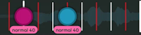
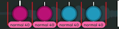

# Ranking-Kriterien für osu!taiko

***Hinweis: Dieses Dokument ist eine Ergänzung der [allgemeinen Ranking-Kriterien](/wiki/Ranking_criteria).***

Die **Ranking-Kriterien für osu!taiko** legen die [Regeln und Richtlinien](/wiki/Ranking_criteria) fest, die [osu!taiko](/wiki/Game_mode/osu!taiko)-spezifische [Beatmaps](/wiki/Beatmap) befolgen müssen, um das [Beatmap-Ranking-Verfahren](/wiki/Beatmap_ranking_procedure) zu durchlaufen.

## Glossar

### Schwierigkeitsgrade

::: alert-note
**Hauptseite:** [Benennung von Schwierigkeitsgraden](/wiki/Ranking_criteria/Difficulty_naming)
:::

-  Kantan
-  Futsuu
-  Muzukashii
-  Oni
-  Inner Oni

### Gameplay

- **Don / Rote Note:** Ein Beat, der mit einer der Trommelmitte zugehörigen Taste getroffen werden kann (Standardtasten `X` und `C`).
- **Kat / Blaue Note:** Ein Beat, der mit einer dem Trommelrand zugehörigen Taste getroffen werden kann (Standardtasten `Z` und `V`).
- **Big don / Große rote Note / Finisher-Note:** Ein kräftiger Beat, der für zusätzliche Punkte mit beiden der Trommelmitte zugehörigen Tasten gleichzeitig getroffen werden kann.
- **Big kat / Große blaue Note / Finisher-Note:** Ein kräftiger Beat, der für zusätzliche Punkte mit beiden dem Trommelrand zugehörigen Tasten gleichzeitig getroffen werden kann.
- **BPM:** Tempo eines Songs, gemessen in "Beats pro Minute".
- **Slider/Drumroll:** Ein gelber Balken mit Ticks darin, die mit irgendeiner der zugewiesenen Tasten gespielt werden. Diese Ticks haben meistens eine Taktteilung von 1/4, entsprechend der BPM des Songs. Wenn die BPM geringer als 125 sind, ändert sich die Taktteilung zu 1/8. Wenn die BPM höher als 250 sind, ändert sie sich zu 1/2. Wenn die Slidertick-Rate auf 3 eingestellt ist, werden die Sliderticks stattdessen auf einen 1/3-Takt angepasst.
- **Spinner:** Ein rundes Element, bei dem Spieler zwischen dem Treffen von Don/Kat für eine bestimmte Anzahl von Malen hin- und herwechseln müssen, was in der Mitte des Spinners angezeigt wird. Dieser Wert hängt von der allgemeinen Schwierigkeit (OD) der Beatmap sowie von der Länge des Spinners ab.
- **Taktstrich:** Eine Linie, die auf dem Spielfeld erscheint und den Start eines Taktes bestimmt.
- **Überlappung:** Eine Note, die teilweise oder vollständig andere Noten im Spielfeld überdeckt.
- **Ruhemoment:** Ein Zeitabschnitt ohne Noten, damit Spieler ihre Hände ausruhen und sich auf die bevorstehende Sektion vorbereiten können.
- **Stream:** Gruppierung aufeinanderfolgender Circles. Normalerweise auf 1/4-Takte geteilt.
- **Taktteilung:** Ein Strich auf der Zeitleiste, bei dem ein Objekt platziert wird.
- **Variable Taktteilung:** Eine Kombination mehrerer verschiedener Wege, Noten aufgrund des schwankenden Charakters des Songs innerhalb einer kurzen Zeitspanne zu platzieren.
- **Slider-Geschwindigkeit:** Die Geschwindigkeit, mit der sich die Noten/Drumrolls/Spinner/Taktstriche horizontal von rechts nach links über das Spielfeld bewegen. Die Ausgangsgeschwindigkeit der Slider kann im Timing-Tab gesteuert werden und zusätzliche Änderungen lassen sich über vererbte (grüne) Timing-Punkte durchführen.
- **Weiche Änderungen der Slider-Geschwindigkeit:** Eine Mechanik, die einen schrittweisen Übergang von Sektionen mit niedriger zu Sektionen mit höherer Slider-Geschwindigkeit (und umgekehrt) ermöglicht. Um diesen Effekt zu erzielen, werden Übergangsnoten mit unterschiedlichen Slider-Geschwindigkeiten verwendet.
- **Improvisation:** Mehr Noten haben als der eigentliche Song vorgibt.
- **[Taiko-Vorlagenhintergrund](/wiki/Beatmap/Background/Taiko_template_background):** Hintergrundbilder, die authentisches Gameplay aus Taiko no Tatsujin simulieren.

## Global

Globale Regeln und Richtlinien gelten für alle osu!taiko-Schwierigkeitsstufen. Rhythmusbezogene Regeln und Richtlinien gelten für Beatmaps mit ca. 180 BPM und 4/4-Taktsignaturen. Wenn dein Song drastisch schneller oder langsamer ist, können einige Variablen anders sein, wie unter [BPM-Skalierung in den Ranking-Kriterien](/wiki/Ranking_criteria/Scaling_BPM) ausführlich beschrieben wird.

### Allgemein

#### Regeln

Alle Regeln sind genau das: **Regeln**. Sie sind **keine** Richtlinien und dürfen **unter keinen Umständen** gebrochen werden.

- **Jede Note muss eine klare, unterscheidbare Farbe zu den vorhergehenden und den nachfolgenden Noten haben.**
- **Jede Note muss eindeutig einer [musikalischen Ebene](/wiki/Music_theory/Layer) oder Ebeneneinheit zugeordnet werden können, die sie repräsentieren soll, sei es, um eine vom Song vorgegebene Ebene zu erweitern, oder sei es eine zusätzliche, vom Mapper improvisierte Ebene.** Improvisiere nicht in einer Weise, die das Tempo verschiebt, der allgemeinen Musikrichtung widerspricht oder die aktuelle Intensität des Songs falsch interpretiert. Die Improvisation muss entweder eine bestehende Ebene des Songs verbessern oder eine neue hinzufügen. Andernfalls geht der Bezug zum Song verloren, was dem Hauptzweck eines Rhythmusspiels widerspricht.
- **Die Funktion `Omit first bar line` eines nicht vererbten Timing-Punkts muss verwendet werden, wenn eine Änderung der BPM bzw. eine Rücksetzung des Metronoms das Spielerlebnis durch das Hinzufügen überflüssiger Taktstriche in ästhetischer Hinsicht beeinträchtigen würde.**
- **Slidertails dürfen nicht fehlenden Sliderticks im Takt zugeteilt werden.** Dieses Verhalten ist unbeabsichtigt und wird in Zukunft korrigiert.
- **[Taiko-Vorlagenhintergründe](/wiki/Beatmap/Background/Taiko_template_background) dürfen nicht benutzt werden.** Bei gängigeren Seitenverhältnissen funktionieren sie nicht so, wie sie urprünglich gedacht waren.
- **Lasse keinen Platz zwischen dem Taiko-Spielfeld und dem Hintergrund frei.** Wenn dies der Fall ist, solltest du die letzte Null in der Datei `.osu` in der Zeile `0,0,"name_des_hintergrunds.dateiendung",0,0` unter der Überschrift `[Events]` mit Notepad ändern. Positive Werte senken den Hintergrund, während negative Werte ihn anheben.

#### Richtlinien

In **Ausnahmefällen** dürfen die Richtlinien ignoriert werden. Diese außergewöhnlichen Umstände müssen durch eine ausführliche Erklärung gerechtfertigt sein, warum die Richtlinie ignoriert wurde und warum ihre Beachtung die Gesamtqualität des Werks beeinträchtigen würde.

- **Vermeide visuell störende Noten auf dem Spielfeld mit aktiven Spinnern.** Spinner decken den Großteil des Bildschirms ab, so dass die Beatmap massiv schwieriger zum Lesen wird, wenn die Spinner zu nah an den nachfolgenden Noten enden. Einen 1/2-Takt Abstand zwischen einem Spinner und der folgenden Note löst dieses Problem in der Regel.
- **Erhebliche Überlappungen sollten vermieden werden, sodass die Farbe jeder Note noch leicht erkennbar ist und keine unnötige visuelle Störung verursacht.** Überschneidungen sollten nur vorhanden sein, wenn das Tempo des Songs oder die Taktteilung es an dieser Stelle rechtfertigen würde.
- **Vermeide, den Fokus auf mehrere [Ebenen](/wiki/Music_theory/Layer) des Songs gleichzeitig zu legen, wenn unklar ist, welcher Rhythmus priorisiert wird.** Spieler sollten in der Lage sein, zu erkennen, welchem Teil des Songs gefolgt wird.
- **Vermeide Rhythmen, die in keiner Weise vorhersehbar sind.** Rhythmus kann durch einheitliche Abstände in der Zeitleiste, die verschiedene Taktteilungen überbrücken, oder durch Ruhemomente intuitiv erzeugt werden.
- **Kiai-Zeit sollte nur für den Refrain oder hervorgehobene Teile eines Songs benutzt werden.** Von kurzen Kiai-Effekten wird aus mehreren Gründen abgeraten: Sie stören das Spielerlebnis insbesondere auf Computern mit niedriger Leistung und können Probleme für epileptische Nutzer verursachen.
- **Die Slidertick-Rate sollte entsprechend dem Song eingestellt werden.** In den meisten Fällen ist 1 ein guter Wert. Wenn der Song hauptsächlich 1/3 als Taktteilung verwendet, setze die Tickrate auf 3, um die Drumrollticks auf 1/3 festzulegen.
- **Wenn eigene Hitsounds verwendet werden, sollten diese mit Trommeln zu tun haben.** Tiefere Töne sollten als Don und höhere Töne als Kat eingestellt werden.
- **Verwende leise oder stille Spinner nur, wenn es zu einem leisen Abschnitt des Songs passt.** In den meisten anderen Fällen ist ein hörbares Hitsound-Feedback bei Spinnern sehr zu empfehlen.
- **Vermeide es, wesentliche Bereiche des Hintergrunds mit dem Taiko-Spielfeld zu verdecken.**

### Verteilung

#### Regeln

- **Wenn die [Drain-Zeit](/wiki/Beatmap/Drain_time) jeder Schwierigkeitsstufe...**
  - **...kürzer als 2:30 ist**, darf der unterste Schwierigkeitsgrad nicht schwerer als Futsuu sein.
  - **...zwischen 2:30 und 3:15 liegt**, darf der unterste Schwierigkeitsgrad nicht schwerer als Muzukashii sein.
  - **...zwischen 3:15 und 4:00 liegt**, darf der unterste Schwierigkeitsgrad nicht schwerer als Oni sein.
  - **[Pausen](/wiki/Beatmap/Break) dürfen mit [Drain-Zeit](/wiki/Beatmap/Drain_time) kombiniert werden, um die oben genannten Grenzwerte zu erreichen.** In der höchsten Schwierigkeitsstufe ist das auf allerhöchstens 30 Sekunden Pause begrenzt. Dies gilt nicht für Schwierigkeitsgrade mit weniger als 30 Sekunden Drain-Zeit.

#### Richtlinien

- **Es sollte keine drastisch großen Schwierigkeitslücken zwischen je zwei Schwierigkeitsgraden unter Inner Oni geben**, wobei diese Richtlinie bei Gastschwierigkeiten abgemildert wird, um die Koordinierung der Aufteilung auf mehrere Mapper zu erleichtern.

### Slidergeschwindigkeit

#### Richtlinien

- **Die Ausgangsgeschwindigkeit von Slidern sollte 1,40 in allen Schwierigkeitsgraden einer Beatmap sein.** Dies soll eine optimale Menge an Noten auf dem Spielfeld sowie den bestmöglichen Abstand zwischen verschiedenen Noten gewährleisten.
- **Wenn die Geschwindigkeit von Slidern verändert wird, sollte diese den Tempoänderungen im Song entsprechen.** Das bedeutet, dass ruhige Teile eines Songs nicht beschleunigt und schnelle Teile nicht verlangsamt werden.
- **Vermeide es, weiche Änderungen der Slider-Geschwindigkeit in Sektionen mit variabler Taktteilung zu benutzen.** Dadurch wird die Lesbarkeit dieser Taktteilungen beeinträchtigt, daher solltest du die Abweichungen niedrig genug halten, um ein Überlappen zu verhindern.
- **Vermeide abrupte Änderungen der Slider-Geschwindigkeit innerhalb von Patterns, die bereits überlappen (z. B. 1/4-Streams).** Weiche Änderungen der Slider-Geschwindigkeit sollten in diese Fällen benutzt werden, um sicherzustellen, dass die Patterns lesbar bleiben.
- **Songs mit variablen BPM dürfen häufige Änderungen der Slider-Geschwindigkeit beinhalten, um die Scrollgeschwindigkeit, mit der sich Noten bewegen, ungefähr konstant zu halten.** Auf diese Weise werden die Zeitabstände zwischen den Noten leicht erkennbar und verbessern das Spielerlebnis, da Überlappungen durch BPM-Änderungen vermieden werden.

## Abhängig vom Schwierigkeitsgrad

Schwierigkeitsspezifische Regeln und Richtlinien gelten nur für die Schwierigkeitsstufe, bei der sie aufgeführt werden und *betreffen somit nicht **jeden** osu!taiko-Schwierigkeitsgrad*. Rhythmusbezogene Regeln und Leitlinien gelten für Beatmaps mit ungefähr 180 BPM. Wenn dein Song drastisch schneller oder langsamer ist, können einige Variablen anders sein, wie in [Skalierung der BPM anhand der Ranking-Kriterien](/wiki/Ranking_criteria/Scaling_BPM) ausführlich beschrieben.

### Richtlinien für Ruhemomente

Ruhemomente sind kleine Unterbrechungen im Gameplay, die verwendet werden, um Patterns voneinander zu trennen und dem Spieler eine Pause von kontinuierlichen Rhythmusketten zu bieten. Sie spielen eine wichtige Rolle bei der Reduzierung der Ermüdung von Spielern, insbesondere bei dichteren Rhythmen.

Es ist akzeptabel, Ruhemomente seltener zu verwenden, wenn sie aufgrund des Tempos der Musik unintuitiv sind oder wenn der durchgehende Teil der Beatmap insgesamt nachsichtiger mit dem Spieler ist.

**Jeder Schwierigkeitsgrad muss die jeweiligen Richtlinien für Ruhemomente einhalten:**

| Schwierigkeitsgrad | Ruhemoment | Beispiel | Länge der Kette |
| :-: | :-: | :-: | :-- |
|  **Kantan** | 3/1 oder länger |  | Ruhemoment benötigt alle 32–36 Beats |
|  **Futsuu** | 2/1 oder länger |  | Ruhemoment benötigt alle 32–36 Beats |
|  **Muzukashii** (erste Option) | 3/2 oder länger |  | Ruhemoment benötigt alle 32–36 Beats |
|  **Muzukashii** (zweite Option) | 3 aufeinanderfolgende 1/1 oder länger |  | Ruhemoment benötigt alle 32–36 Beats |
|  **Oni** | 1/1 oder länger |  | Ruhemoment benötigt alle 16–20 Beats |

###  Kantan

#### Regeln

- **Wenn ein 1/2-Pattern benutzt wird, müssen die Patterns einfach bleiben und auf sie muss ein [Ruhemoment](#richtlinien-für-ruhemomente) folgen.** Farbwechsel oder Finisher-Notes dürfen nicht in solchen Patterns verwendet werden. Bei Songs, die einem Swing-Takt folgen, beträgt diese Grenze 1/3.
- **Noten müssen mindestens einen 1/2-Takt auseinander liegen.** Alles, was schneller ist, ist für Anfänger zu komplex. Bei Songs, die einem Swing-Takt folgen, ist das Mindestmaß stattdessen 1/3.

#### Richtlinien

- **1/1-Patterns sollten nicht länger als 7 Noten sein.** Alles, was länger ist, ist für Anfänger wahrscheinlich zu anstrengend. Auf solche Patterns sollte ein [Ruhemoment](#richtlinien-für-ruhemomente) folgen.
- **Die allgemeine Taktteilung sollte hauptsächlich aus 2/1, 4/1 oder langsameren Rhythmen bestehen.** Die gelegentliche Verwendung von 1/1-Rhythmen ist in Ordnung.
- **Zwischen einem Spinner und der vorhergehenden Note sollte mindestens 1/2 Abstand sein.** Auf diese Weise wird sichergestellt, dass sie nicht übermäßig überlappen und dass die Lesbarkeit gewährleistet ist.
- **Die Slider-Geschwindigkeit darf mit Bedacht verändert werden.** Änderungen sollten nur für Abschnitte mit unterschiedlichem Tempo erfolgen und die Slider-Geschwindigkeit sollte nicht drastisch variieren.

#### Richtlinien für die Schwierigkeitseinstellungen

- Allgemeine Schwierigkeit sollte 3 oder weniger sein.
- HP-Drain-Rate sollte 8 oder mehr sein.[^hp-note]

###  Futsuu

#### Regeln

- **Wenn ein 1/3-Pattern benutzt wird, müssen die Patterns einfach bleiben.** Farbwechsel oder Finisher-Notes dürfen nicht in solchen Patterns verwendet werden.
- **Noten müssen mindestens einen 1/3-Takt auseinander liegen.** Alles, was schneller ist, ist für Anfänger zu komplex.

Wenn eine Futsuu-Schwierigkeit erforderlich ist und als *niedrigste Schwierigkeitsstufe* einer Beatmap verwendet wird, muss sie ebenfalls diese Regeln befolgen:

- **Noten müssen mindestens einen 1/2-Takt auseinander liegen.** Alles, was schneller ist, ist für Anfänger zu komplex. Bei Songs, die einem Swing-Takt folgen, ist das Mindestmaß stattdessen 1/3.

#### Richtlinien

- **1/3-Patterns sollten nicht länger als 2 Noten sein.** Alles, was länger ist, ist sehr situationsabhängig und normalerweise zu komplex für neue Spieler. Auf diese Patterns sollte ein [Ruhemoment](#richtlinien-für-ruhemomente) innerhalb von 2/1 folgen und Patterns, die 1/2 oder schneller sind, sollten hier gänzlich vermieden werden.
- **1/2-Patterns sollten nicht länger als 7 Noten sein.** Alles, was länger ist, ist für Anfänger vermutlich zu anstrengend.
- **Die allgemeine Taktteilung sollte hauptsächlich aus 1/1, 2/1 oder langsameren Rhythmen bestehen.** Die gelegentliche Verwendung von 1/2-Rhythmen ist in Ordnung.
- **Zwischen einem Spinner und der vorhergehenden Note sollte mindestens 1/2 Abstand sein.** Auf diese Weise wird sichergestellt, dass sie nicht übermäßig überlappen und dass die Lesbarkeit gewährleistet ist.
- **Die Slider-Geschwindigkeit darf mit Bedacht verändert werden.** Änderungen sollten nur für Abschnitte mit unterschiedlichem Tempo erfolgen und die Slider-Geschwindigkeit sollte nicht drastisch variieren.

Wenn eine Futsuu-Schwierigkeit erforderlich ist und als *niedrigste Schwierigkeitsstufe* einer Beatmap verwendet wird, muss sie ebenfalls diese Richtlinien befolgen:

- **1/2-Patterns sollten nicht länger als 5 Noten sein.**

#### Richtlinien für die Schwierigkeitseinstellungen

- Allgemeine Schwierigkeit sollte 4 oder weniger sein.
- HP-Drain-Rate sollte 7 oder mehr sein.[^hp-note]

###  Muzukashii

#### Regeln

- **Finisher-Notes dürfen nicht in 1/4 oder schnelleren Patterns in dieser Schwierigkeitsstufe platziert werden.** Die Verwendung von Finisher-Notes ist für das Zielpublikum zu kompliziert.
- **Noten müssen mindestens einen 1/6-Takt auseinander liegen.** Alles, was schneller ist, ist für das Zielpublikum dieses Schwierigkeitsgrades zu komplex.
- **1/4-Patterns dürfen nicht länger als 5 Noten sein.** Alles, was länger ist, ist zu anstrengend für fortgeschrittene Spieler.

#### Richtlinien

- **1/6-Patterns sollten nicht länger als 4 Noten bei mittleren bis niedrigen BPM (~140) sein.** Alles, was länger ist, ist sehr situationsabhängig und normalerweise zu komplex. Auf solche Patterns sollte ein [Ruhemoment](#richtlinien-für-ruhemomente) folgen. Des Weiteren sollten diese Patterns bei höheren BPM gänzlich vermieden werden.
- **Die allgemeine Taktteilung sollte hauptsächlich aus 1/2, 1/1 oder langsameren Rhythmen bestehen.** Die gelegentliche Verwendung von 1/4-Rhythmen ist in Ordnung.
- **Zwischen einem Spinner und der vorhergehenden Note sollte mindestens 1/2 Abstand sein.** Auf diese Weise wird sichergestellt, dass sie nicht übermäßig überlappen und dass die Lesbarkeit gewährleistet ist.
- **Das Editieren der Slider-Geschwindigkeit ist erlaubt**, aber Änderungen sollten nur für Abschnitte mit unterschiedlichem Tempo erfolgen und die Slider-Geschwindigkeit sollte nicht drastisch variieren.
- **1/4-Patterns mit einem oder mehreren Farbwechsel sollten sparsam verwendet werden.** Sie sollten in Verbindung mit anderen Patterns dieser Art vermieden werden, weil das Zielpublikum dieses Schwierigkeitsgrades nicht an Patterns dieser Komplexität gewöhnt ist.
- **1/4-Pattern, die länger als 3 Noten sind, sollten maximal einen Farbwechsel am Anfang oder am Ende des Patterns beinhalten.** Komplexere Patterns als diese sind zu anstrengend für fortgeschrittene Spieler. Auf diese Patterns sollte ein [Ruhemoment](#richtlinien-für-ruhemomente) folgen.

#### Richtlinien für die Schwierigkeitseinstellungen

- Allgemeine Schwierigkeit sollte 5 oder weniger sein.
- HP-Drain-Rate sollte 6 oder mehr sein.[^hp-note]

###  Oni

#### Regeln

- **Finisher-Notes dürfen nicht in 1/6 oder schnelleren Patterns in dieser Schwierigkeitsstufe platziert werden.** Die Verwendung von Finisher-Notes ist für das Zielpublikum zu kompliziert.
- **Finisher-Notes für 1/4-Patterns in dieser Schwierigkeitsstufe dürfen nur am Ende des Patterns platziert werden und müssen die entgegengesetzte Farbe der vorhergehenden Note haben.** Andere Platzierungen können die Lesbarkeit für das Zielpublikum zu stark beeinträchtigen.
- **Noten müssen mindestens einen 1/8-Takt auseinander liegen.** Alles, was schneller ist, ist für das Zielpublikum dieses Schwierigkeitsgrades zu komplex.

#### Richtlinien

- **1/8-Patterns sollten nicht länger als 2 Noten sein.** Alles, was länger ist, ist sehr situationsabhängig und normalerweise zu komplex. Auf solche Patterns sollte ein [Ruhemoment](#richtlinien-für-ruhemomente) folgen.
- **1/4-Patterns sollten nicht länger als 9 Noten sein.** Alles, was länger ist, ist vermutlich zu anstrengend für das Zielpublikum dieses Schwierigkeitsgrades.
- **Die allgemeine Taktteilung sollte hauptsächlich aus 1/2 und gelegentlich 1/1-Rhythmen bestehen.** 1/4-Rhythmen dürfen in diesem Schwierigkeitsgrad häufiger verwendet werden.
- **Zwischen einem Spinner und der vorhergehenden Note sollte mindestens 1/4 Abstand sein.** Auf diese Weise wird sichergestellt, dass sie nicht übermäßig überlappen und dass die Lesbarkeit gewährleistet ist.
- **1/4-Patterns, die länger als 5 Noten sind, sollten komplizierte Farbwechsel vermeiden.** Längere Patterns mit solcher Komplexität sind für das Zielpublikum dieser Schwierigkeitsstufe zu anstrengend.

#### Richtlinien für die Schwierigkeitseinstellungen

- Allgemeine Schwierigkeit sollte 5 oder mehr sein.
- HP-Drain-Rate sollte 5 oder mehr sein.[^hp-note]

###  Inner Oni

#### Richtlinien

- **Die allgemeine Taktteilung sollte hauptsächlich aus 1/2 und 1/4-Rhythmen bestehen.** 1/4-Rhythmen dürfen in diesem Schwierigkeitsgrad sehr häufig verwendet werden.
- **Zwischen einem Spinner und der vorhergehenden Note sollte mindestens 1/4 Abstand sein.** Auf diese Weise wird sichergestellt, dass sie nicht übermäßig überlappen und dass die Lesbarkeit gewährleistet ist.

#### Richtlinien für die Schwierigkeitseinstellungen

- Allgemeine Schwierigkeit sollte 6 oder mehr sein.
- HP-Drain-Rate sollte 5 oder mehr sein.[^hp-note]

## Anmerkungen

[^hp-note]: Wenn die Notenanzahl höher oder der Song länger ist, sollte die HP-Drain-Rate leicht abgesenkt werden, und umgekehrt für eine geringere Notenanzahl oder einen längeren Song.
