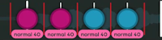
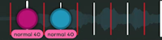

# Criterios de clasificación de osu!taiko

***Aviso: Este documento es una extensión de los [criterios de clasificación generales](/wiki/Ranking_criteria).***

Este conjunto de **criterios de clasificación de osu!taiko** establece [reglas y pautas](/wiki/Ranking_criteria) que los [beatmaps](/wiki/Beatmap) específicos de [osu!taiko](/wiki/Game_mode/osu!taiko) deben seguir para avanzar en el [procedimiento de clasificación](/wiki/Beatmap_ranking_procedure).

## Glosario

### Nombres de las dificultades

*Artículo principal: [Nombramiento de las dificultades](/wiki/Ranking_criteria/Difficulty_naming)*

-  Kantan
-  Futsuu
-  Muzukashii
-  Oni
-  Inner Oni

### Jugabilidad

- **Don/Nota roja:** Una nota que se puede pulsar con cualquiera de las teclas del tambor central (teclas predeterminadas `X`, `C`).
- **Kat/Nota azul:** Una nota que se puede pulsar con cualquiera de las teclas del borde del tambor (teclas predeterminadas `Z`, `V`).
- **Don grande/Nota roja grande/Nota finalizadora:** Una nota que se puede pulsar con las dos teclas del tambor central al mismo tiempo para conseguir una puntuación extra.
- **Kat grande/Nota azul grande/Nota finalizadora:** Una nota que se puede pulsar con las dos teclas del borde del tambor al mismo tiempo para obtener una puntuación extra.
- **BPM:** Acrónimo de «pulsaciones por minuto» usado para determinar el tempo de una canción.
- **Slider/Redoble de tambor:** Una barra amarilla con marcas en su interior que se pulsan con cualquiera de las teclas asignadas. Estas marcas suelen estar ajustadas a 1/4 correspondientes al BPM de la canción. Si el BPM es inferior a 125, el ajuste cambiará a 1/8. Si el BPM es superior a 250, cambiará a 1/2. Si la tasa de marcas de los sliders está establecida en 3, las marcas de los sliders se ajustarán a 1/3.
- **Spinner:** Un elemento redondo que requiere que el jugador alterne entre golpear el Don/Kat un número determinado de veces, que se muestra en el centro del spinner. Este número depende de la dificultad general del mapa y de la duración del spinner.
- **Línea de compás:** Línea que aparece en el campo de juego y determina el inicio de un compás.
- **Overlap:** Una nota que cubre parcial o totalmente otras notas en el campo de juego.
- **Descanso:** Un periodo de tiempo sin notas usado específicamente para permitir al jugador descansar sus manos y prepararse para los siguientes patrones.
- **Stream:** Círculos consecutivos agrupados. Normalmente se ajustan a un ritmo de 1/4.
- **Snapping:** Marca de la línea de tiempo donde se coloca un objeto.
- **Snapping variable:** Una combinación de múltiples formas diferentes de ajustar las notas en un corto espacio de tiempo debido a la naturaleza fluctuante de la canción en ese momento.
- **Velocidad de los sliders:** Velocidad a la que se mueven horizontalmente las notas/redobles de tambor/spinners/líneas de compás de derecha a izquierda por el campo de juego. La velocidad base de los sliders se puede controlar en el panel de la temporización y se pueden realizar cambios adicionales a través de los puntos de tiempo heredados (verdes).
- **Cambios suaves en la velocidad de los sliders:** Una mecánica que permite una transición gradual desde secciones de menor a mayor/de mayor a menor en la velocidad de los sliders. Para conseguir este efecto, se usan notas de transición con diferentes velocidades de los sliders.
- **Improvisación:** Tener más notas de las que proporciona la canción real.
- **[Plantillas para los fondos de Taiko](/wiki/Beatmap/Background/Taiko_template_background):** Imágenes de fondo que simulan la auténtica jugabilidad de *Taiko no Tatsujin*.

## General

Las reglas y pautas generales se aplican a todo tipo de dificultad de osu!taiko. Las reglas y pautas relacionadas con el ritmo se aplican a beatmaps de aproximadamente 180 BPM con compases de 4/4. Si tu canción es drásticamente más rápida o más lenta, algunas variables pueden ser diferentes, como se detalla en [Escalado del BPM según los criterios de clasificación](/wiki/Ranking_criteria/Scaling_BPM).

### Reglas

Todas las reglas son exactamente eso: **reglas**. **No** son pautas y **no** deben incumplirse bajo **ninguna** circunstancia.

- **Cada nota debe tener un color claramente distinguible de las notas anteriores y posteriores.**
- **Cada nota debe ser claramente asignable a una [capa musical](/wiki/Music_theory/Layer) o a una unidad de capa que intente representar, ya sea para mejorar una capa que la canción proporciona, o ya sea una capa adicional improvisada por el mapper.** No improvises de manera que cambies el ritmo, contradigas el movimiento general de la música o malinterpretes la intensidad actual de la canción. La improvisación debe mejorar una capa actual de la canción o añadir una nueva. De lo contrario, se pierde la relación con la canción, lo que contradice el objetivo principal de un juego de ritmo.
- **La opción `Omit first bar line` de un punto de tiempo no heredado debe usarse cuando un cambio de BPM/reinicio del metrónomo dificultaría estéticamente la experiencia de juego al añadir líneas de compás innecesarias.**
- **No deben usarse [plantillas para los fondos de taiko](/wiki/Beatmap/Background/Taiko_template_background).** No funcionan como se pretendía originalmente en las relaciones de aspecto más comunes.
- **Las colas de los sliders no deben ajustarse erróneamente para corregir la ausencia de las marcas de los sliders.** Este comportamiento no es intencionado y se corregirá en el futuro.
- **Si el [tiempo de drenaje](/wiki/Beatmap/Drain_time) de cada dificultad es...**
  - **... menos de 2:30**, la dificultad más baja no puede ser más difícil que un Futsuu.
  - **... entre 2:30 y 3:15**, la dificultad más baja no puede ser más difícil que un Muzukashii.
  - **... entre 3:15 y 4:00**, la dificultad más baja no puede ser más difícil que un Oni.
  - **Los [descansos](/wiki/Beatmap/Break) pueden combinarse con el [tiempo de drenaje](/wiki/Beatmap/Drain_time) para cumplir los umbrales mencionados**. Para la dificultad más alta, esto se limita a un máximo de 30 segundos de descanso. Esto no se aplica a las dificultades con menos de 30 segundos de tiempo de drenaje.
- **No dejes ningún espacio en blanco entre el campo de juego de taiko y el fondo.** Si esto ocurre, debes modificar el último cero del `.osu` mediante el bloc de notas en la línea `0,0,«nombre_del_fondo.extensión_del_archivo»,0,0` en `[Events]`. Los valores positivos bajarán el fondo mientras que los negativos lo subirán.

### Pautas

Las pautas pueden ignorarse en **circunstancias excepcionales**. Estas circunstancias excepcionales deben justificarse con una explicación detallada de por qué se ha ignorado la pauta y por qué no ignorarla interferirá en la calidad general de la creación.

- **No debería haber diferencias drásticas entre dos niveles de dificultad por debajo de Inner Oni**, aunque se puede permitir cierta tolerancia entre las [dificultades de invitados](/wiki/Beatmap/Guest_difficulty) para facilitar la coordinación entre varios mappers.
- **Evita cubrir partes esenciales del fondo con el campo de juego de taiko.**
- **Si se usan cambios en la velocidad de los sliders, deben coincidir con los cambios en el ritmo de la canción.** Eso significa no acelerar las partes tranquilas ni ralentizar las partes rápidas de una canción.
- **Evita usar cambios uniformes en la velocidad de los sliders en secciones que incluyan un snapping variable.** Hacerlo afecta a la legibilidad de estos snaps, así que mantén la variación lo suficientemente baja como para evitar que se superpongan.
- **Evita los cambios bruscos en la velocidad de los sliders dentro de los patrones que ya se superponen (por ejemplo, streams de 1/4).** En estos casos se deben usar cambios suaves en la velocidad de los sliders para garantizar que los patrones sigan siendo legibles.
- **Deben evitarse las superposiciones sustanciales para que el color de cada nota siga siendo fácilmente legible y no suponga una molestia visual innecesaria.** La superposición solo debe hacerse si el ritmo de la canción o el ajuste de las notas en ese punto pueden justificarlo.
- **Evita los ritmos que no sean en absoluto predecibles.** El ritmo puede hacerse intuitivo mediante el uso de intervalos de tiempo coherentes que sirvan de puente entre los diferentes snappings o mediante los descansos.
- **El kiai time solo debe usarse para el coro o las partes destacadas de una canción.** Los destellos del kiai/kiais cortos no se recomiendan por varias razones: perturban la experiencia de juego, especialmente para los usuarios con ordenadores de gama baja, y pueden causar problemas a los usuarios epilépticos.
- **La velocidad base de los sliders debe ser de 1,40 en todas las dificultades de un beatmap.** De este modo se garantiza la cantidad óptima de notas en el campo de juego, así como la distancia óptima de separación entre las distintas notas.
- **La tasa de las marcas de los sliders debe ajustarse según la canción.** En la mayoría de los casos, debe establecerse en 1. Si la canción usa 1/3 como divisor principal, usa una tasa de 3 para ajustar las marcas de los redobles de tambor a 1/3.
- **Evita seguir varias [capas](/wiki/Music_theory/Layer) de la canción si no está claro qué ritmo se está priorizando.** Los jugadores deben ser capaces de distinguir qué parte de la canción se está siguiendo.
- **Usa spinners con volumen bajo o silenciosos solo cuando sea adecuado para una sección de la canción con volumen bajo.** En la mayoría de los demás casos, se recomienda encarecidamente contar con sonidos audibles en los spinners.
- **Las canciones con un BPM variable pueden usar frecuentes cambios en la velocidad de los sliders para mantener constante la velocidad de desplazamiento a la que se mueven las notas.** De este modo, los intervalos de tiempo entre las notas serán fácilmente predecibles y se mejorará la experiencia de juego al evitar las superposiciones debidas a los cambios del BPM.
- **Evita obstruir visualmente las notas en el campo de juego con spinners activos.** Los spinners cubren la mayor parte de la pantalla, por lo que terminarlos demasiado cerca de las próximas notas puede provocar problemas de lectura. Por lo general, tener 1/2 de distancia entre un spinner y la siguiente nota resuelve esto.
- **Si se usan hitsounds personalizados, deben estar relacionados con el sonido del tambor.** Los tonos más fuertes/graves deben ponerse como Don y los más débiles/agudos como Kat.

## Dificultades específicas

Las reglas y pautas específicas de cada dificultad solo se aplican al nivel de dificultad para el que se indican y, por lo tanto, *no se aplican a **todas** las dificultades de osu!taiko*. Las reglas y pautas relacionadas con el ritmo se aplican a los beatmaps de aproximadamente 180 BPM. Si tu canción es drásticamente más rápida o más lenta, algunas variables pueden ser diferentes, como se detalla en [Escalado del BPM según los criterios de clasificación](/wiki/Ranking_criteria/Scaling_BPM).

### Pautas de los momentos de descanso

Los momentos de descanso son pequeñas pausas dentro de los beatmaps que se usan para separar patrones y darle un respiro al jugador de las cadenas de ritmo continuas. Desempeñan un papel importante en la reducción de la fatiga de los jugadores, especialmente en ritmos más densos.

Es aceptable usar los momentos de descanso con menos frecuencia si el ritmo de la música hace que los momentos de descanso sean poco intuitivos o si la parte mapeada de forma continua es, en general, más tolerante con el jugador.

**Cada dificultad debe seguir sus respectivas pautas para los momentos de descanso:**

| Dificultad | Momento de descanso | Ejemplo | Longitud de la cadena del ritmo |
| :-: | :-: | :-: | :-- |
|  **Kantan** | 3/1 o más |  | Momento de descanso necesario cada 32-36 pulsos |
|  **Futsuu** | 2/1 o más |  | Momento de descanso necesario cada 32-36 pulsos |
|  **Muzukashii** (opción 1) | 3/2 o más |  | Momento de descanso necesario cada 32-36 pulsos |
|  **Muzukashii** (opción 2) | Tres 1/1 consecutivos o más |  | Momento de descanso necesario cada 32-36 pulsos |
|  **Oni** | 1/1 o más |  | Momento de descanso necesario cada 16-20 pulsos |

###  Kantan

#### Reglas

- **Si se usa un patrón de 1/2, los patrones deben seguir siendo simples e ir seguidos de un [momento de descanso](#pautas-de-los-momentos-de-descanso) entre las notas.** Los cambios de color o las notas finalizadoras no deben usarse en los patrones como si lo fueran. Para las canciones que siguen un ritmo de swing, este límite es de 1/3.
- **Las notas deben estar separadas por al menos 1/2 pulso.** Cualquier cosa más rápida es demasiado compleja para los jugadores principiantes. En cambio, para las canciones que siguen un ritmo de swing, este límite es de 1/3.

#### Pautas

- **Los patrones de 1/1 no deben tener más de siete notas.** Todo lo que sea más largo es probable que resulte demasiado agotador para los jugadores principiantes. Los patrones de este tipo deben ir seguidos de un [momento de descanso](#pautas-de-los-momentos-de-descanso) entre las notas.
- **El snapping principal debe consistir principalmente en 2/1, 4/1 o ritmos más lentos.** En ocasiones, es aceptable usar ritmos de 1/1.
- **Debe haber al menos 1/2 de distancia entre un spinner y la siguiente nota.** De este modo se garantiza que no se superpongan de manera excesiva y se asegure la legibilidad.
- **Los cambios en la velocidad de los sliders deben usarse con precaución.** Los cambios solo deben producirse en secciones con ritmos diferentes y la velocidad de los sliders no debe variar drásticamente.

#### Pautas para la configuración de la dificultad

- La dificultad general debería ser de 3 o menos.
- La tasa de drenaje de HP debería ser de 8 o más[^hp-note].

###  Futsuu

#### Reglas

- **Si se usa un patrón de 1/3, los patrones deben seguir siendo simples.** Los cambios de color o las notas finalizadoras no deben usarse en los patrones como si lo fueran.
- **Las notas deben estar separadas por al menos 1/3 de un pulso.** Cualquier cosa más rápida es demasiado compleja para los jugadores principiantes.

Si se requiere una dificultad Futsuu y se usa como la *dificultad más baja* de un beatmap, también debe cumplir estas reglas:

- **Las notas deben estar separadas por al menos 1/2 pulso.** Cualquier cosa más rápida es demasiado compleja para los jugadores principiantes. En cambio, para las canciones que siguen un ritmo de swing, este límite es de 1/3.

#### Pautas

- **Los patrones de 1/3 no deben tener más de dos notas.** Todo lo que sea más largo depende mucho de la situación y suele ser demasiado complejo para los nuevos jugadores. Estos patrones deben ir seguidos de un [momento de descanso](#pautas-de-los-momentos-de-descanso) dentro de 2/1, y los patrones que son de 1/2 o más rápidos deben evitarse durante ese tiempo.
- **Los patrones de 1/2 no deben tener más de siete notas.** Todo lo que sea más largo es probable que resulte demasiado agotador para los jugadores principiantes.
- **El snapping principal debe consistir principalmente en ritmos de 1/1, 2/1 o más lentos.** En ocasiones, es aceptable usar ritmos de 1/2.
- **Debe haber al menos 1/2 de distancia entre un spinner y la siguiente nota.** De este modo se garantiza que no se superpongan de manera excesiva y se asegure la legibilidad.
- **Los cambios en la velocidad de los sliders deben usarse con precaución.** Los cambios solo deben producirse en secciones con ritmos diferentes y la velocidad de los sliders no debe variar drásticamente.

Si se requiere una dificultad Futsuu y se usa como la *dificultad más baja* de un beatmap, también debe seguir estas pautas:

- **Los patrones de 1/2 no deben tener más de cinco notas.**

#### Pautas para la configuración de la dificultad

- La dificultad general debería ser de 4 o menos.
- La tasa de drenaje de HP debería ser de 7 o más[^hp-note].

###  Muzukashii

#### Reglas

- **Las notas finalizadoras no deben usarse en ningún patrón de 1/4 o más rápido en esta dificultad.** El uso de finalizadores en estos patrones es demasiado complicado para los jugadores de este nivel.
- **Las notas deben estar separadas por al menos 1/6 de un pulso.** Cualquier cosa más rápida es demasiado compleja para el público objetivo de este nivel de dificultad.
- **Los patrones de 1/4 no deben tener más de cinco notas.** Algo más largo es demasiado agotador para el público objetivo de este nivel de dificultad.

#### Pautas

- **Los patrones de 1/6 no deben tener más de cuatro notas en un BPM moderado a bajo (alrededor de 140 BPM).** Todo lo que sea más largo es muy situacional y normalmente demasiado complejo. Los patrones de este tipo deben ir seguidos de un [momento de descanso](#pautas-de-los-momentos-de-descanso) entre las notas y deben evitarse a un BPM más elevado.
- **El snapping principal debe consistir principalmente en 1/2, 1/1 o ritmos más lentos.** En ocasiones, es aceptable usar ritmos de 1/4.
- **Debe haber al menos 1/2 de distancia entre un spinner y la siguiente nota.** De este modo se garantiza que no se superpongan de manera excesiva y se asegure la legibilidad.
- **Manipular la velocidad de los sliders está permitido**, pero la velocidad de los sliders solo debe cambiarse para las secciones de la música con ritmos diferentes y no debe ser drásticamente variable.
- **Los patrones de 1/4 con uno o más cambios de color deben usarse con moderación.** Deben evitarse junto con otros patrones de esta naturaleza porque el público objetivo de este nivel de dificultad no está acostumbrado a los patrones de esta complejidad.
- **Los patrones de 1/4 de más de tres notas deben constar de un cambio de color como máximo, que debe tener lugar al principio o al final del patrón.** Los patrones más complejos serían demasiado exigentes para los jugadores de nivel intermedio. Estos patrones deben ir seguidos de un [momento de descanso](#pautas-de-los-momentos-de-descanso) entre las notas.

#### Pautas para la configuración de la dificultad

- La dificultad general debería ser de 5 o menos.
- La tasa de drenaje de HP debería ser de 6 o más[^hp-note].

###  Oni

#### Reglas

- **Las notas finalizadoras no deben usarse en ningún patrón de 1/6 o más rápido en esta dificultad.** El uso de finalizadores en estos patrones es demasiado complicado para el público de este nivel.
- **Las notas finalizadoras de los patrones de 1/4 en esta dificultad solo deben usarse al final de ese patrón y ser del color opuesto a su nota anterior.** Una ubicación distinta puede alterar la legibilidad para el público de este nivel.
- **Las notas deben estar separadas por al menos 1/8 de un pulso.** Todo lo que sea más rápido es demasiado complejo para el público objetivo de este nivel de dificultad.

#### Pautas

- **Los patrones de 1/8 no deben tener más de dos notas.** Todo lo que sea más largo es muy situacional y normalmente demasiado complejo. Los patrones de este tipo deben ir seguidos de un [momento de descanso](#pautas-de-los-momentos-de-descanso) entre las notas.
- **Los patrones de 1/4 no deben tener más de nueve notas.** Todo lo que sea más largo es probable que resulte demasiado agotador para el público objetivo de este nivel de dificultad.
- **El snapping principal debe consistir principalmente en ritmos de 1/2 y ocasionalmente de 1/1.** Los ritmos de 1/4 pueden usarse con más frecuencia en este nivel de dificultad.
- **Debe haber al menos 1/4 de distancia entre un spinner y la siguiente nota.** De este modo se garantiza que no se superpongan de manera excesiva y se asegure la legibilidad.
- **Los patrones de 1/4 de más de cinco notas deben evitar los cambios de color complicados.** Los patrones más largos con tal complejidad serían demasiado exigentes para el público objetivo de este nivel de dificultad.

#### Pautas para la configuración de la dificultad

- La dificultad general debería ser de 5 o más.
- La tasa de drenaje de HP debería ser de 5 o más[^hp-note].

###  Inner Oni

#### Pautas

- **El snapping principal debe consistir principalmente en ritmos de 1/2 y 1/4.** Los ritmos de 1/4 pueden usarse con mucha frecuencia en este nivel de dificultad.
- **Debe haber al menos 1/4 de distancia entre un spinner y la siguiente nota.** De este modo se garantiza que no se superpongan de manera excesiva y se asegure la legibilidad.

#### Pautas para la configuración de la dificultad

- La dificultad general debería ser de 6 o más.
- La tasa de drenaje de HP debería ser de 5 o más[^hp-note].

## Notas

[^hp-note]: En los casos en que el número de notas o la duración de la canción sean mayores, se debe reducir ligeramente la tasa de drenaje de HP, y viceversa cuando el número de notas o la duración de la canción sean menores.
