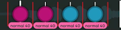

# osu!taiko 上架标准

***注意: 此页面是[通用上架标准 (RC)](/wiki/Ranking_Criteria)的扩展。***

这套 **osu!taiko 上架标准**列出了 [osu!taiko](/wiki/Game_mode/osu!taiko) 专属的[谱面](/wiki/Beatmap)在推进[谱面上架流程](/wiki/Beatmap_ranking_procedure)时，必须遵循的[规定和准则](/wiki/Ranking_Criteria)。

## 术语

### 难度名

*主页面：[难度命名](/wiki/Ranking_criteria/Difficulty_naming)*

-  Kantan
-  Futsuu
-  Muzukashii
-  Oni
-  Inner Oni

### 游戏

- **咚（红音符）：** 击打鼓面键的节拍（默认按键 `X`、`C`）。
- **咔（蓝音符）：** 击打鼓边键的节拍（默认按键 `Z`、`V`）。
- **大咚（大红音符）：** 同时击打两侧鼓面键来获得额外分数的强节拍。
- **大咔（大蓝音符）：** 同时击打两侧鼓边键来获得额外分数的强节拍。
- **BPM：** 每分钟节拍数（beats per minute）的缩写，用于确定一首歌的节拍速度。
- **滑条（黄条）：** 一个带有滑条点的黄条。根据歌曲的 BPM，滑条点通常间隔 1/4 拍。如果 BPM 低于 125，间隔会变成 1/8 拍；如果 BPM 高于 250，间隔会变成 1/2 拍。如果将“滑条点倍率”（Stable 版编辑器中为“每拍滑条点个数”）设为 3，间隔则会变成 1/3 拍。
- **转盘：** 要求玩家红蓝交替击打一定的次数的转动物件，需要击打次数显示在转盘的中心，且由谱面的判定严度 (OD) 和转盘的时间长度决定。
- **小节线：** 游戏区域中显示的白线，表示一小节的开始位置。
- **重叠音符：** 在游戏区域内因滑条速度变化而互相重叠的音符。
- **休息段 (Rest moment)：** 一段没有音符的时间，通常用于让玩家放松双手，迎接即将到来的音符。
- **鱼蛋：** 一串相同间隔的连续音符，通常间隔 1/4 拍。
- **采音 (Snapping)：** 用来描述音符在时间轴上排列的方式。
- **变奏采音 (Variable snapping)：** 根据歌曲本身的特点，在一小段时间内使用多种不同的节奏组合排列音符。
- **滑条速度 (SV, Slider velocity)：** 决定谱面（包括音符、滑条、小节线等）的水平移动速度。基础滑条速度可在 Timing 面板设置，每一段落的滑条速度则通过继承时间节点（绿线）控制。
- **滑条速度平滑渐变：** 一种实现滑条速度从大到小/从小到大平滑渐变的技法。通过使用不同滑条速度的过渡音符来实现这一效果。
- **过采 (Improvisation)：** 在歌曲的基础节拍内塞入更密集的音符来达到展示效果。
- **[太鼓模板背景](/wiki/Beatmap/Background/Taiko_template_background)：** 模仿原版太鼓达人游戏界面的背景图片。

## 全局

全局规定和准则适用于所有种类的 osu!taiko 难度。与节奏相关的规定和准则适用于歌曲为 4/4 拍，约 180 BPM 的谱面。如果歌曲明显更快或更慢，某些规则内限制的指标会不一样。更详细的说明请参考：[上架标准中的 BPM 缩放规则](/wiki/Ranking_Criteria/Scaling_BPM)。

### 规定

规定就是 **规定**。它们 **不是** 准则，在 **任何** 情况下都 **不得** 违反。

- **每个音符的颜色必须清晰可见，不得与前后的音符相混淆。**
- **每个音符必须明确地表现歌曲的[音轨](/wiki/Music_theory/Layer)，作为对某一轨的强调，或者作为谱师对音乐的过采。** 不要在会改变音乐节奏、与整体乐章冲突或影响对当前音乐强度的表达时过采。过采只能增强既有的音轨或增加一条新的音轨。否则，谱面既失去了对音乐的表达，也违背了音乐游戏的初衷。
- **请在改变 BPM 或重置节拍器时，使用`忽略第一拍小节线 (Omit first bar line)` 功能，清除掉可能会干扰玩家读图的多余小节线。**
- **不允许使用[太鼓模板背景](/wiki/Beatmap/Background/Taiko_template_background)。** 它们在常见纵横比下的显示效果不合预期。
- **不允许通过错误地[对齐](/wiki/Beatmapping/Beat_snapping)滑条尾来修补消失的滑条点。** 这是一个错误，将来会被修正。
- **如果谱面的[掉血时间](/wiki/Beatmap/Drain_time)...**
  - **...小于 2:30**，则最低难度不可高于 Futsuu。
  - **...在 2:30 到 3:15 之间**，则最低难度不可高于 Muzukashii。
  - **...在 3:15 到 4:00 之间**，则最低难度不可高于 Oni。
  - **允许将谱面的[休息时间](/wiki/Beatmap/Break)和[掉血时间](/wiki/Beatmap/Drain_time)加起来，作为度量标准来满足以上要求。** 计算最高难度的时间时，最多只能计入 30 秒的休息时间。如果该难度的掉血时间短于 30 秒，则不能依据此规定来计算。
  - **禁止在太鼓游玩区域和背景之间留出空白。** 如果默认情况下出现了空白，则考虑使用记事本修改 `.osu` 中 `[Events]` 的最后一行内容 `0,0,"name_of_background.file_extension",0,0` 中的最后一个数字。正值会把背景图向下平移，负值则向上平移。

### 准则

在 **例外情况** 下可以违反准则。这些例外情况必须能够详细解释，说明违反准则的原因，以及不违反准则将如何影响谱面的整体质量。

- **低于 Inner Oni 的任何难度之间不得有巨大差距。** 对于客串难度可适当放宽要求，以便协调不同谱师的难度分工。
- **避免背景图中的重点被太鼓游玩区域遮挡住。**
- **若考虑使用不同的滑条速度，则应使滑条速度与歌曲的强弱相关联。** 即不应该在高潮处使用较慢的滑条速度，也不应在平缓处使用较快的滑条速度。
- **避免在复杂节奏中使用滑条速度平滑渐变的作图技法。** 这可能会影响玩家的读图。所以应在使用渐变 SV 时采用容易分辨的简单节奏，以避免音符重叠干扰读图。
- **避免在已含有互相重叠的 1/4 拍或更密集的音符段落突然改变滑条速度。** 一定要在谱面可读的基础上使用滑条速度平滑渐变的作图技巧。
- **避免连续的重叠音符，要让每个音符的颜色清晰可辨。** 重叠音符在乐曲速度一定且音符节奏合适时使用为宜。
- **请不要放置完全无法预料的节奏 (如飞饼，即高速划过的大音符)。** 可以通过更好的方法控制排列，例如留出适当休息时间，使用不同的变奏采音思路(如 1/4 音符和 1/6 音符混合)。
- **Kiai 时间只能用来突出歌曲的高潮和副歌部分。** 不建议使用短促的 Kiai 闪光，因为它们会影响配置较低玩家的游戏体验，快速的闪光也可能会影响到患有光敏性癫痫的玩家。
- **所有太鼓谱面的基础滑条速度应一直保持为 1.40。** 这保证了屏幕上不会出现过多或过少的音符，音符的间距也能控制得较好。
- **滑条点倍率应按歌曲节奏类型来设置。** 多数情况下，它应设置为 1。如果歌曲主要是 1/3 节拍细分（三分拍、六分拍），那么此时应使用 3 倍滑条点倍率来让滑条的滑条点贴合歌曲。
- **如果歌曲结构复杂，不知道该采哪部分节奏时，应避免同时采取多个[音轨](/wiki/Music_theory/Layer)。** 玩家应能分辨谱面采的是歌曲中的哪一条音轨。
- **只应在切合歌曲的低音量段时使用低音量或静音转盘。** 其余情况下，务必给转盘设置能听见的音量，以给玩家更好的打击感。
- **对于变 BPM 曲，请在使用红线改变 BPM 的同时使用绿线改变滑条速度，使音符的滚动速度基本保持不变。** 这样可以避免了因为 BPM 变化而导致的音符重合，也提高谱面可读性，增强了游戏体验。
- **避免在转盘后放置可能在击打转盘时被转盘本身挡住的音符。** 击打转盘时，转盘会占据屏幕的大部分，且玩家在完成转盘后需要一定的反应时间来读图。建议在转盘结尾与其后的物件之间至少留出 1/2 的空白时间。
- **应使用与鼓相关的自定义打击音效。** 较低沉的鼓音应安排为咚，较高昂的则为咔。

## 具体难度

具体难度的规定和准则只适用于它们所对应的难度，因此*不是**每个** osu!taiko 难度都适用*。与节奏相关的规定和准则适用于 BPM 约为 180 的谱面。如果歌曲明显更快或更慢，某些规则内限制的指标会有所不同。更详细的说明请参考：[上架标准中的 BPM 缩放规则](/wiki/Ranking_Criteria/Scaling_BPM)。

### 休息段准则

休息段是游戏中的一小段暂停，用于区分小节，并让玩家为即将到来的音符做好准备。休息段的使用对减轻玩家的疲劳有重要作用，特别是当节奏密集时。

如果音乐节奏不适合放置休息段，或者连续的音符排布总体上对玩家更为友好，允许使用更少的休息段。

**每个难度都应遵守对应的休息段准则：**

| 难度 | 休息段 | 示例 | 物件连续排布的段落长度 |
| :-: | :-: | :-: | :-- |
|  **Kantan** | 3/1 或更长 |  | 每 32-36 拍需要一个休息段 |
|  **Futsuu** | 2/1 或更长 |  | 每 32-36 拍需要一个休息段 |
|  **Muzukashii** （选项 1） | 3/2 或更长 |  | 每 32-36 拍需要一个休息段 |
|  **Muzukashii** （选项 2） | 3 个连续的 1/1 或更长 |  | 每 32-36 拍需要一个休息段 |
|  **Oni** | 1/1 或更长 |  | 每 16-20 拍需要一个休息段 |

###  Kantan

#### 规定

- **如果使用了 1/2 排列，配色一定要足够容易，并且在其后适当地留出[休息段](#休息段准则)。** 禁止在 1/2 排列中使用大音符或者换色。对于摇摆拍 (Swing Beat，三/六分拍) 曲子，此限制为 1/3。
- **不允许使用比 1/2 更密的排列。** 这些节奏对于新手来说太复杂。对于摇摆拍 (Swing Beat，三/六分拍) 曲子，此限制为 1/3。

#### 准则

- **不宜使用超过 7 连的 1/1 音符。** 太长的连续音符对新手来说太累。比较长的连续 1/1 音符也应该在其后留一段[休息段](#休息段准则)。
- **谱面音符密度应主要由 2/1、4/1 节奏或者更慢的节奏组成。** 允许偶尔夹带 1/1 节奏。
- **转盘和其之前的音符之间应至少有 1/2 拍的距离。** 这是为了保证其不重叠并清晰可读。
- **谨慎改变滑条速度。** 只能在不同的两个段落中改变滑条速度，同时也不能快速或大幅度地变化。

#### 难度设定准则

- 判定严度 (OD) 应小于等于 3。
- 掉血速度 (HP) 应大于等于 8[^hp-note]。

###  Futsuu

#### 规定

- **如果使用了 1/3 排列，配色一定要足够容易。** 禁止在 1/3 排列中使用大音符或者换色。
- **不允许使用比 1/3 更密的排列。** 更密的节奏对于新手来说太复杂。

如果此 Futsuu 难度是谱面的*最低难度*，则还应遵循以下规定：

- **不允许使用比 1/2 更密的排列。** 更密的节奏对于新手来说太复杂。对于摇摆拍 (Swing Beat，三/六分拍) 曲子，此限制为 1/3。

#### 准则

- **不宜使用超过 2 连的 1/3 音符。** 密集的连续 1/3 音符对新手来说太复杂。使用时应在此排列后留出至少 2 拍的[休息段](#休息段准则)，且休息段前不应出现 1/2 或者更密的音符。
- **不宜使用超过 7 连的 1/2 音符。** 太长的连续音符对新手来说太累。
- **谱面音符密度应主要由 1/1、2/1 节奏或者更慢的节奏组成。** 允许偶尔夹带 1/2 节奏。
- **转盘和其之前的音符之间应至少有 1/2 拍的距离。** 这是为了保证其不重叠并清晰可读。
- **谨慎改变滑条速度。** 只能在不同的两个段落中改变滑条速度，同时也不能快速或大幅度地变化。

如果此 Futsuu 难度是谱面的*最低难度*，则还应遵循以下准则：

- **不宜使用超过 5 连的 1/2 音符。**

#### 难度设定准则

- 判定严度 (OD) 应小于等于 4。
- 掉血速度 (HP) 应大于等于 7[^hp-note]。

###  Muzukashii

#### 规定

- **禁止在 1/4 或更密集的排列中使用大音符。** 这对于该难度的目标玩家而言过于困难。
- **不允许使用比 1/6 更密的排列。*** 这对于该难度的目标玩家而言过于复杂。
- **不允许使用超过 5 连的 1/4 音符。** 太长的连续音符对于该难度的目标玩家而言太累。

#### 准则

- **不宜在中低速曲（约 140 BPM）中使用超过 4 连的 1/6 音符。** 稍长的连续音符通常会显得难以上手。使用时应在此排列后留出适当的[休息段](#休息段准则)。对于 BPM 较高的曲子，应尽量避免使用 1/6。
- **谱面音符密度应主要由 1/1、1/2 节奏或者更慢的节奏组成。** 允许偶尔夹带 1/4 节奏。
- **转盘和其之前的音符之间应至少有 1/2 的距离。** 这是为了保证其不重叠并清晰可读。
- **允许改变滑条速度。** 只能在不同的两个段落中改变滑条速度，同时也不能大幅度地变化。
- **应尽量少地使用换色 1/4 排列。** 应避免换色排列之间互相连接（如 oox xxo），因为中阶玩家并不熟练应对这样的复杂排列。
- **只应在超过 3 连的 1/4 排列的头尾改变 1 次颜色（如 oooox、xoooo 等）。** 更难的模式对中阶玩家来说要求太高。使用时应在此排列后留出适当的[休息段](#休息段准则)。

#### 难度设定准则

- 判定严度 (OD) 应小于等于 5。
- 掉血速度 (HP) 应大于等于 6[^hp-note]。

###  Oni

#### 规定

- **禁止在 1/6 或更密集的排列中使用大音符。** 这对于该难度的目标玩家而言过于困难。
- **在 1/4 的排列中使用的大音符必须位于排列的最后，并且颜色需要与之前的音符相反。** 放在其它位置会影响该难度目标玩家的读图。
- **不允许使用比 1/8 更密的排列。*** 这对于该难度的目标玩家而言过于复杂。

#### 准则

- **不宜使用超过 2 连的 1/8 音符。** 稍长的连续音符通常会显得难以上手。使用时应在此排列后留出适当的[休息段](#休息段准则)。
- **不宜使用超过 9 连的 1/4 音符。** 太长的连续音符对这一难度的目标玩家来说太累。
- **谱面音符密度应主要由 1/2 组成，可使用少量的 1/1 节奏。** 鼓励使用更多 1/4 节奏。
- **转盘和其之前的音符之间应至少有 1/4 的距离。** 这是为了保证其不重叠并清晰可读。
- **应避免在超过 5 连的 1/4 排列中使用复杂的换色。** 长而配色复杂的鱼蛋对这一难度的目标玩家来说要求太高。

#### 难度设置准则

- 判定严度 (OD) 应大于等于 5。
- 掉血速度 (HP) 应大于等于 5[^hp-note]。

###  Inner Oni

#### 准则

- **谱面音符密度应主要由 1/2、1/4 组成。** 鼓励大量使用 1/4 节奏。
- **转盘和其之前的音符之间应至少有 1/4 的距离。** 这是为了保证其不重叠并清晰可读。

#### 难度设置准则

- 判定严度 (OD) 应大于等于 6。
- 掉血速度 (HP) 应大于等于 5[^hp-note]。

## 备注

[^hp-note]: 在音符更多或歌曲更长时，掉血速度应当设置的略小，对于相反情况，则应设置的略大。
