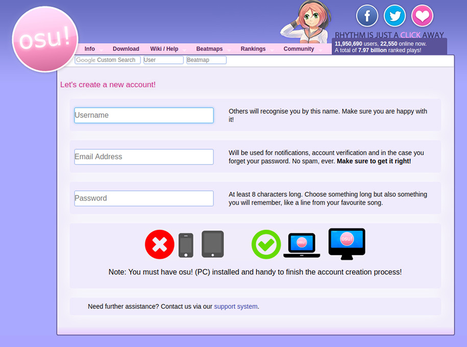

# Rejestracja

*Uwaga: Posiadanie więcej niż jednego konta jest niezgodne z [zasadami gry](/wiki/Rules)!*

1.  Po [zainstalowaniu](/wiki/installation) i otworzeniu gry, osu! poprosi cię o zalogowanie się lub utworzenie nowego konta. Naciśnij `Stwórz konto` i pozostaw osu! otwarte. Po naciśnięciu przycisku zostanie otworzona strona z [formularzem rejestracyjnym](https://osu.ppy.sh/p/register).

2.  Wypełnij wszystkie pola w formularzu.
    -   W polu `Username` wprowadź nazwę użytkownika. Może składać się z maksymalnie 15 znaków, z których dozwolone są tylko: znaki alfanumeryczne (`a-z`, `A-Z`, `0-9`), znaki podkreślenia (`_`), nawiasy kwadratowe, (`[` i `]`), myślniki (`-`) oraz spacje (` `).
    -   W polu `Email Address` wprowadź swój aktywny adres e-mail. Będzie on potrzebny do zresetowania hasła i uzyskiwania kodów weryfikacyjnych, dlatego upewnij się, że będziesz mieć do niego stały dostęp. Nie używaj tymczasowego adresu e-mail.
    -   W polu `Password` wprowadź hasło o długości co najmniej 8 znaków.
3.  Po wykonaniu tych czynności naciśnij przycisk `Continue` i wróć do okna z osu!.
4.  Zaloguj się, by zakończyć proces rejestracji.

## Co dalej?

Nie zapomnij o dokładnym przeczytaniu [zasad](/wiki/Rules)!

Teraz możesz rozpocząć swoją przgodę z osu!. Możesz zacząć [dodawać beatmapy](/wiki/installation#adding-beatmapsets), [stworzyć własną skórkę](/wiki/skinning) czy [stworzyć własną beatmapę](/wiki/beatmapping). Nie zapomnij o [przywitaniu się](/community/forums/8)!

Jeżeli potrzebujesz pomocy, możesz zadać pytanie na kanale `#help`. Aby się tam dostać, otwórz czat (naciśnij `F8` lub `F9`), a następnie wpisz `/join help`. Możesz także utworzyć nowy wątek w [podforum przeznaczonym dla pomocy](/community/forums/5).
