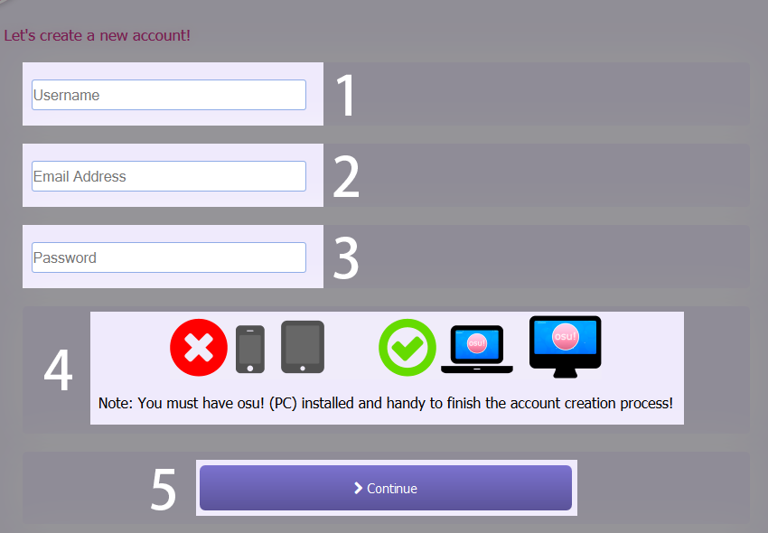

## Como crio uma conta?

**Por favor, tenha em mente que ter mais de uma conta infringe as nossas [regras do osu!](/wiki/Rules/). Siga os passos abaixo para criar sua conta no osu!.**

1. Na [página principal](https://osu.ppy.sh/home), Clique em ``Sou novo!`` para iniciar o processo de registro

2. Complete todos os campos do formulário e pressione ``Continuar``

    1. Nome de usuário         
        1. Máximo de 15 caracteres                                                                                                                    
        2. Caracteres alfanuméricos (``a-z``, ``A-Z``, ``0-9``), traço inferior (``_``), colchetes, (``[`` and ``]``) e hífens (``-``) são os únicos caracteres permitidos.
     2. Endereço de e-mail                                                                                                                                                     
     3. Senha                                                                                                                                                            
     4. Observação                                                                                                                                                               
     5. Botão de continuar                                                                                                                                                    
3. Entre no osu! e o processo será finalizado. Você conseguiu registrar sua conta no osu! com sucesso!

| Nome           | Imagem                           | Descrição                                                                                                                                                                                                                                                                                              |
|:---------------:|:-------------------------------:|:--------------------------------------------------------------------------------------------------------------------------------------------------------------------------------------------------------------------------------------------------------------------------------------------------------:|
| Executável do osu! |  | Esse executável (que deve ser chamado de osu!.exe) abrirá o jogo. Caso atualizações sejam necessárias, elas serão aplicadas automaticamente. _Observação: Você não precisa executar o oso como administrador. Caso seja necessário, o jogo fará isso sozinho._                                               |
| Painel de opções   |          | Se essa é sua primeira vez iniciando o osu!, você verá isto no canto esquerdo da sua tela. Insira seu nome de usuário e senha nos respectivos campos para fazer log in.                                                                                       |
| Painel de usuário     |  | Assim que seu nome de usuário e senha forem inseridos, você verá seu painel de usuário no canto esquerdo superior de sua tela. Você conseguiu entrar no osu! e está pronto para jogar! Você também poderá ver seu painel de usuário no canto inferior na tela de seleção de músicas, à esquerda da ``Seleção de Opções``.|

## E agora?

Você está pronto para começar sua aventura ritmica, então prossiga para a página de [boas-vindas](/wiki/Welcome/) e comece a jogar! Não esqueça de ler as [regras](/wiki/Rules/) cuidadosamente!

Caso precise de assistência dentro do jogo, pergunte no canal #help, ou faça uma postagem nos fóruns.

Para entrar no ``#help``, pressione F8 e então digite ``/join #help``. Você também pode clicar no botão amarelo  na direita dos seus canais abertos, descendo um pouco até achar o ``#help``, e então clicar para se juntar ao canal.

Em caso de duvidas, sempre lembre que:
> o ritmo está a um clique de distância!
