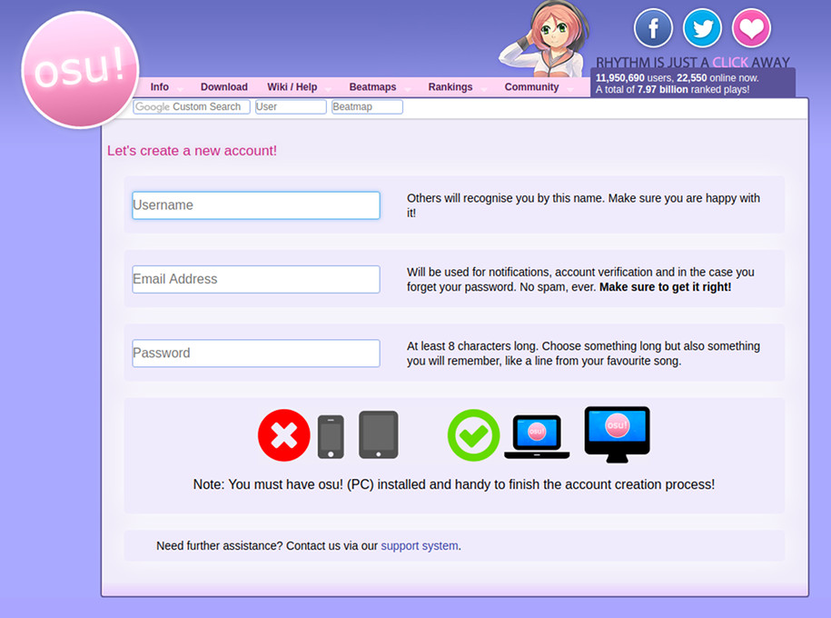

# Registrácia

*Varovanie: Tvorba viac ako jedného účtu je proti [osu! pravidlám](/wiki/Rules)!*

1. Po [nainštalovaní](/wiki/Client/Installation) osu! a jeho spustení, osu! ťa vyzve aby si sa prihlásil alebo zaregistroval. Kedže si tu pretože si chceš vytvoriť účet, klikni na `Vytvoriť účet` / `Create an account` a nechaj osu! otvorené. osu! by malo otvoriť stránku [Vytvoriť účet](https://osu.ppy.sh/p/register).

   

2. Vyplň všetky údaje vo fomulári

   - Pre pole použivateľské meno, si vyber meno, ktoré môže mať maximálne 15 znakov; z čoho sa môžu používať len abeceda a čísla (`a-z`, `A-Z`, `0-9`), podčiarknutie (`_`), hranaté zátvorky, (`[` and `]`), odrážky (`-`), a medzery (` `).
   - Pre pole email, použi tvoj email. Tvoj email bude použitý na resetovanie hesla a pre posielanie overovacích kódov keď to bude potrebné, takže nepoužívaj jednorázové emaily.
   - Pre pole heslo použi heslo, ktoré má aspoň 8 znakov.

3. Keď si toto urobil, stlač `Continue` a vráť sa späť do osu!

4. Prihlás sa pre dokončenie registrácie.

## Čo ďalej?

Nezabudni si pozorne prečítať [pravidlá](/wiki/Rules)!

Keď si s tým hotový, si pripravený začať tvoje rytmové dobrodružstvo! Môžeš si [pridať beatmapy](/wiki/Client/Installation#pridávanie-beatmapov) na hranie, [vytvoriť si skin](/wiki/Skinning), alebo [vytvoriť beatmapu](/wiki/Beatmapping). Tiež sa môžeš zastaviť a povedať "Čau" v [Predstavovaciom subfóre](https://osu.ppy.sh/community/forums/8).

Pokiaľ potrebuješ pomoc v hre, môžeš sa spýtať v  `#help` [IRC](/wiki/Community/Internet_Relay_Chat) (Internet Relay Čete) kanáli otvorením četovej konzoly (stlač `F8` alebo `F9` v hre) a napíš `/join help`. Tiež sa môžeš opýtať v [subfóre Pomoc](https://osu.ppy.sh/community/forums/5).
