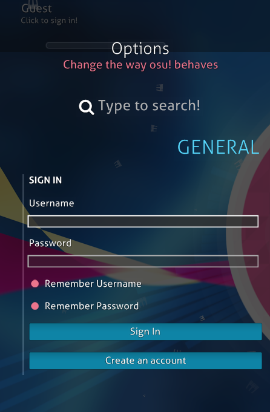
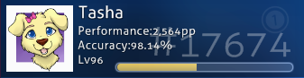

## ลงทะเบียนยังไง

**คำเตือน: การสมัครมากกว่าหนึ่งไอดีจะเป็นการละเมิด[กฎของ osu!](/wiki/Rules)**

1. ที่[หน้าหลัก](https://osu.ppy.sh/home) คลิก "<b>I'm new!</b>" เพื่อเริ่มลงทะเบียน 

2. กรอกทุกอย่างลงแบบฟอร์มแล้วกด "Continue" 

| <b><s>ตำนาน</s>อธิบายแต่ละช่อง</b>                                                                                                                    |
|-------------------------------------------------------------------------------------------------------------------------------------------------------|
| **1. Username**                                                                                                                                       |
| a. ยาวได้ 15 ตัวอักษร                                                                                                                                 |
| b. ตัวพิมพ์ใหญ่-พิมพ์เล็ก ตัวเลข ("a-z, A-Z, 0-9") อันเอร์สกอร์ ("\_") วงเล็บเหลี่ยม ("\[" and "\]") และยัติภังค์ ("-") เท่านั้นที่ใส่ในชื่อของคุณได้ |
| **2. E-mail Address**                                                                                                                                 |
| **3. Password**                                                                                                                                       |
| **4. Note**                                                                                                                                           |
| **5. ปุ่ม Continue**                                                                                                                                  |

3. ลอคอินเข้าเกม และทุกอย่างก็เรียบร้อยแล้ว เย่ :D 

| <s>ตำนาน</s>อธิบายแต่ละช่อง |
|-----------------------------|
| **1. osu! executable**      |
| **2. Panel การตั้งค่า**     |
| **3. User panel**           |

## แล้วไงต่อ

คุณพร้อมผจญภัยในโลกของดนตรีแล้ว ดังนั้นรีบไปยังหน้า [welcome](/wiki/Welcome) แล้วเริ่มเล่นเลย และอย่าลืมอ่าน[กฎ](/wiki/Rules)ด้วยล่ะ

ถ้ามีปัญหาอะไรในเกม ก็ลองถามคนในห้อง \#help (ภาษาอังกฤษ) ไม่ก็ห้อง \#thai (**ภาษาไทย** มีแต่คนไทย) หรือโพสต์ลงกระทู้ (ภาษาอังกฤษ)
