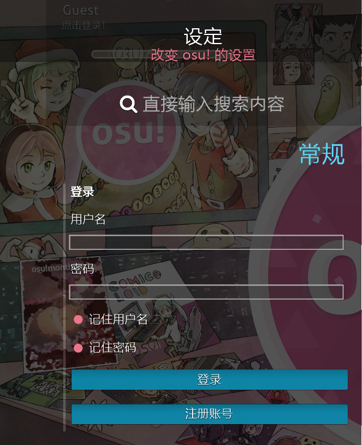

# 注册

## 我该怎么注册？

**请注意，无论何时，如果你有多个 osu! 帐号是违反 [osu! 规则](/wiki/Rules/) 的。你可以按照下面的步骤设置你的 osu! 帐户。**

1. 在 [官网的主页面](https://osu.ppy.sh) 上，点击 ``I'm new!`` 按钮以开始注册。

2. 填写表中的所有字段并按下 ``Continue`` 按钮。

    1. 用户名          
        - 最多 15 个字符。
        - 只支持字母、数字（``a-z``， ``A-Z``， ``0-9``）、下划线（``_``）、方括号、（``[`` 和 ``]``）、破折号（``-``）与空格（`` ``）。
    2. 电子邮箱地址
    3. 密码
    4. 提示
    5. ``Continue`` 按钮
3. 登录进 osu! 后，整个注册过程便完成了。你已经成功地注册了你的 osu! 账号！

## 登录 osu!

### osu! 可执行文件

  

osu! 的可执行文件（应该被命名为 `osu!.exe` ）将运行游戏本身。如果游戏需要更新，那么它将会自动执行更新操作。 _注意：你不需要以管理员身份运行 osu! 。如果游戏需要权限，那么它将会自己提示。_

### 选项面板

*参见：[选项](/wiki/Options)*

如果这是你第一次运行 osu! ，你将会在游戏界面的左边看见这个登录面板。输入你的用户名和密码并进行登录。

### 用户面板

如果你正确的输入了你的用户名与密码并登录进了 osu! ，则将会在游戏界面的左上角看到你的用户面板。你还可以在歌曲选择界面的底部看到你的用户面板，它位于 ``Beatmap Options`` 按钮的右边。

下一步该做什么？
------------

你已经准备好开始你的节奏冒险之旅了，继续阅读 [欢迎](/wiki/Welcome/) 页面以开始游玩！不要忘记仔细地阅读 [规则](/wiki/Rules/) ！

如果你需要游戏中的帮助，在 IRC 上对 `#help` 频道进行提问或者在论坛中发帖报告你的问题。

如果需要加入 ``#help`` 频道，按下 `F8` 键并且输入 ``/join #help`` 。你也可以点击已打开频道右边的黄色按钮，向下滚动找到 ``#help`` 频道，点击它即可加入频道。

当有疑问时，永远记住：
> 节奏跃然指上！
