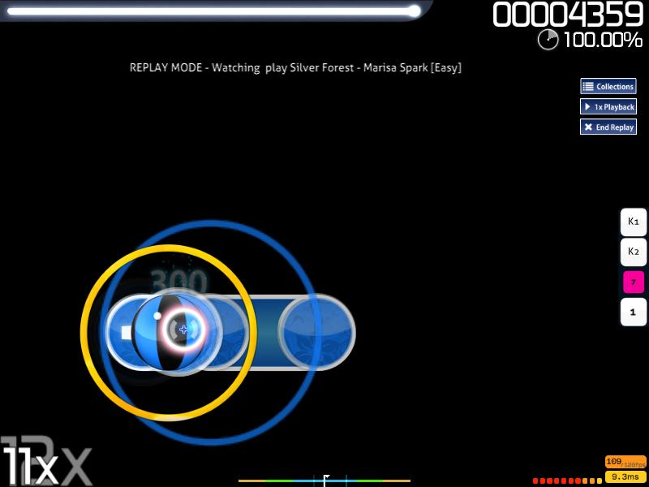
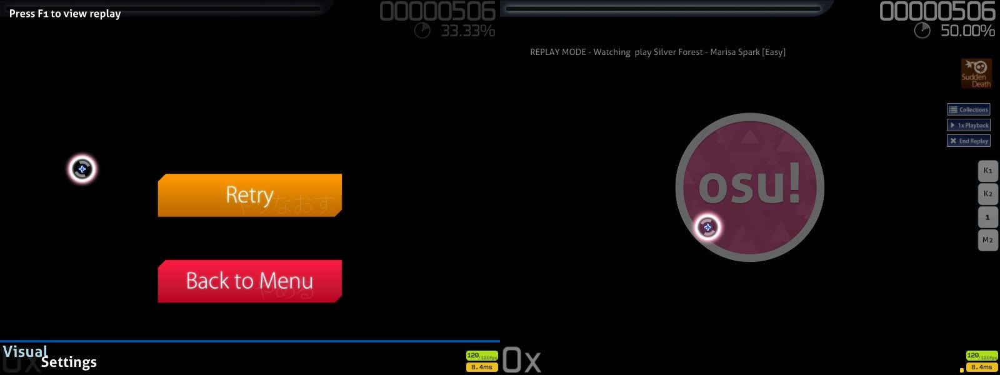
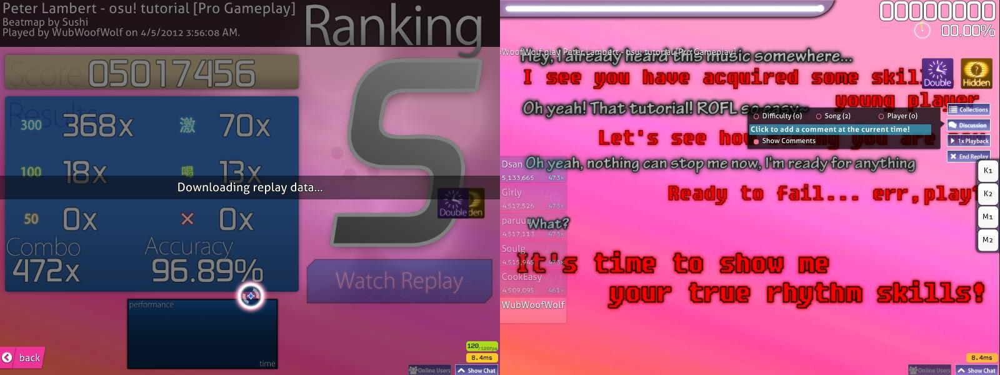
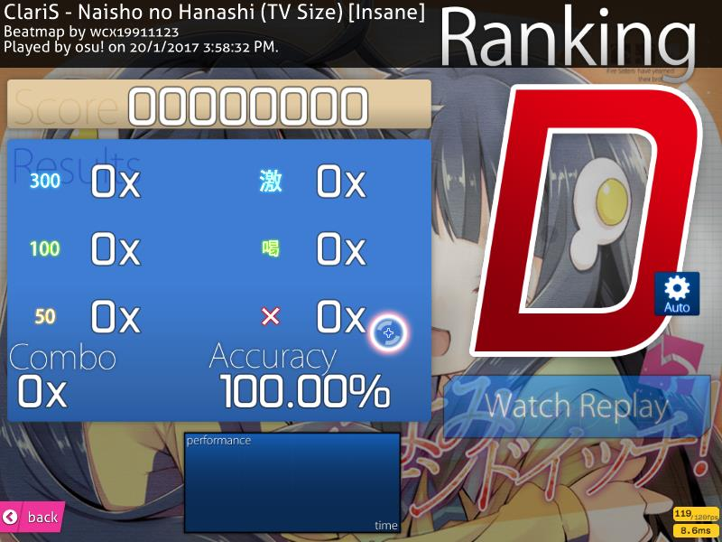

<!-- TODO: this is riddled with old client information and probably needs to be rewritten anyway. -->

# Replay

Un replay est une rediffusion ou émulation directe d'une partie, qu'elle soit réalisée par un joueur ou par le mod [Auto](/wiki/Game_modifier/Auto).
Tant que le fichier local avec pour extension `.osr` est disponible avec la bonne beatmap et la bonne difficulté ou un replay téléchargé via le `classement local` , un replay complet peut être construit par osu! pour être regardé.

## Options du replay


Pour relancer un replay depuis le début, restez appuyé sur un des boutons par défaut (`` ` ``/`~`) (qui peuvent être changés dans les [options dans la catégorie Clavier](/wiki/Options#keyboard); avec le bouton `Configuer les touches` -> **Quick Retry (hold briefly)**) ou en appuyant sur `Ctrl`+`R` pendant un court instant.
L'écran devrait s'assombrir et un son sera joué lorsque le replay sera relancé.
Relâcher trop tôt ne permettra pas au relancement de s'effectuer.

Il est toujours possible d'accéder à la [console de chat](/wiki/Chat_Console) (`F8`)/[console de chat étendue](/wiki/Chat_Console#extended-chat-console) (`F9`) .
Appuyez sur `Tab` pour cacher/afficher le classement actuellement sélectionné.
Appuyez sur `H` pour cacher/afficher les éléments du replays exceptés les mods utilisés et la notice **UNRANKED** si la partie est jouée par [Auto](/wiki/Game_modifier/Auto).

Un replay avec le mod [Cinema](/wiki/Game_modifier/Cinema) va :

- Cacher toutes les options de replay,
- Désactiver l'accès au gameplay,
- Cacher tous les éléments de skin du mode de jeu,
- Activer l'image/la vidéo d'arrière-plan,
- Uniquement jouer le storyboard en cas de réussite de la map,
- Mettre l'assombrissement de l'arrière-plan à 0%
- Jouer les hitsounds au même moment où les notes de la map seraient complétées.

Pour passer l'intro/l'outro de la map, appuyez sur la barre `Espace` .

### Discussion

Le bouton **n'apparaît que si un compte osu! connecté à Bancho et si la beatmap peut être trouvée dans la liste des beatmaps (Classée ou autre)**.
Les commentaires laissés par la communauté sur la difficulté/beatmap défileront de droite à gauche.

Cliquez sur le bouton `Discussion` pour afficher les options disponibles.


Cliquez sur `Show Comments` pour activer les commentaires qui défileront concernant la diffficulté/beatmap au milieu de l'écran.
Un compte osu! avec un tag osu!supporter actif ajoutera un bouton `Colour` qui permet de mettre de la couleur au nouveau commentaire.


Cliquez sur `Click to add a comment at the current time!` pour commenter sur la difficulté/beatmap actuelle.
Le replay sera mis sur pause, assombri, avec le osu!logo en avant-plan au centre jusqu'à ce que le commentaire soit terminé (appuyez sur `Entrée`) ou annulé (appuyez sur `Echap`).


Pour filtrer les commentaires par difficulté, activez `Difficulty (#)`.
Pour filtrer les commentaires par toutes les difficultés, activez `Song (#)`.
Quand vous regardez un replay du `classement global`, activez `Player (#)` pour montrer les commentaires du joueur lui-même.

Les commentaires du créateur de la map seront placés au-dessus des commentaires défilants avec un texte bleu-clair et une animation jump-out/jump-in.
Selon la résolution du jeu, ces commentaires peuvent être cachés par la notice **UNRANKED** quand vous regardez un replay d'Auto.
Pour retirer la notice **UNRANKED** , regardez un replay du `classement global`, ou un replay local du `classement local` sans le mod Auto.

Quand vous regardez un replay du classement global, les commentaires du joueur seront montrés en bas de l'écran et ne seront montrés que sur ce replay uniquement.

Par défaut, sans tag osu!supporter actif, la couleur des commentaires dépendra de la couleur affichée dans le chat (les comptes sans osu!supporter sont affichés en blanc) mis à part le créateur de la map (commentaires en bleu-clair).

### Collections

Ajouter cette difficulté/beatmap aux *Collections*.
Ce bouton ouvrira le menu des collections pour ajouter la difficulté/beatmap en cours dans une des collections ou renommer les collections.

Le replay ne se mettra pas en pause et continuera en arrière-plan sur ce menu.

### Playback Speed

Ajustez la vitesse de lecture du replay.

La vitesse de replay change entre `1x`, `2x`, `0.5x`.
La vitesse de départ est toujours à `1x`.

La touche raccourci est la touche `F`.

### End Replay

Cliquez sur ce bouton pour quitter le replay.

Vous pouvez également utiliser la touche `Echap` pour quitter.

## Types de Replays

*Toute la documentation concernant le format `.osr` : [.osr (format de fichier)](/wiki/osu!_File_Formats/Osr_(file_format))*

Pour exporter un replay, appuyez sur `F2` sur l'écran de résultat.
Un replay exporté aura un fichier sous le format `.osr` avec un nom écrit comme ceci:-

```
Format : {Nom local du joueur} - {Artiste} - {Titre} [{Difficulté}] ({AAAA-MM-JJ}) {GameMode}
Exemple: dummytest1 - Loituma - Ievan Polkka [SPINNER-MADNESS] (2013-08-12) OsuMania
```

Notez que le fichier du replay ne fonctionnera **pas** si la **difficulté/beatmap liée au fichier du replay n'est pas présente**.
Une fois ouvert, les données du replay exporté seront ajoutées au classement local et le fichier sera copié dans le backend (plus précisément dans le dossier caché `Data/r`).
Le fichier du replay ne sera pas perdu une fois ouvert.

Un texte blanc défilant de droite à gauche sera affiché au dessus des commentaires et en dessous de la notice **UNRANKED** quand vous regardez un replay.

Le format de ce texte est montré ci-dessous:-

```
Format : REPLAY MODE - Watching {Nom du joueur} play {Nom de l'artiste} - {Nom de la beatmap} [{Difficulté}]
Exemple: REPLAY MODE - Watching osu! play Peter Lambert - osu!tutorial [Gameplay Basics]
```

### Local (Solo)



*Un replay local typique*

Une partie locale en *Solo*.
Tant que la difficulté a été réussie, un replay sera généré et pourra être exporté dans le dossier `Replays`.

Dans le backend, une paire de fichiers sera créé dans le dossier caché, `Data/r`: `.osr` (osu! replay ; le fichier du replay), et `.osg` (précision et combo en temps réel : utilisé uniquement pour les replays en mode spectateur) avec le même nom de fichier crypté.
Il est hautement recommandé  de ne **pas renommer le fichier crypté**, et d'utiliser la touche `F2` à la place.

Supprimer le fichier `.osg` n'a pas d'effet (il s'agit du reste du replay en spectateur, peut être supprimé en toute sécurité).
Supprimer le fichier `.osr` vous fera perdre le replay *pour toujours* (puisque les données du replay ne sont plus présentes).
Par ailleurs, supprimer le fichier `scores.db` (qui contient tous les scores locaux et les chemins vers les replays cryptés) *vous fera perdre tous les scores locaux et replays (non exportés) pour toujours*.

Pour établir un pseudo sur des scores locaux en étant hors ligne (compte *Guest*), défilez vers le bas sur l'écran de résultat pour accéder aux résultats en ligne après avoir terminé une map et tapez le pseudo choisi dans la boîte de texte *Guest player name*.
Sur cet écran, une alternative à la touche d'exportation `F2` est d'activer le bouton `Save replay to Replays folder` situé sur la partie supérieure droite.

Retournez sur l'écran de sélection de beatmap et les changements seront mis à jour pour ce replay (Si aucun nom n'a été donné, il sera vide).

### Échec



Pour accéder à cet écran, échouez la map en vidant entière la barre de vie, ou ne dépassez pas + de 50% de la barre de vie avant la fin de map en osu!taiko.

Sur l'écran de Game Over, appuyez sur la touche `F1` pour voir un replay de la partie perdue et appuyez sur la touche `F2` pour en sauvegarder un replay.
Le replay se termine lorsque l'écran s'assombrit, avec le osu!logo au milieu et remplace l'écran de Game Over.

Puisqu'il ne s'agit pas d'un écran de Game Over normal, le seul moyen de retourner sur l'écran de sélection de beatmap est d'appuyer sur la touche `Echap`.
Essayer de redémarrer la beatmap pour le relancer directement dans cet état n'est pas possible.

Cela ne fonctionne actuellement qu'en `Solo`.

Voir un replay échoué ne fonctionnera pas avec les mods [No Fail(NF)](/wiki/Game_modifier/No_Fail), [Relax(RL)](/wiki/Game_modifier/Relax) et [Auto Pilot(AP)](/wiki/Game_modifier/Autopilot) puisqu'il est impossible d'échouer.
Utiliser le mod [Perfect(PF)](/wiki/Game_modifier/Perfect) effectuera automatiquement un Quick Retry au lieu d'afficher un écran de Game Over.

**Ce type de replay ne sera pas sauvegardé dans le classement local**.
Il vous faut obligatoirement l'exporter avec la touche `F2` sur l'écran de Game Over, il sera autrement *perdu pour toujours*

S'il y avait une chaîne de retry, celle-ci sera perdue une fois avoir lancé le replay échoué.

### Multi


Les replays du mode Multi ne peuvent être exportés que s'ils ont été joués en Head-to-Head ou en Team Vs.
Les replays échoués en Multi ne seront **pas sauvegardés dans le classement local**, vous pouvez tout de même exporter un replay échoué en Multi sur l'écran de résultat en appuyant sur la touche `F2`.
Les éléments du Multi ne seront pas sauvegardés comme montré sur la comparaison affichée ci-dessus (Voir la deuxième image).

### Spectateur

Le mode spectateur requiert l'accès à la [Console de chat étendue](/wiki/Chat_Console#extended-chat-console), vous devez donc vous connecter à Bancho pour observer un joueur.

Après cela, appuyez sur `F9` pour accéder à la console de chat étendue et choisissez le jouer à observer.
Vous devez avoir la **même** difficulté/beatmap que le joueur, ou un message d'avertissement apparaîtra en bas à droite pour vous dire que vous ne possédez pas la beatmap, vous ne pouvez donc pas obtenir le replay.
Si vous possédez la beatmap, le replay en mode spectateur commencera.

Un onglet `#spectator` s'ouvrira dans la console de chat (pour les spectateurs et le joueur) pour discuter de la partie du joueur.

Notez que selon les paramètres du joueur, la liste des pseudos des spectateurs apparaîtra en blanc sur l'écran du joueur dans le coin supérieur gauche.

Format et exemple de la liste que le joueur voit :

```
Format :
Spectateurs (#):
{Pseudos des joueurs}

Exemple :
Spectateurs (2):
deadbeat
ztrot
```

Un texte blanc défilant de droite à gauche apparaîtra lorsque vous regardez un replay en mode spectateur.

Format et exemple de ce texte :

```
Format : SPECTATOR MODE - Watching {Pseudo du joueur} play {Nom de l'artiste} - {Beatmap} [{Difficulté}]
Example: SPECTATOR MODE - Watching peppy play Peter Lambert - osu!tutorial [Gameplay Basics]
```

### Auto


Le mod Auto joue la difficulté/beatmap pour vous.
Le replay ne se sauvegarde pas localement mais **peut être exporté**.
Ouvrir le fichier exporté d'une partie d'Auto mettra la partie dans le classement local avec un mod "Auto".

Notez que la notice **UNRANKED** ne peut pas être retirée.

#### Partie fictive

Lorsque vous cliquez sur le bouton `Voir le skin dans une partie fictive` dans le `Options`, Auto va **aléatoirement choisir une difficulté/beatmap** du **mode de jeu actuellement sélectionné (choisi sur l'écran de sélection de beatmap en Solo)** à un **moment aléatoire de la map**.

Dans ce type de replay, Auto manquera de temps en temps les objets pour montrer à quoi ressemble les éléments du skin.
Si le bouton `Voir le skin dans une partie fictive` n'a pas été appuyé de nouveau pour changer de difficulté/beatmap et que celle-ci se termine, l'écran de résultats de cette partie apparaîtra et la `barre d'Options` sera fermée.

La  `barre d'options` ne peut pas être rouverte pendant la partie ou sur l'écran de résultats.

### Serveur



Les replays sur le serveur sont réservés au top 1000 sur le `Classement global` d'une difficulté/beatmap.
Ce replay sera sauvegardé sur le serveur.
Il peut être exporté, téléchargé ou regardé directement.

Lorsque vous regardez un replay depuis le classement (un replay exporté ne compte pas), le nombre affiché à côté dans le compteur de "Replays regardés par les autres" sur le profil du joueur du replay augmentera de 1.
Si un nouveau score s'ajoute au top 1000 du classement, le replay de l'ancien détenteur du 1000ème score sera supprimé.

Pour regarder un replay du serveur, vous devez avoir un compte connecté à Bancho.
Sur l'écran de sélection de beatmap en `Solo`, allez sur le `Classement général` et cliquez sur le joueur que vous souhaitez pour regarder le replay.
Cliquez sur le bouton `Watch replay` et osu! téléchargera le replay sur le serveur comme montré sur l'image de gauche.
Le replay ne se joue qu'une fois et sera supprimé une fois quitté/fini.

## Le saviez-vous ?

### General

La vitesse du replay n'affecte pas la vitesse de défilement de la notice `REPLAY MODE/SPECTATOR MODE`.

Les pauses ne seront pas comptées dans les données du replay; seul le gameplay actif est compté.

### Spectateur

Bien qu'il soit possible d'exporter un replay en mode spectateur, c'est une mauvaise idée si vous avez rejoint en plein milieu ou à la fin de la map.

Le replay exporté ne contiendra que les données de la partie à partir du moment où vous avez commencé à observer le joueur.

Durant tout le temps avant cela, le curseur sera placé à l'endroit où il était au moment où vous avez rejoint et ne bougera pas. La barre de vie se videra comme d'habitude (selon le mode de jeu) 

Une barre de vie vide ne fera pas échouer le replay.

Notez que le replay d'une partie échouée en spectateur ne peut pas être exportée.

### Multi


Notez que c'est actuellement le seul moyen de sauvegarder un replay qui continuera de jouer même si la barre de vie se vide au moins une fois.

### Partie fictive



Selon le moment aléatoire choisi par Auto, il pourrait commencer à la fin de la map sans le moindre objet, menant directement à l'écran de résultat avec 0 score, 0 combo, un rang D et 100% de précision
Lorsque vous regardez le replay, la perte de vie fonctionnera comme d'habitude, pas de mouvement de curseur, et pas de miss (d'où les 100% de précision) jusqu'au moment où Auto a commencé à jouer après avoir appuyé sur `Voir le skin dans une partie fictive`, les objets commenceront à fonctionner

Puisqu'Auto ne peut pas échouer une map, une barre de vie vide n'a pas d'effet sur Auto.
Cependant, en osu!taiko, si Auto ne peut pas remplir la barre de vie à au moins 50%, le replay sera bloqué dans une *boucle infinie*.
