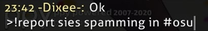
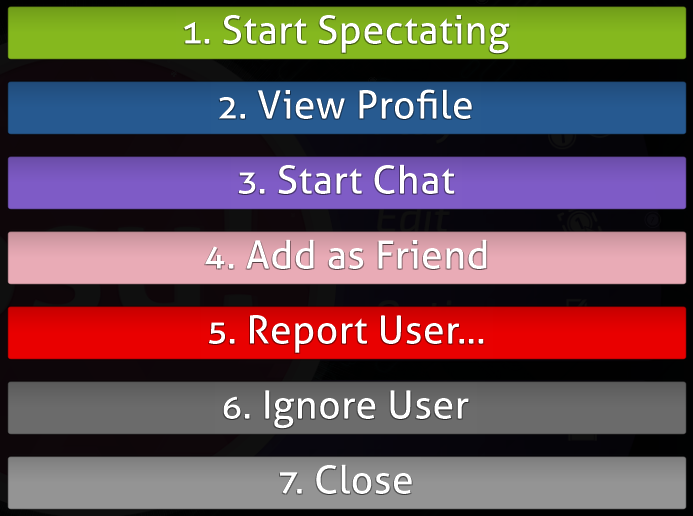
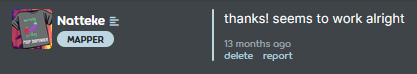
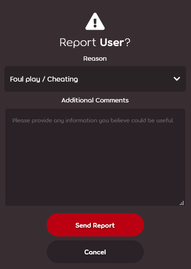
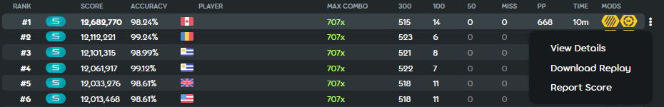

<!-- TODO: FAQ-like things and overall it doesn't do a good job of describing the report system first. -->

# Reporting bad behaviour

## What is the report system?

The report system is an important feature to inform the moderators about misbehaving user(s) and for them to take action.

It is not only limited to in-game chat but also in other places such as the forum and wiki itself.

## How to report someone

### Using the !report command in-game

Usage: `!report username [reason]`

Parameters in **[** and **]** are optional.

If the user has a space in their username, it must be replaced with an underscore `_` because the osu! in-game chat is based on [Internet Relay Chat](/wiki/Internet_Relay_Chat).

`!report This User Name is spamming in #osu` turns to `!report This_User_Name is spamming in #osu`

Reports are not case-sensitive so it is okay to use lowercase letters like `this_user_name`.

### Using the user report button in-game

Reporting the user by this way only needs a type of reason and the custom text, unlike the `!report` command.

### Using the report button on the website

This also works the same as the `Report User` button in-game.

Remember to add details to your report at the comments.

### Using the Report Score button at the record of an user's score

This should only be used when reporting cheating users.

## Examples what to report

### Spamming or flooding in chat

Using a broken keyboard is not an excuse!

### Excessive use of uppercase letters

This has been considered as shouting and annoying.

### Posting of inappropriate contents such as pornographic materials (questionable/suggestive are considerable)

Moderators immediately silence for this, removing the content without warning.

### Posting of unwanted contents such as advertisements, screamers and referrals

Take note that spamming streaming links are applied to this rule.

### Offensive behaviour towards other players

Telling people to kill themselves is not a good thing to say.

and many more...

## Frequently Asked Questions

### Can other players see my reports in chat?

Obviously, no, unless you typed the command prefix wrong.
Make sure you type an exclamation mark first!

### I accidentally reported a user! Will I get an punishment?

No.
Do not worry about it, false reports will be ignored unless abused.

### Can I report multiple times?

Reporting once is enough but you can report several times during the day.
Two or three times should be fine.

You can either report the channel saying that multiple players are causing problems, or just a list of each person.

### Does this include private messages?

Most issues on private messages such as insults are not handled.

A user can use the ignore system to avoid any messages getting received from the ignored user including channels.

**Note:** Ignore list will reset when you close the game client.

### Can I report a moderator?

Yes, you can, but it is recommended to report them to the [account support team](/wiki/People/The_Team/Account_support_team#support@ppy.sh) instead.
