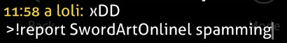
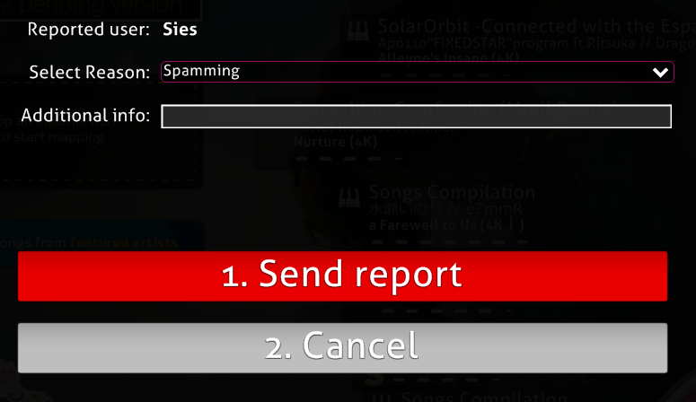
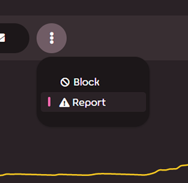
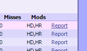

# Melaporkan Perilaku Buruk

## Apa itu sistem lapor?

Sistem lapor adalah sebuah fitur penting untuk memberitahu moderator mengenai pemain yang berperilaku buruk untuk diberikan hukuman yang sesuai.

Tidak hanya sebatas obrolan dalam game tetapi juga di tempat lain seperti forum dan wiki itu sendiri.

## Bagaimana cara melaporkan seseorang

### Menggunakan perintah !report dalam game

Penggunaan: `!report user_name [alasan]`

Parameter **[** dan **]** merupakan opsional.

Jika pengguna memiliki spasi di nama pengguna mereka, spasi harus diganti dengan garis bawah_ karena obrolan dalam game osu! didasarkan pada [IRC](/wiki/Internet_Relay_Chat "Internet Relay Chat (IRC)").

`!report This User Name is spamming in #osu` menjadi `!report This_User_Name is spamming in #osu`

Sistem lapor tidak peka huruf besar-kecil sehingga tidak masalah untuk menggunakan huruf kecil seperti `this_user_name`.

### Menggunakan tombol laporkan pengguna dalam game

Melaporkan pengguna dengan cara ini hanya membutuhkan alasan dan beberapa teks tambahan, tidak seperti perintah `!report`.

### Menggunakan tombol report user di profil pengguna

Fitur ini juga berfungsi sama dengan tombol laporkan pengguna dalam game.

Jangan lupa menambahkan detil laporan anda di komentar.

### Menggunakan tautan report pada catatan pengguna di daftar beatmap

Penggunaan fitur ini hanya boleh digunakan ketika melaporkan pengguna yang melakukan kecurangan.

## Contoh apa yang harus dilaporkan

### Melakukan spam atau flood dalam obrolan.

Menggunakan keyboard yang rusak bukan sebuah alasan!

### Penggunaan huruf besar secara berlebihan.

Hal ini dianggap sebagai kesan berteriak dan menjengkelkan.

### Posting konten yang tidak pantas seperti konten pornografi (konten yang dipertanyakan/sugestif juga dipertimbangkan).

Moderator akan segera melakukan silence untuk hal ini, menghapus konten tanpa peringatan.

### Posting konten yang tidak diinginkan seperti iklan, screamers, dan tautan referral.

Catatan bahwa tautan untuk streaming juga berlaku dalam aturan ini.

### Berperilaku tidak pantas terhadap pemain lain

Memberitahu orang untuk bunuh diri bukanlah hal yang baik untuk dikatakan.

dan masih banyak lagi...

## Pertanyaan yang Sering Ditanyakan

### Dapatkah pemain lain melihat laporan saya dalam obrolan?

Tentunya, tidak, kecuali anda mengetikkan awalan perintah dengan salah.
Pastikan anda mengetik tanda seru terlebih dahulu!

### Saya tidak sengaja melaporkan pengguna! Apakah saya akan mendapatkan sanksi?

Tidak.
Jangan khawatir, laporan palsu akan diabaikan kecuali disalahgunakan.

### Dapatkah saya melaporkan beberapa kali?

Pelaporan sekali saja sudah cukup, tetapi anda dapat melaporkan beberapa kali di siang hari.
Dua atau tiga kali seharusnya baik-baik saja.

Anda dapat melaporkan channel yang mengatakan bahwa beberapa pemain menyebabkan masalah, atau buat daftar untuk setiap orang.

### Apakah ini termasuk pesan pribadi?

Sebagian besar masalah pada pesan pribadi seperti penghinaan tidak akan ditangani.

Pengguna dapat menggunakan sistem abaikan untuk menghindari pesan apa pun yang dikirim oleh pengguna termasuk pesan di channel.

**Catatan:** Daftar Abaikan akan disetel ulang saat anda menutup klien game.

### Dapatkah saya melaporkan moderator?

 Bisa, tetapi disarankan untuk menghubungi osu! support (support@ppy.sh) untuk keluhan staf.
