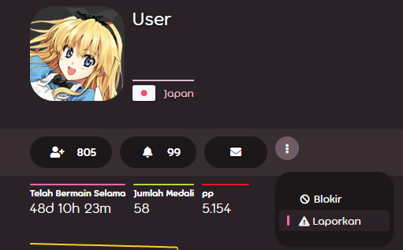
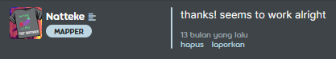
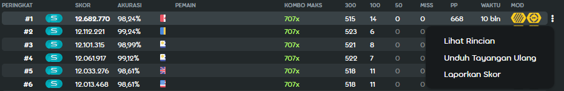

<!-- TODO: FAQ-like things and overall it doesn't do a good job of describing the report system first. -->

# Melaporkan perilaku buruk

## Apa itu sistem lapor?

Sistem lapor adalah sebuah fitur penting untuk memberitahu moderator mengenai pemain yang berperilaku buruk untuk diberikan hukuman yang sepadan.

Tidak hanya sebatas obrolan di dalam gim saja tetapi juga di tempat lain seperti forum dan wiki itu sendiri.

## Bagaimana cara melaporkan seseorang

### Menggunakan perintah !report di dalam gim

Penggunaan: `!report username [alasan]`

Parameter **[** dan **]** merupakan opsional.

Jika pengguna memiliki spasi di nama pengguna mereka, spasi harus diganti dengan garis bawah `_` karena obrolan di dalam gim osu! didasarkan pada [Internet Relay Chat](/wiki/Internet_Relay_Chat).

`!report Nama Pengguna Ini is spamming in #osu` menjadi `!report Nama_Pengguna_Ini is spamming in #osu`

Sistem lapor tidak memengaruhi penggunaan huruf besar ataupun kecil sehingga tidak masalah untuk menggunakan huruf kecil seperti `nama_pengguna_ini`.

### Menggunakan tombol Laporkan Pengguna di dalam gim

Melaporkan pengguna dengan cara ini hanya membutuhkan alasan dan beberapa teks tambahan, tidak seperti perintah `!report`.

### Menggunakan tombol Laporkan di situs web

Fitur ini mempunyai fungsi yang sama seperti yang terdapat pada tombol `Laporkan Pengguna` di dalam gim.

Jangan lupa menambahkan detail laporan Anda pada kolom komentar.

### Menggunakan tombol Laporkan Skor pada catatan skor pengguna

Penggunaan fitur ini hanya boleh digunakan ketika melaporkan pengguna yang melakukan kecurangan.

## Contoh apa yang harus dilaporkan

### Melakukan spam atau flood dalam obrolan

Menggunakan keyboard yang rusak bukan sebuah alasan!

### Penggunaan huruf besar secara berlebihan

Hal ini dianggap sebagai kesan berteriak dan menjengkelkan.

### Posting konten yang tidak pantas seperti konten pornografi (konten yang dipertanyakan/sugestif juga dipertimbangkan)

Moderator akan segera melakukan silence untuk hal ini, menghapus konten tanpa peringatan.

### Posting konten yang tidak diinginkan seperti tautan iklan, screamer, dan referral

Harap dicatat bahwa tautan untuk streaming juga berlaku dalam aturan ini.

### Berperilaku tidak pantas terhadap pemain lain

Memberitahu orang untuk bunuh diri bukanlah hal yang baik untuk dikatakan.

dan masih banyak lagi...

## Pertanyaan yang Sering Ditanyakan

### Dapatkah pemain lain melihat laporan saya dalam obrolan?

Tentunya, tidak, kecuali Anda mengetikkan awalan perintah dengan salah.
Pastikan Anda mengetik tanda seru terlebih dahulu!

### Saya tidak sengaja melaporkan pengguna! Apakah saya akan mendapatkan sanksi?

Tidak.
Jangan khawatir, laporan palsu akan diabaikan kecuali disalahgunakan.

### Dapatkah saya melaporkan beberapa kali?

Melaporkan sekali saja sudah cukup, tetapi Anda dapat melaporkan beberapa kali di siang hari.
Dua atau tiga kali seharusnya baik-baik saja.

Anda dapat melaporkan channel yang mengatakan bahwa beberapa pemain menyebabkan masalah, atau buat daftar untuk setiap orang.

### Apakah ini termasuk pesan pribadi?

Sebagian besar masalah pada pesan pribadi seperti penghinaan tidak akan ditangani.

Pengguna dapat menggunakan sistem abaikan untuk menghindari pesan apa pun yang dikirim oleh pengguna termasuk pesan di channel.

**Catatan:** Daftar pengabaian akan disetel ulang saat Anda menutup klien gim.

### Dapatkah saya melaporkan moderator?

Ya, Anda bisa, tetapi disarankan untuk melaporkan mereka kepada [account support team](/wiki/People/The_Team/Account_support_team#support@ppy.sh).
