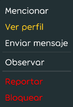
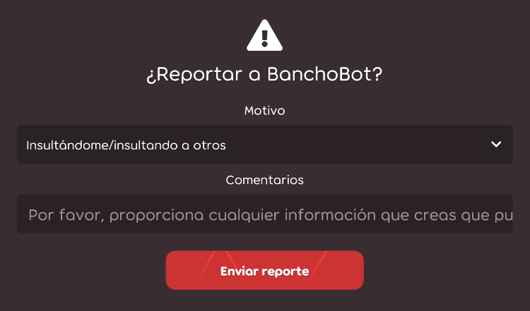
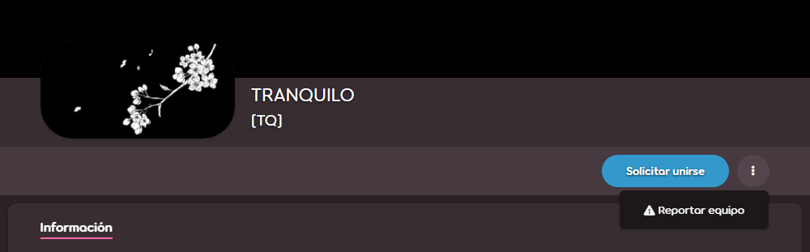

# Reportar mala conducta

osu! tiene un equipo de moderadores, el [Global Moderation Team](/wiki/People/Global_Moderation_Team) (GMT), que se encarga de mantener el juego y sus ecosistemas limpios y seguros. Si observas una conducta que infringe las reglas o es contenido inapropiado, repórtala utilizando uno de los métodos que se describen a continuación. Alternativamente, puedes comunicarte directamente con cualquiera de los moderadores en línea si tu reporte no se manejó correctamente dentro de un período de tiempo razonable, hazlo solo como último recurso.

Los reportes accidentales se ignoran. Los usuarios que envían deliberadamente reportes no válidos pueden correr el riesgo de ser [silenciados](/wiki/Silence).

## Casos especiales

| Naturaleza de la infracción | Punto de contacto |
| :-- | :-- |
| Estafas/phishing en mensajes privados | Enviar un reporte regular |
| Otros mensajes privados ofensivos/inapropiados | **Ninguno**: [ignorar al usuario](/wiki/Client/Interface/Chat_console#lista-de-comandos) en su lugar. Para un efecto permanente, usa la lista de ignorados en el juego ubicada en las [opciones](/wiki/Client/Options) o bloquéalos en el sitio web con el botón ubicado en su perfil de usuario. |
| Contenido inapropiado en beatmaps [clasificados](/wiki/Beatmap/Category#ranked)[^invalid-reports] | [Nomination Assessment Team](/wiki/People/Nomination_Assessment_Team) (NAT) o [GMT](/wiki/People/Global_Moderation_Team), a través del sitio web de [gestión de los BN](https://bn.mappersguild.com/reports) |
| Conducta inapropiada por parte de un [Beatmap Nominator](/wiki/People/Beatmap_Nominators) | [NAT](/wiki/People/Nomination_Assessment_Team), a través del sitio web de [gestión de los BN](https://bn.mappersguild.com/reports) |
| Conducta inapropiada de un miembro del [NAT](/wiki/People/Nomination_Assessment_Team) o del [GMT](/wiki/People/Global_Moderation_Team) | [Equipo de soporte de cuentas](/wiki/People/Account_support_team) en [support@ppy.sh](mailto:support@ppy.sh) |
| Plagio de un beatmap u otra infracción de los derechos de autor | Envía un reclamo DMCA a [copyright@ppy.sh](mailto:copyright@ppy.sh) según la [política de derechos de autor de osu!](/wiki/Legal/Copyright) |
| Abuso sexual o mala conducta extrema | Consulta [Reportar abuso](/wiki/Reporting_bad_behaviour/Abuse) |

Para cualquier otra cosa, sigue las instrucciones que aparecen a continuación.

## Chat en el juego

### El comando !report

*Precaución: ¡Reportar a un usuario mediante el comando `!report` en osu!(lazer) o a través del sitio web hará que el reporte sea **visible para todos!** En su lugar, [usa el menú de reportes](#lazer-reports) o repórtalos a través de [su página de perfil](#perfil-de-usuario).*


La mala conducta en el chat es la infracción más común. Para reportarla, usa [el comando `!report`](https://osu.ppy.sh/community/forums/topics/34843), preferiblemente en el canal donde se produjo la infracción o infracciones. No te preocupes: si tu mensaje empieza con `!report` y un espacio, y lo has enviado desde osu!(stable) o un cliente IRC, **solo lo podrán ver los moderadores** y nadie más en el chat. También puedes usar la función de reportes a través de la [superposición del juego](#stable-reports) en el cliente de osu!(stable) como se muestra a continuación si todavía estás preocupado.

La sintaxis del comando tiene dos formas:

```
!report nombre de usuario
!report nombre de usuario (a continuación se incluye una descripción de formato libre)
```

Si hay espacios en el nombre de usuario, reemplázalos con guiones bajos:

```
!report bad_user spam en #osu
```

Si tu reporte se realizó correctamente, BanchoBot te enviará un mensaje privado indicando que se ha alertado a los moderadores.

Ten en cuenta que el comando `!report` **no funciona** en osu!(lazer). Reporta a los usuarios a través del [menú de reportes](#lazer-reports) en su lugar.

### Superposición del juego en osu!(stable) {id=stable-reports}


Esta opción funciona si el usuario infractor está a la vista:

1. Haz clic en su nombre de usuario y presiona el botón rojo titulado `Reportar usuario`.
2. Selecciona la categoría y agrega detalles (opcional).

### Menú de reportes del chat en osu!(lazer) {id=lazer-reports}





1. Haz clic con el botón derecho del ratón o mantén pulsado el nombre del usuario infractor y pulsa el botón rojo que dice `Reportar`.
2. Selecciona la categoría y agrega detalles (opcional, a menos que la categoría seleccionada sea `Otro (indicar abajo)`).

## Sitio web

### Perfil de usuario


1. Pulsa el botón con tres puntos verticales y selecciona `Reportar`.
2. Selecciona la categoría y agrega detalles.

### Foros


1. Pase el cursor sobre la publicación.
2. En una fila de botones que aparece en la esquina superior derecha de la publicación, haz clic en el botón con una señal de advertencia.
3. Selecciona la categoría y agrega detalles.

### Sección de comentarios


1. Debajo del comentario, haz clic en el enlace `reportar`.
2. Selecciona la categoría y agrega detalles.

### Beatmaps


1. Pulsa el botón con tres puntos verticales y selecciona `Reportar`.
2. Selecciona la categoría y agrega detalles.

### Discusión de beatmaps


1. Debajo de la publicación de discusión, haz clic en el enlace `reportar`.
2. Selecciona la categoría y agrega detalles.

### Listado de puntuaciones


#### Perfil del usuario

1. Desplázate a la sección `Rangos` o `Histórico` para las jugadas recientes y localiza la puntuación.
2. En el lado derecho de la puntuación, presiona el botón con tres puntos verticales y selecciona `Reportar puntuación`.
3. Selecciona la categoría y agrega detalles.

#### Listado de puntuaciones de los beatmaps


1. Pasa el cursor sobre la puntuación.
2. En el lado derecho de la puntuación, presiona el botón con tres puntos verticales y selecciona `Reportar puntuación`.
3. Selecciona la categoría y agrega detalles.

### Equipos



1. Presiona el botón con tres puntos verticales y selecciona `Reportar equipo`.
2. Selecciona la categoría y agrega detalles.

## Referencias

[^invalid-reports]: A diferencia de otras categorías de beatmaps, los beatmaps clasificados no se pueden reportar a través del sitio web.
