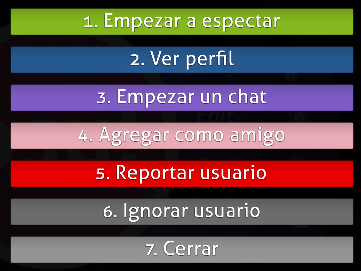
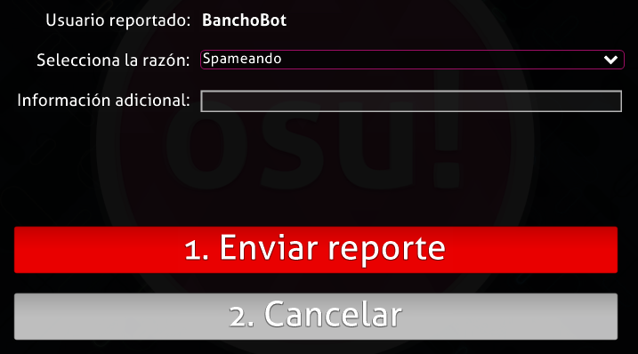
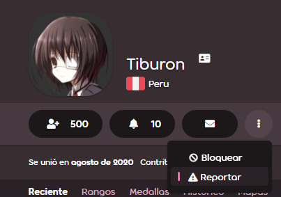
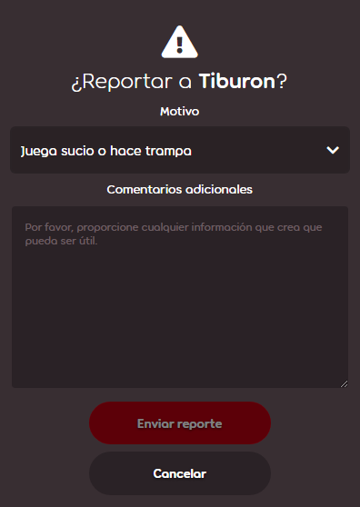
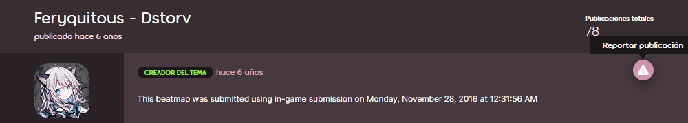
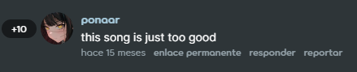
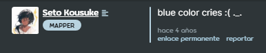
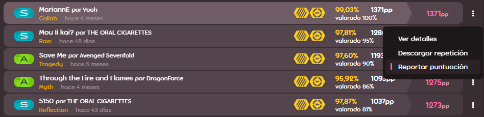
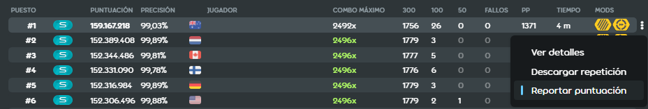

# Reportar mala conducta

osu! tiene [un equipo de moderadores](/wiki/People/Global_Moderation_Team) que se adhieren a mantener el juego y su ecosistema limpios y seguros. Si observas una conducta que infringe las reglas o es contenido inapropiado, repórtala utilizando uno de los métodos que se describen a continuación. Alternativamente, puedes comunicarte directamente con cualquiera de los moderadores en línea si tu reporte no se manejó correctamente dentro de un período de tiempo razonable, hazlo solo como último recurso.

Los reportes accidentales se ignoran. Los usuarios que envían deliberadamente reportes no válidos pueden correr el riesgo de ser [silenciados](/wiki/Silence).

## Casos especiales

| Naturaleza de la infracción | Punto de contacto |
| :-- | :-- |
| Estafas/Phishing en mensajes privados | Enviar un reporte regular |
| Otros mensajes privados ofensivos/inapropiados | **Ninguno**: [ignorar al usuario](/wiki/Client/Interface/Chat_console#lista-de-comandos) en su lugar. Para un efecto permanente, usa la lista de ignorados en el juego ubicada en las [opciones](/wiki/Client/Options) o bloquéalos en el sitio web con el botón ubicado en su perfil de usuario. |
| Conducta inapropiada de un [BN](/wiki/People/Beatmap_Nominators) | [NAT](/wiki/People/Nomination_Assessment_Team), a través del sitio web de [gestión del NAT/BN](https://bn.mappersguild.com/reports) |
| Conducta inapropiada de un miembro del [NAT](/wiki/People/Nomination_Assessment_Team) o del [GMT](/wiki/People/Global_Moderation_Team) | [Equipo de soporte de cuentas](/wiki/People/Account_support_team) en [support@ppy.sh](mailto:support@ppy.sh) |
| Abuso sexual o mala conducta extrema | Consulte [Reportar abuso](/wiki/Reporting_bad_behaviour/Abuse) |

Para cualquier otra cosa, véase las instrucciones a continuación.

## Chat en el juego

### El comando !report


La mala conducta en el chat es la infracción más común. Para reportarla, usa el comando [`!report`](https://osu.ppy.sh/community/forums/topics/34843), preferiblemente en el canal donde ocurrió la infracción. No te sientas estresado: si tu mensaje empieza con `!report` y un espacio, **solo será visible para los moderadores** y nadie más en el chat. También puedes usar la función de reporte a través de la [superposición en el juego](#superposición-en-el-juego) como se muestra a continuación si todavía estás preocupado.

La sintaxis del comando tiene dos formas:

```
!report nombre de usuario
!report nombre de usuario (a continuación se incluye una descripción de formato libre)
```

Si hay espacios en el nombre de usuario, reemplázalos con guiones bajos:

```
!report bad_user spam en #osu
```

### Superposición en el juego





Esta opción funciona si el usuario infractor está a la vista:

1. Haz clic en su nombre de usuario y presiona el botón rojo titulado `Reportar usuario`
2. Selecciona la categoría y agrega detalles (opcional).

## Sitio web

### Perfil de usuario





1. Pulsa el botón con tres puntos verticales y selecciona `Reportar`.
2. Selecciona la categoría y agrega detalles (opcional).

### Foro



1. Pase el cursor sobre la publicación.
2. En una fila de botones que aparece en la esquina superior derecha de la publicación, haz clic en el botón con una señal de advertencia.
3. Selecciona la categoría y agrega detalles (opcional).

### Sección de comentarios



1. Debajo del comentario, haz clic en el enlace `reportar`.
2. Selecciona la categoría y agrega detalles (opcional).

### Beatmap


1. Pulsa el botón con tres puntos verticales y selecciona `Reportar`.
2. Selecciona la categoría y agrega detalles (opcional).

### Discusión de beatmaps



1. Debajo de la publicación de discusión, haz clic en el enlace `reportar`.
2. Selecciona la categoría y agrega detalles (opcional).

### Listado de puntuaciones



#### Perfil del usuario

1. Desplázate a la sección `Rangos` o `Histórico` para las jugadas recientes y localiza la puntuación.
2. En el lado derecho de la puntuación, presiona el botón con tres puntos verticales y selecciona `Reportar puntuación`.
3. Selecciona la categoría y agrega detalles (opcional).

#### Listado de puntuaciones de beatmaps



1. Pasa el cursor sobre la puntuación.
2. En el lado derecho de la puntuación, presiona el botón con tres puntos verticales y selecciona `Reportar puntuación`.
3. Selecciona la categoría y agrega detalles (opcional).
