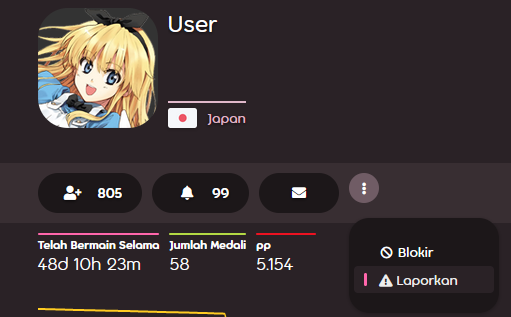
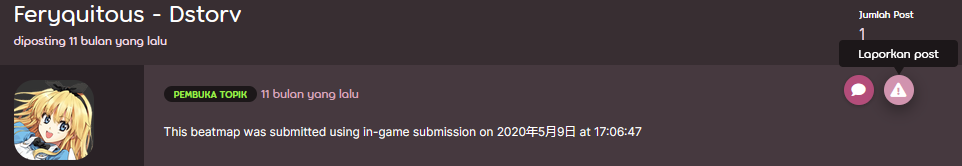
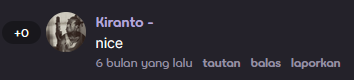
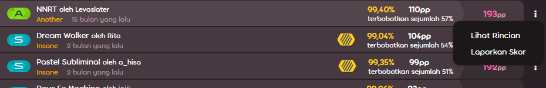
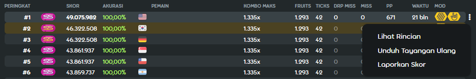

# Melaporkan perilaku buruk

osu! memiliki [sebuah tim moderator](/wiki/People/The_Team/Global_Moderation_Team) yang setia untuk menjaga permainan dan ekosistemnya bersih dan aman. Jika kamu melihat perilaku yang melanggar peraturan atau konten tidak pantas, laporkan hal tersebut dengan menggunakan metode yang dijelaskan di bawah ini. Sebagai alternatif, kamu dapat mengontak moderator yang sedang *online* secara langsung jika laporanmu tidak ditangani secara benar dalam jangka waktu yang wajar sebagai cara terakhir.

Laporan yang tidak disengaja akan diabaikan. Pengguna yang sengaja mengirim laporan palsu akan terancam [di-silence](/wiki/Silence).

## Kasus-kasus spesial

| Sifat pelanggaran | Kontak yang dapat diakses |
| :-- | :-- |
| Pesan pribadi yang tidak pantas | **Tidak ada**: [abaikan pengguna](/wiki/Chat_Console#commands-list) saja. Untuk efek permanen, gunakan daftar abaikan pengguna dalam permainan yang ada pada [options](/wiki/Options). |
| Pelanggaran terkait modding dan/atau mapping | NAT, melalui website [NAT/BN Management](https://bn.mappersguild.com/reports) |
| Pelanggaran tingkah laku dari seorang member [NAT](/wiki/People/The_Team/Nomination_Assessment_Team) atau [GMT](/wiki/People/The_Team/Global_Moderation_Team) | [Account support team](/wiki/People/The_Team/Account_support_team) di [support@ppy.sh](mailto:support@ppy.sh) |
| Pelecehan seksual atau kelakuan buruk ekstrim | Rujuk ke artikel [Melaporkan Penyalahgunaan](/wiki/Reporting_Bad_Behaviour/Abuse) |

Untuk kasus selain yang di atas, lihat instruksi di bawah ini.

## Chat dalam permainan

### Perintah !report


Perilaku buruk dalam chat adalah pelanggaran yang paling sering terjadi. Untuk melaporkan itu, gunakan perintah [`!report`](https://osu.ppy.sh/community/forums/topics/34843) di kanal di mana pelanggaran terjadi. Jangan merasa stres: jika pesan kamu dimulai dengan `!report` dan diikuti oleh spasi, **pesan tersebut hanya terlihat oleh moderator** dan tidak ada yang lain dalam chat. Kamu dapat menggunakan fungsi laporkan melalui [menu dalam permainan](#Menu-dalam-permainan) seperti yang digambarkan di bawah ini jika kamu masih khawatir.

Sintaks perintah memiliki dua bentuk:

```
!report nama_pengguna
!report nama_pengguna (deskripsi mengapa pengguna tersebut melanggar)
```

Jika ada spasi pada nama pengguna, gantikan spasi dengan garis bawah (_):

```
!report pengguna_melanggar melakukan spam di #osu
```

### Menu dalam permainan


Opsi ini dapat bekerja jika pengguna yang melanggar sedang *online*:

1. Klik nama pengguna dan tekan tombol merah yang bertuliskan `Laporkan Pengguna...`
2. Pilih kategori dan tambahkan detil (opsional).

## Website

### Halaman profil




1. Tekan tombol yang berbentuk tiga dot vertikal dan pilih `Laporkan`.
2. Pilih kategori dan tambahkan detil (opsional).

### Forum



1. Layangkan kursor ke atas post.
2. Pada sebuah barisan tombol yang muncul pada pojok kanan atas post, klik tombol dengan simbol peringatan.
3. Pilih kategori dan tambahkan detil (opsional).

### Bagian komentar



1. Di bawah komen, klik link `laporkan`.
2. Pilih kategori dan tambahkan detil (opsional).

### Beatmap


1. Tekan tombol yang berbentuk tiga dot vertikal dan pilih `Laporkan`.
2. Pilih kategori dan tambahkan detil (opsional).

### Diskusi beatmap


1. Di bawah laman diskusi, klik link `laporkan`.
2. Pilih kategori dan tambahkan detil (opsional).

### Daftar skor



#### Profil pengguna

1. Navigasikan ke bagian `Peringkat` atau `Historis` untuk permainan yang terbaru dan temukan skornya.
2. Pada bagian kanan atas skor, tekan tombol yang berbentuk tiga dot vertikal dan pilih  `Laporkan Skor`.
3. Pilih kategori dan tambahkan detil (opsional).

#### Daftar skor beatmap



1. Layangkan kursor ke atas skor.
2. Pada bagian kanan atas skor, tekan tombol yang berbentuk tiga dot vertikal dan pilih  `Laporkan Skor`.
3. Pilih kategori dan tambahkan detil (opsional).
