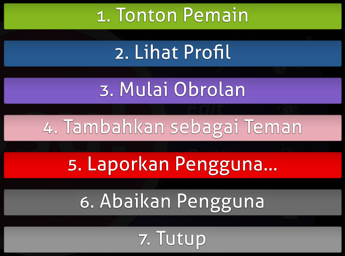
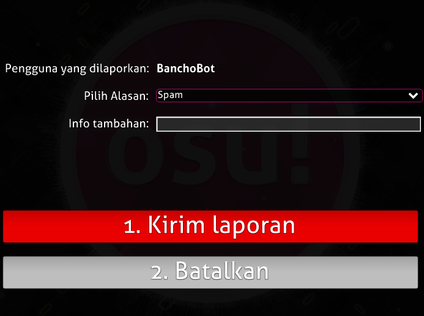
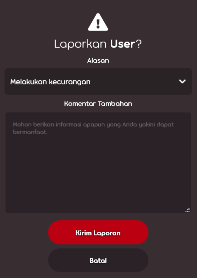

# Melaporkan perbuatan yang tidak pantas

osu! memiliki [tim moderator](/wiki/People/Global_Moderation_Team) yang berkomitmen untuk menjaga permainan osu! beserta ekosistemnya bersih dan aman. Apabila kamu menemukan perbuatan yang melanggar peraturan atau konten yang tidak pantas, mohon laporkan hasil temuanmu melalui salah satu jalur laporan yang tertera di bawah ini. Di samping itu, kamu juga dapat menghubungi salah satu moderator yang sedang *online* secara langsung apabila laporanmu belum ditanggapi setelah sekian waktu — mohon lakukan hal ini hanya sebagai upaya terakhirmu.

Laporan yang terkirim secara tidak sengaja akan diabaikan. Meskipun demikian, para pengguna yang sengaja mengirimkan laporan palsu akan terancam untuk di-*[silence](/wiki/Silence)*.

## Kasus khusus

| Jenis pelanggaran | Pihak yang dapat dihubungi |
| :-- | :-- |
| Upaya *scamming*/*phishing* di dalam pesan pribadi | Kirimkan laporan seperti biasa |
| Pesan pribadi lainnya yang bersifat menghina/tidak pantas | **Tidak ada**: mohon [abaikan pengguna tersebut](/wiki/Client/Interface/Chat_console#daftar-perintah). Untuk mengabaikan seseorang secara permanen, gunakan fitur daftar pengabaian (*ignore list*) yang terdapat pada menu [Options](/wiki/Client/Options) atau blokir pengguna tersebut melalui tombol yang ada pada halaman profil mereka. |
| Perilaku yang tidak pantas dari anggota [BN](/wiki/People/Beatmap_Nominators) | [NAT](/wiki/People/Nomination_Assessment_Team), melalui situs web [NAT/BN Management](https://bn.mappersguild.com/reports) |
| Perilaku yang tidak pantas dari anggota [NAT](/wiki/People/Nomination_Assessment_Team) atau [GMT](/wiki/People/Global_Moderation_Team) | [Tim dukungan akun](/wiki/People/Account_support_team) melalui [support@ppy.sh](mailto:support@ppy.sh) |
| Pelecehan seksual atau perilaku menyimpang yang berlebihan | Mohon rujuk artikel [Melaporkan tindak pelecehan](/wiki/Reporting_bad_behaviour/Abuse) |

Untuk segala bentuk pelanggaran lainnya, mohon ikuti instruksi di bawah ini.

## In-game chat

### Perintah !report


Obrolan yang tidak pantas merupakan bentuk pelanggaran yang paling umum dijumpai. Untuk melaporkan hal ini, gunakan perintah [`!report`](https://osu.ppy.sh/community/forums/topics/34843) pada kanal di mana pelanggaran tersebut terjadi. Jangan takut untuk melapor: apabila pesan yang kamu tulis dimulai dengan `!report` dan diikuti oleh spasi, **pesanmu hanya akan dapat dilihat oleh para moderator** tanpa diketahui oleh para pengguna lainnya. Di samping itu, kamu juga dapat melapor melalui [menu dalam permainan](#menu-dalam-permainan) sebagaimana yang dijelaskan di bawah apabila kamu masih merasa ragu.

Perintah ini dapat dikirim baik dengan mau pun tanpa penjelasan lebih lanjut sebagai berikut:

```
!report nama_pengguna
!report nama_pengguna (penjelasan singkat mengenai pelanggaran yang terjadi)
```

Apabila nama pengguna yang ingin kamu laporkan mengandung spasi, ganti semua spasi yang ada dengan garis bawah (\_) seperti pada contoh berikut:

```
!report pengguna_yang_melanggar mengirimkan spam di #osu
```

### Menu dalam permainan





Metode ini dapat digunakan apabila pengguna yang melanggar berada tepat di hadapanmu sebagai berikut:

1. Klik nama pengguna yang ingin kamu laporkan dan pilih tombol merah yang bertuliskan `Laporkan Pengguna...`
2. Pilih kategori pelanggaran yang sesuai dan sertakan rincian seputar pelanggaran yang bersangkutan (opsional).

## Situs web

### Halaman profil




1. Klik tombol titik tiga yang tertera di bawah nama pengguna dan pilih `Laporkan`.
2. Pilih kategori pelanggaran yang sesuai dan sertakan rincian seputar pelanggaran yang bersangkutan (opsional).

### Forum


1. Layangkan kursormu ke atas postingan forum yang ingin kamu laporkan.
2. Dari deretan tombol yang muncul pada pojok kanan atas postingan forum, klik tombol yang berlambang simbol peringatan.
3. Pilih kategori pelanggaran yang sesuai dan sertakan rincian seputar pelanggaran yang bersangkutan (opsional).

### Kolom komentar


1. Klik tautan `laporkan` yang tertera di bawah komentar.
2. Pilih kategori pelanggaran yang sesuai dan sertakan rincian seputar pelanggaran yang bersangkutan (opsional).

### Beatmap


1. Klik tombol titik tiga yang tertera pada halaman beatmap dan pilih `Laporkan`.
2. Pilih kategori pelanggaran yang sesuai dan sertakan rincian seputar pelanggaran yang bersangkutan (opsional).

### Topik diskusi beatmap


1. Klik tautan `laporkan` yang tertera di bawah topik diskusi beatmap.
2. Pilih kategori pelanggaran yang sesuai dan sertakan rincian seputar pelanggaran yang bersangkutan (opsional).

### Skor


#### Halaman profil pengguna

1. Tuju bagian `Peringkat` atau `Historis` dan layangkan kursormu ke atas skor yang kamu anggap tidak wajar.
2. Pada ujung kanan bilah skor, klik tombol titik tiga yang muncul dan pilih `Laporkan Skor`.
3. Pilih kategori pelanggaran yang sesuai dan sertakan rincian seputar pelanggaran yang bersangkutan (opsional).

#### Papan peringkat beatmap


1. Layangkan kursormu ke atas skor yang kamu anggap tidak wajar.
2. Pada ujung kanan bilah skor, klik tombol titik tiga yang muncul dan pilih `Laporkan Skor`.
3. Pilih kategori pelanggaran yang sesuai dan sertakan rincian seputar pelanggaran yang bersangkutan (opsional).
