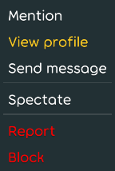
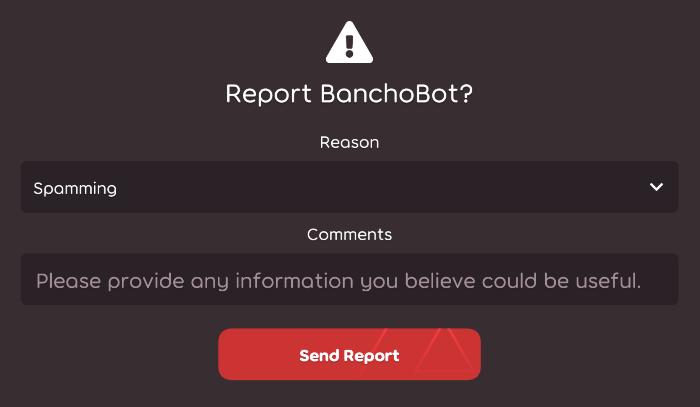
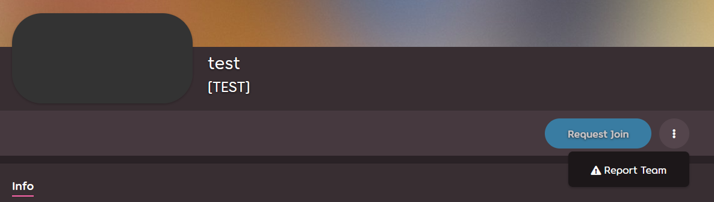

# Báo cáo hành vi xấu

osu! có một nhóm để điều hành, được gọi là [Nhóm điều hành toàn cầu (GMT)](/wiki/People/Global_Moderation_Team), hoạt động nhằm giữ cho trò chơi và toàn bộ cộng đồng luôn an toàn và sạch sẽ. Nếu bạn nhận thấy một hành vi phá luật hoặc nội dung không phù hợp, hãy báo cáo bằng cách sử dụng một trong những phương pháp được mô tả bên dưới. Ngoài ra, bạn có thể liên lạc trực tiếp đến bất kỳ người điều hành nào đang hoạt động nếu báo cáo của bạn không được xử lý đúng cách trong một khoản thời gian phù hợp - chỉ nên làm như một biện pháp cuối. 

Báo cáo ngẫu nhiên đều bị bỏ qua. Người dùng cố ý gửi báo cáo không hợp lệ có nguy cơ bị [im lặng](/wiki/Silence)

## Các trường hợp đặc biệt

| Tính chất vi phạm | điểm liên hệ |
| :-- | :-- |
| Lừa đảo/Tấn công mạo danh trong tin nhắn riêng | Gửi báo cáo thường xuyên |
| Tin nhắn riêng tư xúc phạm/không phù hợp khác | **Không**: Thay vào đó hãy [phớt lờ người dùng](/wiki/Client/Interface/Chat_console#danh-sách-lệnh). Để có hiệu lực vĩnh viễn, sử dụng danh sách phớt lờ trong trò chơi được tìm thấy trong [Cài đặt](/wiki/Client/Options) hoặc chặn họ trên website với nút được tìm thấy trên hồ sơ người dùng của họ |
| Nội dung không phù hợp trong beatmap [xếp hạng](/wiki/Beatmap/Category#ranked)[^invalid-reports] | [Đội ngũ Đánh giá Đề cử](/wiki/People/Nomination_Assessment_Team) (NAT) hoặc [GMT](/wiki/People/Global_Moderation_Team), thông qua website [quản lý BN](https://bn.mappersguild.com/reports) |
| Hành vi không phù hợp từ một [Đề cử Beatmap](/wiki/People/Beatmap_Nominators) | [NAT](/wiki/People/Nomination_Assessment_Team), thông qua website [quản lý BN](https://bn.mappersguild.com/reports) |
| Hành vi không phù hợp từ một thành viên của [NAT](/wiki/People/Nomination_Assessment_Team) hoặc [GMT](/wiki/People/Global_Moderation_Team) | [Nhóm hỗ trợ tài khoản](/wiki/People/Account_support_team) tại [support@ppy.sh](mailto:support@ppy.sh) |
| Lạm dụng tình dục hoặc hành vi sai trái nghiêm trọng | Tham thảo [Báo cáo lạm dụng](/wiki/Reporting_bad_behaviour/Abuse) |

Đối với điều gì khác, xem các hướng dẫn bên dưới.

## Trò chuyện trong trò chơi

### Lệnh !report 

*Thận trọng: việc báo cáo người dùng qua lệnh `!report` trong osu!(lazer) hoặc thông qua website sẽ làm cho báo cáo trở thành **được mọi người nhìn thấy** thay vào đó, vui lòng [sử dụng báo cáo trên menu](#lazer-reports) hoặc báo cáo họ thông qua [trang hồ sơ của họ](#trang-hồ-sơ).*


Hành vi sai trái trong trò chuyện là vi phạm phổ biến nhất. Để báo cáo điều này, sử dụng [lệnh !report](https://osu.ppy.sh/community/forums/topics/34843) được ưu tiên trong kênh nơi đã xảy ra vi phạm. Đừng cảm thấy căng thẳng: nếu tin nhắn của bạn bắt đầu với !report với một dấu cách, và bạn gửi nó từ osu!(stable) hoặc từ một client IRC, **Nó chỉ được nhìn thấy bởi các người điều hành** và không một ai khác trong trò chuyện. Bạn cũng có thể sử dụng chức năng báo cáo qua [giao diện trong trò chơi](#stable-reports) của client osu!(stable) như phần được miêu tả bên dưới nếu bạn vẫn cảm thấy lo ngại.

Cú pháp của lệnh có 2 dạng:

```
!report tên_người_dùng
!report tên_người_dùng (mô tả hành vi)
``` 

Nếu trong tên người dùng có khoảng trắng, thay thế chúng thành dấu gạch dưới:

```
!report người_đó spamming in #osu
```

Nếu báo cáo của bạn được gửi thành công, Bancho sẽ hiển thị cho bạn một tin nhắn riêng tư cho biết rằng người điều hành đã nhận được cảnh báo.

Lưu ý rằng lệnh `!report` không hoạt động trong osu!(lazer), vui lòng báo cáo người dùng qua [menu cáo báo](#lazer-reports) thay vào đó.   

### Trong giao diện trò chơi osu!(stable) {id=stable-reports}


Đây là cách cài đặt hoạt động nếu người dùng gây khó chịu đang hoạt động trong trò chơi:

1. Nhấn vào tên người dùng của họ và ấn vào nút có tiêu đề `Report User...` màu đỏ 
2. Lựa chọn danh mục lý do và thêm chi tiết (không bắt buộc)  

### Giao diện báo cáo trò chuyện trong osu!(lazer) {id=lazer-reports}





1. Nhấn chuột phải hoặc giữ lâu tên của người dùng gây khó chịu và nhấn vào nút đỏ tiêu đề `Báo cáo` 
2. Lựa chọn danh mục lý do và thêm chi tiết ( Trừ khi tùy chọn danh mục lý do được chọn là `Khác(nhập bên dưới)`

## Website

### Trang hồ sơ


1. Ấn vào nút hình ba chấm dọc và chọn `Report`
2. Chọn danh mục lý do và thêm chi tiết (không bắt buộc)

### Diễn đàn {id=forum}


1. Di chuyển con trỏ chuột đến bài đăng.
2. Trong các nút bấm xuất hiện ở góc trên bên phải của bài đăng, nhấn vào nút biển cảnh báo.
3. Lựa chọn danh mục lý do và thêm chi tiết. 

### Phần bình luận 


1. Bên dưới bình luận, nhấn vào liên kết `Báo cáo` 
2. Lựa chọn danh mục lý do và thêm chi tiết 

### Beatmap 


1. Nhấn vào nút ba chấm dọc và chọn `Báo cáo` 
2. Lựa chọn danh mục báo cáo và thêm chi tiết 

### Thảo luận beatmap 


1. Bên dưới bài đăng thảo luận, nhấn vào nút `Báo cáo`. 
2. Lựa chọn danh mục lý do và thêm chi tiết.

### Danh sách điểm số


#### Hồ sơ người dùng 

1. Cuộn xuống đến phần `Xếp hạng`, hoặc `Lịch sử` với các lần chơi gần đây và tìm kiếm điểm số.
2. Tại bên phải của điểm số, nhấn vào nút với ba dấu chấm dọc và chọn `Báo cáo điểm số`. 
3. Lựa chọn danh mục lý do và thêm chi tiết.

#### Danh sách điểm số beatmap 


1. Di chuyển con trỏ chuột đến điểm số 
2. Tại bên phải của điểm số, nhấn vào nút hình ba chấm dọc và chọn `Báo cáo`
3. Lựa chọn danh mục báo cáo và thêm chi tiết 

### Team 



1. Nhấn vào nút hình ba chấm dọc và chọn `Báo cáo đội`
2. Lựa chọn danh mục báo cáo và thêm chi tiết

## Tài liệu tham thảo 

[^invalid-reports]: Không giống như các danh mục khác, beatmap được xếp hạng không thể được báo cáo thông qua website.
