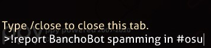
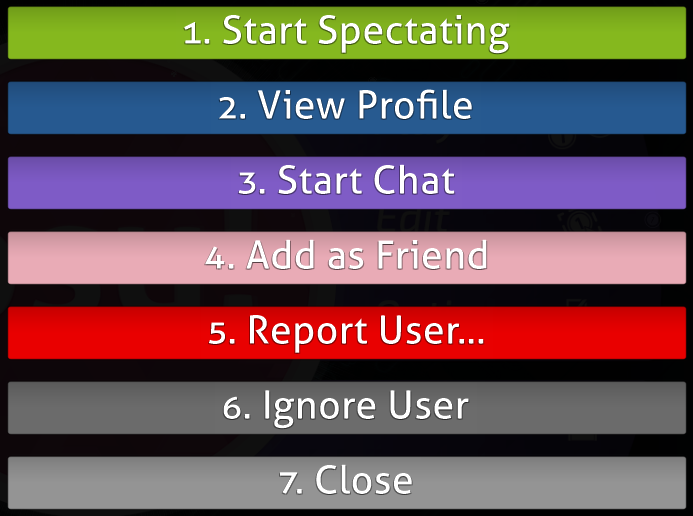
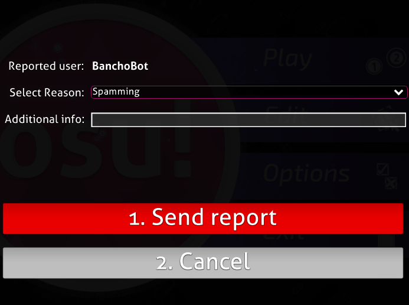
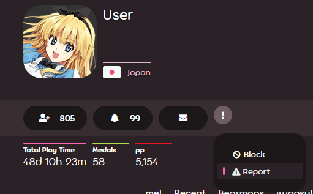
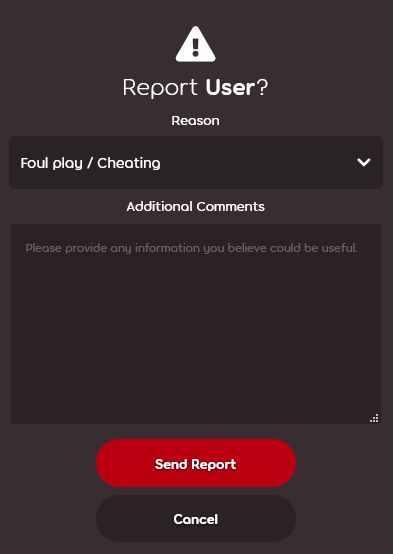
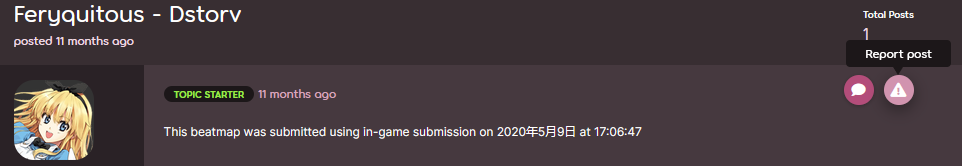
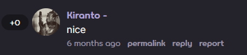
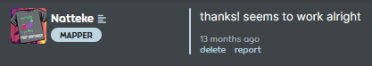
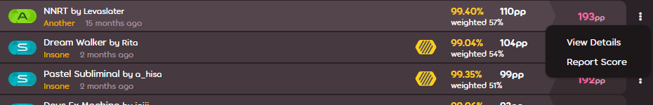
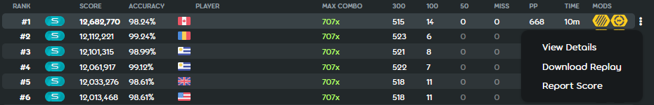

# 举报不当行为

osu! 拥有一支维护游戏及其社区环境干净安全的[管理员团队](/wiki/People/Global_Moderation_Team)。如果你注意到违反规则的行为或不适当的内容，请使用以下列出的方法之一举报。另外，如果你的举报未在合理的时间段内得到妥善处理，你可以直接在线联系任何一位管理员——只能在万不得已时使用此方法。

管理员团队会忽视误举报的玩家。但如果玩家恶意发送无效举报，则可能会导致被[禁言](/wiki/Silence)。

## 特殊情况

| 侵权性质 | 举报方法 |
| :-- | :-- |
| 在私信中电信诈骗或网络钓鱼 | 发送常规举报 |
| 私信中的其他侵犯性/不适当内容 | **不举报**：可以直接[拉黑玩家](/wiki/Client/Interface/Chat_console#命令列表)。如果想永久拉黑，请使用[设置](/wiki/Client/Options)内的游戏内黑名单，或是在他们的个人主页上点击拉黑按钮。 |
| [BN](/wiki/People/Beatmap_Nominators) 的不当行为 | 通过 [NAT/BN 管理](https://bn.mappersguild.com/reports)网站，向 [NAT](/wiki/People/Nomination_Assessment_Team) 举报 |
| [NAT](/wiki/People/Nomination_Assessment_Team) 或 [GMT](/wiki/People/Global_Moderation_Team) 的不当行为 | 通过 [support@ppy.sh](mailto:support@ppy.sh) 邮箱向[账号支持团队](/wiki/People/Account_support_team)举报 |
| 性虐待或极端不当行为 | 参见[举报骚扰](/wiki/Reporting_bad_behaviour/Abuse) |

其他情况，参见以下指南。

## 游戏内聊天

### !report 命令



在聊天中出现的不当行为是最常见的侵权行为。要举报它，最好在出现侵权消息的频道内，使用 [`!report`](https://osu.ppy.sh/community/forums/topics/34843) 命令。不要觉得有压力：如果你的消息以 `!report` 带空格开头，那么这条举报消息**仅对频道管理员可见**，频道内的其他人都无法看见。如果你仍然担心举报信息会泄露，也可以按如下步骤，使用[游戏内覆盖层](#游戏内覆盖层)举报。

举报命令语法有两种格式：

```
!report 玩家名
!report 玩家名 (括号内还可以写一些论坛格式的，可作为参考的信息)
```

如果玩家名内含有空格，举报时用下划线替代它：

```
!report bad_user 在 #osu 内刷屏
```

### 游戏内覆盖层





如果看到违规的玩家，按以下方法操作即可来到此界面：

1. 点击他们的玩家名，并按下名为 `举报玩家...` 的红底按钮。
2. 选择举报类别，添加详细信息（可选）。

## 网站

### 个人主页





1. 按下三个竖直排列点的按钮，并且选择 `举报`。
2. 选择举报类别，添加详细信息（可选）。

### 论坛



1. 在贴子上悬停光标。
2. 在贴子右上角出现的一列按钮中，点击警告符号的按钮。
3. 选择举报类别，添加详细信息（可选）。

### 评论区



1. 在评论下，点击 `举报` 链接。
2. 选择举报类别，添加详细信息（可选）。

### 谱面


1. 按下三个竖直排列点的按钮，并且选择 `举报`。
2. 选择举报类别，添加详细信息（可选）。

### 谱面讨论区



1. 在讨论贴下，点击 `举报` 链接。
2. 选择举报类别，添加详细信息（可选）。

### 成绩列表



#### 玩家信息

1. 向下滚动页面到 `排名` 或 `历史记录` 段落，并且定位要举报的成绩。
2. 在成绩右侧，按下三个竖直排列点的按钮，并且选择 `举报成绩`。
3. 选择举报类别，添加详细信息（可选）。

#### 谱面成绩列表



1. 将光标悬停在成绩上。
2. 按下成绩右侧三个竖直排列点的按钮，并且选择 `举报成绩`。
3. 选择举报类别，添加详细信息（可选）。
