# 举报不当行为

osu! 设有一个[全局管理团队](/wiki/People/Global_Moderation_Team) (GMT)，负责维护游戏及其社区生态保持干净安全。如果你发现违反规则的行为或不适当的内容，请使用下述方法之一进行举报。或者，如果你的举报在合理时间内未得到妥善处理，你也可以直接联系任何在线管理员——但这仅应作为最后的手段。

误报会被忽略。故意发送无效举报的用户可能会面临被[禁言](/wiki/Silence)的风险。

## 特殊情况

| 违规性质 | 举报的联系方式 |
| :-- | :-- |
| 私信中的欺诈/钓鱼行为 | 发送常规举报 |
| 其他冒犯性/不恰当的私信 | **无需举报**：改为[忽略该用户](/wiki/Client/Interface/Chat_console#命令列表)。如需永久生效，可使用[设置](/wiki/Client/Options)中的游戏内屏蔽玩家发言列表，或使用网页端用户资料页上的按钮进行屏蔽。 |
| [上架 (Ranked)](/wiki/Beatmap/Category#ranked) 谱面中的不当内容[^invalid-reports] | 通过 [BN 管理网站](https://bn.mappersguild.com/reports)联系 [NAT](/wiki/People/Nomination_Assessment_Team) 或 [GMT](/wiki/People/Global_Moderation_Team) |
| [谱面审核成员 (BN)](/wiki/People/Beatmap_Nominators) 的不当行为 | 通过 [BN 管理网站](https://bn.mappersguild.com/reports)联系 [NAT](/wiki/People/Nomination_Assessment_Team) |
| [NAT](/wiki/People/Nomination_Assessment_Team) 或 [GMT](/wiki/People/Global_Moderation_Team) 成员的不当行为 | 通过 [support@ppy.sh](mailto:support@ppy.sh) 联系[账号支持团队](/wiki/People/Account_support_team) |
| 谱面抄袭或其他侵犯版权行为 | 根据 [osu! 版权政策](/wiki/Legal/Copyright)，向 [copyright@ppy.sh](mailto:copyright@ppy.sh) 提交 DMCA 申诉 |
| 性虐待或极端不良行为 | 参阅[举报滥用行为](/wiki/Reporting_bad_behaviour/Abuse) |

对于其他情况，请参阅以下说明。

## 游戏内聊天

### !report 命令

*注意：在 osu!(lazer) 中或网页端通过 `!report` 命令举报用户，会导致举报内容**对所有人可见！** 请改用[聊天举报菜单](#lazer-reports)或通过[其个人主页](#个人主页)进行举报。*

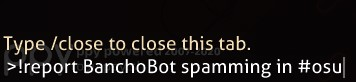

聊天违规是最常见的违规行为。要举报此类行为，请使用 [`!report` 命令](https://osu.ppy.sh/community/forums/topics/34843)，最好在违规行为发生的频道中进行。不必紧张：如果你的消息以 `!report` 加一个空格开头，并且是在 osu!(stable) 或 IRC 客户端中发送的，**则只有管理员能看到**，聊天室中的其他人都看不到。如果你仍有顾虑，也可以像下图所示那样，通过 osu!(stable) 客户端的[游戏内覆盖层](#stable-reports)使用举报功能。

该命令的语法有两种形式：

```
!report 玩家名
!report 玩家名 (可以跟一段自由格式的描述)
```

如果玩家名中包含空格，请用下划线代替：

```
!report bad_user 在 #osu 频道刷屏
```

如果你的举报提交成功，BanchoBot 会向你发送一条私信，告知管理员已收到通知。

请注意，`!report` 命令在 osu!(lazer) 中**不起作用**。请改用[聊天举报菜单](#lazer-reports)举报用户。

### osu!(stable) 中的游戏内覆盖层 {id=stable-reports}

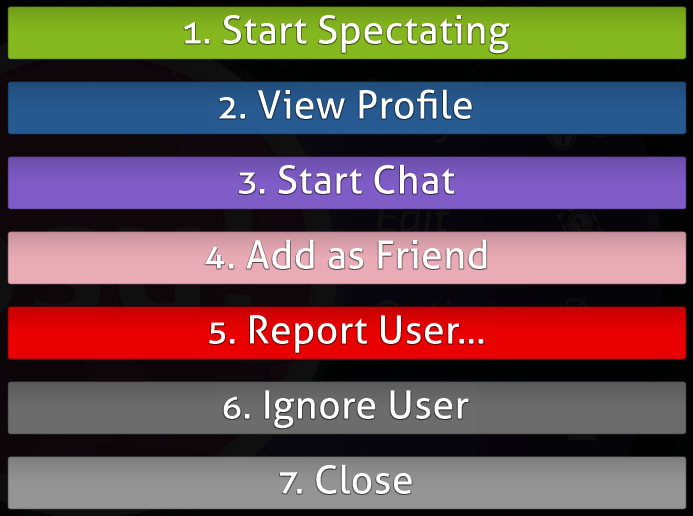

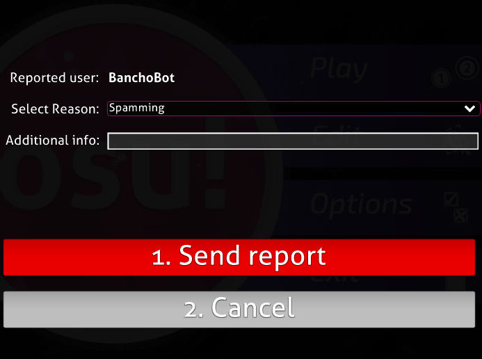

如果看到违规的玩家，按以下方法操作即可来到此界面：

1. 点击他们的玩家名，并按下名为 `举报玩家...` 的红色按钮。
2. 选择举报类别，添加详细信息（可选）。

### osu!(lazer) 中的聊天举报菜单 {id=lazer-reports}

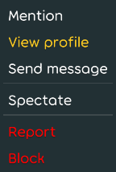

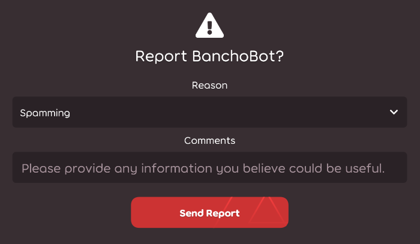

1. 右键或长按违规用户的用户名，然后点击红色的 `Report` 按钮。
2. 选择类别并添加详细信息（除非选择的类别是 `Other (type below)`，否则为可选）。

## 网站

### 个人主页

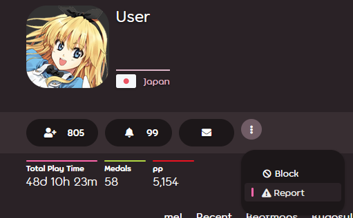

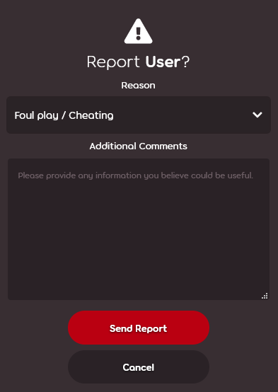

1. 按下三个竖直排列点的按钮，并且选择 `举报`。
2. 选择举报类别，添加详细信息。

### 论坛

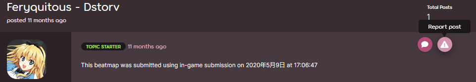

1. 在帖子上悬停光标。
2. 在帖子右上角出现的一列按钮中，点击警告符号的按钮。
3. 选择举报类别，添加详细信息。

### 评论区

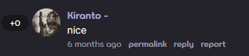

1. 在评论下，点击 `举报` 链接。
2. 选择举报类别，添加详细信息。

### 谱面


1. 按下三个竖直排列点的按钮，并且选择 `举报`。
2. 选择举报类别，添加详细信息。

### 谱面讨论区

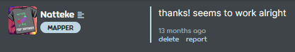

1. 在讨论帖下，点击 `举报` 链接。
2. 选择举报类别，添加详细信息。

### 成绩列表

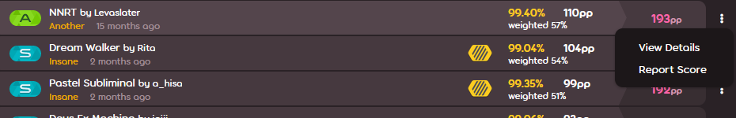

#### 玩家信息

1. 向下滚动页面到 `排名` 或 `历史记录` 段落，并且定位要举报的成绩。
2. 在成绩右侧，按下三个竖直排列点的按钮，并且选择 `举报成绩`。
3. 选择举报类别，添加详细信息。

#### 谱面成绩列表

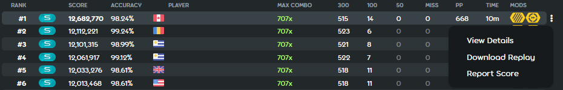

1. 将光标悬停在成绩上。
2. 按下成绩右侧三个竖直排列点的按钮，并且选择 `举报成绩`。
3. 选择举报类别，添加详细信息。

### 团队

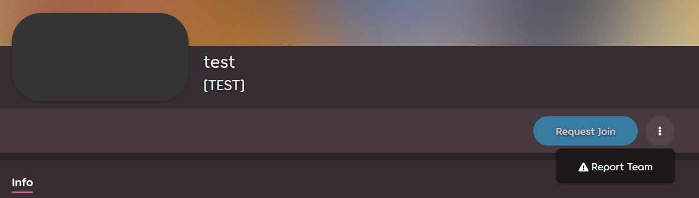

1. 按下三个竖直排列点的按钮，并且选择 `举报团队`。
2. 选择举报类别，添加详细信息。

## 参考资料

[^invalid-reports]: 与其他类别不同，上架 (Ranked) 谱面无法通过网站举报。
