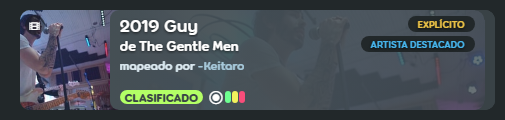

# Contenido explícito

Los mappers pueden declarar si el contenido de su beatmap es *explícito* marcando la casilla de verificación `Contenido explícito` que se encuentra en el [menú emergente de género e idioma](/wiki/Beatmap/Genre_and_language) en el listado web del beatmap correspondiente. Esta función tiene algunas expectativas y normas que rigen su uso.

Independientemente de la naturaleza del audio, asegúrate de que también cumpla con las [reglas de contenido de las canciones](/wiki/Rules/Song_content_rules).

## ¿Qué se considera contenido explícito?

El contenido explícito se refiere principalmente al **contenido de audio de un beatmap**, sobre todo en cuanto a temática, contenido o uso *excesivo* de un lenguaje explícito. **No** se aplica a los elementos visuales de un beatmap; esos **deben** cumplir con las [consideraciones de contenido visual](/wiki/Rules/Visual_content_considerations) o cualquier otro aspecto de un beatmap que el usuario pueda modificar (como etiquetas o nombres de dificultad) que **deben** cumplir con las [reglas de la comunidad de osu!](/wiki/Rules) como de costumbre.

Como regla general, la disposición del contenido explícito crea excepciones solo para el contenido que un usuario no puede editar razonablemente con las herramientas que le proporciona el juego, y también puede ser revocada en función de cada pista a discreción del [equipo de soporte de osu!](/wiki/People/Account_support_team).

En términos generales, la mayoría de las formas de música son aceptables para su uso en los beatmaps, con muy pocas excepciones, siempre que se marquen adecuadamente.

## ¿Qué se considera un uso excesivo de lenguaje explícito?

El uso leve (o único) de cualquier blasfemia común no es suficiente para que un beatmap pueda llevar el marcador de contenido explícito. Los beatmaps con este tipo de lenguaje pueden dejarse sin etiquetar como explícitos, siempre que el lenguaje sea el que se esperaría razonablemente de algo clasificado como algo que requiere «orientación parental» (PG-13). Si surgen discusiones sobre si esto es relevante para una pista determinada, asume que no lo es.

El uso de malas palabras debe ser sostenido, significativo, muy provocativo o muy repetitivo para que se considere explícito.

Además, las discusiones vívidas y sostenidas sobre temas controvertidos o cualquier cosa que una persona razonable consideraría «pesada» deben considerarse explícitas. Algunos ejemplos (aunque no todos) son:

- Imágenes, impacto o consecuencias del suicidio
- Violencia muy implícita
- Representación/discusión de consecuencias violentas con detalles sangrientos
- Referencias sexuales extremadamente abiertas o alusiones a actos sexuales

Una buena forma de discernir si algo debe etiquetarse como explícito o no es si alguno de los principales servicios de transmisión de audio lo incluye como tal en sus propias plataformas. [Spotify](https://www.spotify.com) es un excelente lugar para comenzar.
