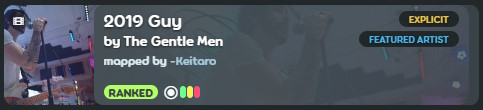

# Nội dung không phù hợp

Mapper có thể nhắc nhở rằng nội dung với beatmap của họ là *không phù hợp* qua việc ấn vào ô chọn `Explicit Content` được tìm thấy tại [menu bật lên trong thể loại và ngôn ngữ](/wiki/Beatmap/Genre_and_language) trên trang wed của beatmap tương ứng. Tính năng này có một vài yêu cầu và quy tắc nhất định khi áp dụng.

Bất kể bản chất của âm thanh như nào, hãy đảm bảo nó cũng tuân thủ với [quy định nội dung chung của bài hát](/wiki/Rules/Song_content_rules)

## Điều gì được coi là nội dung không phù hợp?

Nội dung không phù hợp chủ yếu đề cập đến phần nội dung âm thanh của beatmap, thường thể hiện qua chủ đề, đề tài, hoặc sử dụng `nhiều` ngôn ngữ tục tĩu. Nó không áp dụng cho các yếu tố hình ảnh của beatmap — những nội dung sẽ phải tuân theo [những cân nhắc về nội dung trực quan](/wiki/Rules/Visual_content_considerations), hoặc đến bất cứ yếu tố mà người dùng có thể thay đổi với beatmap (ví dụ như thẻ người tạo bản đồ hoặc tên chế độ beatmap) đều bắt buộc tuân thủ [quy tắc cộng đồng](/wiki/Rules) như thường lệ. 

Theo nguyên tắc chung, điều khoản nội dung không phù hợp tạo ra ngoại lệ chỉ với nội dung mà người dùng không thể chỉnh sửa hợp lý bởi các công cụ được trò chơi cung cấp, và cũng có thể bị thu hồi riêng cho từng bản nhạc tùy thuộc vào quyết định của [nhóm hỗ trợ tài khoản](/wiki/People/Account_support_team)

Nói chung, hầu hết các loại nhạc đều được chấp nhận để sử dụng trong beatmap với một số ngoại lệ, miễn là chúng đã được đánh dấu một cách phù hợp. 

## Điều gì được tính là sử dụng nhiều từ ngữ tục tĩu?

Việc sử dụng bất cứ từ tục tĩu nhẹ nhành (hoặc một vài lần) là không đủ điều kiện để một beatmap được gắn thẻ nội dung không phù hợp. Những beatmap với thể loại ngôn ngữ này có thể an toàn bỏ qua mà không cần thẻ explicit (18+), miễn là các từ ngữ được sử dụng vẫn nằm trong phạm vi mà người ta có thể hợp lý mong đợi ở một nội dung được xếp loại là “cần có sự hướng dẫn của phụ huynh” (PG-13). Nếu có bất cứ cuộc tranh cãi liệu điều này có thích hợp để đưa vào một bản nhạc cụ thể hay không, hãy cho rằng nó là không.

Việc sử dụng từ ngữ thô tục kéo dài liên tục, có tính kích động nặng, lặp lại nhiều lần mới được xem là rõ ràng. 

Ngoài ra, các cuộc thảo luận sôi nổi và kéo dài về các chủ đề gây tranh cãi hoặc bất cứ điều gì mà người bình thường sẽ đáng giá là "nặng nề" nên được xem xét minh bạch. Một số (nhưng không phải tất cả) ví dụ như: 

- Hình ảnh, tác động, hậu quả của tự sát
- Hàm ý bạo lực nặng nề
- Mô tả/thảo luận về hậu quả bạo lực chi tiết quá mức
- Những ám chỉ đến tình dục quá lộ liễu hoặc hành vi tình dục

Một phương pháp tốt để nhận định liệu một bài hát nên được gắn thẻ không phù hợp hay không thì hãy xem các dịch vụ phát trực tuyến âm thanh lớn đã liệt kê bài hát đó như thế nào trên nền tảng của họ. [Spotify](https://www.spotify.com) là một nơi tuyệt vời để bắt đầu. 
