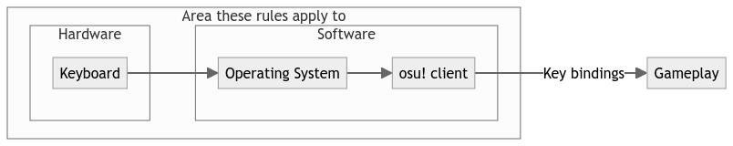

# Macro rules

Besides the rules outlaid here, as a general thumb rule it is generally not recommended to use any hardware or software adding unnecessary complexity or logic to your inputs. If you use a keyboard in the normal, intended way there is nothing to be afraid of.

If you do use special features or anything the-like that you think could possibly be disallowed, it is worth reading the rules below.

## What is considered a macro?

Macroing is the utilization of automated procedures or specialized behaviour that alters your input from that of a typical, unmodified keyboard. This goes for both hardware- and software-related features or tools.

Please note that the rules are specifically tailored towards keyboards as input devices. If you use anything else, do so at your own risk.

## Glossary

**Key**: A "key" refers to a physical key on your keyboard that can be moved upwards or downwards.

**Movement**: A movement is the continuous physical movement of a key in **one direction** (upwards or downwards). A direction change ends the movement and starts the next one. Whenever a key is "moved" in the rules, it refers to this definition.

**Action**: An action is the act of a **game key** (input to the osu! client) changing to pressed or released. If talking about pressing or releasing a key, it refers to this.

## Rules

### 1. A singular movement may only cause a singular action

Moving a key upwards or downwards should only result in a singular action.

For example, moving your `A`-key down must cause the osu! client to only receive that `A`-key press. Similarly, an action **must** be caused by a movement, and cannot be produced in any non-physical way (eg. software).

#### Examples

[!Disallowed][false] The `A`-key is moved down. Moving the `B`-key down presses it and additionally releases the `A`-key.[^RappySnappy]

This is **not** allowed as the act of pressing the `B`-key down performs multiple actions, being that the `B`-key is pressed (action 1) and the `A`-key released (action 2).

![Disallowed][false] The `A`-key is being moved down. Over the span of the downwards movement, the `A`-key is pressed and released.[^DKS]

This is **not** allowed as a singular movement, being moving the `A`-key down, causes both a press (action 1) and a release (action 2).

![Disallowed][false] The `A`-key is being moved down. A software sees this press, and simulates a second press for the `B`-key on software-level.

This is not allowed as this causes two actions, as an action is defined by what the osu! client receives, and not what the keyboard sends.

### 2. A movement on a key may not cause an action on any other key

Every key needs to do it's job independently. A movement performed on a key should not perform any actions on a different key.

If the `A`-key is moved down, the osu! client should only receive an action for the `A`-key, and not any other.

#### Examples

[!Allowed][true] You bind multiple in-game inputs to the same key.

This is allowed as the osu! client allows you to do so. The rule only applies to the input going from your keyboard into your osu! client, and excludes how the osu! client itself proceeds it. (eg. binding it to multiple keys in gameplay)

![Disallowed][false] The `B`-key is pressed down. Moving the `A`-key down causes the `B`-key to release.[^RappySnappy]

This is **not** allowed as a movement on the `A`-key causes an action on a different key, the `B`-key.

---

Technology not specifically covered by these rules, but clearly conflicting with the spirit of rhythm games, are prone to be addressed in the future and are not inheritly allowed. If a program is doing something to help you play the game that you should be doing yourself, it isn't okay!

## Notes

[^RappySnappy]: This disallows features similar to "[Rappy Snappy](https://www.youtube.com/watch?v=Uzv4bmtir3k)" or "[Snap Tap](https://www.razer.com/technology/snap-tap-mode)" on [Wooting](https://wooting.io/) or [Razer](https://www.razer.com/) keyboards.
[^DKS]: This disallows most configurations of features similar to "[Dynamic Keystroke](https://www.youtube.com/watch?v=1M6sovkYlRY)" or "[Dual Actuation](https://www.youtube.com/watch?v=4M-f7JUI30I)" on [Wooting](https://wooting.io/) or [SteelSeries](https://steelseries.com) keyboards.
