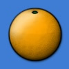
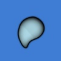
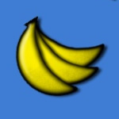
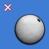

# Score

A player's performance on a map is given in terms of score after a successful completion of the map.
Most of the time, combo plays a major part in the scoring system since it serves as a multiplier of the score.

## Scoring Values

### osu!

| Image | Name | Effect |
| :-: | :-: | :-- |
|  | 300 | A possible score when tapping a hit circle precisely on time, completing a Slider and keeping the cursor over every tick, or completing a Spinner with the Spinner Metre full. A score of 300 appears in an blue score by default. Scoring nothing except 300s in a beatmap will award the player with the SS or SSH grade. |
|  | (激) Geki | A term from Ouendan, called Elite Beat! in EBA. Appears when playing the last element in a combo in which the player has scored only 300s. Getting a Geki will give a sizable boost to the Life Bar. By default, it is blue. |
|  | 100 | A possible score one can get when tapping a Hit Object slightly late or early, completing a Slider and missing a number of ticks, or completing a Spinner with the Spinner Meter almost full. A score of 100 appears in a green score by default. When very skilled players test a beatmap and they get a lot of 100s, this may mean that the beatmap does not have correct timing. |
|   | (喝) Katu or Katsu | A term from Ouendan, called Beat! in EBA. Appears when playing the last element in a combo in which the player has scored at least one 100, but no 50s or misses. Getting a Katu will give a small boost to the Life Bar. By default, it is coloured green or blue depending on whether the Katu itself is a 100 or a 300. |
|  | 50 | A possible score one can get when tapping a hit circle rather early or late but not early or late enough to cause a miss, completing a Slider and missing a lot of ticks, or completing a Spinner with the Spinner Metre close to full. A score of 50 appears in a orange score by default. Scoring a 50 in a combo will prevent the appearance of a Katu or a Geki at the combo's end. |
|  | Miss | A possible score one can get when not tapping a hit circle or too early (based on OD and AR, it may *shake* instead), not tapping or holding the Slider at least once, or completing a Spinner with low Spinner Metre fill. Scoring a Miss will reset the current combo to 0 and will prevent the appearance of a Katu or a Geki at the combo's end. |

### osu!taiko

| Image | Name | Effect |
| :-: | :-: | :-- |
|    | (良) Great | A possible score one can get when hitting the note exactly on the hit area in correct colour. Picture: \[1 and 2\] Large Note \[3\] Small Note |
|   | (可) Good | A possible score one can get when hitting the note slightly early or late on the hit area in correct colour. Picture: \[1\] Large Note \[2\] Small Note. |
|  | (不可) Miss | A possible score one can get for not hitting the note or hitting the note in wrong colour. |

### osu!catch


| Image | Name | Effect |
| :-: | :-: | :-- |
|  | Fruit | A large fruit which is equivalent to normal Hit-circle or Slider's starting, repeating and ending point. Catching it is equivalent to perfect hit (shown as 300 on multiplayer and result). |
|  | Juice Drops (Slider Tick) | These large droplets signifies Slider's ticks, similar to the dots (slider ticks) inside the sliders. It is compulsory to catch for combo. It is twice the size of Droplet (Slider Trails). 30pt for successful capture (shown as 100 on multiplayer and result). |
|  | Droplets (Slider Trail) | These small droplets are slider trails. They form the trails of the slider and are smaller comparatively to Juice Drops. 10pt for each Droplets. It would decrease accuracy for not capturing but does not break combo count (shown as 50 on multiplayer and result) |
| (None) | Miss Droplets | Droplets (Slider Trails) not caught. Not shown in Results screen but is shown in server-side. Combo will not be broken but will decrease accuracy and lose out one of the 50's score. Not considered a miss. Not shown at multiplayer and result but shown as *Droplet Miss* in website leaderboard. |
|  | Bananas | Spinner's equivalent. These pesky Bananas will become smaller as they fall towards the catcher. It is not compulsory to catch them. 1,100pt given, however this one follows spinner clear in osu!standard which combines 1000 as bonus and 100 as spinning score. |
|  | Miss | Normal Fruit and Juice Drops not caught. Breaks combo count. Given when failed to catch the Fruit/Juice Drops. No score given and breaks combo. This can only be seen from the results screen. |

### osu!mania

| Image | Name | Effect |
| :-: | :-: | :-- |
|  | Rainbow 300 (MAX) | Perfect hit of the note or hold. Comparing to 300, getting this mark required dead-on accuracy to get it. Otherwise, a regular 300 will be given. Completing the beatmap with just this score will give the maximum 1,000,000 score (1 million score limit). This is equivalent to *Marvelous* in DDR term. |
|  | 300 | Almost perfect hit of the note or hold. Maximum score limit cannot be achieved if this score was given. |
|  | 200 | Slightly early or slightly late hit or hold. New players may get this mark a lot until they got accustomed to the mechanism of the conveyor, speed, buttons and the judgement area. |
|  | 100 | Early or late hit or hold. It does not affect the HP bar at all. |
|  | 50 | Very early or very late hit or hold. This score will be given for unreleased hold notes by default. Decreases HP, but not for a drastic amount. Does not break combo. |
|  | Miss | Not hitting the note or holding the note using the correct keys. Drastically drain the HP and breaks the current combo. |

## Scoring

<!-- Uncomment the below and delete this comment if ScoreV2 is official. -->

<!-- **[Click here to visit the deprecated ScoreV1 system](ScoreV1 "ScoreV1")** -->

### ScoreV2

Before ScoreV2, each game modes has their own scoring system in place:

- osu! and osu!catch use a strictly combo-based score multiplier,
- osu!taiko roughly follows the *Taiko no Tatsujin* scoring system with a small constant score affected with combo bonus, and
- osu!mania is the only game mode with a score limiter, which is capped at 1,000,000 (1 million) score at 1.00x score modifier.

While the issue only arise on *very long and combo-intensive* beatmap, if the player managed to exceed a combo of ~6,500 onwards, the player's score will begin to count *backwards*.
This is a known flaw with the 32-bit signed integer where (in computing) the max integer is **2,147,483,647**.

This is where ScoreV2 comes in.

ScoreV2 attempts to standardise all the game modes' scoring system to 1,000,000 (1 million) score at 1.00x score modifier with extra score gains from spinner's bonus for osu!, drumrolls for osu!taiko, and bananas as usual for osu!catch.
Each of the hit objects are now part of the 1 million score and scaled accordingly rather than their own scoring values and bonus formulae.

ScoreV2 can be tested in [Multi](/wiki/Multi) mode as one of the Match Setup's Win Condition.
As of [22 February 2017 (2017-02-22)](https://osu.ppy.sh/p/changelog?v=b20170222.3), the ScoreV2 system can be tested in *Solo* mode using the **UNRANKED** [ScoreV2](/wiki/Game_modifier/ScoreV2) game modifier.

### Score

<!-- Delete the above heading and this comment if ScoreV2 is official, and update the child headings below to ScoreV2 system behaviour. -->

#### osu!

The score given by each hit circle and end of a slider is calculated with the following formula:-

`Score = Hit Value + (Hit Value * ((Combo multiplier * Difficulty multiplier * Mod multiplier) / 25))`

| Term | Meaning |
| :-: | :-- |
| **Hit Value** | The hit circle judgement (50, 100 or 300), any slider ticks and spinner's bonus |
| **Combo multiplier** | (Combo before this hit - 1) or 0; whichever is higher |
| **Difficulty multiplier** | The difficulty setting for the beatmap (see next header) |
| **Mod multiplier** | The multiplier of the selected mods |

Additionally each slider start, end and repeat tick awards 30 points, each slider middle tick awards 10 points and each spin of a spinner awards 100 points.

Additional bonus of 1,000 points given for each spin of a spinner after the spinner meter is full.

##### How to calculate the Difficulty multiplier

[Circle Size (CS)](/wiki/Beatmap_Editor/Song_Setup#circle-size), [HP Drain (HP)](/wiki/Beatmap_Editor/Song_Setup#hp-drain-rate) and [Overall Difficulty (OD)](/wiki/Beatmap_Editor/Song_Setup#overall-difficulty) each give a tick on *difficulty point*.

The accumulated *difficulty points* affect the **Difficulty multiplier** as so:-

| Difficulty points range | Difficulty multiplier |
| :-: | :-- |
| 0 - 5 | 2x multiplier |
| 6 - 12 | 3x multiplier |
| 13 - 17 | 4x multiplier |
| 18 - 24 | 5x multiplier |
| 25 - 30 | 6x multiplier |

The limited highest is 27 difficulty points with CS7, OD10 and HP10.
The limited lowest is 2 difficulty points with CS2, OD0 and HP0.

CS cannot normally go below 2 or above 7 (requires direct modification to the `.osu` file).

Note that game modifiers (like Hard Rock/Easy) will not change the **Difficulty multiplier**.
It will only account for original values only.

#### osu!taiko

Each GREAT (excluding Kiai Time's 1.2x bonus) is worth `300 + RoundDown(Combo / 10)` times `n` up to a maximum of `300+10n` points, in which `n` depends on the difficulty rating of the song.

Each *GOOD* gives half of the score as *GREAT* does, while zero score is given for *MISS/BAD*.

Double score is given for *successful hit* on large notes (different from *Taiko no Tatsujin*, left and right drum must be hit at the same time very precisely in order to allow a successful hit of large notes).

For yellow long notes, 300 is given per hit in the small one while 600 per hit is given to the large one.

For shaker notes, each shake gives 300 and finishing the shaker gives score twice as much as a GREAT of the current combo.

A typical value of `n` (4.5-5 star difficulties in old 5 star ratings system) is 80, which gives a maximum score of 1,100/2,200 at 100 combo and later combos.
For 4 - 4.5 star difficulties, `n` is equal to 64 in which the maximum score per hit is 940/1,880.
In the hardest case, `n` is equal to 96 in which the maximum score per hit is 1,260/2,520.
There are lower value of `n` for even easier difficulties.

Unlike [osu!standard](/wiki/Game_mode/osu!)/[osu!catch](/wiki/Game_mode/osu!catch), a miss in osu!taiko will not cause a *drastic* score difference from the maximum possible score (in osu!standard/osu!catch, score deviation damage from a miss grows *wider* the higher the maximum combo and especially breaking in around half combo of the maximum combo).
Instead, a constant score of `n` (explained above) is reduced per miss if each miss is separated by more than 100 combos.
With the existence of shaker and large notes, score loss would be larger.

For example, in a typical difficulty (80), breaking a combo in the middle of a song without accounting for large notes and spinners, would result in a maximum loss of 44,000 points (to bring the combo back up to 100, all GREAT score value).

Also unlike the other game modes, Kiai Time has an effect on scores because it refers to the *"Go-Go Time"* in *Taiko no Tatsujin*.
While Kiai Time is active, the drum in the upper left changes animation, the playfield has a background gradient and the hit area gains a fire graphic around it.
Additionally, all hit notes gain a 1.2x score multiplier, long yellow notes (drumroll) included, except for hits on a shaker (the final hit is still multiplied).

In short: `Score = {ScoreValue + [min(RoundDown(Combo / 10), 10) * RoundDown(taiko score multiplier * raw mod multiplier)]} * Kiai Time`

| Term | Meaning |
| :-: | :-- |
| **ScoreValue** | The Score Value gained from the hit (300/600, 150/300, or 0/0). |
| **Combo** | (Combo before this hit - 1) or 0; whichever is higher |
| **taiko score multiplier** | \[Depends on difficulty rating\] Possible values are: 32, 48, 64, 80, 96 |
| **raw mod multiplier** | The *raw* multiplier of the selected mods (shown multipliers are usually rounded up) |
| **RoundDown** | Round down this value to a whole number instead, removing all the decimal values. |
| **min(x, y)** | Always pick the lowest value between *x* or *y*. |
| **Kiai Time** | If Kiai Time was active, this value is 1.2. Otherwise, the value is 1.0. |

Exceptions:-

- Each successful drumroll hit gives a constant GREAT Score Value (300/600 for small/large drumroll respectively) with Kiai Time bonus only.
- Each denden hits/shaker shakes gives a constant GREAT Score Value (300) without Kiai Time bonus except for last denden hit/shaker shake, which gives a large GREAT Score Value (600) with current combo multiplier.

#### osu!catch

Scoring for osu!catch follows the same multiplier as in [osu!standard](/wiki/Game_mode/osu!).
However, the fruit that adds up the score is different from osu!standard.

- A regular sized fruit gives a score of 300 times the multiplier.
- A large juice drop (slider tick) gives a score of 100.
- The smallest drop (also called "droplet", or slider trail/path) gives a score of 10.
- Each collected bananas (collected during spinner duration) will give a static score of 1,100 regardless of mod and combo multiplier.

Combo will not be lost for missing droplets (considered as *Miss Droplet* in server leaderboard) in this mode, but a drop of Accuracy and score gain from it.

`Score = Hit Value + [Hit Value * ((Combo multiplier * Difficulty multiplier * Mod multiplier) / 25)]`

| Term | Meaning |
| :-: | :-- |
| **Hit Value** | The hit circle judgement (50, 100 or 300), any slider ticks, and spinner's bonus |
| **Combo multiplier** | (Combo before this hit - 1) or 0; whichever is higher |
| **Difficulty multiplier** | The difficulty setting for the beatmap |
| **Mod multiplier** | The multiplier of the selected mods |

**Note:** There is a difference between osu!standard and osu!catch's scoring methods:

- 300s and a combo increment are not given to a finished spinner
- reverse slider ticks are counted as a full score of a hit
  - note that in osu!standard, a reverse tick only gives 30 points

#### osu!mania

In osu!mania, each beatmap has the same maximum total score of 1 million (1,000,000).

The score is given in two parts, base score and bonus score, each contributing 50% of total score.

- Base score is based on hit judgement.
  - A rainbow 300 is worth a bit more than 300.
- Bonus score is based on hit judgement and a floating bonus multiplier.
  - The multiplier increases with a rainbow 300 or 300, while it decreases with a 200 or below.
  - The better judgement, the more multiplier increase/less punishment.
    - There's an upper limit for the multiplier.

The score given by each note is calculated with the following formula:-

```
Score = BaseScore + BonusScore

BaseScore = (MaxScore * ModMultiplier * 0.5 / TotalNotes) * (HitValue / 320)

BonusScore = (MaxScore * ModMultiplier * 0.5 / TotalNotes) * (HitBonusValue * Sqrt(Bonus) / 320)
Bonus = Bonus before this hit + HitBonus - HitPunishment / ModDivider
Bonus is limited to [0, 100], initially 100.

MaxScore = 1 000 000
ModMultiplier = The score multiplier of the selected mods (difficulty reduction and/or nK)
ModDivider = The punishment divider of the selected mods (difficulty increase)

Judgement  HitValue  HitBonusValue  HitBonus  HitPunishment
   MAX       320          32            2
   300       300          32            1
   200       200          16                        8
   100       100           8                       24
    50        50           4                       44
  Miss         0           0                        ∞

       Mod  ModMultiplier  ModDivider
      Easy       0.5
    NoFail       0.5
  HalfTime       0.5
  HardRock                    1.08
DoubleTime                     1.1
 NightCore                     1.1
    FadeIn                    1.06
    Hidden                    1.06
Flashlight                    1.06
```

## Other Scores

Suppose a player played these four beatmaps online with a signed in osu!account on a single game mode, osu!standard:

-  [BRANDY - The Festival of Ghosts 2 (darrihuka)](https://osu.ppy.sh/beatmapsets/3302)
  - **Relaxing**: 3,000,000
  - **DaRRi MIx**: 5,000,000
-  [ZZ - Samurai Blue (elzamxrai)](https://osu.ppy.sh/beatmapsets/271)
  - **Easy**: 500,000
  - **Normal**: 1,000,000
  - **Hard**: No score
-  [Matchbox 20 - How Far We've Come (Sushi)](https://osu.ppy.sh/beatmapsets/1264)
  - **Normal**: 2,000,000
  - **Hard**: 1,500,000
    - First failed online play : 2,450,000
    - Second failed online play : 50,000
-  [Nico Nico Douga - U.N. Owen Was Her? (Reikin)](https://osu.ppy.sh/beatmapsets/1785)
  - **Normal**: 2,000,000
    - Offline play : 50,000,000

The player's **total ranked score for osu!standard** would be: (3,000,000 + 5,000,000) + (500,000 + 1,000,000) + (2,000,000 + 1,500,000) + 2,000,000 = **15,000,000 score**.

Meanwhile, the player's **total score for osu!standard** would be: (3,000,000 + 5,000,000) + (500,000 + 1,000,000) + (2,000,000 + 1,500,000 + 2,450,000 + 50,000) + (2,000,000) = **17,500,000 score**.

### Ranked Score

The ranked score is the **total sum of the best scores for all ranked difficulties played online.**

### Total Score

The total score is the **total sum of all scores on ranked and/or approved beatmaps, including failed attempts.**

If a player plays a ranked song for the first time and gets 500k, both ranked and total score increase by 500k.
Then, the player plays again and gets 400k, only the total score increases by 400k.

#### Level

The level of a player is based solely on the player's **total score**. The score requirement for a level is given by the following function:

```
score(n) = 5,000 / 3 * (4n^3 - 3n^2 - n) + 1.25 * 1.8^(n - 60) if n <= 100
score(n) = 26,931,190,827 + 99,999,999,999 * (n - 100)         if n > 100
```

Note that due to a rounding technique used by the game, the values for levels up to 100 do not precisely match the formula. This is because the game keeps a pre-calculated list of differences in score between levels, and each item in the list is rounded to the nearest integer. For example, the eightieth item in the list is `score(81) - score(80) = 128,927,482.36216`, rounded to 128,927,482. By level 100, the total error is +1.629 score, which is why `score(100) = 26,931,190,828.629` does not match the 26,931,190,827 in the second part of the function.

The progress to the next level is displayed using a bar next to the player's level.
