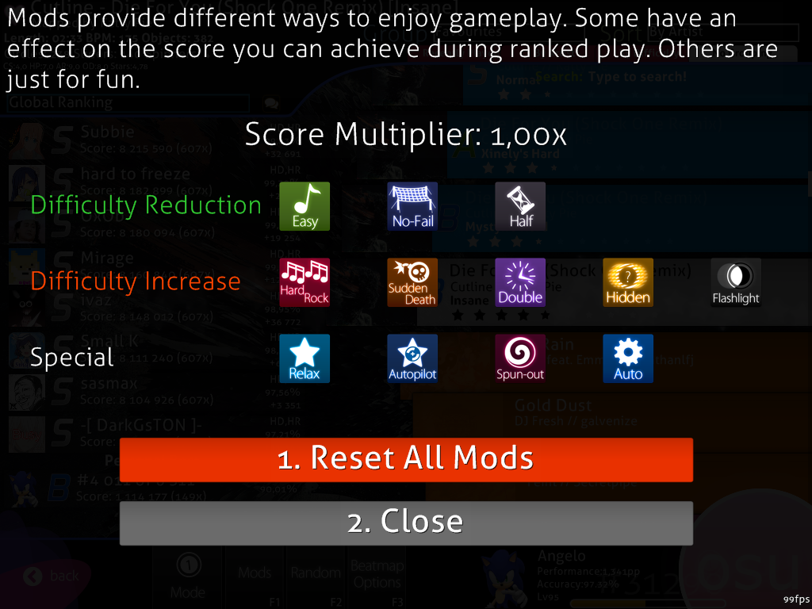
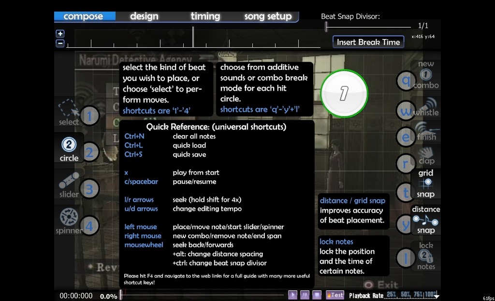

# Raccourcis clavier

Dans osu!, il existe divers raccourcis qui peuvent être utilisés dans le jeu et les menus. Ils sont listés ici avec leurs fonctions ci-dessous.

## Raccourcis généraux

-   **MAJ+F1**: Ouvre osu!status (en cas d'erreur de connexion)
-   **F7**: Change la limite du FPS
-   **F8**: Montre ou cache le Chat
-   **F9**: Montre ou cache le Chat étendu
-   **F10**: Désactive les boutons de la souris. (La molette fonctionne toujours)
-   **F12**: Prend une capture d'écran (maintenez MAJ pour l'uploader instantanément au serveur pour la partager)
-   **Inser**: Réduit osu! dans la zone de notification.
-   **Flèche Haut/Bas**: Augmente/Réduit le volume. (Maintenez MAJ pour régler les bruitages)

## Menus seulement

-   **F1**: Musique précédente
-   **F2**: Jouer depuis le début
-   **F3**: Pause/Reprendre
-   **F4**: Arrêter
-   **F5**: Musique suivante
-   **F6**: Aller à (jukebox)
-   **Alt-Entrée**: Active/Désactive le mode plein écran
-   **Échap**: Retour en arrière
-   **Ctrl-Alt-MAJ-S**: Recharger les images du skin

## Menu principal

-   **P**: Mode Play (deux fois pour l'écran de sélection des beatmaps)
-   **P-M**: Mode Play ([Multijoueur](/wiki/Multi))
-   **E**: Mode Edit (Sélection de la beatmap)
-   **J**: Aller à (jukebox)
-   **Z/X/C/V/B**: Commandes du jukebox (interface Winamp)
-   **D**: osu!direct (supporters seulement)
-   **O**: Options
-   **Q**: Quitter
-   **R**: Musique aléatoire

## Sélection de la beatmap

-   **F1**: [Modes de difficulté](/wiki/Game_Modifiers)
-   **F2**: Map aléatoire
-   **Shift+F2**: Annuler la sélection aléatoire
-   **F3**: Options de la beatmap sélectionnée
-   **F5**: Rafraîchir la liste des beatmaps (réparer la liste)
-   **MAJ-Suppr**: Supprimer la map sélectionnée
-   **Ctrl-1/2/3/4**: Passer respectivement entre les modes  [osu! Standard](/wiki/Game_Modes/osu!)/  [Taiko](/wiki/Game_Modes/osu!taiko) /  [Catch the Beat](/wiki/Game_Modes/osu!catch) /  [osu!mania](/wiki/Game_Modes/osu!mania).
-   **Ctrl-Entrée**: Jouer la map actuelle avec le mod [Auto](/wiki/Game_Modifiers).
-   **Ctrl-MAJ-Entrée**: Jouer la map actuelle avec le mod [Cimema](/wiki/Game_Modifiers).
-   **Ctrl-A**: Active le mod Auto
-   **Ctrl+(F3/F4) ou Ctrl+(+/-)**: Augmente ou diminue la vitesse de défilement (osu!mania seulement)
-   **Ctrl+Backspace**: Efface le dernier mot de la recherche
-   **Haut/Bas**: Changer la sélection
-   **Left/Right**: Changer le mapset sélectionné
-   **PgUp/PgDown**: Changer la sélection (Déplacement rapide)
-   **Enter**: Choisir la beatmap
-   **Shift+(Left/Right)**: Changer de groupe
-   **Shift+Enter**: Ouvrir ou fermer le groupe

## Modes de difficulté

Note: Les mods spéciaux comme [Perfect](/wiki/Game_Modifiers) ou [Nightcore](/wiki/Game_Modifiers) nécessitent d'appuyer sur la touche correspondante une nouvelle fois.

-   **Q**: [Easy](/wiki/Game_Modifiers)
-   **W**: [No Fail](/wiki/Game_Modifiers)
-   **E**: [Half-Time](/wiki/Game_Modifiers)

------------------------------------------------------------------------

-   **A**: [Hard Rock](/wiki/Game_Modifiers)
-   **S**: [Sudden Death](/wiki/Game_Modifiers)
-   **D**: [Double Time](/wiki/Game_Modifiers)
-   **F**: [Hidden](/wiki/Game_Modifiers)
-   **G**: [Flashlight](/wiki/Game_Modifiers)

------------------------------------------------------------------------

-   **X**: [Relax](/wiki/Game_Modifiers) (Aucun effet sur les mods 4/5/6/7/8K d'osu!mania)
-   **C**: [Auto-Pilot](/wiki/Game_Modifiers)
-   **V**: [Spun-Out](/wiki/Game_Modifiers)
-   **B**: Auto

## Mode Play

-   **+/-**: Ajuster le décalage audio (maintenez MAJ/CTRL pour changer la précision)
-   **Échap**: Pause (Quitte la chanson si Auto est utilisé)
-   **Espace**: Passe l'intro.
-   **Tab**: Affiche le classement
-   **Shift+Tab**: Affiche ou masque l'interface de jeu
-   **F3/F4**: Ajuste la vitesse d'osu!mania.
-   **Ctrl-R**: Redémarrage rapide de la map (passe automatiquement l'intro)

## Mode Edit

### Raccourcis clavier

#### Géneral

-   **H**: Aide (Contient tous les raccourcis montrés ci-contre)

**Musique**

-   **Z**: Arrêter
-   **X**: Jouer depuis le début
-   **C ou Espace**: Pause/Reprendre
-   **Flèches gauche et droite**: Naviguer dans la musique. Maintenez MAJ pour aller 4 fois plus vite.

**Commandes des marques-pages**

-   **Ctrl+B**: Ajoute un marque-page au moment actuel.
-   **Ctrl+MAJ+B**: Retire un marque-page au moment actuel.
-   **Ctrl+Flèche gauche**: Saute au marque-page précédent.
-   **Ctrl+Flèche droite**: Saute au marque-page suivant.

**Sauvegarde et réinitialisation**

-   **Ctrl+L**: Revenir à la dernière sauvegarde
-   **Ctrl+S**: Sauvegarde rapide
-   **Ctrl+N**: Retire toutes les notes (mais garde le timing/configuration de la beatmap)

**Changement de mode**

-   **F1**: Mode [Composition](/wiki/Beatmap_Editor/Compose)
-   **F2**: Mode [Design](/wiki/Beatmap_Editor/Design)
-   **F3**: Mode [Timing](/wiki/Beatmap_Editor/Timing)
-   **F4**: [Configuration de la beatmap](/wiki/Beatmap_Editor/Song_Setup)

#### Mode Composition

-   **Nombres 1-4**: Change de mode de sélection/placement
-   **Q,W,E,R,L**: Change les modes d'options
-   **Suppr**: Supprime les notes sélectionnées
-   **Ctrl+Z,Y**: Annuler,Refaire
-   **Ctrl+A**: Sélectionner toutes les notes
-   **Ctrl+X,C,V**: Couper, Copier, Coller
-   **Ctrl+D**: Cloner la sélection
-   **Alt pendant le placement**: Place la note en se basant sur la durée écoulée depuis la dernière note
-   **MAJ pendant le placement**: Pas d'accrochage à la grille
-   **MAJ pendant la modification**: Pas de grille ou de beat (time) snapping
-   **J/K**: Déplace le cercle plus tôt/plus tard dans le temps
-   **G**: Change la précision de la grille
-   **Ctrl+1-4**: Taille de la grille (minuscule,petit,moyen,grand)
-   **Ctrl+ , (virgule)**: Tourner dans le sens inverse des aiguilles d'une montre/sens des aiguilles d'une montre
-   **Ctrl+H,J**: Retourner Horizontalement/Verticalement

#### Mode Timing

-   **T**: Timer en utilisant le clavier
-   **MAJ en ajustant le BPM/Point de départ**: 4x plus vite
-   **Ctrl+B**: Réinitialise le point de timing actuel
-   **Ctrl+P**: Ajoute un point de timing

### Contrôles de la souris

-   **Clic gauche**: Place des hit circles normaux, commence un slider ou ajoute un point à un slider en train d'être placé. Sélectionne les cercles.
-   **Ctrl + Clic gauche**: Ajoute un nouveau point à un slider existant.
-   **Clic droit**: Commence un nouveau combo, termine le placeùent d'un slider ou retire un point, retire un cercle (seulement en mode sélection ou en je jouant pas l'audio).
-   **Molette de la souris**: Avance/Recule dans la musique. Maintenez MAJ pour aller 4x plus vite.
-   **Ctrl + Alt + Molette de la souris**: Change le mode de placement/sélection dans l'aire de jeu.
-   **Ctrl + Molette**: Augmente/Réduit le [snap divisor](/wiki/Beatmap_Editor/Distance_Snap).
-   **Alt + Molette**: Augmente/Réduit le multiplicateur de distance. Change le zoom du timeline dans le timeline.
-   **Glisser**: Déplace la sélection des notes (position et temps), déplace les points dans le slider. Déplace la fin des sliders/spinners pour la rallonger dans le temps.
