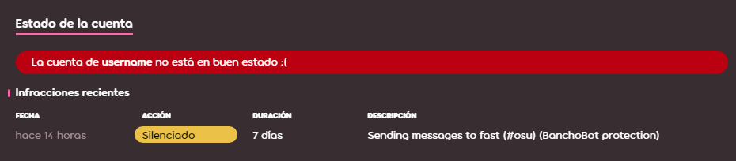

# Silencio

**Silencio** es un término usado para describir el castigo de limitar los medios de comunicación de un usuario dentro de la comunidad de osu!. Los silencios pueden ser colocados por miembros del [Global Moderation Team](/wiki/People/Global_Moderation_Team) y el [Nomination Assessment Team](/wiki/People/Nomination_Assessment_Team), y solo se colocan en usuarios que han infringido las [Reglas de la comunidad](/wiki/Rules).

## Limitaciones

::: Infobox

:::

Los usuarios silenciados por los moderadores no pueden hacer lo siguiente:

- Usar el [chat](/wiki/Client/Interface/Chat_console) (público y privado), tanto en el juego como en el sitio web
- Publicar en cualquiera de los foros de osu!
- Dejar comentarios en cualquier lugar del sitio web (noticias, registro de cambios, beatmaps)
- Participar en [discusiones de beatmap](/wiki/Beatmap_discussion)
- Editar los detalles del perfil (por ejemplo, avatar, sección "¡yo!")
- Enviar y actualizar beatmaps
- Participar en juegos [multijugador](/wiki/Client/Interface/Multiplayer)

Además de eso, todos los mensajes de un usuario silenciado se eliminan de todos los canales de chat y conversaciones privadas.[^chat-cleanup]

::: Infobox

:::

Después de silenciar a un usuario, se mostrará una alerta en lugar del campo de entrada de chat, que indicará cuándo desaparece el silencio. El registro del silencio también se puede observar en la parte inferior del perfil de la web, del que desaparecerá a los 28 días.

## Apelando un silencio

Si cree que lo silenciaron injustamente, comuníquese con el [equipo de soporte de cuentas](/wiki/People/Account_support_team#accounts@ppy.sh) en [accounts@ppy.sh](mailto:accounts@ppy.sh) para impugnar el silencio. Asegúrate de hacerlo desde el correo electrónico vinculado a tu cuenta de osu!; menciona tu nombre de usuario de osu!, así como la fecha y hora aproximada en que se procedió al silencio.

## Razones comunes para los silencios

*Precaución: Participar en un "comportamiento inapropiado" en mensajes privados no está en contra de las reglas, a menos que dicho comportamiento inapropiado se entregue a destinatarios que no quieran o no consientan. Si se reporta, se impondrán las sanciones correspondientes.*

- Comportamiento inapropiado en chats o foros públicos (por ejemplo, `#multiplayer`, discusiones de beatmap, comentarios, etc.), incluyendo  — pero no limitado a — spam, chat sin sentido, racismo, etc.
- Subir o publicar contenido inapropiado a través de otros medios. (Por ejemplo, avatares de perfil, envío de beatmaps, detalles de perfil, biografía de la página de usuario, banner, etc.).

La duración de un silencio puede variar según la gravedad de la infracción. Los silencios se pueden acumular uno encima del otro, agregando más tiempo para cada uno. Tenga en cuenta que si una ofensa es lo suficientemente grave, o si un jugador es reincidente, puede resultar en una [restricción de cuenta](/wiki/Help_centre/Account_restrictions) en lugar de un silencio.

## Referencias

[^chat-cleanup]: [Publicación de blog de ppy (2012-12-17) "This Week in osu!"](https://blog.ppy.sh/post/38114063519/this-week-in-osu-5)
