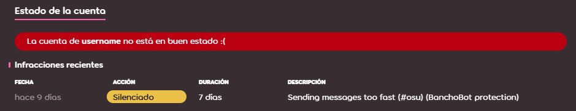

# Silencio

El **silencio** es un término usado para describir el castigo de limitar los medios de comunicación de un usuario dentro de la comunidad de osu!. Los silencios pueden ser colocados por miembros del [Global Moderation Team](/wiki/People/Global_Moderation_Team) y del [Nomination Assessment Team](/wiki/People/Nomination_Assessment_Team), y solo se colocan en usuarios que han infringido las [reglas de la comunidad](/wiki/Rules).

## Limitaciones

::: Infobox

:::

Los usuarios silenciados por los moderadores no pueden hacer lo siguiente:

- Usar el [chat](/wiki/Client/Interface/Chat_console) (público y privado), tanto en el juego como en el sitio web
- Publicar en cualquiera de los foros de osu!
- Dejar comentarios en cualquier lugar del sitio web (noticias, registro de cambios, beatmaps)
- Participar en [discusiones de beatmaps](/wiki/Beatmap_discussion)
- Editar los detalles del perfil (p. ej. avatar, sección «¡yo!», etc.)
- Enviar y actualizar beatmaps
- Participar en juegos [multijugador](/wiki/Client/Interface/Multiplayer)

Además de eso, todos los mensajes de un usuario silenciado se eliminan de todos los canales de chat y conversaciones privadas.[^chat-cleanup]

::: Infobox

:::

Después de silenciar a un usuario, se mostrará una alerta en lugar del campo de entrada del chat, que indicará cuándo desaparece el silencio. El registro del silencio también se puede observar en la parte inferior del perfil en la web, que desaparecerá a los 28 días.

## Apelar un silencio

Si crees que te silenciaron injustamente, comunícate con el [equipo de soporte de cuentas](/wiki/People/Account_support_team#accounts@ppy.sh) a través de [accounts@ppy.sh](mailto:accounts@ppy.sh) para impugnar el silencio. Asegúrate de hacerlo desde el correo electrónico vinculado a tu cuenta de osu!; menciona tu nombre de usuario de osu!, así como la fecha y hora aproximada en que te silenciaron.

## Razones comunes para los silencios

*Precaución: Participar en una «conducta inapropiada» en mensajes privados no está en contra de las reglas, a menos que dicha conducta inapropiada se entregue a destinatarios que no quieran o no lo consientan. Si se reporta, se impondrán las sanciones correspondientes.*

- Conducta inapropiada en chats o foros públicos (p. ej. `#multiplayer`, discusiones de beatmaps, comentarios, etc.), incluyendo —pero no limitado a— spam, chat sin sentido, racismo, etc.
- Subir o publicar contenido inapropiado a través de otros medios (p. ej. avatares de perfil, envío de beatmaps, detalles de perfil, biografía de la página de usuario, banner, etc.).

La duración de un silencio puede variar según la gravedad de la infracción. Los silencios se pueden acumular uno encima de otro, agregando más tiempo para cada uno. Ten en cuenta que si una ofensa es lo suficientemente grave, o si un jugador es reincidente, puede resultar en una [restricción de cuenta](/wiki/Help_centre/Account_restrictions) en lugar de un silencio.

## Referencias

[^chat-cleanup]: [Publicación del blog por ppy (17/12/2012) «This Week in osu!»](https://blog.ppy.sh/post/38114063519/this-week-in-osu-5)
