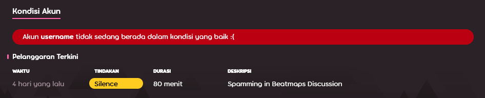

# Silence

***Silence*** merupakan bentuk hukuman di osu! yang membatasi kemampuan seorang pengguna untuk dapat berkomunikasi dengan anggota-anggota komunitas lainnya. Hukuman ini dijatuhkan oleh anggota [Global Moderation Team](/wiki/People/The_Team/Global_Moderation_Team) dan [Nomination Assessment Team](/wiki/People/The_Team/Nomination_Assessment_Team) kepada para pengguna yang telah terbukti melanggar [peraturan komunitas](/wiki/Rules) yang berlaku.

## Pembatasan aktivitas

::: Infobox

:::

Para pengguna yang sedang di-*silence* oleh moderator tidak akan dapat melakukan hal-hal berikut:

- Menggunakan fitur [*chat*](/wiki/Client/Interface/Chat_console) (publik dan privat) baik di dalam permainan maupun pada situs web osu!
- Membuat post pada forum osu!
- Berkomentar pada situs web osu! (baik itu pada laman berita, riwayat perubahan, maupun info beatmap)
- Berpartisipasi dalam [laman diskusi beatmap](/wiki/Beatmap_discussion)
- Menyunting rincian profilnya masing-masing (semisal mengganti avatar atau mengubah isi bagian "me!")
- Mengunggah beatmap baru atau memperbarui beatmap-beatmap yang sudah ada
- Berpartisipasi dalam [pertandingan multiplayer](/wiki/Client/Interface/Multiplayer)

Di samping itu, seluruh pesan yang sebelumnya telah dikirim oleh pengguna yang bersangkutan akan ikut terhapus dari seluruh kanal *chat* dan *private message* yang aktif.[^chat-cleanup]

::: Infobox

:::

Setelah seorang pengguna di-*silence*, sebuah pesan yang menyatakan durasi *silence* yang berlaku akan muncul pada layar *chat* pengguna yang bersangkutan. Adapun riwayat pelanggaran yang pernah dilakukan oleh tiap-tiap pengguna dapat dilihat pada bagian bawah laman profil mereka masing-masing, yang akan hilang dengan sendirinya setelah 28 hari.

## Mengajukan banding akan silence yang diterima

Apabila kamu yakin bahwa kamu telah di-*silence* secara sewenang-wenang, harap hubungi [account support team](/wiki/People/The_Team/Account_support_team#accounts@ppy.sh) kami pada alamat email [accounts@ppy.sh](mailto:accounts@ppy.sh). Pastikan email yang kamu kirim berasal dari alamat email yang terhubung dengan akun osu! milikmu, dan harap sebutkan nama pengguna osu! milikmu serta tanggal dan waktu kapan *silence* yang bersangkutan dijatuhkan dalam email tersebut.

## Penyebab-penyebab umum silence

*Perhatian: osu! tidak memandang segala bentuk "cacian" atau "hinaan" yang semata-mata ditujukan untuk saling menghibur diri di dalam ranah pribadi (private message) sebagai suatu pelanggaran. Meskipun demikian, apabila sampai terdapat pihak yang merasa terlecehkan atas cacian-cacian dan hinaan-hinaan ini, maka hukuman yang sesuai akan dijatuhkan kepada para pelanggar sesuai dengan laporan yang kami terima.*

Berikut merupakan tindakan-tindakan yang dapat menyebabkan seseorang terkena *silence* pada umumnya:

- Berperilaku tidak sepantasnya dalam kanal *chat* atau ruang-ruang publik lainnya (semisal `#multiplayer` atau laman diskusi beatmap, komentar, dan lain-lain), yang meliputi — namun tidak terbatas pada — mengirimkan spam, berceloteh yang tidak sewajarnya, berperilaku rasis, dan lain sebagainya
- Mengunggah atau memposting konten-konten yang tidak sepantasnya (baik itu dalam bentuk avatar, beatmap, rincian profil, biodata, banner, ataupun yang lainnya)

Durasi *silence* yang dijatuhkan akan bervariasi tergantung pada seberapa berat pelanggaran yang dilakukan. *Silence* dapat bertumpuk satu sama lain, yang akan memperpanjang durasi *silence* seiring dengan semakin banyaknya pelanggaran yang diperbuat. Sebagai catatan, apabila seorang pengguna telah melakukan pelanggaran yang sangat berat, atau apabila pengguna tersebut telah berulang kali melanggar peraturan tanpa merasa jera sedikit pun, maka pengguna tersebut dapat langsung di-[*restrict*](/wiki/Help_centre/Account_restrictions) oleh tim kami tanpa harus di-*silence* terlebih dahulu.

## Referensi

[^chat-cleanup]: [Blog post by ppy (2012-12-17) "This Week in osu!"](https://blog.ppy.sh/post/38114063519/this-week-in-osu-5)
