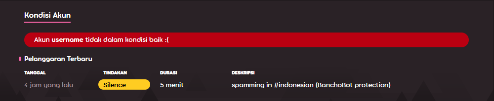

# Silence

Silence merupakan istilah yang digunakan untuk mendeskripsikan hukuman di osu! dengan membatasi akses pengguna untuk berkomunikasi dengan khalayak umum di komunitas osu!. Silence dapat dijatuhkan oleh anggota [Global Moderation Team](/wiki/People/The_Team/Global_Moderation_Team) dan [Nomination Assessment Team](/wiki/People/The_Team/Nomination_Assessment_Team), hukuman ini dijatuhkan kepada pengguna yang terbukti telah melanggar [Aturan Komunitas osu!](/wiki/Rules).

## Batasan

::: Infobox

:::

Pengguna yang dijatuhkan hukuman silence oleh moderator tidak dapat melakukan hal berikut:

- Menggunakan fitur [chat](/wiki/Chat_Console) (publik dan privat), baik dalam permainan maupun pada website
- Membuat post pada forum osu!
- Menambahkan komentar pada website (news, changelog, beatmaps)
- Berpartisipasi dalam [diskusi beatmap](/wiki/Beatmap_Discussion)
- Melakukan perubahan pada detil profil (misalnya, avatar, bagian "me!")
- Melakukan upload beatmap baru atau memperbarui beatmap yang sudah ada
- Berpartisipasi dalam [multiplayer](/wiki/Multi)

Selain itu, seluruh pesan yang dikirim oleh user tersilence dihapus dari seluruh kanal chat dan percakapan pribadi [[1]](https://blog.ppy.sh/post/38114063519/this-week-in-osu-5 "ppy blog").

::: Infobox

:::

Setelah user tersebut di silence, sebuah peringatan akan muncul pada kolom chat, dan terdapat tulisan kapan silence akan hilang. Catatan silence juga dapat dilihat pada bagian bawah profil di situs, yang dimana akan hilang setelah 28 hari.

## Mengajukan banding sebuah silence

Jika kamu percaya bahwa kamu di silence secara tidak adil, hubungi [account support team](/wiki/People/The_Team/Account_support_team#accounts@ppy.sh) di [accounts@ppy.sh](mailto:accounts@ppy.sh) untuk menggugat suatu silence. Pastikan untuk melakukan itu dari email yang terhubung dengan akun osu! kamu; sebutkan username osu! kamu, dan sertakan tanggal dan waktu ketika silence dijatuhkan.

## Alasan umum terkena silence

*Perhatian: Terlibat dalam "perilaku yang tidak pantas" dalam pesan pribadi tidak melanggar aturan, kecuali perilaku yang tidak pantas tersebut dikirimkan ke penerima lain yang tidak mau atau tidak setuju dalam pesan pribadi tersebut. Jika tindakan ini dilaporkan, maka hukuman yang sesuai akan dijatuhkan.*

- Perilaku yang tidak pantas dalam chat atau forum publik (misalnya, `#multiplayer`, atau diskusi beatmap, komentar, dll.), termasuk —tetapi tidak terbatas pada— melakukan spam, chat yang tidak masuk akal, rasisme, dll.
- Mengunggah atau memposting konten yang tidak pantas. (Misalnya, dalam avatar profil, pengiriman beatmap, rincian profil, bio dalam userpage, berbentuk banner, dll.).

Lamanya silence dapat bervariasi berdasarkan seberapa keras aturan yang dilanggar. Durasi silence bisa bertumpuk satu sama lain, saling menambahkan durasi silence. Sebagai catatan bahwa jika sebuah pelanggaran yang cukup berat terjadi, atau pemain merupakan pelanggar yang berulangkali melakukan pelanggaran yang sama, maka [restriction akun](/wiki/Help_Centre/Account_Restrictions) dapat dijatuhkan sebagai ganti silence.
