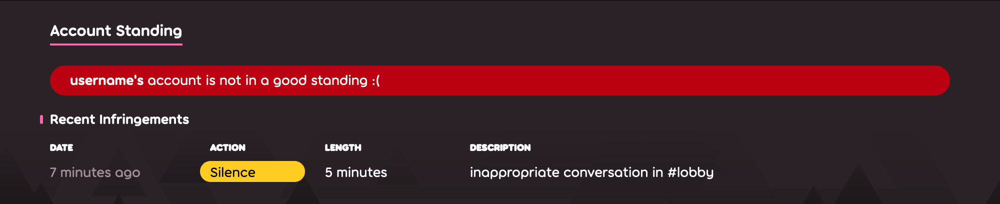
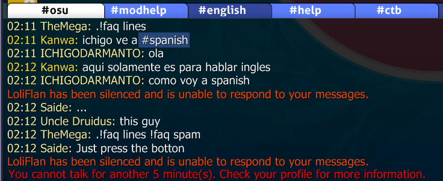

# サイレンス

**サイレンス**はユーザーのコミュニケーション手段を制限することを表す用語です。サイレンスは[Global Moderation Team](/wiki/People/Global_Moderation_Team)(GMT)と[Nomination Assessment Team](/wiki/People/Nomination_Assessment_Team)(NAT)が行うことができ、[コミュニティルール](/wiki/Rules)に従わないユーザーのみ行われます。

## 制限の内容

::: Infobox

:::

モデレーターによってサイレンスにされているユーザーは次のことができなくなります。

- ゲーム内とウェブサイトで[チャット](/wiki/Client/Interface/Chat_console)(パブリックとプライベート)で発言する
- フォーラムに投稿する
- ウェブサイト上のコメント可能なページ（ニュース、変更履歴、ビートマップなど）にコメントする
- [ビートマップのディスカッション](/wiki/Beatmap_discussion)に参加する
- プロフィールの詳細（プロフィール画像、me!など）を編集する
- ビートマップを作成・更新する
- [マルチプレイヤ－](/wiki/Client/Interface/Multiplayer)ゲームに参加する

上記に加えて、サイレンスされたユーザーの発言はすべてのパブリックチャンネルとプライベートチャンネルから削除されます。[^chat-cleanup]

::: Infobox

:::

ユーザーがサイレンスになると、チャットを入力する部分にアラートが表示され、サイレンスがいつ解除されるのかが表示されます。サイレンスの記録はユーザーページのアカウントの状態から確認でき、28日後に消えます。

## サイレンスの異議申し立て

もしあなたが不当にサイレンスを受けたと思うのであれば、異議申し立てを[アカウントサポートチーム](/wiki/People/Account_support_team#accounts@ppy.sh)の[accounts@ppy.sh](mailto:accounts@ppy.sh)まで連絡してください。その際、あなたのosu!アカウントに紐づくメールアドレスから、ユーザー名とサイレンスを受けた大体の時間を明記してください。

## サイレンスの一般的な理由

注: プライベートメッセージで「不適切な言動」を行うことは、その不適切な言動が不本意または同意のない受信者に送信しない限り、ルール違反ではありません。報告された場合は処分が下されます。

- 公開チャットやフォーラム（#マルチプレイヤー、ビートマップディスカッション、コメントなど）で不適切な言動（スパム、無意味なチャット、人種差別などを含むがこれに限らない）を行うこと
- 他の手段で不適切なコンテンツをアップロードまたは投稿すること(例：プロフィール画像、ビートマップ、プロフィールの詳細、ユーザーページのbio、バナーなど）

サイレンスの長さは、違反の深刻さによって異なる場合があります。また、違反するごとに長さが増加します。違反の度合いが大きい場合、または違反が繰り返される場合、サイレンスの代わりに[アカウント制限](/wiki/Help_centre/Account_restrictions)の対象となることがありますのでご注意ください。

## 出典

[^chat-cleanup]: [Blog post by ppy (2012-12-17) "This Week in osu!"](https://blog.ppy.sh/post/38114063519/this-week-in-osu-5)
