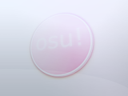
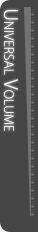
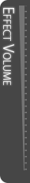
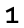
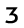
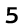
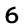
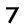

# L'Historique du skinning

Les éléments de skinning listés ici ne sont plus utilisés.

## Interface

`menu-osu.png`

| Versions | Possibilité de l'animer | Skinnable sur les beatmaps | Mode de fusion | Origine | Taille SD suggérée |
| :-: | :-: | :-: | :-: | :-: | :-: |
| Tous | ![Non][false] | ![Oui][true] | Normal | Centre | - |

Remarques :

- Cet élément a été observé à la fin d'un replay miss d'une beatmap ou en tant que spectateur (lors de la mise en mémoire tampon, de la pause ou du miss).
- Cet élément a été considéré comme un bug et a été retiré du skinning.

---

`playfield.png`

| Versions | Possibilité de l'animer | Skinnable sur les beatmaps | Mode de fusion | Origine | Taille SD suggérée |
| :-: | :-: | :-: | :-: | :-: | :-: |
| Tous | ![Non][false] | ![Oui][true] | Normal | Centre | 1366x768 |

Remarques :

- Cet élément a été supprimé et remplacé par `menu-background.jpg`.

---

`selection-selectoptions.png`

| Possibilité de l'animer | Skinnable sur les beatmaps |
| :-: | :-: |
| ![Non][false] | ![Non][false] |

Remarques :

- Cet élément a été supprimé pour une raison indéterminée.
- Ce bouton ouvrait le menu des options de la beatmap pour les beatmaps individuels. Vous pouvez toujours accéder à ce menu en cliquant avec le bouton droit de la souris sur une beatmap pendant la sélection de la musique.

---

`selection-selectoptions-over.png`

| Possibilité de l'animer | Skinnable sur les beatmaps |
| :-: | :-: |
| ![Non][false] | ![Non][false] |

Remarques :

- Cet élément a été supprimé avec `selection-selectoptions.png`

---

`volume-bg.png`

| Possibilité de l'animer | Skinnable sur les beatmaps |
| :-: | :-: |
| ![Non][false] | ![Non][false] |

Remarques :

- Cet élément a été supprimé pour une raison indéterminée.

---

`volume-bg.png-effect`

| Possibilité de l'animer | Skinnable sur les beatmaps |
| :-: | :-: |
| ![Non][false] | ![Non][false] |

Remarques :

- Cet élément a été supprimé pour une raison indéterminée.

---

`volume-bg.png`

| Possibilité de l'animer | Skinnable sur les beatmaps |
| :-: | :-: |
| ![Non][false] | ![Non][false] |

Remarques :

- Cet élément a été supprimé pour une raison indéterminée.
- La possibilité de skinner cet élément n'a pas été vérifiée, mais présumée.

---

`coin`

| Possibilité de l'animer | Skinnable sur les beatmaps |
| :-: | :-: |
| ![Non][false] | ![Non][false] |

Remarques :

- Cet élément a été skinnable pendant une seule journée dans le cadre du poisson d'avril 2015.

---

`menu-charts-click.wav`

Remarques :

- L'échantillon joué en cliquant sur `Charts` dans le menu principal.

---

`menu-charts-hover.wav`

Remarques :

- L'échantillon joué en passant la souris sur `Charts` dans le menu principal.

---

### FPS

`fps-0.png`

| Versions | Possibilité de l'animer | Skinnable sur les beatmaps | Mode de fusion | Origine | Taille SD suggérée |
| :-: | :-: | :-: | :-: | :-: | :-: |
| Tous | ![Non][false] | ![Oui][true] | Normal | (inconnu) | - |

Remarques :

- Cet élément a été supprimé avec la version Stable (Fallback).
- Exclusivement pour la version Stable (Fallback).
- Doit être activé dans les [options](/wiki/Client/Options) pour être visible.

---

`fps-1.png`

| Versions | Possibilité de l'animer | Skinnable sur les beatmaps | Mode de fusion | Origine | Taille SD suggérée |
| :-: | :-: | :-: | :-: | :-: | :-: |
| Tous | ![Non][false] | ![Oui][true] | Normal | (inconnu) | - |

Remarques :

- Cet élément a été supprimé avec la version Stable (Fallback).
- Exclusivement pour la version Stable (Fallback).
- Doit être activé dans les [options](/wiki/Client/Options) pour être visible.

---

`fps-2.png`

| Versions | Possibilité de l'animer | Skinnable sur les beatmaps | Mode de fusion | Origine | Taille SD suggérée |
| :-: | :-: | :-: | :-: | :-: | :-: |
| Tous | ![Non][false] | ![Oui][true] | Normal | (inconnu) | - |

Remarques :

- Cet élément a été supprimé avec la version Stable (Fallback).
- Exclusivement pour la version Stable (Fallback).
- Doit être activé dans les [options](/wiki/Client/Options) pour être visible.

---

`fps-3.png`

| Versions | Possibilité de l'animer | Skinnable sur les beatmaps | Mode de fusion | Origine | Taille SD suggérée |
| :-: | :-: | :-: | :-: | :-: | :-: |
| Tous | ![Non][false] | ![Oui][true] | Normal | (inconnu) | - |

Remarques :

- Cet élément a été supprimé avec la version Stable (Fallback).
- Exclusivement pour la version Stable (Fallback).
- Doit être activé dans les [options](/wiki/Client/Options) pour être visible.

---

`fps-4.png`

| Versions | Possibilité de l'animer | Skinnable sur les beatmaps | Mode de fusion | Origine | Taille SD suggérée |
| :-: | :-: | :-: | :-: | :-: | :-: |
| Tous | ![Non][false] | ![Oui][true] | Normal | (inconnu) | - |

Remarques :

- Cet élément a été supprimé avec la version Stable (Fallback).
- Exclusivement pour la version Stable (Fallback).
- Doit être activé dans les [options](/wiki/Client/Options) pour être visible.

---

`fps-5.png`

| Versions | Possibilité de l'animer | Skinnable sur les beatmaps | Mode de fusion | Origine | Taille SD suggérée |
| :-: | :-: | :-: | :-: | :-: | :-: |
| Tous | ![Non][false] | ![Oui][true] | Normal | (inconnu) | - |

Remarques :

- Cet élément a été supprimé avec la version Stable (Fallback).
- Exclusivement pour la version Stable (Fallback).
- Doit être activé dans les [options](/wiki/Client/Options) pour être visible.

---

`fps-6.png`

| Versions | Possibilité de l'animer | Skinnable sur les beatmaps | Mode de fusion | Origine | Taille SD suggérée |
| :-: | :-: | :-: | :-: | :-: | :-: |
| Tous | ![Non][false] | ![Oui][true] | Normal | (inconnu) | - |

Remarques :

- Cet élément a été supprimé avec la version Stable (Fallback).
- Exclusivement pour la version Stable (Fallback).
- Doit être activé dans les [options](/wiki/Client/Options) pour être visible.

---

`fps-7.png`

| Versions | Possibilité de l'animer | Skinnable sur les beatmaps | Mode de fusion | Origine | Taille SD suggérée |
| :-: | :-: | :-: | :-: | :-: | :-: |
| Tous | ![Non][false] | ![Oui][true] | Normal | (inconnu) | - |

Remarques :

- Cet élément a été supprimé avec la version Stable (Fallback).
- Exclusivement pour la version Stable (Fallback).
- Doit être activé dans les [options](/wiki/Client/Options) pour être visible.

---

`fps-8.png`

| Versions | Possibilité de l'animer | Skinnable sur les beatmaps | Mode de fusion | Origine | Taille SD suggérée |
| :-: | :-: | :-: | :-: | :-: | :-: |
| Tous | ![Non][false] | ![Oui][true] | Normal | (inconnu) | - |

Remarques :

- Cet élément a été supprimé avec la version Stable (Fallback).
- Exclusivement pour la version Stable (Fallback).
- Doit être activé dans les [options](/wiki/Client/Options) pour être visible.

---

`fps-9.png`

| Versions | Possibilité de l'animer | Skinnable sur les beatmaps | Mode de fusion | Origine | Taille SD suggérée |
| :-: | :-: | :-: | :-: | :-: | :-: |
| Tous | ![Non][false] | ![Oui][true] | Normal | (inconnu) | - |

Remarques :

- Cet élément a été supprimé avec la version Stable (Fallback).
- Exclusivement pour la version Stable (Fallback).
- Doit être activé dans les [options](/wiki/Client/Options) pour être visible.

---

`fps-comma.png`

| Versions | Possibilité de l'animer | Skinnable sur les beatmaps | Mode de fusion | Origine | Taille SD suggérée |
| :-: | :-: | :-: | :-: | :-: | :-: |
| Tous | ![Non][false] | ![Oui][true] | Normal | (inconnu) | - |

Remarques :

- Cet élément a été supprimé avec la version Stable (Fallback).
- Exclusivement pour la version Stable (Fallback).
- Doit être activé dans les [options](/wiki/Client/Options) pour être visible.

---

`fps-fps.png`

| Versions | Possibilité de l'animer | Skinnable sur les beatmaps | Mode de fusion | Origine | Taille SD suggérée |
| :-: | :-: | :-: | :-: | :-: | :-: |
| Tous | ![Non][false] | ![Oui][true] | Normal | (inconnu) | - |

Remarques :

- Cet élément a été supprimé avec la version Stable (Fallback).
- Exclusivement pour la version Stable (Fallback).
- Doit être activé dans les [options](/wiki/Client/Options) pour être visible.

## osu!

`hitcircleoverlay-{n}.png`

*Pour plus de détails, voir [hitcircleoverlay.png](/wiki/Skinning/osu!#hit-circles).*

Remarques :

- Nom de l'animation : `hitcircleoverlay-{n}.png`
- Fréquence de l'animation : 2 FPS (4 FPS max).
  - Cette fréquence est affecté par les mods Half Time et Double Time/Nightcore

---

`sliderstartcircleoverlay-{n}.png`

*Pour plus de détails, voir [sliderstartcircleoverlay.png](/wiki/Skinning/osu!#hit-circles).*

Remarques :

- Nom de l'animation : `sliderstartcircleoverlay-{n}.png`
- Fréquence de l'animation : 2 FPS (4 FPS max).
  - Cette fréquence est affecté par les mods Half Time et Double Time/Nightcore

---

`sliderendcircleoverlay-{n}.png`

*Pour plus de détails, voir [sliderendcircleoverlay.png](/wiki/Skinning/osu!#hit-circles).*

Remarques :

- Nom de l'animation : `sliderendcircleoverlay-{n}.png`
- Fréquence de l'animation : 2 FPS (4 FPS max).
  - Cette fréquence est affecté par les mods Half Time et Double Time/Nightcore

## .ini

`#k.ini`

Fichiers .ini séparés pour tous les keymodes d'osu!mania.

Remarques :

- Ces éléments ont été fusionnés avec le fichier skin.ini.

---

`SliderStyle:`

- Question : Quel style les sliders doivent-ils utiliser ?
- Valeur : `1` / `2`
- Valeur par défaut : `2`

Remarques :

- **Version Stable (Fallback) uniquement**
- `1` = Pistes segmentées
- `2` = Pistes gradué

---

`SliderBallFrames:`

- Question : Combien d'images voulez-vous pour l'animation du sliderball ?
- Valeur : *nombre entier positif*
- Valeur par défaut : *(vide)*

Remarques :

- Ce paramètre est réservé à [osu!](/wiki/Game_mode/osu!).
- Il dépend de la vitesse du slider

[true]: /wiki/shared/true.png
[false]: /wiki/shared/false.png
