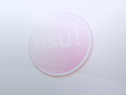
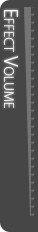
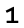
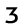
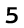
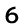
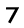
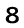

<!-- TODO: needs explanation -->

# ประวัติของ skinning

Skinning element ที่ระบุไว้ที่นี่ไม่ได้ใช้งานแล้ว

## อินเทอร์เฟซ

`menu-osu.png`

| Versions | Animatable | Beatmap Skinnable | Blend Mode | Origin | Suggested SD Size |
| :-: | :-: | :-: | :-: | :-: | :-: |
| All | ![No][false] | ![Yes][true] | Normal | Centre | - |

Notes:

- element นี้เคยปรากฏตอนท้ายของ replay บีตแมปที่ fail หรือตอน spectate (ระหว่าง buffering, pause หรือ fail)
- element นี้ถูกมองว่าเป็น bug และถูกถอดออกจากการเป็น element ที่ทำสกินได้

---

`playfield.png`

| Versions | Animatable | Beatmap Skinnable | Blend Mode | Origin | Suggested SD Size |
| :-: | :-: | :-: | :-: | :-: | :-: |
| All | ![No][false] | ![Yes][true] | Normal | Centre | 1366x768 |

Notes:

- element นี้ถูกถอดออกและถูกแทนที่ด้วย `menu-background.jpg`

---

`selection-selectoptions.png`

| Animatable | Beatmap Skinnable |
| :-: | :-: |
| ![No][false] | ![No][false] |

Notes:

- element นี้ถูกถอดออกโดยไม่ทราบสาเหตุ
- ปุ่มนี้ใช้เปิดเมนูตัวเลือกของบีตแมปสำหรับบีตแมปแต่ละอัน คุณยังเข้าถึงเมนูนี้ได้ด้วยการคลิกขวาที่บีตแมประหว่าง song selection

---

`selection-selectoptions-over.png`

| Animatable | Beatmap Skinnable |
| :-: | :-: |
| ![No][false] | ![No][false] |

Notes:

- element นี้ถูกถอดออกพร้อมกับ `selection-selectoptions.png`

---

`volume-bg.png`

| Animatable | Beatmap Skinnable |
| :-: | :-: |
| ![No][false] | ![No][false] |

Notes:

- element นี้ถูกถอดออกโดยไม่ทราบสาเหตุ

---

`volume-bg.png-effect`

| Animatable | Beatmap Skinnable |
| :-: | :-: |
| ![No][false] | ![No][false] |

Notes:

- element นี้ถูกถอดออกโดยไม่ทราบสาเหตุ

---

`volume-bg.png`

| Animatable | Beatmap Skinnable |
| :-: | :-: |
| ![No][false] | ![No][false] |

Notes:

- element นี้ถูกถอดออกโดยไม่ทราบสาเหตุ
- ความสามารถในการทำสกินให้ element นี้ยังไม่ได้รับการยืนยัน แต่สันนิษฐานว่าทำได้

---

`coin`

| Animatable | Beatmap Skinnable |
| :-: | :-: |
| ![No][false] | ![No][false] |

Notes:

- element นี้เคยทำสกินได้เพียงวันเดียวในฐานะส่วนหนึ่งของมุก April fools ปี 2015

---

`menu-charts-click.wav`

Notes:

- sample ที่เล่นเมื่อคลิก `Charts` ใน main menu

---

`menu-charts-hover.wav`

Notes:

- sample ที่เล่นเมื่อ hover เหนือ `Charts` ใน main menu

---

### FPS

`fps-0.png`

| Versions | Animatable | Beatmap Skinnable | Blend Mode | Origin | Suggested SD Size |
| :-: | :-: | :-: | :-: | :-: | :-: |
| All | ![No][false] | ![Yes][true] | Normal | (unknown) | - |

Notes:

- element นี้ถูกถอดออกพร้อมกับ stream Stable (Fallback)
- ใช้เฉพาะกับ stream Stable (Fallback)
- ต้องเปิดใช้งานใน[ตัวเลือก](/wiki/Client/Options)จึงจะเห็น

---

`fps-1.png`

| Versions | Animatable | Beatmap Skinnable | Blend Mode | Origin | Suggested SD Size |
| :-: | :-: | :-: | :-: | :-: | :-: |
| All | ![No][false] | ![Yes][true] | Normal | (unknown) | - |

Notes:

- element นี้ถูกถอดออกพร้อมกับ stream Stable (Fallback)
- ใช้เฉพาะกับ stream Stable (Fallback)
- ต้องเปิดใช้งานใน[ตัวเลือก](/wiki/Client/Options)จึงจะเห็น

---

`fps-2.png`

| Versions | Animatable | Beatmap Skinnable | Blend Mode | Origin | Suggested SD Size |
| :-: | :-: | :-: | :-: | :-: | :-: |
| All | ![No][false] | ![Yes][true] | Normal | (unknown) | - |

Notes:

- element นี้ถูกถอดออกพร้อมกับ stream Stable (Fallback)
- ใช้เฉพาะกับ stream Stable (Fallback)
- ต้องเปิดใช้งานใน[ตัวเลือก](/wiki/Client/Options)จึงจะเห็น

---

`fps-3.png`

| Versions | Animatable | Beatmap Skinnable | Blend Mode | Origin | Suggested SD Size |
| :-: | :-: | :-: | :-: | :-: | :-: |
| All | ![No][false] | ![Yes][true] | Normal | (unknown) | - |

Notes:

- element นี้ถูกถอดออกพร้อมกับ stream Stable (Fallback)
- ใช้เฉพาะกับ stream Stable (Fallback)
- ต้องเปิดใช้งานใน[ตัวเลือก](/wiki/Client/Options)จึงจะเห็น

---

`fps-4.png`

| Versions | Animatable | Beatmap Skinnable | Blend Mode | Origin | Suggested SD Size |
| :-: | :-: | :-: | :-: | :-: | :-: |
| All | ![No][false] | ![Yes][true] | Normal | (unknown) | - |

Notes:

- element นี้ถูกถอดออกพร้อมกับ stream Stable (Fallback)
- ใช้เฉพาะกับ stream Stable (Fallback)
- ต้องเปิดใช้งานใน[ตัวเลือก](/wiki/Client/Options)จึงจะเห็น

---

`fps-5.png`

| Versions | Animatable | Beatmap Skinnable | Blend Mode | Origin | Suggested SD Size |
| :-: | :-: | :-: | :-: | :-: | :-: |
| All | ![No][false] | ![Yes][true] | Normal | (unknown) | - |

Notes:

- element นี้ถูกถอดออกพร้อมกับ stream Stable (Fallback)
- ใช้เฉพาะกับ stream Stable (Fallback)
- ต้องเปิดใช้งานใน[ตัวเลือก](/wiki/Client/Options)จึงจะเห็น

---

`fps-6.png`

| Versions | Animatable | Beatmap Skinnable | Blend Mode | Origin | Suggested SD Size |
| :-: | :-: | :-: | :-: | :-: | :-: |
| All | ![No][false] | ![Yes][true] | Normal | (unknown) | - |

Notes:

- element นี้ถูกถอดออกพร้อมกับ stream Stable (Fallback)
- ใช้เฉพาะกับ stream Stable (Fallback)
- ต้องเปิดใช้งานใน[ตัวเลือก](/wiki/Client/Options)จึงจะเห็น

---

`fps-7.png`

| Versions | Animatable | Beatmap Skinnable | Blend Mode | Origin | Suggested SD Size |
| :-: | :-: | :-: | :-: | :-: | :-: |
| All | ![No][false] | ![Yes][true] | Normal | (unknown) | - |

Notes:

- element นี้ถูกถอดออกพร้อมกับ stream Stable (Fallback)
- ใช้เฉพาะกับ stream Stable (Fallback)
- ต้องเปิดใช้งานใน[ตัวเลือก](/wiki/Client/Options)จึงจะเห็น

---

`fps-8.png`

| Versions | Animatable | Beatmap Skinnable | Blend Mode | Origin | Suggested SD Size |
| :-: | :-: | :-: | :-: | :-: | :-: |
| All | ![No][false] | ![Yes][true] | Normal | (unknown) | - |

Notes:

- element นี้ถูกถอดออกพร้อมกับ stream Stable (Fallback)
- ใช้เฉพาะกับ stream Stable (Fallback)
- ต้องเปิดใช้งานใน[ตัวเลือก](/wiki/Client/Options)จึงจะเห็น

---

`fps-9.png`

| Versions | Animatable | Beatmap Skinnable | Blend Mode | Origin | Suggested SD Size |
| :-: | :-: | :-: | :-: | :-: | :-: |
| All | ![No][false] | ![Yes][true] | Normal | (unknown) | - |

Notes:

- element นี้ถูกถอดออกพร้อมกับ stream Stable (Fallback)
- ใช้เฉพาะกับ stream Stable (Fallback)
- ต้องเปิดใช้งานใน[ตัวเลือก](/wiki/Client/Options)จึงจะเห็น

---

`fps-comma.png`

| Versions | Animatable | Beatmap Skinnable | Blend Mode | Origin | Suggested SD Size |
| :-: | :-: | :-: | :-: | :-: | :-: |
| All | ![No][false] | ![Yes][true] | Normal | (unknown) | - |

Notes:

- element นี้ถูกถอดออกพร้อมกับ stream Stable (Fallback)
- ใช้เฉพาะกับ stream Stable (Fallback)
- ต้องเปิดใช้งานใน[ตัวเลือก](/wiki/Client/Options)จึงจะเห็น

---

`fps-fps.png`

| Versions | Animatable | Beatmap Skinnable | Blend Mode | Origin | Suggested SD Size |
| :-: | :-: | :-: | :-: | :-: | :-: |
| All | ![No][false] | ![Yes][true] | Normal | (unknown) | - |

Notes:

- element นี้ถูกถอดออกพร้อมกับ stream Stable (Fallback)
- ใช้เฉพาะกับ stream Stable (Fallback)
- ต้องเปิดใช้งานใน[ตัวเลือก](/wiki/Client/Options)จึงจะเห็น

## osu!

`hitcircleoverlay-{n}.png`

*ดูรายละเอียดทั้งหมดได้ที่ [hitcircleoverlay.png](/wiki/Skinning/osu!#hit-circles)*

Notes:

- ชื่อ animation: `hitcircleoverlay-{n}.png`
- Animation rate: 2 FPS (สูงสุด 4 FPS)
  - rate นี้ได้รับผลจากม็อด half time และ double time/nightcore

---

`sliderstartcircleoverlay-{n}.png`

*ดูรายละเอียดทั้งหมดได้ที่ [sliderstartcircleoverlay.png](/wiki/Skinning/osu!#hit-circles)*

Notes:

- ชื่อ animation: `sliderstartcircleoverlay-{n}.png`
- Animation rate: 2 FPS (สูงสุด 4 FPS)
  - rate นี้ได้รับผลจากม็อด half time และ double time/nightcore

---

`sliderendcircleoverlay-{n}.png`

*ดูรายละเอียดทั้งหมดได้ที่ [sliderendcircleoverlay.png](/wiki/Skinning/osu!#hit-circles)*

Notes:

- ชื่อ animation: `sliderendcircleoverlay-{n}.png`
- Animation rate: 2 FPS (สูงสุด 4 FPS)
  - rate นี้ได้รับผลจากม็อด half time และ double time/nightcore

## .ini

`#k.ini`

ไฟล์ .ini แยกสำหรับ mania keymode ทุกแบบที่ต่างกัน

Notes:

- element เหล่านี้ถูกรวมเข้ากับไฟล์ skin.ini แล้ว

---

`SliderStyle:`

- Question: slider ควรใช้ style แบบไหน?
- Value: `1` / `2`
- Default: `2`

Notes:

- **เฉพาะ stream Stable (Fallback)**
- `1` = track แบบแบ่ง segment
- `2` = track แบบ gradient

---

`SliderBallFrames:`

- Question: คุณมี sliderball animation กี่เฟรม?
- Value: *จำนวนเต็มบวก*
- Default: *(ว่าง)*

Notes:

- ใช้สำหรับ [osu!](/wiki/Game_mode/osu!) เท่านั้น
- ค่านี้ขึ้นอยู่กับ slider velocity

[true]: /wiki/shared/true.png
[false]: /wiki/shared/false.png
