# Interface skinning

*See also: [Interface](/wiki/Client/Interface)*

Interface skinning elements are used in multiple game modes or parts of the client's user interface.

## Main menu

`menu-background.jpg`

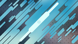

| Versions | Animatable | Beatmap Skinnable | Blend Mode | Origin | Suggested SD Size |
| :-: | :-: | :-: | :-: | :-: | :-: |
| All | ![No][false] | ![No][false] | Normal | Centre | 1366x768 (see notes) |

Notes:

- [osu!supporter](/wiki/osu!supporter) required.
- This element is positioned in the centre and is set to cover (fill the entire width and height while keeping its aspect ratio, but crop anything that is outside the game window).
- By default, osu! has a set of background images that it will cycle through.
  - If this element is skinned and the user has osu!supporter tag, this element will override this behaviour.
- This element is used as the playfield if beatmap does not have a background.
- The seasonal background option can affect the visibility of this element.
  - If it is set to `Always` the seasonal backgrounds will override this element.
  - If it is set to `Sometimes` the seasonal backgrounds will override this element while they are in active use.
- `.jpg` extension only.
  - If the image type is `.png` change the extension to `.jpg`.
    - If the background is transparent, the background colour will be black.
- The player can drag and drop an image to overwrite the skin's skinned image. **This will replace the image in the skin's folder!**

---

`welcome_text.png`

| Versions | Animatable | Beatmap Skinnable | Blend Mode | Origin | Suggested SD Size |
| :-: | :-: | :-: | :-: | :-: | :-: |
| All | ![No][false] | ![No][false] | Normal | Centre | - |

Notes:

- [osu!supporter](/wiki/osu!supporter) required.
- This element appears upon starting the client.
- This element folds out and expands, then fades out.

---

`menu-snow.png`

| Versions | Animatable | Beatmap Skinnable | Blend Mode | Origin | Suggested SD Size |
| :-: | :-: | :-: | :-: | :-: | :-: |
| All | ![No][false] | ![No][false] | Additive | Centre | 32x32 |

Notes:

- If not skinned, the current game mode's small icon will be used instead.
- Must be enabled in the [options](/wiki/Client/Options) to see.
  - This option may forcibly be enabled during the holidays (Christmas).

## Button

`button-left.png`

| Versions | Animatable | Beatmap Skinnable | Blend Mode | Origin | Suggested SD Size |
| :-: | :-: | :-: | :-: | :-: | :-: |
| All | ![No][false] | ![No][false] | Multiplicative | Top Right | - |

Notes:

- Use same height as other button pieces.
- Tinting varies by button state.

---

`button-middle.png`

| Versions | Animatable | Beatmap Skinnable | Blend Mode | Origin | Suggested SD Size |
| :-: | :-: | :-: | :-: | :-: | :-: |
| All | ![No][false] | ![No][false] | Multiplicative | Top | - |

Notes:

- This element is stretched to fit the needed width.
- Use same height as other button pieces.
- Tinting varies by button state.

---

`button-right.png`

| Versions | Animatable | Beatmap Skinnable | Blend Mode | Origin | Suggested SD Size |
| :-: | :-: | :-: | :-: | :-: | :-: |
| All | ![No][false] | ![No][false] | Multiplicative | Top Left | - |

Notes:

- Use same height as other button pieces.
- Tinting varies by button state.

## Cursor

`cursor.png`

| Versions | Animatable | Beatmap Skinnable | Blend Mode | Origin | Suggested SD Size |
| :-: | :-: | :-: | :-: | :-: | :-: |
| All | ![No][false] | ![Yes][true] | Normal | Centre | - |

Notes:

- By default, this element will rotate and expand (on click).
- [skin.ini](/wiki/Skinning/skin.ini) commands:
  - To disable cursor expand (on click), set `CursorExpand` to `0`.
  - To disable cursor rotate, set `CursorRotate` to `0`.

---

`cursormiddle.png`

| Versions | Animatable | Beatmap Skinnable | Blend Mode | Origin | Suggested SD Size |
| :-: | :-: | :-: | :-: | :-: | :-: |
| All | ![No][false] | ![Yes][true] | Normal | Centre | - |

Notes:

- This element does not rotate nor expand (on click).
- This element is above the `cursor.png` element.

---

`cursor-smoke.png`

| Versions | Animatable | Beatmap Skinnable | Blend Mode | Origin | Suggested SD Size |
| :-: | :-: | :-: | :-: | :-: | :-: |
| All | ![No][false] | ![Yes][true] | Normal | Centre | - |

Notes:

- This element is used when the player presses the smoke key.
  - By default, the smoke key is bound to `C`.

---

`cursortrail.png`

| Versions | Animatable | Beatmap Skinnable | Blend Mode | Origin | Suggested SD Size |
| :-: | :-: | :-: | :-: | :-: | :-: |
| All | ![No][false] | ![Yes][true] | Normal | Centre | - |

Notes:

- This element is underneath the `cursor.png` element
- If `cursormiddle.png` is present, a longer trail is used.
- By default, this element does not rotate.
- [skin.ini](/wiki/Skinning/skin.ini) command:
  - To enable cursortrail rotate, set `CursorTrailRotate` to `1`.

---

`cursor-ripple.png`

| Versions | Animatable | Beatmap Skinnable | Blend Mode | Origin | Suggested SD Size |
| :-: | :-: | :-: | :-: | :-: | :-: |
| All | ![No][false] | unknown | Additive | Centre | - |

Notes:

- This element is used when the player presses the Left-Click key or Right-Click key on their keyboard or mouse.
  - By default, the Left-Click key is bound to `Z`.
  - By default, the Right-Click key is bound to `X`.

## Mod icons

*Main page: [Game Modifiers](/wiki/Gameplay/Game_modifier)*

---

`selection-mod-autoplay.png`

| Versions | Animatable | Beatmap Skinnable | Blend Mode | Origin | Suggested SD Size |
| :-: | :-: | :-: | :-: | :-: | :-: |
| All | ![No][false] | ![Yes][true] | Normal | Centre | 64x64 |

---

`selection-mod-cinema.png`

| Versions | Animatable | Beatmap Skinnable | Blend Mode | Origin | Suggested SD Size |
| :-: | :-: | :-: | :-: | :-: | :-: |
| All | ![No][false] | ![Yes][true] | Normal | Centre | 64x64 |

Notes:

- Click the Auto mod icon to see this icon.

---

`selection-mod-doubletime.png`

| Versions | Animatable | Beatmap Skinnable | Blend Mode | Origin | Suggested SD Size |
| :-: | :-: | :-: | :-: | :-: | :-: |
| All | ![No][false] | ![Yes][true] | Normal | Centre | 64x64 |

---

`selection-mod-easy.png`

| Versions | Animatable | Beatmap Skinnable | Blend Mode | Origin | Suggested SD Size |
| :-: | :-: | :-: | :-: | :-: | :-: |
| All | ![No][false] | ![Yes][true] | Normal | Centre | 64x64 |

---

`selection-mod-fadein.png`

| Versions | Animatable | Beatmap Skinnable | Blend Mode | Origin | Suggested SD Size |
| :-: | :-: | :-: | :-: | :-: | :-: |
| All | ![No][false] | ![Yes][true] | Normal | Centre | 64x64 |

Notes:

- This element is [osu!mania](/wiki/Game_mode/osu!mania)-specific.

---

`selection-mod-flashlight.png`

| Versions | Animatable | Beatmap Skinnable | Blend Mode | Origin | Suggested SD Size |
| :-: | :-: | :-: | :-: | :-: | :-: |
| All | ![No][false] | ![Yes][true] | Normal | Centre | 64x64 |

---

`selection-mod-halftime.png`

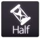

| Versions | Animatable | Beatmap Skinnable | Blend Mode | Origin | Suggested SD Size |
| :-: | :-: | :-: | :-: | :-: | :-: |
| All | ![No][false] | ![Yes][true] | Normal | Centre | 64x64 |

---

`selection-mod-hardrock.png`

| Versions | Animatable | Beatmap Skinnable | Blend Mode | Origin | Suggested SD Size |
| :-: | :-: | :-: | :-: | :-: | :-: |
| All | ![No][false] | ![Yes][true] | Normal | Centre | 64x64 |

---

`selection-mod-hidden.png`

| Versions | Animatable | Beatmap Skinnable | Blend Mode | Origin | Suggested SD Size |
| :-: | :-: | :-: | :-: | :-: | :-: |
| All | ![No][false] | ![Yes][true] | Normal | Centre | 64x64 |

Notes:

- For [osu!mania](/wiki/Game_mode/osu!mania), click the Fade In mod icon to see this icon.

---

`selection-mod-key1.png`

| Versions | Animatable | Beatmap Skinnable | Blend Mode | Origin | Suggested SD Size |
| :-: | :-: | :-: | :-: | :-: | :-: |
| All | ![No][false] | ![Yes][true] | Normal | Centre | 64x64 |

Notes:

- This element is [osu!mania](/wiki/Game_mode/osu!mania)-specific.
- Cycle through the xK mods to view.

---

`selection-mod-key2.png`

| Versions | Animatable | Beatmap Skinnable | Blend Mode | Origin | Suggested SD Size |
| :-: | :-: | :-: | :-: | :-: | :-: |
| All | ![No][false] | ![Yes][true] | Normal | Centre | 64x64 |

Notes:

- This element is [osu!mania](/wiki/Game_mode/osu!mania)-specific.
- Cycle through the xK mods to view.

---

`selection-mod-key3.png`

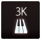

| Versions | Animatable | Beatmap Skinnable | Blend Mode | Origin | Suggested SD Size |
| :-: | :-: | :-: | :-: | :-: | :-: |
| All | ![No][false] | ![Yes][true] | Normal | Centre | 64x64 |

Notes:

- This element is [osu!mania](/wiki/Game_mode/osu!mania)-specific.
- Cycle through the xK mods to view.

---

`selection-mod-key4.png`

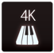

| Versions | Animatable | Beatmap Skinnable | Blend Mode | Origin | Suggested SD Size |
| :-: | :-: | :-: | :-: | :-: | :-: |
| All | ![No][false] | ![Yes][true] | Normal | Centre | 64x64 |

Notes:

- This element is [osu!mania](/wiki/Game_mode/osu!mania)-specific.

---

`selection-mod-key5.png`

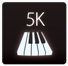

| Versions | Animatable | Beatmap Skinnable | Blend Mode | Origin | Suggested SD Size |
| :-: | :-: | :-: | :-: | :-: | :-: |
| All | ![No][false] | ![Yes][true] | Normal | Centre | 64x64 |

Notes:

- This element is [osu!mania](/wiki/Game_mode/osu!mania)-specific.
- Cycle through the xK mods to view.

---

`selection-mod-key6.png`

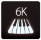

| Versions | Animatable | Beatmap Skinnable | Blend Mode | Origin | Suggested SD Size |
| :-: | :-: | :-: | :-: | :-: | :-: |
| All | ![No][false] | ![Yes][true] | Normal | Centre | 64x64 |

Notes:

- This element is [osu!mania](/wiki/Game_mode/osu!mania)-specific.
- Cycle through the xK mods to view.

---

`selection-mod-key7.png`

| Versions | Animatable | Beatmap Skinnable | Blend Mode | Origin | Suggested SD Size |
| :-: | :-: | :-: | :-: | :-: | :-: |
| All | ![No][false] | ![Yes][true] | Normal | Centre | 64x64 |

Notes:

- This element is [osu!mania](/wiki/Game_mode/osu!mania)-specific.
- Cycle through the xK mods to view.

---

`selection-mod-key8.png`

| Versions | Animatable | Beatmap Skinnable | Blend Mode | Origin | Suggested SD Size |
| :-: | :-: | :-: | :-: | :-: | :-: |
| All | ![No][false] | ![Yes][true] | Normal | Centre | 64x64 |

Notes:

- This element is [osu!mania](/wiki/Game_mode/osu!mania)-specific.
- Cycle through the xK mods to view.

---

`selection-mod-key9.png`

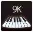

| Versions | Animatable | Beatmap Skinnable | Blend Mode | Origin | Suggested SD Size |
| :-: | :-: | :-: | :-: | :-: | :-: |
| All | ![No][false] | ![Yes][true] | Normal | Centre | 64x64 |

Notes:

- This element is [osu!mania](/wiki/Game_mode/osu!mania)-specific.
- Cycle through the xK mods to view.

---

`selection-mod-keycoop.png`

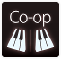

| Versions | Animatable | Beatmap Skinnable | Blend Mode | Origin | Suggested SD Size |
| :-: | :-: | :-: | :-: | :-: | :-: |
| All | ![No][false] | ![Yes][true] | Normal | Centre | 64x64 |

Notes:

- This element is [osu!mania](/wiki/Game_mode/osu!mania)-specific.

---

`selection-mod-mirror.png`

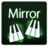

| Versions | Animatable | Beatmap Skinnable | Blend Mode | Origin | Suggested SD Size |
| :-: | :-: | :-: | :-: | :-: | :-: |
| All | ![No][false] | ![Yes][true] | Normal | Centre | 64x64 |

Notes:

- This element is [osu!mania](/wiki/Game_mode/osu!mania)-specific.

---

`selection-mod-nightcore.png`

| Versions | Animatable | Beatmap Skinnable | Blend Mode | Origin | Suggested SD Size |
| :-: | :-: | :-: | :-: | :-: | :-: |
| All | ![No][false] | ![Yes][true] | Normal | Centre | 64x64 |

Notes:

- Click the Double Time mod icon to see this icon.

---

`selection-mod-nofail.png`

| Versions | Animatable | Beatmap Skinnable | Blend Mode | Origin | Suggested SD Size |
| :-: | :-: | :-: | :-: | :-: | :-: |
| All | ![No][false] | ![Yes][true] | Normal | Centre | 64x64 |

---

`selection-mod-perfect.png`

| Versions | Animatable | Beatmap Skinnable | Blend Mode | Origin | Suggested SD Size |
| :-: | :-: | :-: | :-: | :-: | :-: |
| All | ![No][false] | ![Yes][true] | Normal | Centre | 64x64 |

Notes:

- Click the Sudden Death mod icon to see this icon.

---

`selection-mod-random.png`

| Versions | Animatable | Beatmap Skinnable | Blend Mode | Origin | Suggested SD Size |
| :-: | :-: | :-: | :-: | :-: | :-: |
| All | ![No][false] | ![Yes][true] | Normal | Centre | 64x64 |

Notes:

- This element is [osu!mania](/wiki/Game_mode/osu!mania)-specific.

---

`selection-mod-relax.png`

| Versions | Animatable | Beatmap Skinnable | Blend Mode | Origin | Suggested SD Size |
| :-: | :-: | :-: | :-: | :-: | :-: |
| All | ![No][false] | ![Yes][true] | Normal | Centre | 64x64 |

Notes:

- This element is [osu!](/wiki/Game_mode/osu!), [osu!taiko](/wiki/Game_mode/osu!taiko), and [osu!catch](/wiki/Game_mode/osu!catch)-specific mod.

---

`selection-mod-relax2.png`

| Versions | Animatable | Beatmap Skinnable | Blend Mode | Origin | Suggested SD Size |
| :-: | :-: | :-: | :-: | :-: | :-: |
| All | ![No][false] | ![Yes][true] | Normal | Centre | 64x64 |

Notes:

- This element is [osu!](/wiki/Game_mode/osu!)-specific mod.
- This mod will move the cursor for the player while the player just needs to tap or click.

---

`selection-mod-scorev2.png`

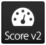

| Versions | Animatable | Beatmap Skinnable | Blend Mode | Origin | Suggested SD Size |
| :-: | :-: | :-: | :-: | :-: | :-: |
| All | ![No][false] | ![Yes][true] | Normal | Centre | 64x64 |

---

`selection-mod-spunout.png`

| Versions | Animatable | Beatmap Skinnable | Blend Mode | Origin | Suggested SD Size |
| :-: | :-: | :-: | :-: | :-: | :-: |
| All | ![No][false] | ![Yes][true] | Normal | Centre | 64x64 |

Notes:

- This element is [osu!](/wiki/Game_mode/osu!)-specific mod.

---

`selection-mod-suddendeath.png`

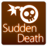

| Versions | Animatable | Beatmap Skinnable | Blend Mode | Origin | Suggested SD Size |
| :-: | :-: | :-: | :-: | :-: | :-: |
| All | ![No][false] | ![Yes][true] | Normal | Centre | 64x64 |

---

`selection-mod-target.png`

| Versions | Animatable | Beatmap Skinnable | Blend Mode | Origin | Suggested SD Size |
| :-: | :-: | :-: | :-: | :-: | :-: |
| All | ![No][false] | ![Yes][true] | Normal | Centre | 64x64 |

- This mod is available in the cuttingedge stream only.
- This element is an [osu!](/wiki/Game_mode/osu!)-specific mod.

---

`selection-mod-freemodallowed.png`

| Versions | Animatable | Beatmap Skinnable | Blend Mode | Origin | Suggested SD Size |
| :-: | :-: | :-: | :-: | :-: | :-: |
| All | ![No][false] | ![Yes][true] | Normal | Centre | 64x64 |

- This mod does not have an image in-game.
- This mod does not show up in the mod selection or leaderboards.
- Indicator for plays with certain mods and combinations.
  - Does not show up if only 'Score V2', 'Auto', 'Double Time', 'Nightcore', or 'Half Time' by itself is used, combinations with other mods including them will show the mod.

---

`selection-mod-touchdevice.png`

| Versions | Animatable | Beatmap Skinnable | Blend Mode | Origin | Suggested SD Size |
| :-: | :-: | :-: | :-: | :-: | :-: |
| All | ![No][false] | ![Yes][true] | Normal | Centre | 64x64 |

- This mod does not have an image in-game.
- This mod does not show up in the mod selection.
- Indicator for plays done using a touchscreen.
  - The client uses a background algorithm to calculate if a play is done with a touchscreen, if too many cursor warps occur it might be applied to a play.

## Offset wizard

*Main page: [Offset Wizard](/wiki/Guides/How_to_use_the_Offset_Wizard)*

---

`options-offset-tick.png`

| Versions | Animatable | Beatmap Skinnable | Blend Mode | Origin | Suggested SD Size |
| :-: | :-: | :-: | :-: | :-: | :-: |
| All | ![No][false] | ![No][false] | Multiplicative | Centre | - |

Notes:

- Tinting varies by tick state.

## Playfield

`play-skip.png`

| Versions | Animatable | Beatmap Skinnable | Blend Mode | Origin | Suggested SD Size |
| :-: | :-: | :-: | :-: | :-: | :-: |
| All | ![Yes][true] | ![Yes][true] | Multiplicative | Bottom Right | - |

Notes:

- Animation name: `play-skip-{n}.png`

---

`play-unranked.png`

| Versions | Animatable | Beatmap Skinnable | Blend Mode | Origin | Suggested SD Size |
| :-: | :-: | :-: | :-: | :-: | :-: |
| All | ![No][false] | ![Yes][true] | Multiplicative | Centre | - |

Notes:

- This element is shown when using mods that disable score submission.

---

`play-warningarrow.png`

| Versions | Animatable | Beatmap Skinnable | Blend Mode | Origin | Suggested SD Size |
| :-: | :-: | :-: | :-: | :-: | :-: |
| All | ![No][false] | ![No][false] (see notes) | Multiplicative | Centre | - |

Notes:

- Beatmap skinnable status is suspected to be a bug.
- Tinting varies by version.
  - pause screen:
    - all versions: tinted blue
  - exiting breaks:
    - v1.0: tinted white
    - v2.0+: tinted red

---

`arrow-pause.png`

| Versions | Animatable | Beatmap Skinnable | Blend Mode | Origin | Suggested SD Size |
| :-: | :-: | :-: | :-: | :-: | :-: |
| All | ![No][false] | ![No][false] (see notes) | Normal | Centre | - |

Notes:

- Beatmap skinnable status is suspected to be a bug.
- If skinned, this element overrides `play-warningarrow.png`.
- This element is used in the pause and fail screens.
- Not tinted.

---

`arrow-warning.png`

| Versions | Animatable | Beatmap Skinnable | Blend Mode | Origin | Suggested SD Size |
| :-: | :-: | :-: | :-: | :-: | :-: |
| All | ![No][false] | ![No][false] (see notes) | Normal | Centre | - |

Notes:

- Beatmap skinnable status is suspected to be a bug.
- If skinned, this element overrides `play-warningarrow.png`.
- Used for the end break warning.
- Not tinted.

---

`masking-border.png`

| Versions | Animatable | Beatmap Skinnable | Blend Mode | Origin | Suggested SD Size |
| :-: | :-: | :-: | :-: | :-: | :-: |
| All | ![No][false] | ![No][false] | Normal | Right | max height: 768px |

Notes:

- Used when playing with 4:3 storyboards on widescreen.
- While beatmapping, disable `Widescreen support` in [song setup](/wiki/Client/Beatmap_editor/Song_setup) for this to appear.
- This element is stretched to fit the needed area.
- The right pillar is flipped horizontally.

---

`multi-skipped.png`

| Versions | Animatable | Beatmap Skinnable | Blend Mode | Origin | Suggested SD Size |
| :-: | :-: | :-: | :-: | :-: | :-: |
| All | ![No][false] | ![Yes][true] | Normal | Bottom Right | 60x30 |

Notes:

- This element is used in multi games, seen next to the player's score (on the sides) when the player votes to skip the intro of a beatmap.

---

`section-fail.png`

| Versions | Animatable | Beatmap Skinnable | Blend Mode | Origin | Suggested SD Size |
| :-: | :-: | :-: | :-: | :-: | :-: |
| All | ![No][false] | ![Yes][true] | Normal | Centre | - |

Notes:

- This element is seen when the player has a low amount of HP, about less than 50%, during a long enough break.

---

`section-pass.png`

| Versions | Animatable | Beatmap Skinnable | Blend Mode | Origin | Suggested SD Size |
| :-: | :-: | :-: | :-: | :-: | :-: |
| All | ![No][false] | ![Yes][true] | Normal | Centre | - |

Notes:

- This element is seen when the player has a high amount of HP, about more than 50%, during a long enough break.

### Countdown

`count1.png`

| Versions | Animatable | Beatmap Skinnable | Blend Mode | Origin | Suggested SD Size |
| :-: | :-: | :-: | :-: | :-: | :-: |
| 1.0 | ![No][false] | ![Yes][true] | Normal | Centre | - |
| 2.0+ | ![No][false] | ![Yes][true] | Normal | Centre | - |

Notes:

- This should either say "1" or "3".

---

`count2.png`

| Versions | Animatable | Beatmap Skinnable | Blend Mode | Origin | Suggested SD Size |
| :-: | :-: | :-: | :-: | :-: | :-: |
| 1.0 | ![No][false] | ![Yes][true] | Normal | Right | - |
| 2.0+ | ![No][false] | ![Yes][true] | Normal | Centre | - |

Notes:

- This should say "2".

---

`count3.png`

| Versions | Animatable | Beatmap Skinnable | Blend Mode | Origin | Suggested SD Size |
| :-: | :-: | :-: | :-: | :-: | :-: |
| 1.0 | ![No][false] | ![Yes][true] | Normal | Left | - |
| 2.0+ | ![No][false] | ![Yes][true] | Normal | Centre | - |

Notes:

- This should either say "3" or "1".

---

`go.png`

| Versions | Animatable | Beatmap Skinnable | Blend Mode | Origin | Suggested SD Size |
| :-: | :-: | :-: | :-: | :-: | :-: |
| All | ![No][false] | ![Yes][true] | Normal | Centre | - |

Notes:

- This should say "Go!".

---

`ready.png`

| Versions | Animatable | Beatmap Skinnable | Blend Mode | Origin | Suggested SD Size |
| :-: | :-: | :-: | :-: | :-: | :-: |
| All | ![No][false] | ![Yes][true] | Normal | Centre | - |

Notes:

- This should say "Are You Ready?" or "Ready?".

### Hit bursts

*Main page: [Skinning/FAQ § Ranking screen hierarchy](/wiki/Skinning/FAQ#ranking-screen-hit-score-hierarchy)*

---

`hit0.png`

| Versions | Animatable | Beatmap Skinnable | Blend Mode | Origin | Suggested SD Size |
| :-: | :-: | :-: | :-: | :-: | :-: |
| All | ![Yes][true] (see notes) | ![Yes][true] | Normal | Centre | - |

Notes:

- Animation name: `hit0-{n}.png`
- Animation rate is fixed to 60 FPS.
- If animation is used:
  - animation does not loop, but the last frame persists until it fades out.
  - single frame behaviour is not used.

---

`hit50.png`

| Versions | Animatable | Beatmap Skinnable | Blend Mode | Origin | Suggested SD Size |
| :-: | :-: | :-: | :-: | :-: | :-: |
| All | ![Yes][true] (see notes) | ![Yes][true] | Normal | Centre | - |

Notes:

- Animation name: `hit50-{n}.png`
- Animation rate is fixed to 60 FPS.
- If animation is used:
  - animation does not loop, but the last frame persists until it fades out.
  - single frame behaviour is not used.

---

`hit100.png`

| Versions | Animatable | Beatmap Skinnable | Blend Mode | Origin | Suggested SD Size |
| :-: | :-: | :-: | :-: | :-: | :-: |
| All | ![Yes][true] (see notes) | ![Yes][true] | Normal | Centre | - |

Notes:

- Animation name: `hit100-{n}.png`
- Animation rate is fixed to 60 FPS.
- If animation is used:
  - animation does not loop, but the last frame persists until it fades out.
  - single frame behaviour is not used.

---

`hit100k.png`

| Versions | Animatable | Beatmap Skinnable | Blend Mode | Origin | Suggested SD Size |
| :-: | :-: | :-: | :-: | :-: | :-: |
| All | ![Yes][true] (see notes) | ![Yes][true] | Normal | Centre | - |

Notes:

- Animation name: `hit100k-{n}.png`
- Animation rate is fixed to 60 FPS.
- If animation is used:
  - animation does not loop, but the last frame persists until it fades out.
  - single frame behaviour is not used.

---

`hit300.png`

| Versions | Animatable | Beatmap Skinnable | Blend Mode | Origin | Suggested SD Size |
| :-: | :-: | :-: | :-: | :-: | :-: |
| All | ![Yes][true] (see notes) | ![Yes][true] | Normal | Centre | - |

Notes:

- Animation name: `hit300-{n}.png`
- Animation rate is fixed to 60 FPS.
- If animation is used:
  - animation does not loop, but the last frame persists until it fades out.
  - single frame behaviour is not used.

---

`hit300g.png`

| Versions | Animatable | Beatmap Skinnable | Blend Mode | Origin | Suggested SD Size |
| :-: | :-: | :-: | :-: | :-: | :-: |
| All | ![Yes][true] (see notes) | ![Yes][true] | Normal | Centre | - |

Notes:

- Animation name: `hit300g-{n}.png`
- Animation rate is fixed to 60 FPS.
- If animation is used:
  - animation does not loop, but the last frame persists until it fades out.
  - single frame behaviour is not used.

---

`hit300k.png`

| Versions | Animatable | Beatmap Skinnable | Blend Mode | Origin | Suggested SD Size |
| :-: | :-: | :-: | :-: | :-: | :-: |
| All | ![Yes][true] (see notes) | ![Yes][true] | Normal | Centre | - |

Notes:

- Animation name: `hit300k-{n}.png`
- Animation rate is fixed to 60 FPS.
- If animation is used:
  - animation does not loop, but the last frame persists until it fades out.
  - single frame behaviour is not used.
- This element is not shown on the ranking screen.

### Input overlay

`inputoverlay-background.png`

| Versions | Animatable | Beatmap Skinnable | Blend Mode | Origin | Suggested SD Size |
| :-: | :-: | :-: | :-: | :-: | :-: |
| All | ![No][false] | ![Yes][true] | Normal | Top Right | 193x55 |

Notes:

- This element is positioned at 320px height.
- Since the image is rotated, the origin on the image itself is Top Left.
- This element is used in [osu!](/wiki/Game_mode/osu!) and [osu!catch](/wiki/Game_mode/osu!catch).
- This element is rotated 90 degrees clockwise and stretched by 1.05x in-game.
- Must be enabled in the [options](/wiki/Client/Options) to see.

---

`inputoverlay-key.png`

| Versions | Animatable | Beatmap Skinnable | Blend Mode | Origin | Suggested SD Size |
| :-: | :-: | :-: | :-: | :-: | :-: |
| All | ![No][false] | ![Yes][true] | Multiplicative | Centre | 43x46 |

Notes:

- This element is used in [osu!](/wiki/Game_mode/osu!) and [osu!catch](/wiki/Game_mode/osu!catch).
- Positioning varies for each key:
  - 24px away from screenborder
  - K1/L: at 350px height
  - K2/R: at 398px height
  - M1/D: at 446px height
  - M2: at 492px height
- Toggleable in the [options](/wiki/Client/Options).
- Shrinks briefly when the keys are pressed.
- Tinting varies by button location and state:
  - White, if key is not pressed.
  - Yellow, if the key is pressed and located on the top half.
  - Purple, if the key is pressed and located on the bottom half.

### Pause screen

`pause-overlay.png`

| Versions | Animatable | Beatmap Skinnable | Blend Mode | Origin | Suggested SD Size |
| :-: | :-: | :-: | :-: | :-: | :-: |
| All | ![No][false] | ![Yes][true] | Normal | Centre | 1366x768 |

Notes:

- When the game is paused, the playfield will be dimmed and this file will overlay on top of it.
- This element will not stretch to fit.
- Full image height is 768px.
- Smaller images are shown with transparent borders while larger images are partially shown.
- This can also be a `.jpg` file (and can have the `.jpg` extension).
  - osu! prefers `.png` over `.jpg`.

---

`fail-background.png`

| Versions | Animatable | Beatmap Skinnable | Blend Mode | Origin | Suggested SD Size |
| :-: | :-: | :-: | :-: | :-: | :-: |
| All | ![No][false] | ![Yes][true] | Normal | Centre | 1366x768 |

Notes:

- When the player has failed, the playfield will be dimmed and this file will overlay on top of it.
- This element will stretch to fit.
- This can also be a `.jpg` file (and can have the `.jpg` extension).
  - osu! prefers `.png` over `.jpg`.

---

`pause-back.png`

| Versions | Animatable | Beatmap Skinnable | Blend Mode | Origin | Suggested SD Size |
| :-: | :-: | :-: | :-: | :-: | :-: |
| All | ![No][false] | ![Yes][true] | Normal | Centre | - |

Notes:

- This element is positioned at 576px height.
- This element is seen in the fail and pause screens.

---

`pause-continue.png`

| Versions | Animatable | Beatmap Skinnable | Blend Mode | Origin | Suggested SD Size |
| :-: | :-: | :-: | :-: | :-: | :-: |
| All | ![No][false] | ![Yes][true] | Normal | Centre | - |

- This element is positioned at 224px height.
- This element is seen in the pause screen.

---

`pause-replay.png`

| Versions | Animatable | Beatmap Skinnable | Blend Mode | Origin | Suggested SD Size |
| :-: | :-: | :-: | :-: | :-: | :-: |
| All | ![No][false] | ![No][false] | Normal | Right | - |

Notes:

- This element appears on the ranking screen (after finishing a map or viewing a score).
- This element is positioned at 672px height or at 576px height, if `pause-retry.png` is not available.

---

`pause-retry.png`

| Versions | Animatable | Beatmap Skinnable | Blend Mode | Origin | Suggested SD Size |
| :-: | :-: | :-: | :-: | :-: | :-: |
| All | ![No][false] | ![Yes][true] | Normal | (Varies) | - |

Notes:

- Positioning varies:
  - pause or fail screen:
    - Centre, positioned at 400px height
  - ranking screen:
    - Right, positioned at 576px height
- This element appears on the ranking screen after finishing a map and on the pause and fail screens.

### Scorebar

`scorebar-bg.png`

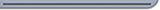

| Versions | Animatable | Beatmap Skinnable | Blend Mode | Origin | Suggested SD Size |
| :-: | :-: | :-: | :-: | :-: | :-: |
| All | ![No][false] | ![Yes][true] | Normal | Top Left | - |

Notes:

- This element has no size restrictions.
- When used in [osu!mania](/wiki/Game_mode/osu!mania), this element is rotated 90 degrees anti-clockwise, scaled to 0.7x size, and placed at the bottom right of stage.

---

`scorebar-colour.png`

| Versions | Animatable | Beatmap Skinnable | Blend Mode | Origin | Suggested SD Size |
| :-: | :-: | :-: | :-: | :-: | :-: |
| All | ![Yes][true] | ![Yes][true] | (Varies) | Top Left | max height: 120px |

Notes:

- Animation name: `scorebar-colour-{n}.png`.
- Blend mode varies:
  - Multiplicative, if `scorebar-marker.png` is used.
    - Tinted black over time when near critical zone and tinted red in the critical zone.
  - Normal, otherwise.
- Positioning varies:
  - If a marker is used, positioned at (12,12).
  - Otherwise, positioned at (5,16).
- When used in [osu!mania](/wiki/Game_mode/osu!mania), this element is rotated 90 degrees anti-clockwise, scaled to 0.7x size, and placed at the bottom right of stage.

---

`scorebar-ki.png`

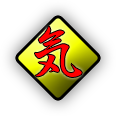

| Versions | Animatable | Beatmap Skinnable | Blend Mode | Origin | Suggested SD Size |
| :-: | :-: | :-: | :-: | :-: | :-: |
| All | ![No][false] | ![Yes][true] | Normal | Centre | - |

Notes:

- `scorebar-marker.png` has higher priority.
- This element represents the "passing" zone.
- This element is not used in [osu!mania](/wiki/Game_mode/osu!mania).
- Y-position at 16; x-position is placed at the end of the cropped `scorebar-colour.png`
- A `scorebar-colour.png` is required for this element to appear.

---

`scorebar-kidanger.png`

| Versions | Animatable | Beatmap Skinnable | Blend Mode | Origin | Suggested SD Size |
| :-: | :-: | :-: | :-: | :-: | :-: |
| All | ![No][false] | ![Yes][true] | Normal | Centre | - |

Notes:

- `scorebar-marker.png` has higher priority.
- this element represents the "warning" zone
- This element is not used in [osu!mania](/wiki/Game_mode/osu!mania)
- Y-position at 16; x-position is placed at the end of the cropped `scorebar-colour.png`
- A `scorebar-colour.png` is required for this element to appear.

---

`scorebar-kidanger2.png`

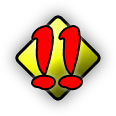

| Versions | Animatable | Beatmap Skinnable | Blend Mode | Origin | Suggested SD Size |
| :-: | :-: | :-: | :-: | :-: | :-: |
| All | ![No][false] | ![Yes][true] | Normal | Centre | - |

Notes:

- `scorebar-marker.png` has higher priority.
- This element represents the "critical" zone.
- This element is not used in [osu!mania](/wiki/Game_mode/osu!mania)
- Y-position at 16; x-position is placed at the end of the cropped `scorebar-colour.png`
- A `scorebar-colour.png` is required for this element to appear.

---

`scorebar-marker.png`

| Versions | Animatable | Beatmap Skinnable | Blend Mode | Origin | Suggested SD Size |
| :-: | :-: | :-: | :-: | :-: | :-: |
| All | ![No][false] | ![Yes][true] | Additive | Centre | - |

Notes:

- If skinned, this element overrides the `scorebar-ki.png`, `scorebar-kidanger.png`, and `scorebar-kidanger2.png` elements.
- The marker fades out if the player reaches the critical zone.
- This element is not used in [osu!mania](/wiki/Game_mode/osu!mania).
- Y-position at 16; x-position is placed at the end of the cropped `scorebar-colour.png`.

### Score numbers

`score-0.png`

| Versions | Animatable | Beatmap Skinnable | Blend Mode | Origin | Suggested SD Size |
| :-: | :-: | :-: | :-: | :-: | :-: |
| All | ![No][false] | ![Yes][true] | (Varies) | (Varies) | - |

Notes:

- By default, this is also used for the combo numbers.
- Blend mode varies:
  - If used for combo counter:
    - In [osu!](/wiki/Game_mode/osu!) and [osu!catch](/wiki/Game_mode/osu!catch), additive for the expanding after images.
    - Additionally in osu!catch, the after images are tinted using the combo colour of the fruit.
    - In osu!mania, multiplicative.

---

`score-1.png`

| Versions | Animatable | Beatmap Skinnable | Blend Mode | Origin | Suggested SD Size |
| :-: | :-: | :-: | :-: | :-: | :-: |
| All | ![No][false] | ![Yes][true] | (Varies) | (Varies) | - |

Notes:

- By default, this is also used for the combo numbers.
- Blend mode varies:
  - If used for combo counter:
    - In [osu!](/wiki/Game_mode/osu!) and [osu!catch](/wiki/Game_mode/osu!catch), additive for the expanding after images.
    - Additionally in osu!catch, the after images are tinted using the combo colour of the fruit.
    - In osu!mania, multiplicative.

---

`score-2.png`

| Versions | Animatable | Beatmap Skinnable | Blend Mode | Origin | Suggested SD Size |
| :-: | :-: | :-: | :-: | :-: | :-: |
| All | ![No][false] | ![Yes][true] | (Varies) | (Varies) | - |

Notes:

- By default, this is also used for the combo numbers.
- Blend mode varies:
  - If used for combo counter:
    - In [osu!](/wiki/Game_mode/osu!) and [osu!catch](/wiki/Game_mode/osu!catch), additive for the expanding after images.
    - Additionally in osu!catch, the after images are tinted using the combo colour of the fruit.
    - In osu!mania, multiplicative.

---

`score-3.png`

| Versions | Animatable | Beatmap Skinnable | Blend Mode | Origin | Suggested SD Size |
| :-: | :-: | :-: | :-: | :-: | :-: |
| All | ![No][false] | ![Yes][true] | (Varies) | (Varies) | - |

Notes:

- By default, this is also used for the combo numbers.
- Blend mode varies:
  - If used for combo counter:
    - In [osu!](/wiki/Game_mode/osu!) and [osu!catch](/wiki/Game_mode/osu!catch), additive for the expanding after images.
    - Additionally in osu!catch, the after images are tinted using the combo colour of the fruit.
    - In osu!mania, multiplicative.

---

`score-4.png`

| Versions | Animatable | Beatmap Skinnable | Blend Mode | Origin | Suggested SD Size |
| :-: | :-: | :-: | :-: | :-: | :-: |
| All | ![No][false] | ![Yes][true] | (Varies) | (Varies) | - |

Notes:

- By default, this is also used for the combo numbers.
- Blend mode varies:
  - If used for combo counter:
    - In [osu!](/wiki/Game_mode/osu!) and [osu!catch](/wiki/Game_mode/osu!catch), additive for the expanding after images.
    - Additionally in osu!catch, the after images are tinted using the combo colour of the fruit.
    - In osu!mania, multiplicative.

---

`score-5.png`

| Versions | Animatable | Beatmap Skinnable | Blend Mode | Origin | Suggested SD Size |
| :-: | :-: | :-: | :-: | :-: | :-: |
| All | ![No][false] | ![Yes][true] | (Varies) | (Varies) | - |

Notes:

- By default, this is also used for the combo numbers.
- Blend mode varies:
  - If used for combo counter:
    - In [osu!](/wiki/Game_mode/osu!) and [osu!catch](/wiki/Game_mode/osu!catch), additive for the expanding after images.
    - Additionally in osu!catch, the after images are tinted using the combo colour of the fruit.
    - In osu!mania, multiplicative.

---

`score-6.png`

| Versions | Animatable | Beatmap Skinnable | Blend Mode | Origin | Suggested SD Size |
| :-: | :-: | :-: | :-: | :-: | :-: |
| All | ![No][false] | ![Yes][true] | (Varies) | (Varies) | - |

Notes:

- By default, this is also used for the combo numbers.
- Blend mode varies:
  - If used for combo counter:
    - In [osu!](/wiki/Game_mode/osu!) and [osu!catch](/wiki/Game_mode/osu!catch), additive for the expanding after images.
    - Additionally in osu!catch, the after images are tinted using the combo colour of the fruit.
    - In osu!mania, multiplicative.

---

`score-7.png`

| Versions | Animatable | Beatmap Skinnable | Blend Mode | Origin | Suggested SD Size |
| :-: | :-: | :-: | :-: | :-: | :-: |
| All | ![No][false] | ![Yes][true] | (Varies) | (Varies) | - |

Notes:

- By default, this is also used for the combo numbers.
- Blend mode varies:
  - If used for combo counter:
    - In [osu!](/wiki/Game_mode/osu!) and [osu!catch](/wiki/Game_mode/osu!catch), additive for the expanding after images.
    - Additionally in osu!catch, the after images are tinted using the combo colour of the fruit.
    - In osu!mania, multiplicative.

---

`score-8.png`

| Versions | Animatable | Beatmap Skinnable | Blend Mode | Origin | Suggested SD Size |
| :-: | :-: | :-: | :-: | :-: | :-: |
| All | ![No][false] | ![Yes][true] | (Varies) | (Varies) | - |

Notes:

- By default, this is also used for the combo numbers.
- Blend mode varies:
  - If used for combo counter:
    - In [osu!](/wiki/Game_mode/osu!) and [osu!catch](/wiki/Game_mode/osu!catch), additive for the expanding after images.
    - Additionally in osu!catch, the after images are tinted using the combo colour of the fruit.
    - In osu!mania, multiplicative.

---

`score-9.png`

| Versions | Animatable | Beatmap Skinnable | Blend Mode | Origin | Suggested SD Size |
| :-: | :-: | :-: | :-: | :-: | :-: |
| All | ![No][false] | ![Yes][true] | (Varies) | (Varies) | - |

Notes:

- By default, this is also used for the combo numbers.
- Blend mode varies:
  - If used for combo counter:
    - In [osu!](/wiki/Game_mode/osu!) and [osu!catch](/wiki/Game_mode/osu!catch), additive for the expanding after images.
    - Additionally in osu!catch, the after images are tinted using the combo colour of the fruit.
    - In osu!mania, multiplicative.

---

`score-comma.png`

| Versions | Animatable | Beatmap Skinnable | Blend Mode | Origin | Suggested SD Size |
| :-: | :-: | :-: | :-: | :-: | :-: |
| All | ![No][false] | ![Yes][true] | Normal | (Varies) | 5x14 |

Notes:

- By default, this is also used for the combo numbers.
- This element is for the accuracy.
- The usage is dependent on your selected language.

---

`score-dot.png`

| Versions | Animatable | Beatmap Skinnable | Blend Mode | Origin | Suggested SD Size |
| :-: | :-: | :-: | :-: | :-: | :-: |
| All | ![No][false] | ![Yes][true] | Normal | (Varies) | 5x14 |

Notes:

- By default, this is also used for the combo numbers.
- This element is for the accuracy.
- The usage is dependent on your selected language.

---

`score-percent.png`

| Versions | Animatable | Beatmap Skinnable | Blend Mode | Origin | Suggested SD Size |
| :-: | :-: | :-: | :-: | :-: | :-: |
| All | ![No][false] | ![Yes][true] | Normal | (Varies) | 12x14 |

Notes:

- This element is for the accuracy.

---

`score-x.png`

| Versions | Animatable | Beatmap Skinnable | Blend Mode | Origin | Suggested SD Size |
| :-: | :-: | :-: | :-: | :-: | :-: |
| All | ![No][false] | ![Yes][true] | (Varies) | (Varies) | 10x14 |

Notes:

- This element is for the combo, only used in [osu!](/wiki/Game_mode/osu!).
- Blend mode varies:
  - If used for combo counter:
    - Additive for the expanding after images.

## Ranking grades

`ranking-XH.png`

| Versions | Animatable | Beatmap Skinnable | Blend Mode | Origin | Suggested SD Size |
| :-: | :-: | :-: | :-: | :-: | :-: |
| All | ![No][false] | ![No][false] | Normal | Centre | - |

Notes:

- Positioning varies:
  - 192px away from right screenborder
  - v1.0: at 272px height
  - v2.0+: at 320px height

---

`ranking-XH-small.png`

| Versions | Animatable | Beatmap Skinnable | Blend Mode | Origin | Suggested SD Size |
| :-: | :-: | :-: | :-: | :-: | :-: |
| All | ![No][false] | ![Yes][true] | Normal | (Varies) | 34x40 |

Notes:

- Origin varies:
  - Break: Centre
  - Song Select panel: Left
  - User scores: Centre

---

`ranking-X.png`

| Versions | Animatable | Beatmap Skinnable | Blend Mode | Origin | Suggested SD Size |
| :-: | :-: | :-: | :-: | :-: | :-: |
| All | ![No][false] | ![No][false] | Normal | Centre | - |

Notes:

- Positioning varies:
  - 192px away from right screenborder
  - v1.0: at 272px height
  - v2.0+: at 320px height

---

`ranking-X-small.png`

| Versions | Animatable | Beatmap Skinnable | Blend Mode | Origin | Suggested SD Size |
| :-: | :-: | :-: | :-: | :-: | :-: |
| All | ![No][false] | ![Yes][true] | Normal | (Varies) | 34x40 |

Notes:

- Origin varies:
  - Break: Centre
  - Song Select panel: Left
  - User scores: Centre

---

`ranking-SH.png`

| Versions | Animatable | Beatmap Skinnable | Blend Mode | Origin | Suggested SD Size |
| :-: | :-: | :-: | :-: | :-: | :-: |
| All | ![No][false] | ![No][false] | Normal | Centre | - |

Notes:

- Positioning varies:
  - 192px away from right screen border
  - v1.0: at 272px height
  - v2.0+: at 320px height

---

`ranking-SH-small.png`

| Versions | Animatable | Beatmap Skinnable | Blend Mode | Origin | Suggested SD Size |
| :-: | :-: | :-: | :-: | :-: | :-: |
| All | ![No][false] | ![Yes][true] | Normal | (Varies) | 34x40 |

Notes:

- Origin varies:
  - Break: Centre
  - Song Select panel: Left
  - User scores: Centre

---

`ranking-S.png`

| Versions | Animatable | Beatmap Skinnable | Blend Mode | Origin | Suggested SD Size |
| :-: | :-: | :-: | :-: | :-: | :-: |
| All | ![No][false] | ![No][false] | Normal | Centre | - |

Notes:

- Positioning varies:
  - 192px away from right screen border
  - v1.0: at 272px height
  - v2.0+: at 320px height

---

`ranking-S-small.png`

| Versions | Animatable | Beatmap Skinnable | Blend Mode | Origin | Suggested SD Size |
| :-: | :-: | :-: | :-: | :-: | :-: |
| All | ![No][false] | ![Yes][true] | Normal | (Varies) | 34x40 |

Notes:

- Origin varies:
  - Break: Centre
  - Song Select panel: Left
  - User scores: Centre

---

`ranking-A.png`

| Versions | Animatable | Beatmap Skinnable | Blend Mode | Origin | Suggested SD Size |
| :-: | :-: | :-: | :-: | :-: | :-: |
| All | ![No][false] | ![No][false] | Normal | Centre | - |

Notes:

- Positioning varies:
  - 192px away from right screen border
  - v1.0: at 272px height
  - v2.0+: at 320px height

---

`ranking-A-small.png`

| Versions | Animatable | Beatmap Skinnable | Blend Mode | Origin | Suggested SD Size |
| :-: | :-: | :-: | :-: | :-: | :-: |
| All | ![No][false] | ![Yes][true] | Normal | (Varies) | 34x40 |

Notes:

- Origin varies:
  - Break: Centre
  - Song Select panel: Left
  - User scores: Centre

---

`ranking-B.png`

| Versions | Animatable | Beatmap Skinnable | Blend Mode | Origin | Suggested SD Size |
| :-: | :-: | :-: | :-: | :-: | :-: |
| All | ![No][false] | ![No][false] | Normal | Centre | - |

Notes:

- Positioning varies:
  - 192px away from right screen border
  - v1.0: at 272px height
  - v2.0+: at 320px height

---

`ranking-B-small.png`

| Versions | Animatable | Beatmap Skinnable | Blend Mode | Origin | Suggested SD Size |
| :-: | :-: | :-: | :-: | :-: | :-: |
| All | ![No][false] | ![Yes][true] | Normal | (Varies) | 34x40 |

Notes:

- Origin varies:
  - Break: Centre
  - Song Select panel: Left
  - User scores: Centre

---

`ranking-C.png`

| Versions | Animatable | Beatmap Skinnable | Blend Mode | Origin | Suggested SD Size |
| :-: | :-: | :-: | :-: | :-: | :-: |
| All | ![No][false] | ![No][false] | Normal | Centre | - |

Notes:

- Positioning varies:
  - 192px away from right screen border
  - v1.0: at 272px height
  - v2.0+: at 320px height

---

`ranking-C-small.png`

| Versions | Animatable | Beatmap Skinnable | Blend Mode | Origin | Suggested SD Size |
| :-: | :-: | :-: | :-: | :-: | :-: |
| All | ![No][false] | ![Yes][true] | Normal | (Varies) | 34x40 |

Notes:

- Origin varies:
  - Break: Centre
  - Song Select panel: Left
  - User scores: Centre

---

`ranking-D.png`

| Versions | Animatable | Beatmap Skinnable | Blend Mode | Origin | Suggested SD Size |
| :-: | :-: | :-: | :-: | :-: | :-: |
| All | ![No][false] | ![No][false] | Normal | Centre | - |

Notes:

- Positioning varies:
  - 192px away from right screen border
  - v1.0: at 272px height
  - v2.0+: at 320px height

---

`ranking-D-small.png`

| Versions | Animatable | Beatmap Skinnable | Blend Mode | Origin | Suggested SD Size |
| :-: | :-: | :-: | :-: | :-: | :-: |
| All | ![No][false] | ![Yes][true] | Normal | (Varies) | 34x40 |

Notes:

- Origin varies:
  - Break: Centre
  - Song Select panel: Left
  - User scores: Centre

## Ranking screen

`ranking-accuracy.png`

| Versions | Animatable | Beatmap Skinnable | Blend Mode | Origin | Suggested SD Size |
| :-: | :-: | :-: | :-: | :-: | :-: |
| All | ![No][false] (see notes) | ![No][false] | Normal | Top Left | - |

Notes:

- Can be animated, but only the zeroth frame will be used.
  - Animation name: `ranking-accuracy-{n}.png`
- Positioning varies:
  - v1.0: (291,500)
  - v2.0+: (291,480)

---

`ranking-graph.png`

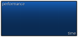

| Versions | Animatable | Beatmap Skinnable | Blend Mode | Origin | Suggested SD Size |
| :-: | :-: | :-: | :-: | :-: | :-: |
| 1.0 | ![No][false] | ![No][false] | Normal | Top Left | min: 308x156 |
| 2.0+ | ![No][false] | ![No][false] | Normal | Top Left | min: 308x148 |

Notes:

- Positioning varies:
  - v1.0: (256,576)
  - v2.0+: (256,608)
- The box itself is 301x141.
- The first 7 pixels at the top and at the left should be transparent.
  - In v1 it's shifted down by 8px.

---

`ranking-maxcombo.png`

| Versions | Animatable | Beatmap Skinnable | Blend Mode | Origin | Suggested SD Size |
| :-: | :-: | :-: | :-: | :-: | :-: |
| All | ![No][false] (see notes) | ![No][false] | Normal | Top Left | - |

Notes:

- Can be animated, but only the zeroth frame will be used.
  - Animation name: `ranking-maxcombo-{n}.png`
- Positioning varies:
  - v1.0: (8,500)
  - v2.0+: (8,480)

---

`ranking-panel.png`

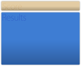

| Versions | Animatable | Beatmap Skinnable | Blend Mode | Origin | Suggested SD Size |
| :-: | :-: | :-: | :-: | :-: | :-: |
| 1.0 | ![No][false] | ![No][false] | Normal | Top Left | max height: 694px |
| 2.0+ | ![No][false] | ![No][false] | Normal | Top Left | max height: 666px |

Notes:

- Positioning varies:
  - v1.0: (0,74)
  - v2.0+: (0,102)

---

`ranking-perfect.png`

| Versions | Animatable | Beatmap Skinnable | Blend Mode | Origin | Suggested SD Size |
| :-: | :-: | :-: | :-: | :-: | :-: |
| All | ![No][false] (see notes) | ![No][false] | Normal | Centre | - |

Notes:

- Can be animated, but only the zeroth frame will be used.
  - Animation name: `ranking-perfect-{n}.png`
- Positioning varies:
  - v1.0: (320,688)
  - v2.0+: (416,688)

---

`ranking-title.png`

| Versions | Animatable | Beatmap Skinnable | Blend Mode | Origin | Suggested SD Size |
| :-: | :-: | :-: | :-: | :-: | :-: |
| All | ![No][false] | ![No][false] | Normal | Top Right | - |

Notes:

- x-position 32px away from the right side

---

`ranking-replay.png`

| Versions | Animatable | Beatmap Skinnable | Blend Mode | Origin | Suggested SD Size |
| :-: | :-: | :-: | :-: | :-: | :-: |
| 1.0 | ![No][false] | ![No][false] | Normal | Right | - |

Notes:

- Position varies:
  - at 672px height.
  - at 576px height, if retry is not available.

---

`ranking-retry.png`

| Versions | Animatable | Beatmap Skinnable | Blend Mode | Origin | Suggested SD Size |
| :-: | :-: | :-: | :-: | :-: | :-: |
| All | ![No][false] | ![No][false] | Normal | Right | - |

Notes:

- Positioned at 576px height.
- If skinned, this element overrides `pause-retry.png`.

---

`ranking-winner.png`

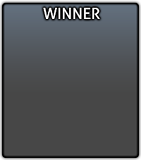

| Versions | Animatable | Beatmap Skinnable | Blend Mode | Origin | Suggested SD Size |
| :-: | :-: | :-: | :-: | :-: | :-: |
| All | ![No][false] | ![No][false] | Normal | Top Left | 200x214 |

Notes:

- This element is used in [multi](/wiki/Client/Interface/Multiplayer) only.

## Score entry

`scoreentry-0.png`

| Versions | Animatable | Beatmap Skinnable | Blend Mode | Origin | Suggested SD Size |
| :-: | :-: | :-: | :-: | :-: | :-: |
| All | ![No][false] | ![Yes][true] | Multiplicative | (varies) | 11x14 |

Notes:

- This element is used for the in-game leaderboards and input overlay.
  - For input overlay, the initial button labels are not skinnable.
- Tinting depends on use:
  - Score: white
  - Combo: cyan
  - Input overlay: use `InputOverlayText` value from [skin.ini](/wiki/Skinning/skin.ini) or black, if not defined
- Origin varies on use:
  - Score: Top Left
  - Combo: Top Right
  - Rank: Top Right
  - Input overlay: Top

---

`scoreentry-1.png`

| Versions | Animatable | Beatmap Skinnable | Blend Mode | Origin | Suggested SD Size |
| :-: | :-: | :-: | :-: | :-: | :-: |
| All | ![No][false] | ![Yes][true] | Multiplicative | (varies) | 11x14 |

Notes:

- This element is used for the in-game leaderboards and input overlay.
  - For input overlay, the initial button labels are not skinnable.
- Tinting depends on use:
  - Score: white
  - Combo: cyan
  - Input overlay: use `InputOverlayText` value from [skin.ini](/wiki/Skinning/skin.ini) or black, if not defined
- Origin varies on use:
  - Score: Top Left
  - Combo: Top Right
  - Rank: Top Right
  - Input overlay: Top

---

`scoreentry-2.png`

| Versions | Animatable | Beatmap Skinnable | Blend Mode | Origin | Suggested SD Size |
| :-: | :-: | :-: | :-: | :-: | :-: |
| All | ![No][false] | ![Yes][true] | Multiplicative | (varies) | 11x14 |

Notes:

- This element is used for the in-game leaderboards and input overlay.
  - For input overlay, the initial button labels are not skinnable.
- Tinting depends on use:
  - Score: white
  - Combo: cyan
  - Input overlay: use `InputOverlayText` value from [skin.ini](/wiki/Skinning/skin.ini) or black, if not defined
- Origin varies on use:
  - Score: Top Left
  - Combo: Top Right
  - Rank: Top Right
  - Input overlay: Top

---

`scoreentry-3.png`

| Versions | Animatable | Beatmap Skinnable | Blend Mode | Origin | Suggested SD Size |
| :-: | :-: | :-: | :-: | :-: | :-: |
| All | ![No][false] | ![Yes][true] | Multiplicative | (varies) | 11x14 |

Notes:

- This element is used for the in-game leaderboards and input overlay.
  - For input overlay, the initial button labels are not skinnable.
- Tinting depends on use:
  - Score: white
  - Combo: cyan
  - Input overlay: use `InputOverlayText` value from [skin.ini](/wiki/Skinning/skin.ini) or black, if not defined
- Origin varies on use:
  - Score: Top Left
  - Combo: Top Right
  - Rank: Top Right
  - Input overlay: Top

---

`scoreentry-4.png`

| Versions | Animatable | Beatmap Skinnable | Blend Mode | Origin | Suggested SD Size |
| :-: | :-: | :-: | :-: | :-: | :-: |
| All | ![No][false] | ![Yes][true] | Multiplicative | (varies) | 11x14 |

Notes:

- This element is used for the in-game leaderboards and input overlay.
  - For input overlay, the initial button labels are not skinnable.
- Tinting depends on use:
  - Score: white
  - Combo: cyan
  - Input overlay: use `InputOverlayText` value from [skin.ini](/wiki/Skinning/skin.ini) or black, if not defined
- Origin varies on use:
  - Score: Top Left
  - Combo: Top Right
  - Rank: Top Right
  - Input overlay: Top

---

`scoreentry-5.png`

| Versions | Animatable | Beatmap Skinnable | Blend Mode | Origin | Suggested SD Size |
| :-: | :-: | :-: | :-: | :-: | :-: |
| All | ![No][false] | ![Yes][true] | Multiplicative | (varies) | 11x14 |

Notes:

- This element is used for the in-game leaderboards and input overlay.
  - For input overlay, the initial button labels are not skinnable.
- Tinting depends on use:
  - Score: white
  - Combo: cyan
  - Input overlay: use `InputOverlayText` value from [skin.ini](/wiki/Skinning/skin.ini) or black, if not defined
- Origin varies on use:
  - Score: Top Left
  - Combo: Top Right
  - Rank: Top Right
  - Input overlay: Top

---

`scoreentry-6.png`

| Versions | Animatable | Beatmap Skinnable | Blend Mode | Origin | Suggested SD Size |
| :-: | :-: | :-: | :-: | :-: | :-: |
| All | ![No][false] | ![Yes][true] | Multiplicative | (varies) | 11x14 |

Notes:

- This element is used for the in-game leaderboards and input overlay.
  - For input overlay, the initial button labels are not skinnable.
- Tinting depends on use:
  - Score: white
  - Combo: cyan
  - Input overlay: use `InputOverlayText` value from [skin.ini](/wiki/Skinning/skin.ini) or black, if not defined
- Origin varies on use:
  - Score: Top Left
  - Combo: Top Right
  - Rank: Top Right
  - Input overlay: Top

---

`scoreentry-7.png`

| Versions | Animatable | Beatmap Skinnable | Blend Mode | Origin | Suggested SD Size |
| :-: | :-: | :-: | :-: | :-: | :-: |
| All | ![No][false] | ![Yes][true] | Multiplicative | (varies) | 11x14 |

Notes:

- This element is used for the in-game leaderboards and input overlay.
  - For input overlay, the initial button labels are not skinnable.
- Tinting depends on use:
  - Score: white
  - Combo: cyan
  - Input overlay: use `InputOverlayText` value from [skin.ini](/wiki/Skinning/skin.ini) or black, if not defined
- Origin varies on use:
  - Score: Top Left
  - Combo: Top Right
  - Rank: Top Right
  - Input overlay: Top

---

`scoreentry-8.png`

| Versions | Animatable | Beatmap Skinnable | Blend Mode | Origin | Suggested SD Size |
| :-: | :-: | :-: | :-: | :-: | :-: |
| All | ![No][false] | ![Yes][true] | Multiplicative | (varies) | 11x14 |

Notes:

- This element is used for the in-game leaderboards and input overlay.
  - For input overlay, the initial button labels are not skinnable.
- Tinting depends on use:
  - Score: white
  - Combo: cyan
  - Input overlay: use `InputOverlayText` value from [skin.ini](/wiki/Skinning/skin.ini) or black, if not defined
- Origin varies on use:
  - Score: Top Left
  - Combo: Top Right
  - Rank: Top Right
  - Input overlay: Top

---

`scoreentry-9.png`

| Versions | Animatable | Beatmap Skinnable | Blend Mode | Origin | Suggested SD Size |
| :-: | :-: | :-: | :-: | :-: | :-: |
| All | ![No][false] | ![Yes][true] | Multiplicative | (varies) | 11x14 |

Notes:

- This element is used for the in-game leaderboards and input overlay.
  - For input overlay, the initial button labels are not skinnable.
- Tinting depends on use:
  - Score: white
  - Combo: cyan
  - Input overlay: use `InputOverlayText` value from [skin.ini](/wiki/Skinning/skin.ini) or black, if not defined
- Origin varies on use:
  - Score: Top Left
  - Combo: Top Right
  - Rank: Top Right
  - Input overlay: Top

---

`scoreentry-comma.png`

| Versions | Animatable | Beatmap Skinnable | Blend Mode | Origin | Suggested SD Size |
| :-: | :-: | :-: | :-: | :-: | :-: |
| All | ![No][false] | ![Yes][true] | Multiplicative | (varies) | 5x14 |

Notes:

- This element is used for the in-game leaderboards.
- This element is used as the decimal separator.
  - Usage depends on your selected language.
- Tinting depends on use:
  - Score: white
  - Combo: cyan
- Origin varies on use:
  - Score: Top Left
  - Combo: Top Right

---

`scoreentry-dot.png`

| Versions | Animatable | Beatmap Skinnable | Blend Mode | Origin | Suggested SD Size |
| :-: | :-: | :-: | :-: | :-: | :-: |
| All | ![No][false] | ![Yes][true] | Multiplicative | Top Left | 5x14 |

Notes:

- This element is used for the in-game leaderboards.
- This element is used as the decimal separator.
  - Usage depends on your selected language.
- Tinted white.

---

`scoreentry-percent.png`

| Versions | Animatable | Beatmap Skinnable | Blend Mode | Origin | Suggested SD Size |
| :-: | :-: | :-: | :-: | :-: | :-: |
| All | ![No][false] | ![Yes][true] | Multiplicative | Top Left | 12x14 |

Notes:

- This element is used for the in-game leaderboards.
- This element is used in [Multi](/wiki/Client/Interface/Multiplayer) games when the win condition is set to Accuracy.
- Tinted white.

---

`scoreentry-x.png`

| Versions | Animatable | Beatmap Skinnable | Blend Mode | Origin | Suggested SD Size |
| :-: | :-: | :-: | :-: | :-: | :-: |
| All | ![No][false] | ![Yes][true] | Multiplicative | Top Right | 10x14 |

Notes:

- This element is used for the in-game leaderboards.
- This element is used as the multiplier symbol.
- Tinted cyan.

## Song selection

`menu-back.png`

| Versions | Animatable | Beatmap Skinnable | Blend Mode | Origin | Suggested SD Size |
| :-: | :-: | :-: | :-: | :-: | :-: |
| All | ![Yes][true] | ![No][false] | Normal | Bottom Left | 200x214 |

Notes:

- Animation name: `menu-back-{n}.png`.
- The native back button is not skinnable.
  - If this element is skinned, it will override the new one everywhere, except for the [options](/wiki/Client/Options).

---

`menu-button-background.png`

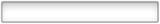

| Versions | Animatable | Beatmap Skinnable | Blend Mode | Origin | Suggested SD Size |
| :-: | :-: | :-: | :-: | :-: | :-: |
| All | ![No][false] | ![Yes][true] | Multiplicative | Bottom Left | min: 690x85 |

Notes:

- Skin versions 2.2+ can support thumbnails (must be enabled in the [options](/wiki/Client/Options)) for song selection
  - Thumbnails get positioned 9px away from the left image border
  - Thumbnail size is 115x85
- This element is used in various places:
  - scoreboards in song selection
  - button for the beatmap difficulty in song selection
  - scoreboards on the left while playing
  - button that shows the selected beatmap while waiting in a room in multiplayer
- Tinting varies by button state.

---

`rank-forum.png`

| Versions | Animatable | Beatmap Skinnable | Blend Mode | Origin | Suggested SD Size |
| :-: | :-: | :-: | :-: | :-: | :-: |
| All | ![No][false] | ![No][false] | Normal | Centre | 25x25 |

Notes:

- Any pixels outside of the 25x25 square will be cut off.

---

`selection-mode.png`

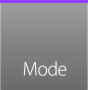

| Versions | Animatable | Beatmap Skinnable | Blend Mode | Origin | Suggested SD Size |
| :-: | :-: | :-: | :-: | :-: | :-: |
| 1.0 | ![No][false] | ![No][false] | Normal | Top Left | 92x87 |
| 2.0+ | ![No][false] | ![No][false] | Normal | Bottom Left | 92x90 |

Notes:

- In v1.0, positioning is 87px away from the bottom.

---

`selection-mode-over.png`

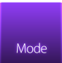

| Versions | Animatable | Beatmap Skinnable | Blend Mode | Origin | Suggested SD Size |
| :-: | :-: | :-: | :-: | :-: | :-: |
| 1.0 | ![No][false] | ![No][false] | Normal | Top Left | 92x87 |
| 2.0+ | ![No][false] | ![No][false] | Normal | Bottom Left | 92x90 |

Notes:

- Hover over `selection-mode.png` to see.
- In v1.0, positioning is 87px away from the bottom.

---

`selection-mods.png`

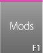

| Versions | Animatable | Beatmap Skinnable | Blend Mode | Origin | Suggested SD Size |
| :-: | :-: | :-: | :-: | :-: | :-: |
| 1.0 | ![No][false] | ![No][false] | Normal | Top Left | 77x87 |
| 2.0+ | ![No][false] | ![No][false] | Normal | Bottom Left | 77x90 |

Notes:

- In v1.0, positioning is 87px away from the bottom.

---

`selection-mods-over.png`

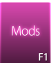

| Versions | Animatable | Beatmap Skinnable | Blend Mode | Origin | Suggested SD Size |
| :-: | :-: | :-: | :-: | :-: | :-: |
| 1.0 | ![No][false] | ![No][false] | Normal | Top Left | 77x87 |
| 2.0+ | ![No][false] | ![No][false] | Normal | Bottom Left | 77x90 |

Notes:

- Hover over `selection-mods.png` to see.
- In v1.0, positioning is 87px away from the bottom.

---

`selection-random.png`

| Versions | Animatable | Beatmap Skinnable | Blend Mode | Origin | Suggested SD Size |
| :-: | :-: | :-: | :-: | :-: | :-: |
| 1.0 | ![No][false] | ![No][false] | Normal | Top Left | 77x87 |
| 2.0+ | ![No][false] | ![No][false] | Normal | Bottom Left | 77x90 |

Notes:

- In v1.0, positioning is 87px away from the bottom.

---

`selection-random-over.png`

| Versions | Animatable | Beatmap Skinnable | Blend Mode | Origin | Suggested SD Size |
| :-: | :-: | :-: | :-: | :-: | :-: |
| 1.0 | ![No][false] | ![No][false] | Normal | Top Left | 77x87 |
| 2.0+ | ![No][false] | ![No][false] | Normal | Bottom Left | 77x90 |

Notes:

- Hover over `selection-random.png` to see.
- In v1.0, positioning is 87px away from the bottom.

---

`selection-options.png`

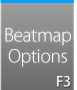

| Versions | Animatable | Beatmap Skinnable | Blend Mode | Origin | Suggested SD Size |
| :-: | :-: | :-: | :-: | :-: | :-: |
| 1.0 | ![No][false] | ![No][false] | Normal | Top Left | 77x87 |
| 2.0+ | ![No][false] | ![No][false] | Normal | Bottom Left | 77x90 |

Notes:

- In v1.0, positioning is 87px away from the bottom.

---

`selection-options-over.png`

| Versions | Animatable | Beatmap Skinnable | Blend Mode | Origin | Suggested SD Size |
| :-: | :-: | :-: | :-: | :-: | :-: |
| 1.0 | ![No][false] | ![No][false] | Normal | Top Left | 77x87 |
| 2.0+ | ![No][false] | ![No][false] | Normal | Bottom Left | 77x90 |

Notes:

- Hover over `selection-options.png` to see.
- In v1.0, positioning is 87px away from the bottom.

---

`selection-tab.png`

| Versions | Animatable | Beatmap Skinnable | Blend Mode | Origin | Suggested SD Size |
| :-: | :-: | :-: | :-: | :-: | :-: |
| All | ![No][false] | ![Yes][true] | Multiplicative | Top Left | 142x24 |

Notes:

- Depending on the client's window size, 4 to 5 tabs will be displayed.

---

`songselect-bottom.png`

| Versions | Animatable | Beatmap Skinnable | Blend Mode | Origin | Suggested SD Size |
| :-: | :-: | :-: | :-: | :-: | :-: |
| All | ![No][false] | ![No][false] | Normal | Bottom Left | - |

Notes:

- Stretches to 100% of screen width.
- Making this element too tall will prevent mouse clicks from interacting with elements below it.

---

`songselect-top.png`

| Versions | Animatable | Beatmap Skinnable | Blend Mode | Origin | Suggested SD Size |
| :-: | :-: | :-: | :-: | :-: | :-: |
| All | ![No][false] | ![No][false] | Normal | Top Left | - |

Notes:

- Rightmost few pixels repeat from a certain point
  - Repetitions are layered below the initial asset
  - Their starting point varies depending on user's in-game resolution

---

`star.png`

| Versions | Animatable | Beatmap Skinnable | Blend Mode | Origin | Suggested SD Size |
| :-: | :-: | :-: | :-: | :-: | :-: |
| All | ![No][false] | ![No][false] | Multiplicative | Centre | 50x50 |

Notes:

- This element is used for difficulty star ratings (seen in song selection).
  - v2.2+ will scale down the last star, if necessary
  - v2.1- will crop the last star, if necessary
- Tinting depends on the state of `menu-button-background.png`

---

`star2.png`

| Versions | Animatable | Beatmap Skinnable | Blend Mode | Origin | Suggested SD Size |
| :-: | :-: | :-: | :-: | :-: | :-: |
| All | ![No][false] | ![Yes][true] | Additive | Centre | 24x24 |

Notes:

- This element is used for song selection (the stars that fly from right to left), cursor, kiai time, combobursts.

### Mode select

`mode-osu.png`

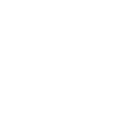

| Versions | Animatable | Beatmap Skinnable | Blend Mode | Origin | Suggested SD Size |
| :-: | :-: | :-: | :-: | :-: | :-: |
| All | ![No][false] | ![No][false] | Additive | Centre | 256x256 |

Notes:

- This element flashes in the centre of the song select screen in respect of the song's BPM.
- Select [osu!](/wiki/Game_mode/osu!) for this to be visible.

---

`mode-taiko.png`

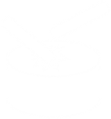

| Versions | Animatable | Beatmap Skinnable | Blend Mode | Origin | Suggested SD Size |
| :-: | :-: | :-: | :-: | :-: | :-: |
| All | ![No][false] | ![No][false] | Additive | Centre | 256x256 |

Notes:

- This element flashes in the centre of the song select screen in respect of the song's BPM.
- Select [osu!taiko](/wiki/Game_mode/osu!taiko) for this to be visible.

---

`mode-fruits.png`

| Versions | Animatable | Beatmap Skinnable | Blend Mode | Origin | Suggested SD Size |
| :-: | :-: | :-: | :-: | :-: | :-: |
| All | ![No][false] | ![No][false] | Additive | Centre | 256x256 |

Notes:

- This element flashes in the centre of the song select screen in respect of the song's BPM.
- Select [osu!catch](/wiki/Game_mode/osu!catch) for this to be visible.

---

`mode-mania.png`

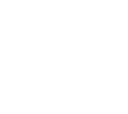

| Versions | Animatable | Beatmap Skinnable | Blend Mode | Origin | Suggested SD Size |
| :-: | :-: | :-: | :-: | :-: | :-: |
| All | ![No][false] | ![No][false] | Additive | Centre | 256x256 |

Notes:

- This element flashes in the centre of the song select screen in respect of the song's BPM.
- Select [osu!mania](/wiki/Game_mode/osu!mania) for this to be visible.

---

`mode-osu-med.png`

| Versions | Animatable | Beatmap Skinnable | Blend Mode | Origin | Suggested SD Size |
| :-: | :-: | :-: | :-: | :-: | :-: |
| All | ![No][false] | ![No][false] | Normal | Centre | 128x128 |

Notes:

- This element is used inside the game mode selection dropdown menu.
- Click on `selection-mode.png` to see.

---

`mode-taiko-med.png`

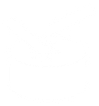

| Versions | Animatable | Beatmap Skinnable | Blend Mode | Origin | Suggested SD Size |
| :-: | :-: | :-: | :-: | :-: | :-: |
| All | ![No][false] | ![No][false] | Normal | Centre | 128x128 |

Notes:

- This element is used inside the game mode selection dropdown menu.
- Click on `selection-mode.png` to see.

---

`mode-fruits-med.png`

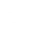

| Versions | Animatable | Beatmap Skinnable | Blend Mode | Origin | Suggested SD Size |
| :-: | :-: | :-: | :-: | :-: | :-: |
| All | ![No][false] | ![No][false] | Normal | Centre | 128x128 |

Notes:

- This element is used inside the game mode selection dropdown menu.
- Click on `selection-mode.png` to see.

---

`mode-mania-med.png`

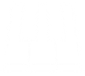

| Versions | Animatable | Beatmap Skinnable | Blend Mode | Origin | Suggested SD Size |
| :-: | :-: | :-: | :-: | :-: | :-: |
| All | ![No][false] | ![No][false] | Normal | Centre | 128x128 |

Notes:

- This element is used inside the game mode selection dropdown menu.
- Click on `selection-mode.png` to see.

---

`mode-osu-small.png`

| Versions | Animatable | Beatmap Skinnable | Blend Mode | Origin | Suggested SD Size |
| :-: | :-: | :-: | :-: | :-: | :-: |
| All | ![No][false] | ![No][false] | Additive | Centre | 32x32 |

Notes:

- This element is on top of the `selection-mode.png` element.
- Select [osu!](/wiki/Game_mode/osu!) for this to be visible.
- If the `menu-snow.png` element is not skinned, this element will be used if it is selected.

---

`mode-taiko-small.png`

| Versions | Animatable | Beatmap Skinnable | Blend Mode | Origin | Suggested SD Size |
| :-: | :-: | :-: | :-: | :-: | :-: |
| All | ![No][false] | ![No][false] | Additive | Centre | 32x32 |

Notes:

- This element is on top of the `selection-mode.png` element.
- Select [osu!taiko](/wiki/Game_mode/osu!taiko) for this to be visible.
- If the `menu-snow.png` element is not skinned, this element will be used if it is selected.

---

`mode-fruits-small.png`

| Versions | Animatable | Beatmap Skinnable | Blend Mode | Origin | Suggested SD Size |
| :-: | :-: | :-: | :-: | :-: | :-: |
| All | ![No][false] | ![No][false] | Additive | Centre | 32x32 |

Notes:

- This element is on top of the `selection-mode.png` element.
- Select [osu!catch](/wiki/Game_mode/osu!catch) for this to be visible.
- If the `menu-snow.png` element is not skinned, this element will be used if it is selected.

---

`mode-mania-small.png`

| Versions | Animatable | Beatmap Skinnable | Blend Mode | Origin | Suggested SD Size |
| :-: | :-: | :-: | :-: | :-: | :-: |
| All | ![No][false] | ![No][false] | Additive | Centre | 32x32 |

Notes:

- This element is on top of the `selection-mode.png` element.
- Select [osu!mania](/wiki/Game_mode/osu!mania) for this to be visible.
- If the `menu-snow.png` element is not skinned, this element will be used if it is selected.

[true]: /wiki/shared/true.png
[false]: /wiki/shared/false.png
