[true]: /wiki/shared/True.png
[false]: /wiki/shared/False.png

# Skinning Interface

## Welcome Screen

### menu-background.jpg

| Animatable   | Beatmap Skinnable | Skin Version(s) | Origin Point | Optimal Size | Blend Mode |
|:------------:|:-----------------:|:---------------:|:------------:|:------------:|:----------:|
| ![No][false] | ![No][false]      | all             | Centre       | 1366x768     | Normal     |

- [osu!supporter](/wiki/osu!supporter) required
- this image is used as the playfield if map does not have a background
- must be in `JPG` format

### welcome_text.png

| Animatable   | Beatmap Skinnable | Skin Version(s) | Origin Point | Optimal Size | Blend Mode |
|:------------:|:-----------------:|:---------------:|:------------:|:------------:|:----------:|
| ![No][false] | ![No][false]      | all             | Centre       | -            | Normal     |

- [osu!supporter](/wiki/osu!supporter) required
- this should say "Welcome"

### menu-snow.png

_(see small game mode icons; not included)_

| Animatable   | Beatmap Skinnable | Skin Version(s) | Origin Point | Optimal Size | Blend Mode |
|:------------:|:-----------------:|:---------------:|:------------:|:------------:|:----------:|
| ![No][false] | ![No][false]      | all             | Centre       | 32x32        | Additive   |

- togglable in the Options
  - this option could be forcibly turned on during the season
- if not skinned, the current game mode's small icon will be used instead

<!--
### triangle.png

**Currently disabled!**

| Animatable   | Beatmap Skinnable | Skin Version(s) | Origin Point | Optimal Size | Blend Mode     |
|:------------:|:-----------------:|:---------------:|:------------:|:------------:|:--------------:|
| ![No][false] | ![No][false]      | all             | Centre       | -            | Multiplicative |

- [osu!supporter](/wiki/osu!supporter) required
- togglable in the options
-->

## Cursor

### cursor.png

| Animatable   | Beatmap Skinnable | Skin Version(s) | Origin Point | Optimal Size | Blend Mode |
|:------------:|:-----------------:|:---------------:|:------------:|:------------:|:----------:|
| ![No][false] | ![Yes][true]      | all             | Centre       | -            | Normal     |

- by default, this image will rotate and expand (on click)
  - to disable cursor expand (on click), set `CursorExpand` to `0`
  - to disable cursor rotate, set `CursorRotate` to `0`

### cursormiddle.png

| Animatable   | Beatmap Skinnable | Skin Version(s) | Origin Point | Optimal Size | Blend Mode   |
|:------------:|:-----------------:|:---------------:|:------------:|:------------:|:------------:|
| ![No][false] | ![Yes][true]      | all             | Centre       | -            | varies&sup1; |

&sup1;additive (if skinned) or normal (if not)

- if this image is not skinned, the default image will not be used!
- skinning this will make the cursortrail longer
  - if you don't want to skin this, but want a long cursortrail, just use a 1x1px transparent image
- this image is not rotatable nor expandable
- cursor.png is required to skin this element

### cursor-smoke.png

| Animatable   | Beatmap Skinnable | Skin Version(s) | Origin Point | Optimal Size | Blend Mode |
|:------------:|:-----------------:|:---------------:|:------------:|:------------:|:----------:|
| ![No][false] | ![Yes][true]      | all             | Centre       | -            | Normal     |

- this is used when the player presses the smoke key
  - by default, the smoke key is binded to the `C` key

### cursortrail.png

| Animatable   | Beatmap Skinnable | Skin Version(s) | Origin Point | Optimal Size | Blend Mode |
|:------------:|:-----------------:|:---------------:|:------------:|:------------:|:----------:|
| ![No][false] | ![Yes][true]      | all             | Centre       | -            | Normal     |

- by default, this image does not rotate
  - to enable cursortrail roate, set `CursorTrailRotate` to `1`

## Buttons

These buttons are used for the beamap options menu, in the editor, lobby, and multiplayer room.

Since the button has three parts, it is best to keep the heights the same!

### button-left.png

| Animatable   | Beatmap Skinnable | Skin Version(s) | Origin Point | Optimal Size | Blend Mode           |
|:------------:|:-----------------:|:---------------:|:------------:|:------------:|:--------------------:|
| ![No][false] | ![No][false]      | all             | TopRight     | -            | Multiplicative&sup1; |

1. different colour tints depending on use

### button-middle.png

| Animatable   | Beatmap Skinnable | Skin Version(s) | Origin Point | Optimal Size | Blend Mode           |
|:------------:|:-----------------:|:---------------:|:------------:|:------------:|:--------------------:|
| ![No][false] | ![No][false]      | all             | TopRight     | -            | Multiplicative&sup1; |

1. different colour tints depending on use

- stretched to fit width

### button-right.png

| Animatable   | Beatmap Skinnable | Skin Version(s) | Origin Point | Optimal Size | Blend Mode           |
|:------------:|:-----------------:|:---------------:|:------------:|:------------:|:--------------------:|
| ![No][false] | ![No][false]      | all             | TopLeft      | -            | Multiplicative&sup1; |

1. different colour tints depending on use

## Song Selection

### menu-back.png

_(transparent; not included; see notes)_

| Animatable   | Beatmap Skinnable | Skin Version(s) | Origin Point | Optimal Size | Blend Mode |
|:------------:|:-----------------:|:---------------:|:------------:|:------------:|:----------:|
| ![Yes][true] | ![No][false]      | all             | BottomLeft   | -            | Normal     |

- animation name: `menu-back-#.png`, replace # with indexed count (start count at zero)
- osu! has a new back button; however, it is unskinnable!
  - if this element is skinned, it will override the new one everywhere; execpt for the options menu.

### menu-button-background.png

| Animatable   | Beatmap Skinnable | Skin Version(s) | Origin Point | Optimal Size | Blend Mode           |
|:------------:|:-----------------:|:---------------:|:------------:|:------------:|:--------------------:|
| ![No][false] | ![Yes][true]      | all&sup1;       | Left         | 690x85 (min) | Multiplicative&sup2; |

1. v2.2+ can support thumnails (toggleable in options), during song selection
2. the colours has different meanings:
   - white: currently selected difficulty
   - blue: other difficulties of the current set
   - pink: not played
   - orange: played
   - red: (multiplayer) download the map
   - grey: (multiplayer) host is changing maps

- this element is used in various places:
  - the leaderboard during song selection,
  - the button for the beatmap difficulty during song selection,
  - the leaderboard on the left while playing,
  - the button that shows the selected beatmap while waiting in a room in multiplayer

### selection-mode.png

| Animatable   | Beatmap Skinnable | Skin Version(s) | Origin Point | Optimal Size | Blend Mode |
|:------------:|:-----------------:|:---------------:|:------------:|:------------:|:----------:|
| ![No][false] | ![No][false]      | all             | varies&sup1; | varies&sup2; | Normal     |

1. v1.0: `TopLeft`, 87px away from bottom screenborder; v2.0+: `BottomLeft`
2. v1.0: `92x87`; v2.0+: `92x90`

### selection-mode-over.png

| Animatable   | Beatmap Skinnable | Skin Version(s) | Origin Point | Optimal Size | Blend Mode |
|:------------:|:-----------------:|:---------------:|:------------:|:------------:|:----------:|
| ![No][false] | ![No][false]      | all             | varies&sup1; | varies&sup2; | Normal     |

1. v1.0: `TopLeft`, 87px away from bottom screenborder; v2.0+: `BottomLeft`
2. v1.0: `92x87`; v2.0+: `92x90`

### selection-mods.png

| Animatable   | Beatmap Skinnable | Skin Version(s) | Origin Point | Optimal Size | Blend Mode |
|:------------:|:-----------------:|:---------------:|:------------:|:------------:|:----------:|
| ![No][false] | ![No][false]      | all             | varies&sup1; | varies&sup2; | Normal     |

1. v1.0: `TopLeft`, 87px away from bottom screenborder; v2.0+: `BottomLeft`
2. v1.0: `92x87`; v2.0+: `92x90`

### selection-mods-over.png

| Animatable   | Beatmap Skinnable | Skin Version(s) | Origin Point | Optimal Size | Blend Mode |
|:------------:|:-----------------:|:---------------:|:------------:|:------------:|:----------:|
| ![No][false] | ![No][false]      | all             | varies&sup1; | varies&sup2; | Normal     |

1. v1.0: `TopLeft`, 87px away from bottom screenborder; v2.0+: `BottomLeft`
2. v1.0: `92x87`; v2.0+: `92x90`

### selection-random.png

| Animatable   | Beatmap Skinnable | Skin Version(s) | Origin Point | Optimal Size | Blend Mode |
|:------------:|:-----------------:|:---------------:|:------------:|:------------:|:----------:|
| ![No][false] | ![No][false]      | all             | varies&sup1; | varies&sup2; | Normal     |

1. v1.0: `TopLeft`, 87px away from bottom screenborder; v2.0+: `BottomLeft`
2. v1.0: `92x87`; v2.0+: `92x90`

### selection-random-over.png

| Animatable   | Beatmap Skinnable | Skin Version(s) | Origin Point | Optimal Size | Blend Mode |
|:------------:|:-----------------:|:---------------:|:------------:|:------------:|:----------:|
| ![No][false] | ![No][false]      | all             | varies&sup1; | varies&sup2; | Normal     |

1. v1.0: `TopLeft`, 87px away from bottom screenborder; v2.0+: `BottomLeft`
2. v1.0: `92x87`; v2.0+: `92x90`

### selection-tab.png

| Animatable   | Beatmap Skinnable | Skin Version(s) | Origin Point | Optimal Size | Blend Mode           |
|:------------:|:-----------------:|:---------------:|:------------:|:------------:|:--------------------:|
| ![No][false] | ![No][false]      | all             | TopLeft      | 142x24       | Multiplicative&sup1; |

1. selected tab tinted in `255,255,255` (normal display) and unselected tabs tinted in `220,21,61`

-  depending on the osu!client's aspect ratio, 4 or 5 tabs will be displayed

### star.png

| Animatable   | Beatmap Skinnable | Skin Version(s) | Origin Point | Optimal Size | Blend Mode           |
|:------------:|:-----------------:|:---------------:|:------------:|:------------:|:--------------------:|
| ![No][false] | ![No][false]      | all&sup1;       | Centre       | 50x50        | Multiplicative&sup2; |

1. v1.0: partical star ratings; v2.0+: scaled star ratings
2. tinting varies:
   - tint colour can be changed with skin.ini
     - use `SongSelectActiveText` and `SongSelectInactiveText`
   - by default, active panel is tinted black while the inactive panel is tinted white

- used for Star Ratings

### star2.png

| Animatable   | Beatmap Skinnable | Skin Version(s) | Origin Point | Optimal Size | Blend Mode |
|:------------:|:-----------------:|:---------------:|:------------:|:------------:|:----------:|
| ![No][false] | ![No][false]      | all             | Centre       | 24x24        | Additive   |

- used for Song Selection, cursor, kiai time, combobursts

## Mode Select

### mode-osu.png

[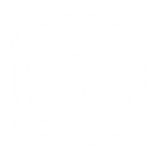](fs/mode-osu.png "Click to view full size")

| Animatable   | Beatmap Skinnable | Skin Version(s) | Origin Point | Optimal Size | Blend Mode |
|:------------:|:-----------------:|:---------------:|:------------:|:------------:|:----------:|
| ![No][false] | ![No][false]      | all             | Centre       | 256x256      | Additive   |

- this appears in the center of the song selection screen

### mode-taiko.png

| Animatable   | Beatmap Skinnable | Skin Version(s) | Origin Point | Optimal Size | Blend Mode |
|:------------:|:-----------------:|:---------------:|:------------:|:------------:|:----------:|
| ![No][false] | ![No][false]      | all             | Centre       | 256x256      | Additive   |

- this appears in the center of the song selection screen

### mode-fruits.png

[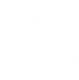](fs/mode-fruits.png "Click to view full size")

| Animatable   | Beatmap Skinnable | Skin Version(s) | Origin Point | Optimal Size | Blend Mode |
|:------------:|:-----------------:|:---------------:|:------------:|:------------:|:----------:|
| ![No][false] | ![No][false]      | all             | Centre       | 256x256      | Additive   |

- this appears in the center of the song selection screen

### mode-mania.png

[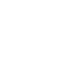](fs/mode-mania.png "Click to view full size")

| Animatable   | Beatmap Skinnable | Skin Version(s) | Origin Point | Optimal Size | Blend Mode |
|:------------:|:-----------------:|:---------------:|:------------:|:------------:|:----------:|
| ![No][false] | ![No][false]      | all             | Centre       | 256x256      | Additive   |

- this appears in the center of the song selection screen

### mode-osu-med.png

| Animatable   | Beatmap Skinnable | Skin Version(s) | Origin Point | Optimal Size | Blend Mode |
|:------------:|:-----------------:|:---------------:|:------------:|:------------:|:----------:|
| ![No][false] | ![No][false]      | all             | Centre       | 128x128      | Normal     |

- this appears inside the mode section button, when selecting the game mode

### mode-taiko-med.png

| Animatable   | Beatmap Skinnable | Skin Version(s) | Origin Point | Optimal Size | Blend Mode |
|:------------:|:-----------------:|:---------------:|:------------:|:------------:|:----------:|
| ![No][false] | ![No][false]      | all             | Centre       | 128x128      | Normal     |

- this appears inside the mode section button, when selecting the game mode

### mode-fruits-med.png

| Animatable   | Beatmap Skinnable | Skin Version(s) | Origin Point | Optimal Size | Blend Mode |
|:------------:|:-----------------:|:---------------:|:------------:|:------------:|:----------:|
| ![No][false] | ![No][false]      | all             | Centre       | 128x128      | Normal     |

- this appears inside the mode section button, when selecting the game mode

### mode-mania-med.png

| Animatable   | Beatmap Skinnable | Skin Version(s) | Origin Point | Optimal Size | Blend Mode |
|:------------:|:-----------------:|:---------------:|:------------:|:------------:|:----------:|
| ![No][false] | ![No][false]      | all             | Centre       | 128x128      | Normal     |

- this appears inside the mode section button, when selecting the game mode

### mode-osu-small.png

| Animatable   | Beatmap Skinnable | Skin Version(s) | Origin Point | Optimal Size | Blend Mode |
|:------------:|:-----------------:|:---------------:|:------------:|:------------:|:----------:|
| ![No][false] | ![No][false]      | all             | Centre       | 32x32        | Additive   |

- this appears inside the mode section button
- this image is used as the default snow, if one isn't skinned (used if this game mode is selected)

### mode-taiko-small.png

| Animatable   | Beatmap Skinnable | Skin Version(s) | Origin Point | Optimal Size | Blend Mode |
|:------------:|:-----------------:|:---------------:|:------------:|:------------:|:----------:|
| ![No][false] | ![No][false]      | all             | Centre       | 32x32        | Additive   |

- this appears inside the mode section button
- this image is used as the default snow, if one isn't skinned (used if this game mode is selected)

### mode-fruits-small.png

| Animatable   | Beatmap Skinnable | Skin Version(s) | Origin Point | Optimal Size | Blend Mode |
|:------------:|:-----------------:|:---------------:|:------------:|:------------:|:----------:|
| ![No][false] | ![No][false]      | all             | Centre       | 32x32        | Additive   |

- this appears inside the mode section button
- this image is used as the default snow, if one isn't skinned (used if this game mode is selected)

### mode-mania-small.png

| Animatable   | Beatmap Skinnable | Skin Version(s) | Origin Point | Optimal Size | Blend Mode |
|:------------:|:-----------------:|:---------------:|:------------:|:------------:|:----------:|
| ![No][false] | ![No][false]      | all             | Centre       | 32x32        | Additive   |

- this appears inside the mode section button
- this image is used as the default snow, if one isn't skinned (used if this game mode is selected)

## Mod icons

All of the game modifiers are explained at [Game Modifiers](/wiki/Game_Modifiers/).

### selection-mod-autoplay.png

| Animatable   | Beatmap Skinnable | Skin Version(s) | Origin Point | Optimal Size | Blend Mode |
|:------------:|:-----------------:|:---------------:|:------------:|:------------:|:----------:|
| ![No][false] | ![Yes][true]      | all             | Centre       | 64x64        | Normal     |

### selection-mod-cinema.png

| Animatable   | Beatmap Skinnable | Skin Version(s) | Origin Point | Optimal Size | Blend Mode |
|:------------:|:-----------------:|:---------------:|:------------:|:------------:|:----------:|
| ![No][false] | ![Yes][true]      | all             | Centre       | 64x64        | Normal     |

- this mod is seen after clicking the Autoplay mod once more

### selection-mod-doubletime.png

| Animatable   | Beatmap Skinnable | Skin Version(s) | Origin Point | Optimal Size | Blend Mode |
|:------------:|:-----------------:|:---------------:|:------------:|:------------:|:----------:|
| ![No][false] | ![Yes][true]      | all             | Centre       | 64x64        | Normal     |

### selection-mod-easy.png

| Animatable   | Beatmap Skinnable | Skin Version(s) | Origin Point | Optimal Size | Blend Mode |
|:------------:|:-----------------:|:---------------:|:------------:|:------------:|:----------:|
| ![No][false] | ![Yes][true]      | all             | Centre       | 64x64        | Normal     |

### selection-mod-fadein.png

| Animatable   | Beatmap Skinnable | Skin Version(s) | Origin Point | Optimal Size | Blend Mode |
|:------------:|:-----------------:|:---------------:|:------------:|:------------:|:----------:|
| ![No][false] | ![Yes][true]      | all             | Centre       | 64x64        | Normal     |

- this mod is only used for osu!mania

### selection-mod-flashlight.png

| Animatable   | Beatmap Skinnable | Skin Version(s) | Origin Point | Optimal Size | Blend Mode |
|:------------:|:-----------------:|:---------------:|:------------:|:------------:|:----------:|
| ![No][false] | ![Yes][true]      | all             | Centre       | 64x64        | Normal     |

### selection-mod-halftime.png

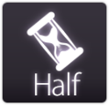

| Animatable   | Beatmap Skinnable | Skin Version(s) | Origin Point | Optimal Size | Blend Mode |
|:------------:|:-----------------:|:---------------:|:------------:|:------------:|:----------:|
| ![No][false] | ![Yes][true]      | all             | Centre       | 64x64        | Normal     |

### selection-mod-hardrock.png

| Animatable   | Beatmap Skinnable | Skin Version(s) | Origin Point | Optimal Size | Blend Mode |
|:------------:|:-----------------:|:---------------:|:------------:|:------------:|:----------:|
| ![No][false] | ![Yes][true]      | all             | Centre       | 64x64        | Normal     |

### selection-mod-hidden.png

| Animatable   | Beatmap Skinnable | Skin Version(s) | Origin Point | Optimal Size | Blend Mode |
|:------------:|:-----------------:|:---------------:|:------------:|:------------:|:----------:|
| ![No][false] | ![Yes][true]      | all             | Centre       | 64x64        | Normal     |

- for osu!mania mode, click FadeIn once more

### selection-mod-key1.png

| Animatable   | Beatmap Skinnable | Skin Version(s) | Origin Point | Optimal Size | Blend Mode |
|:------------:|:-----------------:|:---------------:|:------------:|:------------:|:----------:|
| ![No][false] | ![Yes][true]      | all             | Centre       | 64x64        | Normal     |

- this mod is only used for osu!mania

### selection-mod-key2.png

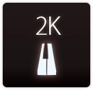

| Animatable   | Beatmap Skinnable | Skin Version(s) | Origin Point | Optimal Size | Blend Mode |
|:------------:|:-----------------:|:---------------:|:------------:|:------------:|:----------:|
| ![No][false] | ![Yes][true]      | all             | Centre       | 64x64        | Normal     |

- this mod is only used for osu!mania

### selection-mod-key3.png

| Animatable   | Beatmap Skinnable | Skin Version(s) | Origin Point | Optimal Size | Blend Mode |
|:------------:|:-----------------:|:---------------:|:------------:|:------------:|:----------:|
| ![No][false] | ![Yes][true]      | all             | Centre       | 64x64        | Normal     |

- this mod is only used for osu!mania

### selection-mod-key4.png

| Animatable   | Beatmap Skinnable | Skin Version(s) | Origin Point | Optimal Size | Blend Mode |
|:------------:|:-----------------:|:---------------:|:------------:|:------------:|:----------:|
| ![No][false] | ![Yes][true]      | all             | Centre       | 64x64        | Normal     |

- this mod is only used for osu!mania

### selection-mod-key5.png

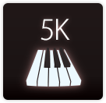

| Animatable   | Beatmap Skinnable | Skin Version(s) | Origin Point | Optimal Size | Blend Mode |
|:------------:|:-----------------:|:---------------:|:------------:|:------------:|:----------:|
| ![No][false] | ![Yes][true]      | all             | Centre       | 64x64        | Normal     |

- this mod is only used for osu!mania

### selection-mod-key6.png

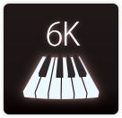

| Animatable   | Beatmap Skinnable | Skin Version(s) | Origin Point | Optimal Size | Blend Mode |
|:------------:|:-----------------:|:---------------:|:------------:|:------------:|:----------:|
| ![No][false] | ![Yes][true]      | all             | Centre       | 64x64        | Normal     |

- this mod is only used for osu!mania

### selection-mod-key7.png

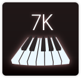

| Animatable   | Beatmap Skinnable | Skin Version(s) | Origin Point | Optimal Size | Blend Mode |
|:------------:|:-----------------:|:---------------:|:------------:|:------------:|:----------:|
| ![No][false] | ![Yes][true]      | all             | Centre       | 64x64        | Normal     |

- this mod is only used for osu!mania

### selection-mod-key8.png

| Animatable   | Beatmap Skinnable | Skin Version(s) | Origin Point | Optimal Size | Blend Mode |
|:------------:|:-----------------:|:---------------:|:------------:|:------------:|:----------:|
| ![No][false] | ![Yes][true]      | all             | Centre       | 64x64        | Normal     |

- this mod is only used for osu!mania

### selection-mod-key9.png

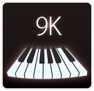

| Animatable   | Beatmap Skinnable | Skin Version(s) | Origin Point | Optimal Size | Blend Mode |
|:------------:|:-----------------:|:---------------:|:------------:|:------------:|:----------:|
| ![No][false] | ![Yes][true]      | all             | Centre       | 64x64        | Normal     |

- this mod is only used for osu!mania

### selection-mod-keycoop.png

| Animatable   | Beatmap Skinnable | Skin Version(s) | Origin Point | Optimal Size | Blend Mode |
|:------------:|:-----------------:|:---------------:|:------------:|:------------:|:----------:|
| ![No][false] | ![Yes][true]      | all             | Centre       | 64x64        | Normal     |

- this mod is only used for osu!mania

### selection-mod-nightcore.png

| Animatable   | Beatmap Skinnable | Skin Version(s) | Origin Point | Optimal Size | Blend Mode |
|:------------:|:-----------------:|:---------------:|:------------:|:------------:|:----------:|
| ![No][false] | ![Yes][true]      | all             | Centre       | 64x64        | Normal     |

- this mod is seen after clicking the DoubleTime mod once more

### selection-mod-nofail.png

| Animatable   | Beatmap Skinnable | Skin Version(s) | Origin Point | Optimal Size | Blend Mode |
|:------------:|:-----------------:|:---------------:|:------------:|:------------:|:----------:|
| ![No][false] | ![Yes][true]      | all             | Centre       | 64x64        | Normal     |

### selection-mod-perfect.png

| Animatable   | Beatmap Skinnable | Skin Version(s) | Origin Point | Optimal Size | Blend Mode |
|:------------:|:-----------------:|:---------------:|:------------:|:------------:|:----------:|
| ![No][false] | ![Yes][true]      | all             | Centre       | 64x64        | Normal     |

- this mod is seen after clicking the SuddenDeath mod once more

### selection-mod-random.png

| Animatable   | Beatmap Skinnable | Skin Version(s) | Origin Point | Optimal Size | Blend Mode |
|:------------:|:-----------------:|:---------------:|:------------:|:------------:|:----------:|
| ![No][false] | ![Yes][true]      | all             | Centre       | 64x64        | Normal     |

- this mod is only used for osu!mania

### selection-mod-relax.png

| Animatable   | Beatmap Skinnable | Skin Version(s) | Origin Point | Optimal Size | Blend Mode |
|:------------:|:-----------------:|:---------------:|:------------:|:------------:|:----------:|
| ![No][false] | ![Yes][true]      | all             | Centre       | 64x64        | Normal     |

- this mod is not used for osu!mania
- _Relax_
  - this mod will auto-click for the player, the player just needs to move the cursor

### selection-mod-relax2.png

| Animatable   | Beatmap Skinnable | Skin Version(s) | Origin Point | Optimal Size | Blend Mode |
|:------------:|:-----------------:|:---------------:|:------------:|:------------:|:----------:|
| ![No][false] | ![Yes][true]      | all             | Centre       | 64x64        | Normal     |

- this mod is only used for osu!standard
- _Auto Pilot_
  - this mod will move the mouse for the player, the player just needs to tap or click

### selection-mod-spunout.png

| Animatable   | Beatmap Skinnable | Skin Version(s) | Origin Point | Optimal Size | Blend Mode |
|:------------:|:-----------------:|:---------------:|:------------:|:------------:|:----------:|
| ![No][false] | ![Yes][true]      | all             | Centre       | 64x64        | Normal     |

- this mod is only used for osu!standard

### selection-mod-suddendeath.png

| Animatable   | Beatmap Skinnable | Skin Version(s) | Origin Point | Optimal Size | Blend Mode |
|:------------:|:-----------------:|:---------------:|:------------:|:------------:|:----------:|
| ![No][false] | ![Yes][true]      | all             | Centre       | 64x64        | Normal     |

### selection-mod-target.png

| Animatable   | Beatmap Skinnable | Skin Version(s) | Origin Point | Optimal Size | Blend Mode |
|:------------:|:-----------------:|:---------------:|:------------:|:------------:|:----------:|
| ![No][false] | ![Yes][true]      | all             | Centre       | 64x64        | Normal     |

- this mod id only available for the cuttingedge stream only
- this mod is only used for osu!standard

## Scorebar

### scorebar-bg.png

[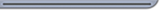](fs/scorebar-bg.png "Click to view full size")

| Animatable   | Beatmap Skinnable | Skin Version(s) | Origin Point | Optimal Size | Blend Mode |
|:------------:|:-----------------:|:---------------:|:------------:|:------------:|:----------:|
| ![No][false] | ![Yes][true]      | all             | TopLeft      | -            | Normal     |

- no size restrictions
- when used for osu!mania, this image is rotated 90deg CCW and is placed at the bottom right of stage

### scorebar-colour.png

| Animatable   | Beatmap Skinnable | Skin Version(s) | Origin Point  | Optimal Size | Blend Mode   |
|:------------:|:-----------------:|:---------------:|:-------------:|:------------:|:------------:|
| ![Yes][true] | ![Yes][true]      | all             | TopLeft&sup1; | -            | varies&sup2; |

1. positioned at (5,16); if a marker is used, positioned at (12,12)
2. depends if a marker is skinned:
   - normal, if not
   - multiplicative, if so

- animation name: `scorebar-colour-#.png`, replace # with indexed count (start count at zero)
- tinted black over time when near critical zone and tinted red in the critical zone
- no size restrictions
- when used for osu!mania, this image is rotated 90deg CCW and is placed at the bottom right of stage

### scorebar-ki.png

| Animatable   | Beatmap Skinnable | Skin Version(s) | Origin Point | Optimal Size | Blend Mode |
|:------------:|:-----------------:|:---------------:|:------------:|:------------:|:----------:|
| ![No][false] | ![Yes][true]      | all             | Centre&sup1; | -            | Normal     |

1. positioned at 16px from top

- v2.0+, `scorebar-marker.png` has higher priority
- this image represents the "passing" zone
- this image is not used in osu!mania

### scorebar-kidanger.png

| Animatable   | Beatmap Skinnable | Skin Version(s) | Origin Point | Optimal Size | Blend Mode |
|:------------:|:-----------------:|:---------------:|:------------:|:------------:|:----------:|
| ![No][false] | ![Yes][true]      | all             | Centre&sup1; | -            | Normal     |

1. positioned at 16px from top

- v2.0+, `scorebar-marker.png` has higher priority
- this image represents the "warning" zone
- this image is not used in osu!mania

### scorebar-kidanger2.png

| Animatable   | Beatmap Skinnable | Skin Version(s) | Origin Point | Optimal Size | Blend Mode |
|:------------:|:-----------------:|:---------------:|:------------:|:------------:|:----------:|
| ![No][false] | ![Yes][true]      | all             | Centre&sup1; | -            | Normal     |

1. positioned at 16px from top

- v2.0+, `scorebar-marker.png` has higher priority
- this image represents the "danger" zone
- this image is not used in osu!mania

### scorebar-marker.png

| Animatable   | Beatmap Skinnable | Skin Version(s) | Origin Point | Optimal Size | Blend Mode |
|:------------:|:-----------------:|:---------------:|:------------:|:------------:|:----------:|
| ![No][false] | ![Yes][true]      | all             | Centre       | -            | Normal     |

- if skinned, this element overrides the `scorebar-ki.png`, `scorebar-kidanger.png`, and `scorebar-kidanger2.png` elements
- the marker darkens if the player reaches the critical zone
- this image is not used in osu!mania

## Countdown

### count1.png

| Animatable   | Beatmap Skinnable | Skin Version(s) | Origin Point | Optimal Size | Blend Mode |
|:------------:|:-----------------:|:---------------:|:------------:|:------------:|:----------:|
| ![No][false] | ![Yes][true]      | all             | Centre       | -            | Normal     |

- this could either say "1" or "3"

### count2.png

| Animatable   | Beatmap Skinnable | Skin Version(s) | Origin Point | Optimal Size | Blend Mode |
|:------------:|:-----------------:|:---------------:|:------------:|:------------:|:----------:|
| ![No][false] | ![Yes][true]      | all             | varies&sup1; | -            | Normal     |

1. anchor changes (version dependent):
   - v1.0: TopRight
   - v2.0+: Centre

- this should say "2"

### count3.png

| Animatable   | Beatmap Skinnable | Skin Version(s) | Origin Point | Optimal Size | Blend Mode |
|:------------:|:-----------------:|:---------------:|:------------:|:------------:|:----------:|
| ![No][false] | ![Yes][true]      | all             | varies&sup1; | -            | Normal     |

1. anchor changes (version dependent):
   - v1.0: TopLeft
   - v2.0+: Centre

- this could either say "3" or "1"

### go.png

| Animatable   | Beatmap Skinnable | Skin Version(s) | Origin Point | Optimal Size | Blend Mode |
|:------------:|:-----------------:|:---------------:|:------------:|:------------:|:----------:|
| ![No][false] | ![Yes][true]      | all             | Centre       | -            | Normal     |

- this should say "Go!"

### ready.png

| Animatable   | Beatmap Skinnable | Skin Version(s) | Origin Point | Optimal Size | Blend Mode |
|:------------:|:-----------------:|:---------------:|:------------:|:------------:|:----------:|
| ![No][false] | ![Yes][true]      | all             | Centre       | -            | Normal     |

- this should say "Are You Ready?" or "Ready?"

## Pause Screen

### pause-overlay.png

_(transparent; not included)_

| Animatable   | Beatmap Skinnable | Skin Version(s) | Origin Point | Optimal Size | Blend Mode |
|:------------:|:-----------------:|:---------------:|:------------:|:------------:|:----------:|
| ![No][false] | ![Yes][true]      | all             | Centre       | 1366x768     | Normal     |

- if one is not skinned, the default is to dim the background
- this image is **not** streched to fit
- full image height is at 768px

### fail-background.png

_(transparent; not included)_

| Animatable   | Beatmap Skinnable | Skin Version(s) | Origin Point | Optimal Size | Blend Mode |
|:------------:|:-----------------:|:---------------:|:------------:|:------------:|:----------:|
| ![No][false] | ![Yes][true]      | all             | Centre       | 1366x768     | Normal     |

- if one is not skinned, the default is to dim the background
- this image is streched to fit height

### pause-back.png

| Animatable   | Beatmap Skinnable | Skin Version(s) | Origin Point | Optimal Size | Blend Mode |
|:------------:|:-----------------:|:---------------:|:------------:|:------------:|:----------:|
| ![No][false] | ![Yes][true]      | all             | Centre       | -            | Normal     |

- this element appears when game is paused or failed

### pause-continue.png

| Animatable   | Beatmap Skinnable | Skin Version(s) | Origin Point | Optimal Size | Blend Mode |
|:------------:|:-----------------:|:---------------:|:------------:|:------------:|:----------:|
| ![No][false] | ![Yes][true]      | all             | Centre       | -            | Normal     |

- this element appears when game is paused

### pause-replay.png

| Animatable   | Beatmap Skinnable | Skin Version(s) | Origin Point | Optimal Size | Blend Mode |
|:------------:|:-----------------:|:---------------:|:------------:|:------------:|:----------:|
| ![No][false] | ![Yes][true]      | all             | Centre       | -            | Normal     |

- this element appears at the ranking screen (after finishing a map or viewing a score)
- this overrides `ranking-replay.png` in v2.0+

### pause-retry.png

| Animatable   | Beatmap Skinnable | Skin Version(s) | Origin Point | Optimal Size | Blend Mode |
|:------------:|:-----------------:|:---------------:|:------------:|:------------:|:----------:|
| ![No][false] | ![Yes][true]      | all             | Centre       | -            | Normal     |

- this element appears at ranking screen (after finishing a map) or when game is paused or failed
- this overrides `ranking-retry.png` in v2.0+

## Score numbers

### score-0.png

| Animatable   | Beatmap Skinnable | Skin Version(s) | Origin Point | Optimal Size | Blend Mode           |
|:------------:|:-----------------:|:---------------:|:------------:|:------------:|:--------------------:|
| ![No][false] | ![Yes][true]      | all             | varies&sup1; | -            | Multiplicative&sup2; |

1. depends on game mode
2. tint colour is difference per use
   - score = white
   - combo = cyan
   - input = colour from `InputOverlayText` (default: black)

- by default, this is also the combo numbers

### score-1.png

| Animatable   | Beatmap Skinnable | Skin Version(s) | Origin Point | Optimal Size | Blend Mode           |
|:------------:|:-----------------:|:---------------:|:------------:|:------------:|:--------------------:|
| ![No][false] | ![Yes][true]      | all             | varies&sup1; | -            | Multiplicative&sup2; |

1. depends on game mode
2. tint colour is difference per use
   - score = white
   - combo = cyan
   - input = colour from `InputOverlayText` (default: black)

- by default, this is also the combo numbers

### score-2.png

| Animatable   | Beatmap Skinnable | Skin Version(s) | Origin Point | Optimal Size | Blend Mode           |
|:------------:|:-----------------:|:---------------:|:------------:|:------------:|:--------------------:|
| ![No][false] | ![Yes][true]      | all             | varies&sup1; | -            | Multiplicative&sup2; |

1. depends on game mode
2. tint colour is difference per use
   - score = white
   - combo = cyan
   - input = colour from `InputOverlayText` (default: black)

- by default, this is also the combo numbers

### score-3.png

| Animatable   | Beatmap Skinnable | Skin Version(s) | Origin Point | Optimal Size | Blend Mode           |
|:------------:|:-----------------:|:---------------:|:------------:|:------------:|:--------------------:|
| ![No][false] | ![Yes][true]      | all             | varies&sup1; | -            | Multiplicative&sup2; |

1. depends on game mode
2. tint colour is difference per use
   - score = white
   - combo = cyan
   - input = colour from `InputOverlayText` (default: black)

- by default, this is also the combo numbers

### score-4.png

| Animatable   | Beatmap Skinnable | Skin Version(s) | Origin Point | Optimal Size | Blend Mode           |
|:------------:|:-----------------:|:---------------:|:------------:|:------------:|:--------------------:|
| ![No][false] | ![Yes][true]      | all             | varies&sup1; | -            | Multiplicative&sup2; |

1. depends on game mode
2. tint colour is difference per use
   - score = white
   - combo = cyan
   - input = colour from `InputOverlayText` (default: black)

- by default, this is also the combo numbers

### score-5.png

| Animatable   | Beatmap Skinnable | Skin Version(s) | Origin Point | Optimal Size | Blend Mode           |
|:------------:|:-----------------:|:---------------:|:------------:|:------------:|:--------------------:|
| ![No][false] | ![Yes][true]      | all             | varies&sup1; | -            | Multiplicative&sup2; |

1. depends on game mode
2. tint colour is difference per use
   - score = white
   - combo = cyan
   - input = colour from `InputOverlayText` (default: black)

- by default, this is also the combo numbers

### score-6.png

| Animatable   | Beatmap Skinnable | Skin Version(s) | Origin Point | Optimal Size | Blend Mode           |
|:------------:|:-----------------:|:---------------:|:------------:|:------------:|:--------------------:|
| ![No][false] | ![Yes][true]      | all             | varies&sup1; | -            | Multiplicative&sup2; |

1. depends on game mode
2. tint colour is difference per use
   - score = white
   - combo = cyan
   - input = colour from `InputOverlayText` (default: black)

- by default, this is also the combo numbers

### score-7.png

| Animatable   | Beatmap Skinnable | Skin Version(s) | Origin Point | Optimal Size | Blend Mode           |
|:------------:|:-----------------:|:---------------:|:------------:|:------------:|:--------------------:|
| ![No][false] | ![Yes][true]      | all             | varies&sup1; | -            | Multiplicative&sup2; |

1. depends on game mode
2. tint colour is difference per use
   - score = white
   - combo = cyan
   - input = colour from `InputOverlayText` (default: black)

- by default, this is also the combo numbers

### score-8.png

| Animatable   | Beatmap Skinnable | Skin Version(s) | Origin Point | Optimal Size | Blend Mode           |
|:------------:|:-----------------:|:---------------:|:------------:|:------------:|:--------------------:|
| ![No][false] | ![Yes][true]      | all             | varies&sup1; | -            | Multiplicative&sup2; |

1. depends on game mode
2. tint colour is difference per use
   - score = white
   - combo = cyan
   - input = colour from `InputOverlayText` (default: black)

- by default, this is also the combo numbers

### score-9.png

| Animatable   | Beatmap Skinnable | Skin Version(s) | Origin Point | Optimal Size | Blend Mode           |
|:------------:|:-----------------:|:---------------:|:------------:|:------------:|:--------------------:|
| ![No][false] | ![Yes][true]      | all             | varies&sup1; | -            | Multiplicative&sup2; |

1. depends on game mode
2. tint colour is difference per use
   - score = white
   - combo = cyan
   - input = colour from `InputOverlayText` (default: black)

- by default, this is also the combo numbers

### score-comma.png

| Animatable   | Beatmap Skinnable | Skin Version(s) | Origin Point | Optimal Size | Blend Mode           |
|:------------:|:-----------------:|:---------------:|:------------:|:------------:|:--------------------:|
| ![No][false] | ![Yes][true]      | all             | varies&sup1; | -            | Multiplicative&sup2; |

1. depends on game mode
2. tint colour is difference per use
   - score = white
   - combo = cyan
   - input = colour from `InputOverlayText` (default: black)

- by default, this is also the combo numbers
- this is for the accuracy
- it's usage is dependent of your location

### score-dot.png

| Animatable   | Beatmap Skinnable | Skin Version(s) | Origin Point | Optimal Size | Blend Mode           |
|:------------:|:-----------------:|:---------------:|:------------:|:------------:|:--------------------:|
| ![No][false] | ![Yes][true]      | all             | varies&sup1; | -            | Multiplicative&sup2; |

1. depends on game mode
2. tint colour is difference per use
   - score = white
   - combo = cyan
   - input = colour from `InputOverlayText` (default: black)

- by default, this is also the combo numbers
- this is for the accuracy
- it's usage is dependent of your location

### score-percent.png

| Animatable   | Beatmap Skinnable | Skin Version(s) | Origin Point | Optimal Size | Blend Mode           |
|:------------:|:-----------------:|:---------------:|:------------:|:------------:|:--------------------:|
| ![No][false] | ![Yes][true]      | all             | varies&sup1; | -            | Multiplicative&sup2; |

1. depends on game mode
2. tint colour is difference per use
   - score = white
   - combo = cyan
   - input = colour from `InputOverlayText` (default: black)

- by default, this is also the combo numbers
- this is for the accuracy

### score-x.png

| Animatable   | Beatmap Skinnable | Skin Version(s) | Origin Point | Optimal Size | Blend Mode           |
|:------------:|:-----------------:|:---------------:|:------------:|:------------:|:--------------------:|
| ![No][false] | ![Yes][true]      | all             | varies&sup1; | -            | Multiplicative&sup2; |

1. depends on game mode
2. tint colour is difference per use
   - score = white
   - combo = cyan
   - input = colour from `InputOverlayText` (default: black)

- by default, this is also the combo numbers
- this is for the combo, only used in osu!standard

## FPS

**Stable (Fallback) only**.
The FPS counter needs to be enabled in the options.

### fps-0.png

| Animatable   | Beatmap Skinnable | Skin Version(s) | Origin Point | Optimal Size | Blend Mode |
|:------------:|:-----------------:|:---------------:|:------------:|:------------:|:----------:|
| ![No][false] | ![Yes][true]      | all             | ?            | -            | ?          |

### fps-1.png

| Animatable   | Beatmap Skinnable | Skin Version(s) | Origin Point | Optimal Size | Blend Mode |
|:------------:|:-----------------:|:---------------:|:------------:|:------------:|:----------:|
| ![No][false] | ![Yes][true]      | all             | ?            | -            | ?          |

### fps-2.png

| Animatable   | Beatmap Skinnable | Skin Version(s) | Origin Point | Optimal Size | Blend Mode |
|:------------:|:-----------------:|:---------------:|:------------:|:------------:|:----------:|
| ![No][false] | ![Yes][true]      | all             | ?            | -            | ?          |

### fps-3.png

| Animatable   | Beatmap Skinnable | Skin Version(s) | Origin Point | Optimal Size | Blend Mode |
|:------------:|:-----------------:|:---------------:|:------------:|:------------:|:----------:|
| ![No][false] | ![Yes][true]      | all             | ?            | -            | ?          |

### fps-4.png

| Animatable   | Beatmap Skinnable | Skin Version(s) | Origin Point | Optimal Size | Blend Mode |
|:------------:|:-----------------:|:---------------:|:------------:|:------------:|:----------:|
| ![No][false] | ![Yes][true]      | all             | ?            | -            | ?          |

### fps-5.png

| Animatable   | Beatmap Skinnable | Skin Version(s) | Origin Point | Optimal Size | Blend Mode |
|:------------:|:-----------------:|:---------------:|:------------:|:------------:|:----------:|
| ![No][false] | ![Yes][true]      | all             | ?            | -            | ?          |

### fps-6.png

| Animatable   | Beatmap Skinnable | Skin Version(s) | Origin Point | Optimal Size | Blend Mode |
|:------------:|:-----------------:|:---------------:|:------------:|:------------:|:----------:|
| ![No][false] | ![Yes][true]      | all             | ?            | -            | ?          |

### fps-7.png

| Animatable   | Beatmap Skinnable | Skin Version(s) | Origin Point | Optimal Size | Blend Mode |
|:------------:|:-----------------:|:---------------:|:------------:|:------------:|:----------:|
| ![No][false] | ![Yes][true]      | all             | ?            | -            | ?          |

### fps-8.png

| Animatable   | Beatmap Skinnable | Skin Version(s) | Origin Point | Optimal Size | Blend Mode |
|:------------:|:-----------------:|:---------------:|:------------:|:------------:|:----------:|
| ![No][false] | ![Yes][true]      | all             | ?            | -            | ?          |

### fps-9.png

| Animatable   | Beatmap Skinnable | Skin Version(s) | Origin Point | Optimal Size | Blend Mode |
|:------------:|:-----------------:|:---------------:|:------------:|:------------:|:----------:|
| ![No][false] | ![Yes][true]      | all             | ?            | -            | ?          |

### fps-comma.png

| Animatable   | Beatmap Skinnable | Skin Version(s) | Origin Point | Optimal Size | Blend Mode |
|:------------:|:-----------------:|:---------------:|:------------:|:------------:|:----------:|
| ![No][false] | ![Yes][true]      | all             | ?            | -            | ?          |

### fps-fps.png

| Animatable   | Beatmap Skinnable | Skin Version(s) | Origin Point | Optimal Size | Blend Mode |
|:------------:|:-----------------:|:---------------:|:------------:|:------------:|:----------:|
| ![No][false] | ![Yes][true]      | all             | ?            | -            | ?          |

## Playfield

### play-skip.png

| Animatable   | Beatmap Skinnable | Skin Version(s) | Origin Point | Optimal Size | Blend Mode |
|:------------:|:-----------------:|:---------------:|:------------:|:------------:|:----------:|
| ![Yes][true] | ![Yes][true]      | all             | BottomRight  | -            | Normal     |

- animation name: `play-skip-#.png`, replace # with indexed count (start count at zero)

### play-unranked.png

| Animatable   | Beatmap Skinnable | Skin Version(s) | Origin Point | Optimal Size | Blend Mode |
|:------------:|:-----------------:|:---------------:|:------------:|:------------:|:----------:|
| ![No][false] | ![Yes][true]      | all             | Centre&sup1; | -            | Normal     |

1. positioned at 72px from top

- shown when using mods that disable score submission

### play-warningarrow.png

| Animatable   | Beatmap Skinnable  | Skin Version(s) | Origin Point | Optimal Size | Blend Mode |
|:------------:|:------------------:|:---------------:|:------------:|:------------:|:----------:|
| ![No][false] | ![No][false]&sup1; | all             | Centre       | -            | Normal     |

1. suspected to be a bug

- tint colour depends on use
  - pause screen: tinted blue
  - exiting breaks:
    - v1.0: tinted white
    - v2.0+: tinted red

### arrow-generic.png

_(transparent; not included)_

| Animatable   | Beatmap Skinnable  | Skin Version(s) | Origin Point | Optimal Size | Blend Mode |
|:------------:|:------------------:|:---------------:|:------------:|:------------:|:----------:|
| ![No][false] | ![No][false]&sup1; | all             | Centre       | -            | Normal     |

1. suspected to be a bug

- overrides `play-warningarrow.png` (but not for Stable (Fallback))
- usage is unknown, but it is believed that this is used for Multiplayer tag gameplay (the arrow that points for the current player's turn)
- this image is not tinted or coloured, this means you can add as much colour you like

### arrow-pause.png

_(transparent; not included)_

| Animatable   | Beatmap Skinnable  | Skin Version(s) | Origin Point | Optimal Size | Blend Mode |
|:------------:|:------------------:|:---------------:|:------------:|:------------:|:----------:|
| ![No][false] | ![No][false]&sup1; | all             | Centre       | -            | Normal     |

1. suspected to be a bug

- overrides `play-warningarrow.png` (but not for Stable (Fallback))
- used in the pause/fail screen
- this image is not tinted or coloured, this means you can add as much colour you like

### arrow-warning.png

_(transparent; not included)_

| Animatable   | Beatmap Skinnable  | Skin Version(s) | Origin Point | Optimal Size | Blend Mode |
|:------------:|:------------------:|:---------------:|:------------:|:------------:|:----------:|
| ![No][false] | ![No][false]&sup1; | all             | Centre       | -            | Normal     |

1. suspected to be a bug

- overrides `play-warningarrow.png` (but not for Stable (Fallback))
- used for the end break warning
- this image is not tinted or coloured, this means you can add as much colour you like

### masking-border.png

| Animatable   | Beatmap Skinnable  | Skin Version(s) | Origin Point | Optimal Size      | Blend Mode |
|:------------:|:------------------:|:---------------:|:------------:|:-----------------:|:----------:|
| ![No][false] | ![No][false]&sup1; | all             | Right        | max height: 768px | Normal     |

1. suspected to be a bug

- primarily used when playing with 4:3 storyboards on widescreen
- this image is stretched to fit the needed area
- the right pillar is flipped horizontally

### menu-osu.png

| Animatable   | Beatmap Skinnable | Skin Version(s) | Origin Point | Optimal Size | Blend Mode |
|:------------:|:-----------------:|:---------------:|:------------:|:------------:|:----------:|
| ![No][false] | ![Yes][true]      | all             | Centre       | -            | Normal     |

- this element is seen in the replay of a failed beatmap (after replay finishes) or when spectating (when buffering, pausing, or failing)

### multi-skipped.png

| Animatable   | Beatmap Skinnable | Skin Version(s) | Origin Point | Optimal Size | Blend Mode |
|:------------:|:-----------------:|:---------------:|:------------:|:------------:|:----------:|
| ![No][false] | ![No][false]      | all             | BottomRight  | 60x30        | Normal     |

- used in multiplayer games, seen next to the player's score when the player tries to skip the intro of a map

### section-fail.png

| Animatable   | Beatmap Skinnable | Skin Version(s) | Origin Point | Optimal Size      | Blend Mode |
|:------------:|:-----------------:|:---------------:|:------------:|:-----------------:|:----------:|
| ![No][false] | ![Yes][true]      | all             | Centre       | max height: 768px | Normal     |

- this element is seen when the player has a low amount of HP, about less than 50%, during a long enough break

### section-pass.png

| Animatable   | Beatmap Skinnable | Skin Version(s) | Origin Point | Optimal Size      | Blend Mode |
|:------------:|:-----------------:|:---------------:|:------------:|:-----------------:|:----------:|
| ![No][false] | ![Yes][true]      | all             | Centre       | max height: 768px | Normal     |

- this element is seen when the player has a high amount of HP, about more than 50%, during a long enough break

## Input Overlay

### inputoverlay-background.png

| Animatable   | Beatmap Skinnable | Skin Version(s) | Origin Point   | Optimal Size | Blend Mode |
|:------------:|:-----------------:|:---------------:|:--------------:|:------------:|:----------:|
| ![No][false] | ![Yes][true]      | all             | TopRight&sup1; | 193x55       | Normal     |

1. positioned at 320px height
   - the origin point is when the image is rotated, the origin point on the image, itself, is really TopLeft

- used in osu!standard and osu!catch
- toggleable in the options
- rotated 90 degrees clockwise
- stretched by 1.05x ingame

### inputoverlay-key.png

| Animatable   | Beatmap Skinnable | Skin Version(s) | Origin Point | Optimal Size | Blend Mode           |
|:------------:|:-----------------:|:---------------:|:------------:|:------------:|:--------------------:|
| ![No][false] | ![Yes][true]      | all             | Centre&sup1; | 43x46        | Multiplicative&sup2; |

1. 24px away from the right side; vertical position varies per button:
   - K1/Left: at 350px,
   - K2/Right: at 398px,
   - M1/Dash: at 446px,
   - M2: at 492px
2. tint colour depends on state and kind of key (and game mode)
   - osu!standard:
     - unpressed = white
     - keyboard inputs = yellow
     - mouse inputs = purple
   - osu!catch:
     - unpressed = white
     - directional inputs = yellow
     - dash input = purple
     - 4th box is grayed out

- used in osu!standard and osu!catch
- toggleable in the options
- expands whenever the keys is pressed

## Ranking Screen

The ranking screen is made up of a few elements.
After version 2.0, most of these elements got realigned.

### ranking-accuracy.png

| Animatable         | Beatmap Skinnable | Skin Version(s) | Origin Point  | Optimal Size | Blend Mode |
|:------------------:|:-----------------:|:---------------:|:-------------:|:------------:|:----------:|
| ![No][false]&sup1; | ![No][false]      | all             | TopLeft&sup2; | -            | Normal     |

1. if animation is used, the zeroth frame is used
2. alignment changes in v2.0+
   - v1.0: (291, 500)
   - v2.0+: (291, 480)

- this is the headline for the player's accuracy

### ranking-graph.png

[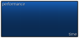](fs/ranking-graph.png "Click to view full size")

| Animatable   | Beatmap Skinnable | Skin Version(s) | Origin Point  | Optimal Size  | Blend Mode |
|:------------:|:-----------------:|:---------------:|:-------------:|:-------------:|:----------:|
| ![No][false] | ![No][false]      | all             | TopLeft&sup1; | 301x141&sup2; | Normal     |

1. alignment changes in v2.0+
   - v1.0: (256, 576)
   - v2.0+: (256, 608)
2. the first 7 lines at the top and at the left should be transparent
   - in v1.0 it is shifted down by 8px resulting in 308x156

- player's performance over time graph (performance = amount from life bar)

### ranking-maxcombo.png

| Animatable         | Beatmap Skinnable | Skin Version(s) | Origin Point  | Optimal Size | Blend Mode |
|:------------------:|:-----------------:|:---------------:|:-------------:|:------------:|:----------:|
| ![No][false]&sup1; | ![No][false]      | all             | TopLeft&sup2; | -            | Normal     |

1. if animation is used, the zeroth frame is used
2. alignment changes in v2.0+
   - v1.0: (8, 500)
   - v2.0+: (8, 480)

- this is the headline for the player's highest combo obtained

### ranking-panel.png

[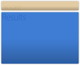](fs/ranking-panel.png)

| Animatable   | Beatmap Skinnable | Skin Version(s) | Origin Point  | Optimal Size | Blend Mode |
|:------------:|:-----------------:|:---------------:|:-------------:|:------------:|:----------:|
| ![No][false] | ![No][false]      | all             | TopLeft&sup1; | varies&sup2; | Normal     |

1. alignment changes in v2.0+
   - v1.0: (0, 74)
   - v2.0+: (0, 102)
2. max height varies by skin version
   - v1.0: 694px max height
   - v2.0+: 666px max height

- this is the body (and main focus) of the ranking screen

### ranking-perfect.png

| Animatable         | Beatmap Skinnable | Skin Version(s) | Origin Point | Optimal Size | Blend Mode |
|:------------------:|:-----------------:|:---------------:|:------------:|:------------:|:----------:|
| ![No][false]&sup1; | ![No][false]      | all             | Centre&sup2; | -            | Normal     |

1. if animation is used, the zeroth frame is used
2. alignment changes in v2.0+
   - v1.0: (320, 688)
   - v2.0+: (416, 688)

### ranking-title.png

| Animatable   | Beatmap Skinnable | Skin Version(s) | Origin Point   | Optimal Size | Blend Mode |
|:------------:|:-----------------:|:---------------:|:--------------:|:------------:|:----------:|
| ![No][false] | ![No][false]      | all             | TopRight&sup1; | -            | Normal     |

1. this element is positioned 32px away from right side

- this is the heading for the entire ranking screen

### ranking-replay.png

_(transparent; not included)_

| Animatable   | Beatmap Skinnable | Skin Version(s) | Origin Point   | Optimal Size | Blend Mode |
|:------------:|:-----------------:|:---------------:|:--------------:|:------------:|:----------:|
| ![No][false] | ![No][false]      | 1.0             | TopRight&sup1; | -            | Normal     |

1. at 672px height; at 576px height, if retry is not available

- legacy support for older skins
- overrides `pause-replay.png`

### ranking-retry.png

_(transparent; not included)_

| Animatable   | Beatmap Skinnable | Skin Version(s) | Origin Point | Optimal Size | Blend Mode |
|:------------:|:-----------------:|:---------------:|:------------:|:------------:|:----------:|
| ![No][false] | ![No][false]      | 1.0             | Right&sup1;  | -            | Normal     |

1. at 576px height

- legacy support for older skins
- overrides `pause-retry.png`

### ranking-winner.png

| Animatable   | Beatmap Skinnable | Skin Version(s) | Origin Point  | Optimal Size | Blend Mode |
|:------------:|:-----------------:|:---------------:|:-------------:|:------------:|:----------:|
| ![No][false] | ![No][false]      | all             | TopLeft&sup1; | 200x214      | Normal     |

1. positioned at height 576px

- used in multiplayer; for the winner of the round

## Offset Wizard

### options-offset-tick.png

[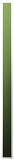](fs/options-offset-tick.png "Click to view full size")

| Animatable   | Beatmap Skinnable | Skin Version(s) | Origin Point | Optimal Size | Blend Mode           |
|:------------:|:-----------------:|:---------------:|:------------:|:------------:|:--------------------:|
| ![No][false] | ![No][false]      | all             | Centre       | -            | Multiplicative&sup1; |

1. big centre tick tinted black; blinks white when tick passes line; ticks are white

- this is used in the offset wizard
- this element is stretched to fit screen height

## Ranking Grades

### ranking-D.png

| Animatable   | Beatmap Skinnable | Skin Version(s) | Origin Point | Optimal Size | Blend Mode |
|:------------:|:-----------------:|:---------------:|:------------:|:------------:|:----------:|
| ![No][false] | ![No][false]      | all             | Centre       | -            | Normal     |

- this element is placed 192px from right side and:
  - v1.0: 272px vertically
  - v2.0+: at 320px vertically

| Animatable   | Beatmap Skinnable | Skin Version(s) | Origin Point | Optimal Size | Blend Mode |
|:------------:|:-----------------:|:---------------:|:------------:|:------------:|:----------:|
| ![No][false] | ![Yes][true]      | all             | varies&sup1; | 34x40        | Normal     |

1. depends on when it is used:
   - Break: Centre
   - Map panel: Left
   - Map ranking: Centre

| Animatable   | Beatmap Skinnable | Skin Version(s) | Origin Point | Optimal Size | Blend Mode |
|:------------:|:-----------------:|:---------------:|:------------:|:------------:|:----------:|
| ![No][false] | ![No][false]      | all             | Centre       | -            | Normal     |

- this element is placed 192px from right side and:
  - v1.0: 272px vertically
  - v2.0+: at 320px vertically

| Animatable   | Beatmap Skinnable | Skin Version(s) | Origin Point | Optimal Size | Blend Mode |
|:------------:|:-----------------:|:---------------:|:------------:|:------------:|:----------:|
| ![No][false] | ![Yes][true]      | all             | varies&sup1; | 34x40        | Normal     |

1. depends on when it is used:
   - Break: Centre
   - Map panel: Left
   - Map ranking: Centre

| Animatable   | Beatmap Skinnable | Skin Version(s) | Origin Point | Optimal Size | Blend Mode |
|:------------:|:-----------------:|:---------------:|:------------:|:------------:|:----------:|
| ![No][false] | ![No][false]      | all             | Centre       | -            | Normal     |

- this element is placed 192px from right side and:
  - v1.0: 272px vertically
  - v2.0+: at 320px vertically

| Animatable   | Beatmap Skinnable | Skin Version(s) | Origin Point | Optimal Size | Blend Mode |
|:------------:|:-----------------:|:---------------:|:------------:|:------------:|:----------:|
| ![No][false] | ![Yes][true]      | all             | varies&sup1; | 34x40        | Normal     |

1. depends on when it is used:
   - Break: Centre
   - Map panel: Left
   - Map ranking: Centre

| Animatable   | Beatmap Skinnable | Skin Version(s) | Origin Point | Optimal Size | Blend Mode |
|:------------:|:-----------------:|:---------------:|:------------:|:------------:|:----------:|
| ![No][false] | ![No][false]      | all             | Centre       | -            | Normal     |

- this element is placed 192px from right side and:
  - v1.0: 272px vertically
  - v2.0+: at 320px vertically

| Animatable   | Beatmap Skinnable | Skin Version(s) | Origin Point | Optimal Size | Blend Mode |
|:------------:|:-----------------:|:---------------:|:------------:|:------------:|:----------:|
| ![No][false] | ![Yes][true]      | all             | varies&sup1; | 34x40        | Normal     |

1. depends on when it is used:
   - Break: Centre
   - Map panel: Left
   - Map ranking: Centre

| Animatable   | Beatmap Skinnable | Skin Version(s) | Origin Point | Optimal Size | Blend Mode |
|:------------:|:-----------------:|:---------------:|:------------:|:------------:|:----------:|
| ![No][false] | ![No][false]      | all             | Centre       | -            | Normal     |

- this element is placed 192px from right side and:
  - v1.0: 272px vertically
  - v2.0+: at 320px vertically

| Animatable   | Beatmap Skinnable | Skin Version(s) | Origin Point | Optimal Size | Blend Mode |
|:------------:|:-----------------:|:---------------:|:------------:|:------------:|:----------:|
| ![No][false] | ![Yes][true]      | all             | varies&sup1; | 34x40        | Normal     |

1. depends on when it is used:
   - Break: Centre
   - Map panel: Left
   - Map ranking: Centre

| Animatable   | Beatmap Skinnable | Skin Version(s) | Origin Point | Optimal Size | Blend Mode |
|:------------:|:-----------------:|:---------------:|:------------:|:------------:|:----------:|
| ![No][false] | ![No][false]      | all             | Centre       | -            | Normal     |

- this element is placed 192px from right side and:
  - v1.0: 272px vertically
  - v2.0+: at 320px vertically

| Animatable   | Beatmap Skinnable | Skin Version(s) | Origin Point | Optimal Size | Blend Mode |
|:------------:|:-----------------:|:---------------:|:------------:|:------------:|:----------:|
| ![No][false] | ![Yes][true]      | all             | varies&sup1; | 34x40        | Normal     |

1. depends on when it is used:
   - Break: Centre
   - Map panel: Left
   - Map ranking: Centre

| Animatable   | Beatmap Skinnable | Skin Version(s) | Origin Point | Optimal Size | Blend Mode |
|:------------:|:-----------------:|:---------------:|:------------:|:------------:|:----------:|
| ![No][false] | ![No][false]      | all             | Centre       | -            | Normal     |

- this element is placed 192px from right side and:
  - v1.0: 272px vertically
  - v2.0+: at 320px vertically

| Animatable   | Beatmap Skinnable | Skin Version(s) | Origin Point | Optimal Size | Blend Mode |
|:------------:|:-----------------:|:---------------:|:------------:|:------------:|:----------:|
| ![No][false] | ![Yes][true]      | all             | varies&sup1; | 34x40        | Normal     |

1. depends on when it is used:
   - Break: Centre
   - Map panel: Left
   - Map ranking: Centre

| Animatable   | Beatmap Skinnable | Skin Version(s) | Origin Point | Optimal Size | Blend Mode |
|:------------:|:-----------------:|:---------------:|:------------:|:------------:|:----------:|
| ![No][false] | ![No][false]      | all             | Centre       | -            | Normal     |

- this element is placed 192px from right side and:
  - v1.0: 272px vertically
  - v2.0+: at 320px vertically

| Animatable   | Beatmap Skinnable | Skin Version(s) | Origin Point | Optimal Size | Blend Mode |
|:------------:|:-----------------:|:---------------:|:------------:|:------------:|:----------:|
| ![No][false] | ![Yes][true]      | all             | varies&sup1; | 34x40        | Normal     |

1. depends on when it is used:
   - Break: Centre
   - Map panel: Left
   - Map ranking: Centre

## History

Interface skinning elements that are longer in use are peacefully resting here.

### playfield.png

[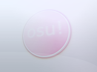](fs/playfield.png "Click to view full size")

| Animatable   | Beatmap Skinnable | Skin Version(s) | Origin Point | Optimal Size | Blend Mode |
|:------------:|:-----------------:|:---------------:|:------------:|:------------:|:----------:|
| ![No][false] | ![Yes][true]      | all             | Centre       | -            | Normal     |

- this element was removed and was replaced with `menu-background.jpg`

### selection-selectoptions.png

| Animatable   | Beatmap Skinnable | Skin Version(s) | Origin Point | Optimal Size | Blend Mode |
|:------------:|:-----------------:|:---------------:|:------------:|:------------:|:----------:|
| ![No][false] | ![No][false]      | all             | varies&sup1; | -            | Normal     |

1. depends on skin version:
   - v1.0: TopLeft
   - v2.0+: BottomLeft

- this element was removed for an unknown reason
- this button opens the beatmap options menu for the individual beatmaps.
  You can still access this menu by right clicking on the beatmap during song selection.

### selection-selectoptions-over.png

| Animatable   | Beatmap Skinnable | Skin Version(s) | Origin Point | Optimal Size | Blend Mode |
|:------------:|:-----------------:|:---------------:|:------------:|:------------:|:----------:|
| ![No][false] | ![No][false]      | all             | varies&sup1; | -            | Normal     |

1. depends on skin version:
   - v1.0: TopLeft
   - v2.0+: BottomLeft

- this element was removed with `selection-selectoptions.png`
