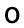
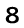
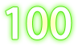

[true]: /wiki/shared/true.png
[false]: /wiki/shared/false.png

# Interfaz

_Véase también: [Tutorial de la Interfaz en Skins](/wiki/Skinning_Interface_Tutorial) e [Interfaz](/Interface)_

Los elementos de la interfaz en el _"Skinning"_ son usados en múltiples modos o partes de la interfaz del osu!client del usuario.

## Menú Principal

| Animable     | Modificable en un Beatmap |
|:------------:|:-------------------------:|
| ![No][false] | ![No][false]              |

**Notas:**

- [osu!supporter](/wiki/osu!supporter) requerido.
- Este elemento es usado como el área de juego si el mapa no contiene un fondo.
- Este elemento puede usar el formato `.jpg` .

---

| Animable     | Modificable en un Beatmap |
|:------------:|:-------------------------:|
| ![No][false] | ![No][false]              |

**Notas:**

- [osu!supporter](/wiki/osu!supporter) requerido.
- Esta imagen debería decir "Welcome" o "Bienvenido".

---

_`menu-snow.png`_ (Transparente; no incluido; mira los iconos pequeños de los modos de juego)

| Animable     | Modificable en un Beatmap |
|:------------:|:-------------------------:|
| ![No][false] | ![No][false]              |

**Notas:**

- Si no está modificado, el icono pequeño del modo de juego actual será usado en su lugar.
- Activable en las [opciones](/wiki/options).
  - Esta opción podría ser forzada a estar encendida en invierno.

## Botón

Estos botones son usados para el menú de opciones de los _beatmaps_, en el editor, y en las salas de multijugador.
Puesto que el botón contiene 3 partes, lo mejor es mantener la misma altura!

---

| Animable     | Modificable en un Beatmap |
|:------------:|:-------------------------:|
| ![No][false] | ![No][false]              |

---

| Animable     | Modificable en un Beatmap |
|:------------:|:-------------------------:|
| ![No][false] | ![No][false]              |

**Nota:**

- Este elemento es estirado para cumplir el ancho necesario.

---

| Animable     | Modificable en un Beatmap |
|:------------:|:-------------------------:|
| ![No][false] | ![No][false]              |

## Cursor

		
| Animable     | Modificable en un Beatmap |
|:------------:|:-------------------------:|
| ![No][false] | ![Yes][true]              |
		
**Notas:**
		
- Por defecto, este elemento rotará y se expandirá al clic.
- Comandos de [skin.ini](/wiki/skin.ini) :
  - Para desactivar la expansión del cursor al clic, cambia `CursorExpand` a `0`
  - Para desactivar la rotación del cursor, cambia `CursorRotate` a `0`.

---
		

| Animable     | Modificable en un Beatmap |
|:------------:|:-------------------------:|
| ![No][false] | ![Yes][true]              |

**Notas:**

- `cursor.png` es requerido para modificar este elemento.
- Si este elemento no está modificado, la imagen predeterminada no será usada!
- Modificar esto hará que el _cursortrail_ sea más largo.
  - Si no quieres modificar esto, pero quieres un _cursortrail_ más largo, solamente usa una imagen transparente de 1x1px. 
- Este elemento nunca rotará o expandirá.

---

| Animable     | Modificable en un Beatmap |
|:------------:|:-------------------------:|
| ![No][false] | ![Yes][true]              |

**Notas:**
		
- Esto es usado cuando el jugador presiona la tecla de humo.
  - Por defecto, la tecla de humo está unida a la `C`.

---

| Animable     | Modificable en un Beatmap |
|:------------:|:-------------------------:|
| ![No][false] | ![Yes][true]              |

**Notas:**

- Por defecto, este elemento no rota.
- Comando en [skin.ini](/wiki/skin.ini) :
  - Para activar la rotación del _cursortrail_, cambia `CursorTrailRotate` a `1`.

## FPS

**Solo para la versión _Estable (Fallback)_**.
El contador de FPS necesita ser activado en las [opciones](/wiki/options).

La siguiente tabla es para todos los elementos de FPS.

| Animable     | Modificable en un Beatmap |
|:------------:|:-------------------------:|
| ![No][false] | ![Yes][true]              |

---

---

---

---

---

---

---

---

---

---

---

---

## Iconos de _Mod's_

_Véase también: [Modificadores de Juego](/wiki/Game_Modifiers)._

La siguiente tabla es para todos los iconos de modificadores de juego.

| Animable     | Modificable en un Beatmap |
|:------------:|:-------------------------:|
| ![No][false] | ![Yes][true]              |

---

---

**Nota:**

- Este modificador se activa al hacer clic una vez más el modificador _"Auto"_

---

---

---

**Nota:**

- Este modificador solamente es usado para [osu!mania](/wiki/osu!mania).

---

---

---

---

**Nota:**

- Para el modificador de osu!mania, haz clic una vez más en el modificador _"Fade"_

---

**Nota:**

- Este modificador solamente es usado para [osu!mania](/wiki/osu!mania).

---

**Nota:**

- Este modificador solamente es usado para [osu!mania](/wiki/osu!mania).

---

**Nota:**

- Este modificador solamente es usado para [osu!mania](/wiki/osu!mania).

---

**Nota:**

- Este modificador solamente es usado para [osu!mania](/wiki/osu!mania).

---

**Nota:**

- Este modificador solamente es usado para [osu!mania](/wiki/osu!mania).

---

**Nota:**

- Este modificador solamente es usado para [osu!mania](/wiki/osu!mania).

---

**Nota:**

- Este modificador solamente es usado para [osu!mania](/wiki/osu!mania).

---

**Nota:**

- Este modificador solamente es usado para [osu!mania](/wiki/osu!mania).

---

**Nota:**

- Este modificador solamente es usado para [osu!mania](/wiki/osu!mania).

---

**Nota:**

- Este modificador solamente es usado para [osu!mania](/wiki/osu!mania).

---

**Nota:**

- Este modificador se activa al hacer clic una vez más el modificador _"Double Time"_

---

---

**Nota:**

- Este modificador se activa al hacer clic una vez más el modificador _"Sudden Death"_

---

**Nota:**

- Este modificador solamente es usado para [osu!mania](/wiki/osu!mania).

---

**Notas:**

- Este modificador es usado para [osu!standard](/wiki/osu!standard), [osu!taiko](/wiki/osu!taiko), y [osu!catch](/wiki/osu!catch).
- Este modificador tiene diferentes efectos cuando se usa en los distintos modos de juego:
  - En [osu!standard](/wiki/osu!standard), este modificador hará clic por el jugador, mientras que el jugador solamente necesita mover el cursor.

---

**Notas:**

- Este modificador solamente es usado para [osu!standard](/wiki/osu!standard).
- Este modificador hará que el cursor se mueva automáticamente mientras que el jugador solo necesita hacer clic.

---

**Nota:**

- Este modificador solamente es usado para [osu!standard](/wiki/osu!standard).

---

---

- Este modificador solamente es activable para la versión _cuttingedge_
- Este modificador solamente es usado para [osu!standard](/wiki/osu!standard).

## Compensación de sonido global

_Véase también: [Compensación de sonido global](/wiki/Offset_Wizard)._

---

| Animable     | Modificable en un Beatmap |
|:------------:|:-------------------------:|
| ![No][false] | ![No][false]              |

**Nota:**

- Este elemento es estirado para cumplir el ancho necesario.

## Área de juego

| Animable     | Modificable en un Beatmap |
|:------------:|:-------------------------:|
| ![Yes][true] | ![Yes][true]              |

**Nota:**

- Nombre de animación: `play-skip-#.png`; remplaza `#` con la numeración (El fotograma inicial empieza de `0`)

---

| Animable     | Modificable en un Beatmap |
|:------------:|:-------------------------:|
| ![No][false] | ![Yes][true]              |

**Nota:**

- Mostrado cuando se utilizan modificadores que desactivan la sumisión de puntuación.

---

| Animable     | Modificable en un Beatmap |
|:------------:|:-------------------------:|
| ![No][false] | ![No][false] (Ver notas)  |

**Notas:**

- El ser modificable en un mapa puede que sea un error.
- El color depende de su uso:
  - Pantalla de pausa:
    - Todas las versiones: Teñido de azul
  - Salida de descanso:
    - v1.0: Teñido de blanco
    - v2.0+: Teñido de rojo

---

_`arrow-generic.png`_ (transparente; no incluido)

| Animable     | Modificable en un Beatmap |
|:------------:|:-------------------------:|
| ![No][false] | ![No][false] (Ver notas)  |

**Notas:**

- El ser modificable en un mapa puede que sea un error.
- Esto anula `play-warningarrow.png` (pero no para la versión _Stable (Fallback)_).
- El uso es desconocido, pero está creído que esto es usado para el Multijugador cooperativo (la flecha que señala el turno del jugador)
- Este elemento no es teñido ni coloreado, esto quiere decir que puedes añadir todo el color como se te plazca.

---

_`arrow-pause.png`_ (transparente; no incluido)

| Animable     | Modificable en un Beatmap |
|:------------:|:-------------------------:|
| ![No][false] | ![No][false] (Ver notas)  |

**Notas:**

- El ser modificable en un mapa puede que sea un error.
- Esto anula `play-warningarrow.png` (pero no para la versión _Stable (Fallback)_).
- Esto es usado en las pantallas de pausa y de fallar.
- Este elemento no es teñido ni coloreado, esto quiere decir que puedes añadir todo el color como se te plazca.

---

_`arrow-warning.png`_ (transparente; no incluido)

| Animable     | Modificable en un Beatmap |
|:------------:|:-------------------------:|
| ![No][false] | ![No][false] (Ver notas)  |

**Notas:**

- El ser modificable en un mapa puede que sea un error.
- Esto anula `play-warningarrow.png` (pero no para la versión _Stable (Fallback)_).
- Usado para el final del descanso.
- Este elemento no es teñido ni coloreado, esto quiere decir que puedes añadir todo el color como se te plazca.

---

| Animable     | Modificable en un Beatmap |
|:------------:|:-------------------------:|
| ![No][false] | ![No][false] (Ver notas)  |

**Notas:**

- El ser modificable en un mapa puede que sea un error.
- Esto es principalmente usado cuando se juega 4:3 en pantalla panorámica.
- Mientras modificas un _beatmap_, desactiva la opción `Widescreen support` en la [configuración de la canción](/wiki/song_setup)
- Este elemento es estirado para cumplir el ancho necesario.
- La sección vertical de la derecha es girada horizontalmente

---

| Animable     | Modificable en un Beatmap |
|:------------:|:-------------------------:|
| ![No][false] | ![Yes][true]              |

**Note:**

- Este elemento es visto al final de un mapa fallado, repetición o cuando estás en modo espectador (durante la carga, pausa o fallo).

---

| Animable     | Modificable en un Beatmap |
|:------------:|:-------------------------:|
| ![No][false] | ![No][false]              |

**Nota:**

- Esto es usado en partidas multijugador, visto a un lado de la puntuación del jugador (en los lados) cuando el jugador vota para saltar la introducción de un mapa.

---

| Animable     | Modificable en un Beatmap |
|:------------:|:-------------------------:|
| ![No][false] | ![Yes][true]              |

**Nota:**

- Este elemento es visto cuando el jugador tiene poca cantidad de _HP_, menos del 50%, durante un descanso suficientemente largo.

---

| Animable     | Modificable en un Beatmap |
|:------------:|:-------------------------:|
| ![No][false] | ![Yes][true]              |

**Nota:**

- Este elemento es visto cuando el jugador tiene poca cantidad de _HP_, más del 50%, durante un descanso suficientemente largo.

### Countdown _(Cuenta regresiva)_

Si la versión de la skin es:

- 1.0, la cuenta atrás será usada como estilo segmentado (donde el 3 está a la izquierda, el 2 a la derecha y el 1 está en el centro).
- 2.0+, la cuenta atrás será usada como estilo centrado (donde todos los números de la cuenta están en el centro).

La siguiente tabla es para todos los elementos de la cuenta regresiva.

| Animable     | Modificable en un Beatmap |
|:------------:|:-------------------------:|
| ![No][false] | ![Yes][true]              |

**Notas:**

- Este elemento no tiene restricción de tamaño.
- Cuando es usado en [osu!mania](/wiki/osu!mania), este elemento es rotado 90 grados en dirección contraria a las agujas del reloj y es colocado en la esquina inferior derecha.

---

**Nota:**

- Esto debería decir "1" o "3".

- Nombre de la animación: `scorebar-colour-#.png`; remplaza `#` con el conteo indicado.
- Teñido de negro sobre tiempo cuando está cerca de una zona crítica y teñido de rojo en la zona critica.
- Este elemento no tiene restricción de tamaño.
- Cuando es usado en [osu!mania](/wiki/osu!mania), este elemento es rotado 90 grados en dirección contraria a las agujas del reloj y es colocado en la esquina inferior derecha.

---

**Nota:**

- Esto debería decir "2".

---

**Nota:**

- Esto debería decir "3" o "1".

---

**Nota:**

- Esto debería decir "Go".

---

**Nota:**

- Esto debería decir "¿Estás listo?" o "¿Listo?".

### Hit Bursts

Estos _hit bursts_ son usados en osu!standar y en [multi](/wiki/multi).

La siguiente tabla es para todos los elementos de _hit burst_.

| Animable     | Modificable en un Beatmap |
|:------------:|:-------------------------:|
| ![No][false] | ![Yes][true]              |

---

---

---

---

---

---

---

### Input Overlay

| Animable     | Modificable en un Beatmap |
|:------------:|:-------------------------:|
| ![No][false] | ![Yes][true]              |

**Notas:**

- Esto es usado en [osu!standard](/wiki/osu!standard) y en [osu!catch](/wiki/osu!catch).
- Activable en las [options](/wiki/options).
- Esto es rotado 90 grados en dirección a las agujas del reloj.
- Estirado 1.05x en el juego.

---

| Animable     | Modificable en un Beatmap |
|:------------:|:-------------------------:|
| ![No][false] | ![Yes][true]              |

**Notas:**

- Esto es usado en [osu!standard](/wiki/osu!standard) y en [osu!catch](/wiki/osu!catch).
- Activable en las [options](/wiki/options).
- Se expande cuando la tecla correspondiente es presionada.

### Pantalla de Pausa

_`pause-overlay.png`_ (transparente; no incluido)

| Animable     | Modificable en un Beatmap |
|:------------:|:-------------------------:|
| ![No][false] | ![Yes][true]              |

**Notas:**

- Si esto no está modificado, el fondo del mapa será difuminado y usado por defecto.
- Este elemento **no** será estirado para caber.
- La altura total de la imagen es de 768px.

---

_`fail-background.png`_ (transparente; no incluido)

| Animable     | Modificable en un Beatmap |
|:------------:|:-------------------------:|
| ![No][false] | ![Yes][true]              |

**Notas:**

- Si esto no está modificado, el fondo del mapa será difuminado y usado por defecto.
- Este elemento será estirado para caber.

---

| Animable     | Modificable en un Beatmap |
|:------------:|:-------------------------:|
| ![No][false] | ![Yes][true]              |

**Nota:**

- Este elemento aparece en la pantalla de falla y en la de pausa.

---

| Animable     | Modificable en un Beatmap |
|:------------:|:-------------------------:|
| ![No][false] | ![Yes][true]              |

- Este elemento aparece en la pantalla de pausa.

---

| Animable     | Modificable en un Beatmap |
|:------------:|:-------------------------:|
| ![No][false] | ![Yes][true]              |

**Notas:**

- Este elemento aparece en la pantalla de clasificación (después de terminar un mapa, o ver una puntuación).
- Esto anula `ranking-replay.png` en las skins de versión 2.0+.

---

| Animable     | Modificable en un Beatmap |
|:------------:|:-------------------------:|
| ![No][false] | ![Yes][true]              |

**Notas:**

- Este elemento aparece en la pantalla de clasificación después de terminar un mapa, o en la pantalla de pausa y en la de fallo.
- Esto anula `ranking-retry.png` en las skins de versión 2.0+.

### Scorebar

| Animable     | Modificable en un Beatmap |
|:------------:|:-------------------------:|
| ![No][false] | ![Yes][true]              |

**Notas:**

- Este elemento no tiene restricción de tamaño.
- Cuando es usado en [osu!mania](/wiki/osu!mania), este elemento es rotado 90 grados en dirección contraria a las agujas del reloj y es colocado en la esquina inferior derecha.

---

| Animable     | Modificable en un Beatmap |
|:------------:|:-------------------------:|
| ![Yes][true] | ![Yes][true]              |

**Notas:**

- Nombre de la animación: `scorebar-colour-#.png`; remplaza `#` con el conteo indicado.
- Teñido de negro sobre tiempo cuando está cerca de una zona crítica y teñido de rojo en la zona critica.
- Este elemento no tiene restricción de tamaño.
- Cuando es usado en [osu!mania](/wiki/osu!mania), este elemento es rotado 90 grados en dirección contraria a las agujas del reloj y es colocado en la esquina inferior derecha.

---

| Animable     | Modificable en un Beatmap |
|:------------:|:-------------------------:|
| ![No][false] | ![Yes][true]              |

**Notas:**

- Para skins de versiones 2.0+, `scorebar-marker.png` tiene una mayor prioridad.
- Este elemento representa la zona de "paso".
- Este elemento no es usado en [osu!mania](/wiki/osu!mania).

---

| Animable     | Modificable en un Beatmap |
|:------------:|:-------------------------:|
| ![No][false] | ![Yes][true]              |

**Notas:**

- Para skins de versiones 2.0+, `scorebar-marker.png` tiene una mayor prioridad.
- Este elemento representa la zona de "peligro".
- Este elemento no es usado en [osu!mania](/wiki/osu!mania).

---

| Animable     | Modificable en un Beatmap |
|:------------:|:-------------------------:|
| ![No][false] | ![Yes][true]              |

**Notas:**

- Para skins de versiones 2.0+, `scorebar-marker.png` tiene una mayor prioridad.
- Este elemento representa la zona "crítica".
- Este elemento no es usado en [osu!mania](/wiki/osu!mania).

---

| Animable     | Modificable en un Beatmap |
|:------------:|:-------------------------:|
| ![No][false] | ![Yes][true]              |

- Este elemento tiene una mayor prioridad.
  - Si es modificado, este elemento anula los elementos `scorebar-ki.png`, `scorebar-kidanger.png`, y `scorebar-kidanger2.png`.
- El marcador se oscurece si el jugador alcanza la zona crítica.
- Este elemento no es usado en [osu!mania](/wiki/osu!mania).

### Números de Puntuación

Por defecto, todos los números de puntuación también son usados para los números de combo.

La siguiente tabla es para todos los elementos de los números de puntuación.

| Animable     | Modificable en un Beatmap |
|:------------:|:-------------------------:|
| ![No][false] | ![Yes][true]              |

---

---

---

---

---

---

---

---

---

---

---

**Notas:**

- Por defecto, esto también es parte de los números de combo.
- Esto es para la visualización de precisión.
- El uso de este elemento es dependiente de tu idioma seleccionado.

---

**Notas:**

- Por defecto, esto también es parte de los números de combo.
- Esto es para la visualización de precisión.
- El uso de este elemento es dependiente de tu idioma seleccionado.

---

**Notas:**

- Por defecto, esto también es parte de los números de combo.
- Esto es para la precisión.

---

**Notas:**

- Por defecto, esto también es parte de los números de combo.
- Esto es para el combo, solo usado en [osu!standard](/wiki/osu!standard).

## Grados de Clasificación

La siguiente tabla es para todos los elementos de los grados de clasificación sin un sufijo.

| Animable     | Modificable en un Beatmap |
|:------------:|:-------------------------:|
| ![No][false] | ![No][false]              |

---

La siguiente tabla es para todos los elementos de los grados de clasificación con el sufijo `-small`.

| Animable     | Modificable en un Beatmap |
|:------------:|:-------------------------:|
| ![No][false] | ![Yes][true]              |

---

- Esto es usado en [osu!standard](/wiki/osu!standard) y [osu!catch](/wiki/osu!catch).
- Activable en las [opciones](/wiki/options).
- Se encoje cuando la tecla es presionada.

---

---

---

---

---

---

---

---

---

---

---

---

---

---

---

## Pantalla de Clasificación

Después de la versión 2.0+, la mayoría de estos elementos se realinearon.

---

| Animable           | Modificable en un Beatmap |
|:------------------:|:-------------------------:|
| ![No][false]&sup1; | ![No][false]              |

**Nota:**

- Este es el encabezado para la precisión del jugador.

---

| Animable     | Modificable en un Beatmap |
|:------------:|:-------------------------:|
| ![No][false] | ![No][false]              |

**Nota:**

- Este es el fondo de la gráfica del rendimiento del jugador sobre el tiempo (el rendimiento es la cantidad de la barra de vida).

---

| Animable                | Modificable en un Beatmap |
|:-----------------------:|:-------------------------:|
| ![No][false](ver notas) | ![No][false]              |

**Notas:**

- Si la animación es usada, el fotograma cero es usado.
- Este es el encabezado para el combo más alto obtenido del jugador.

---

| Animable     | Modificable en un Beatmap |
|:------------:|:-------------------------:|
| ![No][false] | ![No][false]              |

**Nota:**

- Este es el cuerpo del panel de clasificación. 

---

| Animable                | Modificable en un Beatmap |
|:-----------------------:|:-------------------------:|
| ![No][false](ver notas) | ![No][false]              |

**Notas:**

- Si la animación es usada, el fotograma cero es usado.
- "Perfect" se correlaciona con los puntajes, no con la precisión.

---

| Animable     | Modificable en un Beatmap |
|:------------:|:-------------------------:|
| ![No][false] | ![No][false]              |

**Nota:**

- Este es el encabezado para toda la pantalla de clasificación.

---

_`ranking-replay.png`_ (transparente; no incluido)

| Animable     | Modificable en un Beatmap |
|:------------:|:-------------------------:|
| ![No][false] | ![No][false]              |

**Notas:**

- Este elemento es para soporte de legado (para skins antiguas).
- Este elemento anula `pause-replay.png`, si es modificado.

---

_`ranking-retry.png`_ (transparente; no incluido)

| Animable     | Modificable en un Beatmap |
|:------------:|:-------------------------:|
| ![No][false] | ![No][false]              |

**Notas:**

- Este elemento es para soporte de legado (para skins antiguas).
- Este elemento anula `pause-retry.png`, si es modificado.

---

| Animable     | Modificable en un Beatmap |
|:------------:|:-------------------------:|
| ![No][false] | ![No][false]              |

**Nota:**

- Esto es usado en el multijugador para el ganador de la ronda.

## Selección de canciones

_`menu-back.png`_ (transparente; no incluido; ver notas)

| Animable     | Modificable en un Beatmap |
|:------------:|:-------------------------:|
| ![Yes][true] | ![No][false]              |

**Notas:**

- Nombre de la animación: `menu-back-#.png`; remplaza `#` con el conteo indicado.
- _osu!_ tiene un nuevo botón de "atrás"; sin embargo; no es modificable!
  - Si este elemento es modificado, anulará en todos lados el nuevo botón; excepto para la barra lateral de [opciones](/wiki/options).

---

| Animable     | Modificable en un Beatmap |
|:------------:|:-------------------------:|
| ![No][false] | ![Yes][true]              |

**Notas:**

- Skins con versiones 2.2+ soportan miniaturas (activables en las [opciones](/wiki/options)) para la selección de canciones.
- Este elemento es usado en varios lugares:
  - tabla de clasificación en la selección de canción
  - botón para la dificultad de un mapa en la selección de canciones
  - tabla de clasificación a la izquierda mientras se juega
  - botón que muestra el beatmap seleccionado mientras se espera en una sala en el multijugador

---

| Animable     | Modificable en un Beatmap |
|:------------:|:-------------------------:|
| ![No][false] | ![No][false]              |

---

| Animable     | Modificable en un Beatmap |
|:------------:|:-------------------------:|
| ![No][false] | ![No][false]              |

---

| Animable     | Modificable en un Beatmap |
|:------------:|:-------------------------:|
| ![No][false] | ![No][false]              |

---

| Animable     | Modificable en un Beatmap |
|:------------:|:-------------------------:|
| ![No][false] | ![No][false]              |

---

| Animable     | Modificable en un Beatmap |
|:------------:|:-------------------------:|
| ![No][false] | ![No][false]              |

---

| Animable     | Modificable en un Beatmap |
|:------------:|:-------------------------:|
| ![No][false] | ![No][false]              |

---

| Animable     | Modificable en un Beatmap |
|:------------:|:-------------------------:|
| ![No][false] | ![No][false]              |

**Nota:**

- Dependiendo en el tamaño del cliente de osu!, 4 o 5 pestañas serán mostradas.

---

| Animable     | Modificable en un Beatmap |
|:------------:|:-------------------------:|
| ![No][false] | ![No][false]              |

**Nota:**

- Esto es usado para las puntuaciones con estrellas (visto en la selección de canciones).

---

| Animable     | Modificable en un Beatmap |
|:------------:|:-------------------------:|
| ![No][false] | ![No][false]              |

**Nota:**

- Esto es usado para la selección de canciones (las estrellas que vuelan de derecha a izquierda), cursor, tiempo kiai, y combobursts.

### Selección de Modo

Los elementos modificables en esta sección usan 3 sufijos distintos describiendo para lo que son usados.

- _sin sufijo_: Estos aparecen en el centro de la pantalla cuando estás en la selección de canciones (mostrando el modo de juego seleccionado).
- `-med`: Estos aparecen dentro del recuadro de selección de modos, cuando seleccionas el modo de juego.
- `-small`: Estos aparecen dentro del botón del recuadro de selección de modos (mostrando el modo de juego seleccionado)
  Estas imágenes también son usadas como nieve por defecto, si una skin no incluye la imagen `snow.png` (la que se usa es la del modo de juego actualmente seleccionado)

---

| Animable     | Modificable en un Beatmap |
|:------------:|:-------------------------:|
| ![No][false] | ![No][false]              |

---

| Animable     | Modificable en un Beatmap |
|:------------:|:-------------------------:|
| ![No][false] | ![No][false]              |

---

| Animable     | Modificable en un Beatmap |
|:------------:|:-------------------------:|
| ![No][false] | ![No][false]              |

---

| Animable     | Modificable en un Beatmap |
|:------------:|:-------------------------:|
| ![No][false] | ![No][false]              |

---

| Animable     | Modificable en un Beatmap |
|:------------:|:-------------------------:|
| ![No][false] | ![No][false]              |

---

| Animable     | Modificable en un Beatmap |
|:------------:|:-------------------------:|
| ![No][false] | ![No][false]              |

---

| Animable     | Modificable en un Beatmap |
|:------------:|:-------------------------:|
| ![No][false] | ![No][false]              |

---

| Animable     | Modificable en un Beatmap |
|:------------:|:-------------------------:|
| ![No][false] | ![No][false]              |

---

| Animable     | Modificable en un Beatmap |
|:------------:|:-------------------------:|
| ![No][false] | ![No][false]              |

---

| Animable     | Modificable en un Beatmap |
|:------------:|:-------------------------:|
| ![No][false] | ![No][false]              |

---

| Animable     | Modificable en un Beatmap |
|:------------:|:-------------------------:|
| ![No][false] | ![No][false]              |

---

| Animable     | Modificable en un Beatmap |
|:------------:|:-------------------------:|
| ![No][false] | ![No][false]              |

## Trivia

### Historia

Los elementos de la interfaz que ya no están en uso, descansando pacíficamente aquí.

---

| Animable     | Modificable en un Beatmap |
|:------------:|:-------------------------:|
| ![No][false] | ![Yes][true]              |

**Nota:**

- Este elemento fue removido y reemplazado con `menu-background.jpg`.

---

| Animable     | Modificable en un Beatmap |
|:------------:|:-------------------------:|
| ![No][false] | ![No][false]              |

**Notas:**

- Este elemento fue removido por una razón desconocida.
- Este botón abre el menú de opciones de un beatmap de manera individual por beatmap.
  Tu aun puedes accesar este menu haciendo clic derecho en un beatmap durante la selección de canciones.

---

| Animable     | Modificable en un Beatmap |
|:------------:|:-------------------------:|
| ![No][false] | ![No][false]              |

**Notas:**

- Este elemento fue removido con `selection-selectoptions.png`
